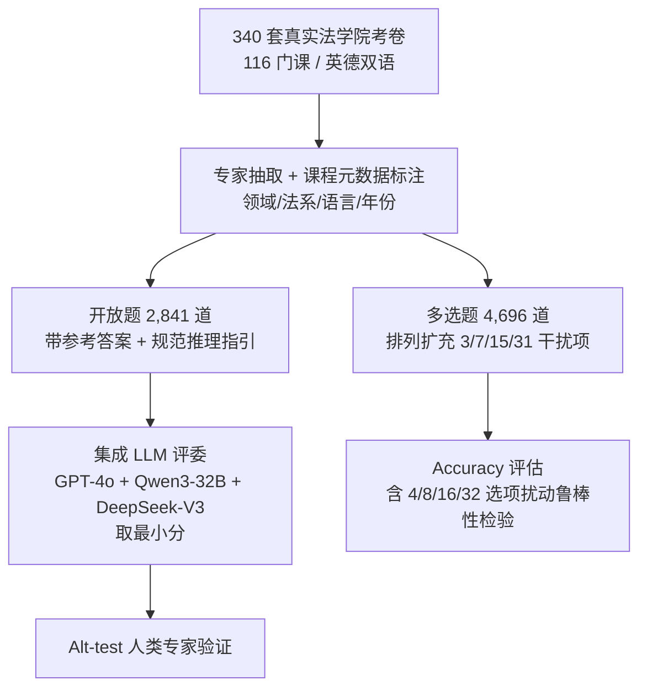

# LEXam: Benchmarking Legal Reasoning on 340 Law Exams

**会议**: ICLR 2026  
**OpenReview**: [https://openreview.net/forum?id=xNhbMyXsJn](https://openreview.net/forum?id=xNhbMyXsJn)  
**代码**: [https://lexam-benchmark.github.io/](https://lexam-benchmark.github.io/)  
**领域**: LLM 推理 / 法律 NLP 评测基准  
**关键词**: 法律推理, 评测基准, 长文本开放问答, 多语言, LLM-as-a-Judge, 过程式评估  

## 一句话总结
LEXam 把苏黎世大学 340 套真实法学院考试整理成 7,537 道英德双语题（开放问答 + 多选），不只看最终答案对不对，还用专家校准过的集成 LLM 评委去评判模型的多步法律推理过程，揭示当前 SOTA 模型在结构化法律推理上仍大面积翻车。

## 研究背景与动机
**领域现状**：测试时扩展（test-time scaling）让 o3、DeepSeek-R1 这类推理模型在数学奥赛、物理题等 STEM 任务上表现亮眼，因为这些任务以演绎推理和确定性规则为主，可以直接核对数值答案或用形式化验证器判定对错。

**现有痛点**：法律推理是另一类问题——它既要严谨的演绎/归纳逻辑，又要把规则套用到界定模糊的真实场景里，本质上是"非形式化推理"。但已有法律基准（LegalBench、LawBench 等）几乎都沿用 STEM 那套**只看最终输出对不对**的范式，把中间推理过程当黑箱。结果就是：模型答错了你也不知道它是哪一步崩的，而法律是高风险领域，这种"知其错不知其所以错"会带来实质危害。

**核心矛盾**：法律答案的"正确"往往**词面重合度很低**——同一个结论可以有完全不同的措辞，而措辞相似也不代表推理合法（引错法条照样语义接近）。这让 BLEU/ROUGE/BERTScore 这类浅层指标失效，但又没有现成的形式化验证器可用，过程式评估缺乏可靠、可扩展的工具。

**本文目标**：造一个能**同时考察过程与结果正确性**、且覆盖多语言多法系的法律推理基准，并配一套经过人类专家严格验证、可复现的评估管线。

**核心 idea**：① **用真实法学院考试当题源**——这些题天然带教授手写的参考答案和"应该怎么推"的规范指引（issue spotting → rule recall → rule application），把过程式评分变得有据可依；② **用集成 LLM-as-a-Judge 替代浅层指标**，并用统计检验（Alt-test）证明这个评委能稳定逼近甚至超过人类专家。

## 方法详解

### 整体框架
LEXam 的构建是一条"原始考卷 → 结构化题库 → 双轨评估"的流水线：先由受过法学训练的标注者从苏黎世大学公开的 340 套考卷（2016–2023，116 门课）中抽取题目并打上领域元数据；开放题（2,841 道）走"过程 + 结果"双重评估，由集成 LLM 评委和人类专家共同打分；多选题（4,696 道）则通过排列组合扩充干扰项，走清晰的结果式 accuracy 评估。

### 关键设计

**1. 真实考卷题源 + 规范化推理指引：把"过程"变得可评**。LEXam 没有像多数基准那样人工编题或从判例里抠片段，而是直接用苏黎世大学法学院公开的真实期末考卷，覆盖私法、公法、刑法、跨学科四大领域下细分的 78 个子领域，由三位有法学训练的作者按教学大纲归类。关键在于每道开放题都自带教授写的参考答案**以及**"这题该怎么推"的规范指引——比如先识别法律争点（issue spotting）、再回忆相关法条（rule recall）、最后把规则套到事实上（rule application）。这条结构化的推理链就是过程式评分的标尺：评委不是去对照某种抽象的"法律推理理论"，而是核查模型有没有遵循专家答案里的教义结构，并惩罚编造或引错法条这类领域特有错误。

**2. 多选题的排列扩充与干扰项控制**。原始考卷里的真/假题（TFQ）和多选题被解析成"题干 stem + 若干陈述 statement"，然后对每个 stem 随机生成含 2–5 条陈述的题目。每道题保证只有一个正确组合，干扰项从"至少有一条陈述错误"的全部组合里随机抽，配成 4 / 8 / 16 / 32 个选项（即 1 正 + 3/7/15/31 错），这样既统一了不同题目的选项数，也固定了随机猜测的基线准确率（4 选 1 约 25%）。更妙的是他们额外造了一个 385 题的扰动子集：题干和陈述顺序完全不变，只把选项数从 4 逐级放大到 32，用来**诊断模型到底是真懂还是靠干扰项不够强在蒙**——选项一多准确率就崩，说明后者。

**3. 集成 LLM-as-a-Judge + Alt-test 统计背书**。开放题评分的核心难点是"评委可信吗"。作者先让两位有法学博士训练的作者起草专用评分 prompt，以 GPT-4o 为评委做 pilot 反复迭代校准罚分力度；再用 **Alternative Annotator Test (Alt-test)** 严格检验候选评委能否在统计上超过人类标注者。他们发现单靠专有大模型（GPT-4o、Gemini-2.5-Pro）或超大推理模型（DeepSeek-R1）才稳定优于人类，但这会损害基准的可及性。解法是**取最小分的集成**：把 GPT-4o、Qwen3-32B、DeepSeek-V3 三家（两开源一闭源）的点对点打分取最小值 $s = \min(s_{\text{GPT-4o}}, s_{\text{Qwen3}}, s_{\text{DSV3}})$。取最小既抑制了同模型/同家族自夸的 self-bias，也让开源组合就能越过人类评委门槛，整条管线可复现、不依赖单一供应商。三位法律专家在 50 题上盲评的平均 Pearson 相关 $r = 0.70$，给"人类一致性"立了参照基线。

## 实验关键数据

### 主实验：开放题（集成 LLM 评委打分，满分 100）
评测 35 个模型，按 Judge Score 排序（节选）：

| 类别 | 模型 | Judge Score (±S.E.) |
|------|------|---------------------|
| 推理 | GPT-5 | **70.20** (±0.41) |
| 推理 | Gemini-2.5-Pro | 67.40 (±0.51) |
| 推理 | Claude-3.7-Sonnet | 62.86 (±0.51) |
| 推理 | DeepSeek-R1 | 55.91 (±0.51) |
| 推理 | Qwen3-32B | 40.00 (±0.43) |
| 大模型 | GPT-4.1 | 57.50 (±0.51) |
| 大模型 | DeepSeek-V3 | 52.53 (±0.48) |
| 大模型 | Llama-3.3-70B-it | 41.27 (±0.41) |
| 小模型 | GPT-4.1-mini | 54.58 (±0.43) |
| 小模型 | Gemma-3-12B-it | 41.29 (±0.48) |
| 小模型 | Llama-3.1-8B-it | 10.00 (±0.26) |

即便最强的 GPT-5 也只到 70 分，说明结构化多步法律推理远未被攻克；分数从 70 一路平滑铺到 10，证明基准有很强的区分度。值得注意的是 Gemma-3-12B-it（41.29）能逼平大它 6×/33× 的 Llama-3.3-70B / Llama-3.1-405B，得益于其多语言专长。

### 多选题（16 选项）与扰动鲁棒性
MCQ-16 上 GPT-5.2 (52.53%)、Claude-4.6-Sonnet (52.42%) 领先，大/小模型多数跌破 20%。扰动实验最能说明问题——同一批题随选项数增加，准确率系统性崩塌：

| 模型 | 4 选项 | 8 选项 | 16 选项 | 32 选项 |
|------|--------|--------|---------|---------|
| Gemini-2.5-Pro | 68.61 | 51.56 | 45.24 | 35.62 |
| Claude-3.7-Sonnet | 60.92 | 48.59 | 40.38 | 33.02 |
| DeepSeek-R1 | 57.54 | 44.11 | 36.94 | 24.93 |
| GPT-4o | 53.73 | 36.42 | 22.55 | 21.81 |
| DeepSeek-V3 | 58.57 | 36.07 | 28.92 | 16.03 |

题干不变只加干扰项就掉这么多，说明 4 选 MCQ 的高分含大量"蒙对"水分，标准多选评测会给出过于乐观的结论。

### 关键发现
- **语言鸿沟**：所有模型英语题都强于德语题，小模型差距最大；因英德题非平行翻译，语言与法律差异交织难以解耦。
- **法系/领域差异**：通用法和国际法题准确率高于瑞士本土法；跨学科和公法高于刑法和私法。
- **否定句反直觉崩盘**：把多选题改成否定式（"以下哪些陈述是错误的"）后所有模型大跌，**推理模型跌得尤其厉害**，小模型几乎掉到随机水平。
- **评委可靠性**：取最小分的集成评委在 Alt-test 下稳定超过人类标注者，且开源组合即可达标，三位专家盲评 $r=0.70$。

## 亮点与洞察
- **"用真考卷"是最聪明的一招**：教授手写的参考答案和评分指引天然提供了过程式评分的金标准，省去了从零定义"什么是好的法律推理"这一最难的环节。
- **扰动诊断直击 MCQ 评测痛点**：固定题干只放大选项数这一招，干净利落地把"真懂"和"蒙对"分开，给整个领域的多选评测敲了警钟。
- **集成取最小分**这个工程化细节，同时解决了 self-bias 和可及性两个问题，且用 Alt-test 给了统计背书，比"拍脑袋选个强模型当评委"扎实得多。
- 否定句让推理模型崩得比普通模型更狠，这个反直觉现象暗示当前推理链在处理逻辑取反时存在系统性脆弱。

## 局限与展望
- **法系单一**：题源全来自瑞士（大陆法系）一所学校，虽含国际/比较法内容，但缺普通法（判例法）题目，作者也把扩展到普通法列为重要未来方向。
- **缺人类基线**：受制度限制无法获取真实考生成绩，MCQ 形式也非原考卷所有，人类表现只能在附录的独立小实验里近似给出。
- **英德非平行**：语言差异和法律内容差异纠缠在一起，无法干净地归因"模型为何德语更差"，需高质量法律翻译才能解耦。
- **评委仍是 LLM**：尽管 Alt-test 验证过，集成评委本质上还是模型评模型，长尾的细微教义错误是否都能被抓住仍存疑。

## 相关工作与启发
LEXam 接续 LegalBench、LawBench、LBOX 等法律基准，但把评估重心从"结果对错"挪到"过程合规"，这与数学推理领域从 final-answer accuracy 转向 step-level / process reward 的趋势同源。它对 LLM-as-a-Judge 路线（MT-Bench 等）的贡献是引入 Alt-test 做统计背书和"取最小分集成"抑制偏置，这套思路可迁移到其他难以核对最终答案的开放域评测（医学、政策分析等）。对做推理模型的人，否定句崩盘和长选项崩盘两个现象提示：当前的测试时扩展更多是在"规则确定"任务上有效，面对界定模糊、需要规则套用的非形式化推理仍有结构性短板。

## 评分
- **新颖性**: ⭐⭐⭐⭐ 用真实考卷自带的参考答案 + 规范指引来做过程式法律推理评估，配上 Alt-test 验证的集成评委，角度新颖且落地。
- **实验充分度**: ⭐⭐⭐⭐⭐ 35 个模型、开放题 + 多选 + 选项扰动 + 多维元数据切片 + 三专家盲评 + Alt-test，覆盖面和严谨度都很高。
- **写作质量**: ⭐⭐⭐⭐ 动机清晰、图表丰富、把过程式评估的难点和解法讲得很透。
- **价值**: ⭐⭐⭐⭐⭐ 高质量、可复现、带可信评委的法律推理基准，对法律 NLP 和过程式评估社区都是稀缺资源。

<!-- RELATED:START -->

## 相关论文

- [\[ICLR 2026\] VisioMath: Benchmarking Figure-based Mathematical Reasoning in LMMs](visiomath_benchmarking_figure-based_mathematical_reasoning_in_lmms.md)
- [\[ICLR 2026\] GeoGramBench: Benchmarking the Geometric Program Reasoning in Modern LLMs](geogrambench_benchmarking_the_geometric_program_reasoning_in_modern_llms.md)
- [\[ACL 2026\] Accurate Legal Reasoning at Scale: Neuro-Symbolic Offloading and Structural Auditability for Robust Legal Adjudication](../../ACL2026/llm_reasoning/accurate_legal_reasoning_at_scale_neuro-symbolic_offloading_and_structural_audit.md)
- [\[ICLR 2026\] FaithCoT-Bench: Benchmarking Instance-Level Faithfulness of Chain-of-Thought Reasoning](faithcot-bench_benchmarking_instance-level_faithfulness_of_chain-of-thought_reas.md)
- [\[ICLR 2026\] USTBench: Benchmarking and Dissecting Spatiotemporal Reasoning Capabilities of LLMs as Urban Agents](ustbench_benchmarking_and_dissecting_spatiotemporal_reasoning_capabilities_of_ll.md)

<!-- RELATED:END -->
