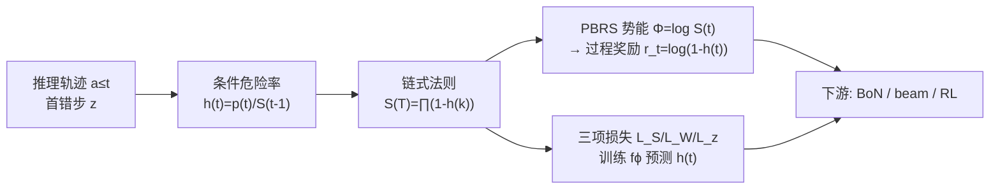

# Linking Process to Outcome: Conditional Reward Modeling for LLM Reasoning

**会议**: ICLR 2026  
**OpenReview**: [https://openreview.net/forum?id=4DJoBOQNd0](https://openreview.net/forum?id=4DJoBOQNd0)  
**代码**: [https://foundation-model-research.github.io/CRM](https://foundation-model-research.github.io/CRM)  
**领域**: LLM 推理 / 过程奖励模型 (PRM)  
**关键词**: Process Reward Model, 条件概率, 信用分配, Reward Hacking, 强化学习  

## 一句话总结
CRM 把多步推理建模为「逐步逼近正确答案」的时序过程，用条件概率链式法则把每一步的过程奖励显式锚定到最终结果，从而解决步间依赖缺失与信用分配模糊两大顽疾，在 Best-of-N、beam search 和 RL 三类下游任务上都更稳、更抗 reward hacking。

## 研究背景与动机
**领域现状**：奖励模型是绕开「可验证奖励依赖 ground-truth、难规模化」的主流替代品，分为只在终点打分的 ORM 和给每一步打分的 PRM。PRM 提供细粒度信号、被认为更利于引导推理。

**现有痛点**：作者把已有 PRM 的缺陷归为两类——(i) **孤立建模**：主流 PRM（Math-Shepherd、Lightman 等）把每一步当成独立的分类问题打分，完全忽略推理链固有的步间因果依赖；(ii) **结果意识薄弱**：试图改进的方法各有短板，PQM 只做相邻步的相对排序（谁的奖励更大），缺乏对最终结果的显式建模；IPRM 把结果奖励参数化成过程奖励的对数和，却说不清某一具体步骤如何关联终点，也没刻画步间依赖。

**核心矛盾**：奖励信号既不尊重序列推理的时序因果，又面临模糊的信用分配，导致下游模型容易 **reward hacking**——奖励一路飙升但真实任务准确率反而下降（论文实验里 PRM/PQM 用重复啰嗦的输出骗高分）。

**本文目标**：构造一个「步间有依赖、过程与结果显式对齐」的奖励，让每一步的奖励精确反映它对「最终答对」这件事的贡献，同时让奖励跨样本可比。

**核心 idea（条件概率视角）**：与其直接量化「推理离正确答案多近」这种难测量的东西，不如建模其互补事件——推理在哪一步**首次进入错误状态**。把每步奖励定义为「在前序步都对的条件下当前步还对」的条件概率，再用链式法则把它和「整条轨迹答对的概率」串起来。

## 方法详解

### 整体框架
CRM 将多步推理视为一个有限时域 MDP，状态 $s_t=(x, a_{\le t-1})$，动作 $a_t$ 是第 $t$ 个推理步。核心是引入随机变量 $z$ —— 推理首次进入「错误状态」的步索引：若整条轨迹无错则 $z>T$（最终答对，$l=1$），否则 $z\le T$（答错，$l=0$）。整个方法围绕三件事展开：先用条件概率定义每步的「危险率」$h(t)$，再用链式法则把 $h(t)$ 串成「整条答对概率」$S(T)$，最后借势能奖励塑形（PBRS）从 $S(t)$ 推出可直接用的稠密过程奖励 $r_t$，并设计三项损失训练模型预测 $h(t)$。

### 关键设计

**1. 条件危险率 h(t)：用「首错步」的条件概率刻画步间依赖。** 推理的因果性在于第 $t$ 步是否成立逻辑上依赖于前 $t-1$ 步。作者定义 $W(t)=\Pr(z\le t)$ 为「到第 $t$ 步前已出错」的累积概率，$S(t)=\Pr(z>t)=1-W(t)$ 为「到第 $t$ 步仍保持正确」的概率，而每步的危险率
$$h(t)=\Pr(z=t\mid z\ge t)=\frac{p(t)}{S(t-1)}$$
表示「在前 $t-1$ 步都对的前提下，第 $t$ 步首次出错」的条件概率，$1-h(t)$ 则是「前都对、这一步也对」。这个 hazard 形式（借鉴生存分析思想）天然把当前步条件在所有前序步上，正面回应了主流 PRM 孤立打分的缺陷。

**2. 链式法则把过程串到结果：S(T) 即整条轨迹答对概率。** 关键一步是把孤立的 $h(t)$ 用概率链式法则拼成全局量：
$$S(t)=\prod_{k=1}^{t}\big(1-h(k)\big),\qquad p(t)=h(t)\prod_{k=1}^{t-1}\big(1-h(k)\big)$$
于是整条轨迹的「最终答对概率」就是 $S(T)=\prod_{t=1}^{T}(1-h(t))$。这一乘积结构把每个中间步与最终结果**显式绑定**：任意一步的 $h(t)$ 变化都会按概率规则传导到 $S(T)$，从而把「某步对终点的贡献」从模糊变成可追溯，直接消解了信用分配的歧义。同时因为所有样本的 $S(t)$ 都是同一套概率语义，奖励天然跨样本可比。

**3. 势能奖励塑形导出稠密过程奖励 r_t。** 有了与结果对齐的 $S(T)$，还需要一个能逐步给出的稠密奖励。作者把 PBRS 的势能函数取为 $\Phi(s_t)\equiv\log S(t)=\sum_{k=1}^{t}\log(1-h(k))$（即「从当前状态最终能答对」的对数似然，编码朝目标的进展），代入塑形公式（原始稀疏奖励 $R=0$、$\gamma=1$）即得
$$r_t = R'(s_{t-1},a_{t-1},s_t)=\gamma\Phi(s_t)-\Phi(s_{t-1})=\log\big(1-h(t)\big)$$
并满足 $S(T)=\prod_{t}e^{r_t}$。PBRS 的策略不变性保证了：用这个塑形奖励训练得到的最优策略与原任务一致，因此 $r_t$ 既稠密、又是有理论支撑的信用分配方案。

**4. 三项损失联合训练 fϕ 预测 h(t)。** 因为 $S(T)$ 和 $r_t$ 都是 $h(t)$ 的函数，模型只需在每步预测 $h(t)=f_\phi(x,a_{\le t})$（在 LLM 上加 value head）。损失按标签分流：答对样本（$l=1$）最大化 $S(T)$，$L_S=-\log S(T)$；答错样本（$l=0$）最小化 $S(T)$ 得 $L_W=-\log(1-S(T))$，并额外鼓励模型在真正出错的步 $z_i$ 上识别错误，$L_z=-\log p(z_i)$。总损失
$$L=\frac{1}{|D|}\sum_i\Big[l_i\,L_S + (1-l_i)\big(L_W+L_z\big)\Big]$$
这种一致的概率建模让同一 $S(t)$ 值在不同样本间保持相同概率含义，正是跨样本可比性的来源。

## 实验关键数据
训练集为 Math-Shepherd（含 GSM8K+MATH 的步级标注），baseline 统一在同一 pipeline/backbone/数据下重新实现：ORM、vanilla PRM、PQM、IPRM。

### 主实验表格

**Best-of-N（trajectory-level，用 S(T) 打分）**

| 模型 | 方法 | GSM-Plus@128 | MATH500@32 | MATH500@128 |
|------|------|------|------|------|
| Qwen2.5-3B-Instruct | PQM | 68.0 | 54.8 | 55.8 |
| Qwen2.5-3B-Instruct | **CRM** | **68.7** | **56.6** | **56.6** |
| LLaMA3.1-8B | PRM | 68.9 | 49.8 | 47.6 |
| LLaMA3.1-8B | **CRM** | 68.5 | **50.6** | **50.6** |

**Beam Search（用 S(t) 做步级奖励，含 OOD 数据 Gaokao2023）**

| 模型 | 方法 | MATH500 N=100 | GAOKAO2023 N=100 |
|------|------|------|------|
| Qwen2.5-Math-1.5B | PQM | 58.80 | 39.83 |
| Qwen2.5-Math-1.5B | **CRM** | **63.00** | **43.55** |
| Qwen2.5-Math-7B | PQM | 61.13 | 43.29 |
| Qwen2.5-Math-7B | **CRM** | **64.07** | **48.40** |

**RL 优化（Pass@1，Qwen2.5-Math-7B 初始化，RLOO token 级）**

| 设置 | 方法 | MATH500 | AIME24 | Olympiad |
|------|------|------|------|------|
| VR Disabled | PURE | 76.0 | 26.6 | 36.7 |
| VR Disabled | **CRM** | **77.8** | **43.3** | **39.3** |
| VR Enabled | PURE | 82.4 | 23.3 | 41.3 |
| VR Enabled | **CRM+VR** | 80.4 | 33.3 | **42.1** |

无 VR 时 CRM 在 AIME24 上比 PURE 高 +16.7，且无需 ground-truth 即可逼近甚至超过 VR 方法；叠加 VR 后进一步涨点，说明过程奖励与可验证奖励互补而非冗余。

### 消融实验表格

**$L_z$ 数据比例消融（MATH500 BoN，Qwen2.5-3B）**

| $L_z$ 数据占比 | @8 | @32 | @128 |
|------|------|------|------|
| 0% | 47.0 | 41.6 | 38.2 |
| 10% | 52.4 | 50.6 | 47.6 |
| 50% | 54.4 | 57.2 | 55.0 |
| 100% | 53.0 | 56.6 | 56.6 |

从 0%→10% 即大幅跃升，50% 已近最优，说明 $L_z$（识别首错步）虽关键但数据效率极高。

### 关键发现
- **抗 reward hacking（RQ1）**：PRM/PQM 训练中奖励飙升但准确率下降，输出 repeat score 接近饱和（靠重复啰嗦骗分）；CRM 因奖励与结果紧耦合而保持稳定。
- **自我反思（RQ2）**：RL 训练中 CRM 的 self-reflection 分数随 MATH500 准确率同步上升，PRM/PQM 几乎不增长且早早崩盘。
- **跨样本可比性**：用 AUPRC 衡量混合不同题目的全局排序，CRM 在 GSM-Plus/MATH500 上均优于 PRM、PQM。
- **跨域泛化（RQ4）**：在 MMLU-Pro-CoT（biology/business/health/history/physics）上训练评测，CRM 在几乎所有领域领先，验证不限于数学。

## 亮点与洞察
- **把生存分析的 hazard + PBRS 引入 PRM**：用「首错步 $z$」的条件概率 + 链式法则，给「过程奖励如何对齐结果」一个干净的概率闭式解 $r_t=\log(1-h(t))$，而非启发式拼接。
- **一个 $S(T)=\prod e^{r_t}$ 同时解决三件事**：步间依赖、信用分配、跨样本可比，三个下游任务（BoN 用 $S(T)$、beam 用 $S(t)$、RL 用 $r_t$）复用同一套量，设计上很统一。
- **抗 reward hacking 是真痛点击中**：不依赖可验证奖励仍能稳定提升，对低成本规模化 RL 很有吸引力。

## 局限与展望
- 训练仍依赖步级标注数据（Math-Shepherd / VersaPRM 的步级标签），$L_z$ 需要「首错步」标注，标注来源与质量是隐含成本。
- 「错误状态一旦进入不可逆」是较强假设（$z$ 一旦发生即定性轨迹失败），但实际推理可自我纠错回到正轨，这与模型自身鼓励的 self-reflection 行为存在一定张力。
- 主要在数学与 MMLU-Pro 验证，更开放、无明确对错标签的推理（如长文写作、agent 决策）上的适用性待考。
- backbone 规模到 7-8B 为止，更大模型与更长链推理下乘积形式 $S(T)$ 的数值稳定性（极长链下连乘趋零）值得关注。

## 相关工作与启发
- **PRM 谱系**：从 step-level 分类（Lightman、Math-Shepherd）→ Q 值排序（PQM）→ 参数化结果（IPRM），CRM 是这条线上「显式概率链 + 结果对齐」的一次理论收敛。
- **奖励塑形**：把经典 PBRS（Ng et al. 1999）的策略不变性引入 LLM 推理，给「过程奖励为何不改变最优策略」提供保证，是值得借鉴的范式迁移。
- **抗 reward hacking 的 RL**：与 PURE（min-form credit assignment）、Prime（在线更新奖励模型）形成对照，CRM 的卖点是无需 verifier 即抗 hacking，对 ground-truth-free 的密集奖励 RL 有启发。

## 评分
- **新颖性**: ⭐⭐⭐⭐ — 用生存分析式的「首错步条件概率 + 链式法则 + PBRS」给 PRM 一个干净自洽的概率框架，是漂亮的理论重构而非堆 trick。
- **实验充分度**: ⭐⭐⭐⭐ — 覆盖 BoN/beam/RL 三类下游 × 多 backbone × OOD/跨域，并专门分析 reward hacking、self-reflection、数据效率，证据链完整。
- **写作质量**: ⭐⭐⭐⭐ — 动机—公式推导—损失—实验逻辑清晰，图 1 的范式对比和 hazard 推导讲得明白。
- **价值**: ⭐⭐⭐⭐ — 无需可验证奖励即抗 hacking 且稳定涨点，对低成本规模化推理 RL 有实用与方法论双重价值。

<!-- RELATED:START -->

## 相关论文

- [\[ICLR 2026\] Smarter Not Harder: Generative Process Evaluation with Intrinsic-Signal Driving and Ability-Adaptive Reward Shaping](smarter_not_harder_generative_process_evaluation_with_intrinsic-signal_driving_a.md)
- [\[ICLR 2026\] Fixing the Broken Compass: Diagnosing and Improving Inference-Time Reward Modeling](fixing_the_broken_compass_diagnosing_and_improving_inference-time_reward_modelin.md)
- [\[ACL 2026\] Efficient Process Reward Modeling via Contrastive Mutual Information](../../ACL2026/llm_reasoning/efficient_process_reward_modeling_via_contrastive_mutual_information.md)
- [\[ICLR 2026\] OR-PRM: A Process Reward Model for Algorithmic Problem in Operations Research](or-prm_a_process_reward_model_for_algorithmic_problem_in_operations_research.md)
- [\[ACL 2025\] Dynamic and Generalizable Process Reward Modeling (DG-PRM)](../../ACL2025/llm_reasoning/dgprm_dynamic_process_reward.md)

<!-- RELATED:END -->
