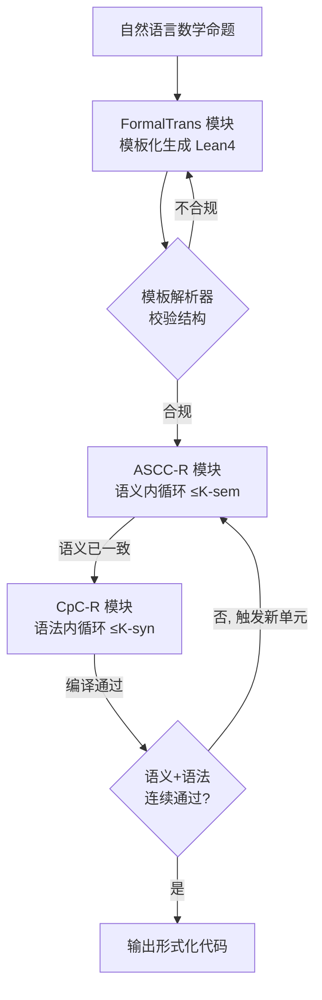

# LoC-Decomp: LLM Autoformalization via Logical Concept Decomposition and Iterative Feedback Correction

**会议**: ICLR 2026  
**OpenReview**: [https://openreview.net/forum?id=0KFQ4F9YEH](https://openreview.net/forum?id=0KFQ4F9YEH)  
**代码**: [https://github.com/jzshischolar/auto-Formalization](https://github.com/jzshischolar/auto-Formalization)  
**领域**: LLM 推理 / 自动形式化（Autoformalization）/ 神经符号系统  
**关键词**: Autoformalization, Lean 4, 语义一致性检查, 逻辑概念分解, 迭代反馈修正  

## 一句话总结
LoC-Decomp 用一个类 CoT 的"逻辑概念分解"模板把自然语言数学命题拆成模块化的 Lean 4 组件，再用"分而治之—回译"做细粒度语义一致性自检，并把语义错误与编译器语法错误统一进一个交替迭代修正循环，在 PutnamBench 上把形式化成功率从 SOTA 的 75% 拉到 93.09%。

## 研究背景与动机
**领域现状**：自动形式化（autoformalization）是把自然语言数学命题翻译成 Lean 4 / Coq / Isabelle 等机器可验证的形式代码，是 LLM 数学推理走向"可验证"的关键一步。近年基于 LLM 的做法——无论是通用模型 + prompt 打分候选，还是在领域数据上做 SFT——在简单命题上已经做得不错。

**现有痛点**：一份合格的形式化必须同时满足两件事：语法正确（编译器能过）和语义一致（忠实保留原命题含义）。语法正确好查，编译器直接报错；但语义一致没有可靠的自动检查手段。当命题涉及概率、组合、几何这类复杂场景时，LLM 很难一眼看出"形式代码和原题之间细微的语义偏差"。更糟的是，现有方法即使察觉到不一致，也缺乏把这种偏差转化成可执行修正信号的能力——要么只给一个数值打分（无修改建议），要么语义反馈需要人工介入。

**核心矛盾**：形式化的难点不在"翻译"本身，而在"如何自动检测细微语义不一致，并把检测结果有效喂回去指导修正"。直接让 LLM 整段回译再比对，在复杂命题上不可靠，因为单次扫描抓不住嵌套的逻辑细节。

**本文目标**：构建一个全自动闭环，把语义不一致反馈与编译器语法错误结合起来，同时逼近语义一致与语法正确，去掉人工环节。

**核心 idea**：**【分解即检查】** 把"分解"这件事既用在生成端，也用在检查端——用一个模块化模板强制 LLM 把形式代码拆成"数学对象 / 约束 / 命题"等语义自洽的组件，这样回译和比对就能在组件级别精确定位偏差，定位到的偏差再作为靶向反馈驱动迭代修正，与编译器报错交替形成闭环。

## 方法详解

### 整体框架
LoC-Decomp 由三个模块串成一条迭代流水线：(1) **FormalTrans**（模板化形式翻译）按预定义模板把自然语言题目生成结构化 Lean 4 代码；(2) **ASCC-R**（自动语义一致性检查与修正）通过"分而治之—回译"检出语义偏差并提修改建议；(3) **CpC-R**（编译检查与修正）处理语法错误。ASCC-R 和 CpC-R 交替运行：先跑语义内循环直到一致（或到上限 K-sem），再跑语法内循环直到编译通过（或到上限 K-syn），二者构成一个 Sem–Syn 迭代单元；多个单元构成外循环（最多 N 次），加最终校验构成一个 ROUND，整体最多重复 M 轮。

### 关键设计

**1. 逻辑概念分解模板（LoC-Decomp Template）：把整段形式化拆成乐高积木。** 区别于以往直接把题目写成单个 Lean 4 theorem 的做法，本文给 LLM 一个带占位符的结构化模板，强制它把形式命题分解成若干语义自洽的声明段——辅助类型（inductive type）、数学系统结构（structure）、各条约束（`def fst_constraint`、`def continuous_constraint` 等）、辅助函数，最后再把这些"积木"拼装成顶层命题 `def problem`。这一步模仿 Chain-of-Thought 的分步推理，让 LLM 逐块构造而非一次性吐出整段代码，组织得更有条理因而正确率更高；其形式化思路借鉴了话语表示理论（Discourse Representation Theory）。由于模板的约束超出 Lean 4 语法本身，作者额外实现了一个轻量 parser 充当模板校验器，不合规就反馈让 LLM 重生成，直到通过或到迭代上限。模板带来的一个理论顾虑是"会不会限制 Lean 4 的表达力"——满足模板的代码是合法 Lean 4 代码的真子集；作者用 Theorem 3.1 给出保证：**对任意完整的 Lean 4 命题串，至少存在一个语义等价且满足模板的 LoC-Decomp counterpart**，即表达力不丢。

**2. 分而治之—回译的语义一致性自检（ASCC）：在组件级别抓细微偏差。** 直接整段回译复杂 Lean 4 代码再比对并不可靠，LLM 单次扫描抓不住嵌套逻辑。ASCC 改用 divide-conquer-merge 三步：先用 parser 把 Lean 4 代码按语义自洽段切开（每段含完整独立的语义单元，能单独过编译），再让 LLM 逐段独立回译成自然语言，最后按逻辑关系把各段译文 merge 成连贯描述。拿到回译后用一个四阶段策略判一致性：先做"分段 + 整体"双重偏差检测（前者抓局部细微偏差、后者抓结构性问题），再把所有偏差按预定义标准评为 critical 或 acceptable，据此定一个整体一致性等级——Fully consistent / Consistent without loss of generality / Inconsistent；若非完全一致，则对每条偏差逐一复核，任一被确认存在即判为不一致，并要求 LLM 对每条确认的偏差给出修正建议。正是这一步把"哪里不一致 + 怎么改"变成可执行反馈。

**3. 语义—语法联合迭代修正（Joint Syn-Sem Rectification）：两类错误交替闭环。** 语义错误来自 ASCC，语法错误来自编译器，二者本质都是"把错误信息追加进上下文让 LLM 重写"。对一份语义不一致的代码，先跑语义内循环（修正—再校验，至多 K-sem 次）直到一致，再进语法内循环（编译—修复，至多 K-syn 次）直到通过——一个语义内循环加一个语法内循环构成一个 Sem–Syn Iter Unit；若一个单元内没能让语义和语法连续通过，就触发下一个单元（外循环最多 N 次），外循环加最终校验为一个 ROUND，失败则进下一 ROUND（最多 M 轮）。实验取 K-sem=2、K-syn=3、N=5、M=3。这种交替设计避免了"修好语义又改坏语法"的来回拉扯，让两类信号在闭环里被轮流消化，每轮迭代都累积知识，从而省掉了以往方法"生成多候选再选一个"的开销。

## 实验关键数据

### 主实验：与现有形式化器对比（LLM-as-judge，pass rate %）

| 数据集 | Ours | DeepSeek-Prover-V2-671B | Goedel-Formalizer-V2-32B | Kimina-Autoformalizer-7B |
|---|---|---|---|---|
| MATH-500 | **96.60** | 84.60 | 90.20 | 63.40 |
| miniF2F | **97.54** | 87.18 | 93.28 | 87.23 |
| PutnamBench | **93.09** | 75.41 | 78.66 | 61.99 |
| ProofNet | 73.57 | **83.10** | 71.39 | 61.31 |

PutnamBench 上 93.09% 比前 SOTA 的 SFT 模型高约 18 个百分点；唯一落后是 ProofNet（被 DeepSeek-Prover 反超）。

### 消融：模板 + 迭代各自的贡献（DeepSeek-V3，ASCC-3-MV %）

| 配置 | MATH-500 | miniF2F |
|---|---|---|
| 仅模板 + few-shot（pass@1，无迭代） | 63.20 | 77.25 |
| + 语义检查 + 编译 + 迭代修正（round-3） | 84.00 | 90.16 |

人工评测（MATH-Level5-50，pass rate %）：

| Ours-no-iter | Ours-iter | Baseline | Baseline-iter | SFT-Baseline |
|---|---|---|---|---|
| 70.00 | **84.00** | 52.00 | 54.00 | 66.00 |

仅靠模板 + few-shot 就比 baseline 高 18%，三轮迭代后再升到 84%，超 baseline 30%，且优于经专家迭代微调的 SFT 模型。

### ASCC 检查器质量（MATH-ASCC-Eval-150，与人工判定对齐）

| 指标 | ASCC-3-MV | ASCC-3-SV | SC-Baseline | SC-Baseline-BackTrans |
|---|---|---|---|---|
| Precision | 0.90 | 0.95 | 0.68 | 0.70 |
| Recall | 0.82 | 0.56 | 0.99 | 0.98 |
| F1 | **0.86** | 0.70 | 0.81 | 0.82 |

### 关键发现
- 模板本身（不含迭代）就是大头增益：pass@1 在 miniF2F 已达 77.25%，说明类 CoT 分解显著改善了 LLM 的结构化生成。
- 迭代修正在难题上收益最大：PutnamBench 从 48.37%（无迭代）涨到 81.50%（round-3，DeepSeek-V3）。
- ASCC-3-MV（三轮多数投票）在 precision 与 recall 间取得最佳平衡，F1=0.86，比朴素 SC-Baseline 的 precision 高出 0.22，作者据此把它定为标准评测指标。
- 方法跨模型稳健：DeepSeek-V3 / KIMI-K2 / Qwen3-235B 三个开源模型上都成立。

## 亮点与洞察
- **"分解"被复用到了检查端**：以往的 decomposition 只用于生成（如 KELPS 引入中间语言做概念分解），本文把同一套分解结构直接服务于语义一致性检查——组件级回译让偏差能被精确定位，这是把生成结构与验证结构对齐的巧思。
- **靶向反馈 vs 数值打分**：相比只给一致性分数的训练式评估（Lu et al. 2024），ASCC 输出"哪条偏差 + critical/acceptable + 怎么改"，把检查结果直接变成修正动作，闭环才转得起来。
- **省掉多候选采样**：迭代累积知识替代了"生成 N 个候选再挑"，思路上更接近人类逐步打磨而非广撒网。
- **表达力有理论兜底**：模板限制表达力的疑虑被 Theorem 3.1 正面回应，工程约束没有牺牲完备性。

## 局限与展望
- **ProofNet 上反被 SOTA 超过**：根因是该数据集编译通过率只有 74%（其它数据集 >95%），多数失败来自未解析的构造——说明模板/few-shot 对某些 Lean 4 高级构造覆盖不足，泛化有边界。
- **重度依赖多次 LLM 调用**：分段回译、双重偏差检测、逐条复核、多层迭代循环（K-sem×K-syn×N×M）叠加，单题推理成本和延迟相当高，论文未给出 token/时延开销分析。
- **ASCC 仍非完美裁判**：F1=0.86 意味着约 18% 的负例漏检（recall 0.82），错误的"一致"判定会让流水线提前停在有语义瑕疵的输出上。
- **聚焦 solve-type 命题**：模板主要面向求解型问题，proof-type 需小幅适配（附录 A.5），其它定理证明器（Coq/Isabelle）的迁移也只是讨论而非实测。

## 相关工作与启发
- **自动形式化两条主线**：合成数据上 SFT（如 DeepSeek-Prover、Kimina）与 in-context prompt。本文属后者，但用模板 + 检查器把 prompt 路线推到能压过 SFT 模型。
- **回译验证**：受"auto-informalization 比 autoformalization 容易"（Wu et al. 2022）启发，用回译比对正确性是这一系的共识；本文把"整段回译"细化成"分段回译"是关键改进。
- **反馈修正**：以往多只用编译器报错修语法（Liu/Lu/Zhang 2024-2025）；FIMO 首次结合语义 + 语法反馈但语义部分需人工，本文把它做成全自动。
- **概念分解**：KELPS 引入中间语言做分解，但没把分解用于语义检查——本文补上了这一环。
- **启发**：把"生成时的结构化分解"同时当作"验证时的对齐锚点"，是一种可迁移到其它"生成—验证"任务（如代码生成、SQL 合成、规约抽取）的通用范式。

## 评分
- **新颖性**: ⭐⭐⭐⭐ — 模板分解 + 组件级回译自检 + 语义/语法联合迭代三件套的组合是新的，尤其"分解复用到检查端"切中要害；单个组件多为已有思路的精化而非全新机制。
- **实验充分度**: ⭐⭐⭐⭐ — 4 个公开数据集 + 2 个自建集、3 个开源模型、与 4 个 SOTA 形式化器对比、ASCC 用人工标注混淆矩阵验证、消融拆清模板与迭代贡献；缺推理成本/时延分析略可惜。
- **写作质量**: ⭐⭐⭐⭐ — 三模块与迭代算法（Algorithm 1）讲得清楚，图 1-4 配合到位；少量拼写/排版瑕疵（Isabella、enginering）不影响理解。
- **价值**: ⭐⭐⭐⭐ — 把自动形式化的语义一致性检查从"人工/打分"推进到"全自动靶向修正"，PutnamBench +18pt 的提升对形式化数学与可验证推理有实际意义。

<!-- RELATED:START -->

## 相关论文

- [\[ICLR 2026\] Divide and Abstract: Autoformalization via Decomposition and Abstraction Learning](divide_and_abstract_autoformalization_via_decomposition_and_abstraction_learning.md)
- [\[ICLR 2026\] ProofFlow: A Dependency Graph Approach to Faithful Proof Autoformalization](proofflow_a_dependency_graph_approach_to_faithful_proof_autoformalization.md)
- [\[ICLR 2026\] ReForm: Reflective Autoformalization with Prospective Bounded Sequence Optimization](reform_reflective_autoformalization_with_prospective_bounded_sequence_optimizati.md)
- [\[ICLR 2026\] ActivationReasoning: Logical Reasoning in Latent Activation Spaces](activationreasoning_logical_reasoning_in_latent_activation_spaces.md)
- [\[ICLR 2026\] LogicReward: Incentivizing LLM Reasoning via Step-Wise Logical Supervision](logicreward_incentivizing_llm_reasoning_via_step-wise_logical_supervision.md)

<!-- RELATED:END -->
