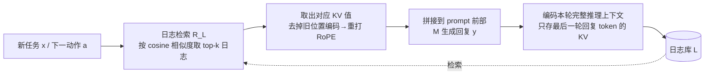

# Log-Augmented Generation: Scaling Test-Time Reasoning with Reusable Computation

**会议**: ICLR 2026  
**OpenReview**: [https://openreview.net/forum?id=oQ3d4O8BaX](https://openreview.net/forum?id=oQ3d4O8BaX)  
**代码**: [https://peterbaile.github.io/lag/](https://peterbaile.github.io/lag/)  
**领域**: LLM 推理 / 测试时计算复用 / 智能体  
**关键词**: 测试时推理、KV 缓存复用、日志增强生成、多跳问答、ReAct 智能体  

## 一句话总结
LAG 把过往任务的推理轨迹存成「只保留少量 token、但 KV 值编码了完整上下文」的日志，新任务来时检索并拼接这些 KV 值直接复用先前的计算，让 LLM 像人一样从历史经验中学习，在多跳问答和推理任务上同时提升准确率和效率。

## 研究背景与动机
**领域现状**：人类解题会自然记住中间结论，遇到相似新题时复用旧推理；但 LLM 及其智能体（如 ReAct）默认是「无记忆」的——顺序处理任务时彼此独立，无法把前一个任务的推理迁移到后一个，导致大量重复推理。

**现有痛点**：为了给模型补上这种记忆能力，已有两条路线各有短板。一是**反思/蒸馏类记忆**（Reflection、Dynamic Cheatsheet 等），它们把日志蒸馏成「思路」「策略」「领域知识」这类抽象组件，但抽象过头会丢失原始推理的丰富上下文，还要额外的抽取/蒸馏步骤，复用价值有限。二是**纯文本日志拼接**，能保留细节但噪声大、且容易超出上下文长度限制。三是**已有 KV 缓存方法**（Block Attention 等），它们只为「内容重复出现时省算力」而设计，缓存的是 prompt 指令或 RAG 文档，目标是效率而非复用推理来提升准确率。

**核心矛盾**：既想保留完整推理上下文以便有效复用，又想让存储的日志足够小（降噪、不爆上下文）——文本表示无法兼得，抽象表示则两头都丢。

**本文目标**：提出一个测试时直接复用过往推理与计算的框架，无需任何抽取/蒸馏，做到「准确率和效率双赢、不牺牲可扩展性」。

**核心 idea**：**用 KV 值而非文本表示日志**。关键洞察是——单个 token 的 KV 值是注意力机制对全部前文 embedding 的加权聚合，它「以一当多」地承载了整段上下文的语义。于是可以**编码整段推理上下文、却只存最后一轮回复那一小撮 token 的 KV 值**，既保住完整语境又把存储压到很小。

## 方法详解

### 整体框架
LAG（Log-Augmented Generation）在基础模型之上加三个模块：**编码存储**（把过往执行表示成可复用的 KV 日志存入日志库 L）、**检索**（新任务来时按语义相似度取最相关的历史日志）、**增强生成**（把检索到的 KV 值拼到当前上下文前面参与生成）。它无缝嵌入 ReAct 式智能体的顺序推理循环——每一步模型在「给答案」和「发起子查询」之间选择，LAG 只需在循环里加一个存储步、一个检索步，并对 prompt 和生成略作调整即可，几乎零侵入。

### 关键设计

**1. 编码与存储解耦：编码整段上下文、只存最后一轮回复的 KV——这是 LAG 区别于已有 KV 缓存方法的命门所在。** 一个任务由多轮 user/assistant 消息构成，LAG 在编码时把**所有轮次的模型回复**一并喂进去算 KV，但落库时只保留**最后一轮回复**对应 token 的 KV 值，把它当作整段推理轨迹的「浓缩摘要」。选最后一轮，是因为它通常反映模型对任务最精炼的理解，其 KV 值通过因果注意力天然 attend 到了前面所有推理。相比之下，已有 KV 缓存方法（Block Attention）不区分「编码什么」和「存储什么」——它直接拿最后一轮回复独立编码再存储，丢掉了早期推理的语境。值得注意的是，多编码内容**不增加 KV 体积**：体积只由「存储 token 数 × 注意力头数 × 每头维度」决定，后两者由模型架构固定，所以这种更优的编码策略是「免费的午餐」。

**2. token 选择策略：用少量关键 token 的 KV 换存储-性能的最优折中。** KV 值是高维向量，逐 token 存储成本高，所以可以只保留「重要 token」的 KV——例如代表最终答案的 token，或智能体设定里下一步动作 $a$ 的 token，因为它们凝结了推理结果。消融显示存更多 token 一般更准但更费空间；综合权衡后，**存「最后一轮回复全部 token」是性能-存储的最佳平衡点**，既不像只存答案那样过少，也不像存全程那样冗余。

**3. RoPE 位置重对齐：让「异地」缓存的 KV 在新上下文里正确生效。** KV 值依赖位置信息，日志库里的 KV 是按原始编码上下文的位置 ID 算的，直接拼进新上下文会位置错乱。LAG 借鉴 Block Attention 的做法：先**剥离旧位置编码、再重新施加适配新上下文的位置编码**。具体地，RoPE 对 key 向量的 2D 子向量施加旋转矩阵 $\text{RoPE}(x,\theta)=\begin{bmatrix}\cos\theta & -\sin\theta\\ \sin\theta & \cos\theta\end{bmatrix}x$，其中角度 $\theta$ 由 token 位置 ID 决定；要去掉旧位置，先左乘逆旋转矩阵还原出 $x$，即 $\begin{bmatrix}\cos\theta & \sin\theta\\ -\sin\theta & \cos\theta\end{bmatrix}\text{RoPE}(x,\theta)=x$，再用新位置 ID 对应的 $\theta'$ 重新旋转得到 $\text{RoPE}(x,\theta')$，最后把多条日志的 KV 拼接起来参与生成。

**4. 语义检索与双日志库设定：决定「调取哪些历史」与「历史何时入库」。** 检索器 $R_L$ 用标准文本嵌入模型（Snowflake-arctic / Qwen3-Embedding）离线预算好日志嵌入，测试时只需对当前动作 $a$ 算一次嵌入，按 cosine 相似度取 top-k（默认 top-3）。日志库分两种工作模式：**静态库**离线建好、在线只查不变（主实验用，按 70/30 划「见过/未见」问题）；**动态库**每完成一个任务就把新日志即时索引进去、持续演化。为贴近真实部署，存日志时**不依赖 gold answer 过滤错误日志**——即便有错误推理也照存，验证框架鲁棒性。

## 实验关键数据

### 主实验表格
在 Llama-3.1-8B + Snowflake 嵌入、静态库 70/30 划分下，知识密集型多跳问答（EM / F1 / 迭代数↓）：

| 方法 | Musique(unseen) EM | F1 | #Iter↓ | 2WikiMultiHop(unseen) EM | F1 | #Iter↓ |
|---|---|---|---|---|---|---|
| Standard agentic (ReAct) | 27.0 | 37.3 | 3.90 | 51.6 | 60.2 | 2.49 |
| Reflection (Dynamic Cheatsheet) | 27.5 | 38.8 | 3.67 | 50.1 | 59.2 | 2.22 |
| KV cache (Block Attention) | 28.7 | 40.7 | 3.37 | 48.3 | 57.1 | 1.89 |
| LAG_text-all | 27.8 | 37.1 | 4.30 | 56.9 | 65.0 | 2.29 |
| LAG_text-last | 30.7 | 42.1 | 3.20 | 55.0 | 63.6 | 2.00 |
| **LAG_KV (本文)** | **32.2** | **45.0** | **2.68** | 55.2 | **64.7** | **1.84** |

推理密集型任务（EM / 迭代数↓）：

| 方法 | GPQA(unseen) EM | #Iter↓ | MMLU-Pro(unseen) EM | #Iter↓ |
|---|---|---|---|---|
| Standard agentic | 18.5 | 1.87 | 41.3 | 1.58 |
| Reflection | 20.0 | 1.84 | 41.0 | 1.59 |
| KV cache | 19.3 | 1.68 | 40.7 | 1.51 |
| LAG_text-last | 18.5 | 1.93 | 42.0 | 1.50 |
| **LAG_KV (本文)** | **30.4** | **1.62** | **42.3** | **1.36** |

LAG_KV 在准确率和迭代数（效率）两个维度上几乎全面领先，GPQA unseen 上 EM 从 18.5 飙到 30.4。

### 消融实验表格
日志表示方式对比（核心消融）：

| 变体 | 编码内容 | 存储内容 | 相对 LAG_KV |
|---|---|---|---|
| LAG_text-all | 全部轮次文本 | 全部轮次文本 | 全文本噪声大 → 更差 |
| LAG_text-last | 仅最后一轮文本 | 仅最后一轮文本 | 丢失广义上下文 → 更差 |
| KV cache(Block Attn) | 仅最后一轮 | 最后一轮 KV | 编码不含全程 → 更差 |
| **LAG_KV** | **全程推理上下文** | **最后一轮 token 的 KV** | **最佳** |

两头对照证明：LAG_text-all 给文本配「全程」反而更差（噪声多），LAG_text-last 配「仅最后一轮」也更差（丢上下文）；只有 KV 值能在「只存最后一轮」的同时仍编码进完整语境。

### 关键发现
- **效率收益**：Musique 上 LAG 在第 2 次迭代的 EM 就略超标准智能体第 7 次迭代，约 **3.5× 效率提升**；即便都跑到第 25 次迭代性能见顶，LAG 仍更准，说明效率与准确率双赢。
- **准确率来源拆解**（迭代 20/25 平台期）：日志带来「知识复用」（少走几步即得解）和「洞察复用」（纠正旧错误、答出原本无解的题）。如 GPQA 上 +18 incorrect→correct、+15 unsolvable→correct，净改善 +22；Musique 净 +20。少数情况下相关日志也会误导模型把对的变错，但纠正数量总体更多。
- **编码更优却零额外存储**：多编码内容不改变 KV 体积（体积只取决于存储 token 数与固定的架构维度），所以 LAG 的性能提升是「免费」的。

## 亮点与洞察
- **把 KV 缓存从「省算力工具」重新定位为「记忆载体」**：以往 KV 缓存只为重复内容省计算，LAG 第一次明确用它来**保留并复用推理语境以提升准确率**，重构了 KV 缓存的目的论。
- **「编码 ≠ 存储」的解耦** 是全文最锋利的一刀：利用「单 token KV 是全程上下文的加权聚合」这一性质，做到「编码全程、只存一撮」，鱼与熊掌兼得，且不增存储。
- **verbatim 复用胜过蒸馏抽象**：直接搬运原始推理比反思类「提炼成思路/策略」更管用，反衬出过度抽象会丢信息——对当下流行的 memory/reflection agent 是一记有力的反例。
- **几乎零侵入**：只在 ReAct 循环里加存/取两步，可推广到任意「存储-检索-增强生成」的生成范式。

## 局限与展望
- **依赖可直接访问 KV 的开源模型**（Llama-3.1、Qwen3-MoE），闭源 API 模型无法操作 KV 值，方法不可用。
- **存储成本随任务量线性增长**：每条日志存高维 KV 向量，大规模长期部署下日志库膨胀与检索开销是隐忧，论文只给了 token 子集折中而未深入压缩。
- **日志可能误导**：相关日志会把部分原本正确的题带偏（C→I），缺少在线甄别「该不该信这条日志」的机制；不过滤错误日志虽贴近现实，也放任了噪声注入。
- **检索质量是上限**：整体效果受限于文本嵌入检索器，跨域/语义漂移时 top-k 可能召回不相关历史。展望可探索 KV 级压缩、可信度加权融合、以及与持续学习/参数更新的结合。

## 相关工作与启发
- **反思/记忆类**：Self-Refine、Reflexion、Dynamic Cheatsheet、Thought/Strategy 蒸馏——LAG 与之的根本分歧是「直接复用 vs 抽取蒸馏」。
- **KV 缓存复用**：Block Attention、CacheBlend、Prompt Cache（Gim et al.）等缓存指令或 RAG 文档以省算力，LAG 把对象换成「推理轨迹」、目标换成「提准确率」，并引入「编码/存储解耦」。
- **测试时计算扩展**：传统 test-time scaling 靠多采样/更长推理换准确率，LAG 提供了正交的一条路——**用历史计算的复用来 scale**，少跑迭代也能更准，对降低 agent 推理成本有直接启发。

## 评分
- **新颖性**: ⭐⭐⭐⭐⭐ —— 「编码全程、只存最后一轮 KV」的解耦洞察既简洁又反直觉，把 KV 缓存从效率工具重新定义为推理记忆载体，切口很新。
- **实验充分度**: ⭐⭐⭐⭐ —— 覆盖知识/推理两类共 4 个数据集、3 个 LLM、2 个嵌入器、静态/动态库、多种数据划分，并做了准确率来源拆解；但规模偏中小、缺大模型与长期部署下的存储增长实测。
- **写作质量**: ⭐⭐⭐⭐ —— 动机（人类记忆类比 + Figure 1 多跳例子）清晰，方法层层递进，消融对照设计巧妙，公式与算法到位。
- **价值**: ⭐⭐⭐⭐ —— 给 agent「记忆复用」提供了即插即用、准确率与效率双赢的实用方案，对降低多步推理成本有现实意义；受限于需可访问 KV 的开源模型。

<!-- RELATED:START -->

## 相关论文

- [\[ICLR 2026\] ATTS: Asynchronous Test-Time Scaling via Conformal Prediction](atts_asynchronous_test-time_scaling_via_conformal_prediction.md)
- [\[ICLR 2026\] CaTS: Calibrated Test-Time Scaling for Efficient LLM Reasoning](cats_calibrated_test-time_scaling_for_efficient_llm_reasoning.md)
- [\[ICLR 2026\] Plan and Budget: Effective and Efficient Test-Time Scaling on Reasoning LLMs](plan_and_budget_effective_and_efficient_test-time_scaling_on_reasoning_large_lan.md)
- [\[ICLR 2026\] Efficient Test-Time Scaling for Small Vision-Language Models](efficient_test-time_scaling_for_small_vision-language_models.md)
- [\[ICLR 2026\] Strategic Scaling of Test-Time Compute: A Bandit Learning Approach](strategic_scaling_of_test-time_compute_a_bandit_learning_approach.md)

<!-- RELATED:END -->
