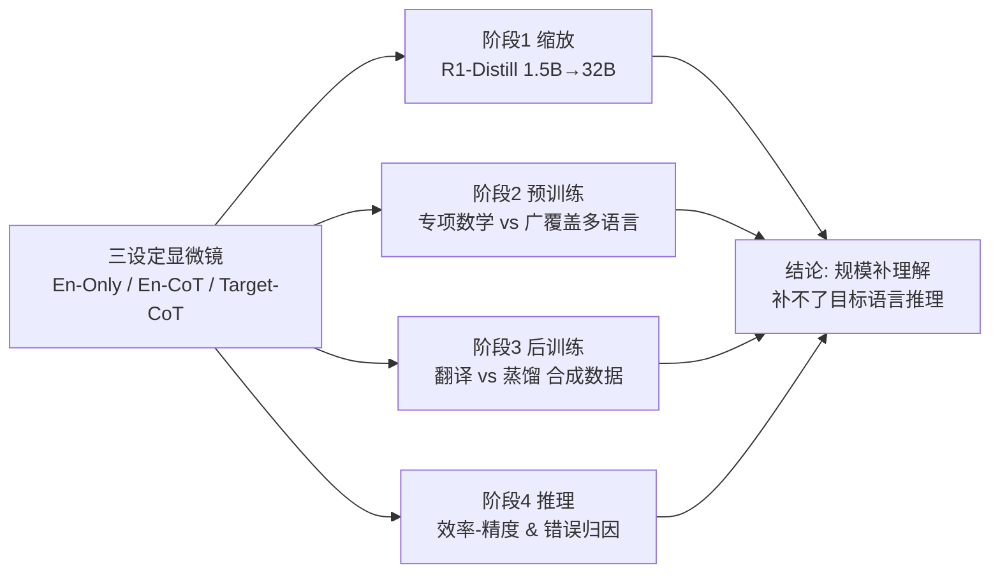

# Long Chain-of-Thought Reasoning Across Languages

**会议**: ICLR 2026  
**OpenReview**: [https://openreview.net/forum?id=2kKXbsRhYI](https://openreview.net/forum?id=2kKXbsRhYI)  
**代码**: [https://github.com/Berkeley-NLP/Multilingual-Long-CoT](https://github.com/Berkeley-NLP/Multilingual-Long-CoT)  
**领域**: LLM 推理 / 多语言推理  
**关键词**: 长链推理, Long CoT, 多语言, 跨语言迁移, 合成数据, 后训练  

## 一句话总结
本文系统性地把长链思维（long CoT）推理能力的跨语言迁移拆解到「缩放、预训练、后训练、推理」四个开发阶段，发现规模放大只能补齐"理解"而补不齐"用目标语言推理"，并给出一个反直觉的实操结论：把英文推理轨迹翻译成目标语言来微调，比直接蒸馏目标语言轨迹更有效。

## 研究背景与动机
**领域现状**：大型推理模型靠在回答前生成长链思维（动辄上万 token，含分支、回溯、自我验证）在数学、代码、科学等任务上达到专家水平，但这些研究几乎全在英文上展开。即使在多语言任务上评测，模型也常常用英文而非输入语言来做中间推理。

**现有痛点**：长链推理是否能迁移到世界上绝大多数非英语语言，至今缺乏系统理解。现有多语言推理工作大多停留在 short CoT（几步推理）设定，或把英文当作"枢轴语言"先翻译再推理，本质上回避了"模型能否真正用目标语言推理"这个问题。对数十亿非英语用户而言，用英文输出推理步骤意味着无法审计、无法复现、无法诊断错误。

**核心矛盾**：评测推理模型需要区分两种截然不同的能力——**理解非英语输入**（$L_{input}$）与**用目标语言推理**（$L_{reason}$）。过去的指标把两者混为一谈，导致"规模放大改善多语言性能"这一结论掩盖了真正的瓶颈在哪里。

**本文目标**：在英文之外的九种语言（高/中/低资源各三种）上，沿模型开发全流程系统刻画长链推理的跨语言迁移，定位"英文推理进步无法泛化"之处以及"针对性多语言干预能补齐差距"之处。

**核心 idea**：**[设定解耦]** 设计 En-Only / En-CoT / Target-CoT 三种对照设定，把"理解"和"推理"两种能力分离出来单独测量，再把这套显微镜分别对准缩放、预训练、后训练、推理四个阶段。

## 方法详解

### 整体框架
本文不是提出单一模型，而是一套"诊断框架 + 四阶段控制实验"。核心是用三种对照设定把多语言推理性能分解成可独立观测的两个因子，然后在固定其他变量的前提下分别扰动模型开发的四个阶段，逐一回答"这一阶段对跨语言长链推理贡献了什么"。

### 关键设计
**1. 三设定显微镜：把"理解"与"推理"拆成可测因子**——这是全文方法论的基石。沿用 Ko et al. (2025) 的分解思路，作者把一次推理任务的成功拆成两个因子：理解输入语言 $L_{input}$ 和用某语言推理 $L_{reason}$。对应三种设定：En-Only（输入和推理都用英文，作为英文基线）、En-CoT（输入是目标语言、但用英文推理）、Target-CoT（输入和推理都用目标语言）。关键在于对照逻辑——En-CoT 相对 En-Only 的差距反映**理解**障碍，Target-CoT 相对 En-CoT 的差距则单独暴露**用目标语言推理**的能力。九种语言按其在 mC4 中的占比分为高（中/法/日）、中（南非荷兰语/泰/拉脱维亚）、低（马拉地/泰卢固/斯瓦希里）三档，覆盖多种文字系统与语系；评测用 MATH-500、AIME-Combined（数学）和 MMLU-ProX（通用知识推理）。

**2. 受控缩放实验：用同源蒸馏系列隔离参数量变量**——为了让结论只归因于参数量，作者选 DeepSeek-R1-Distill 系列（1.5B–32B），它们共享同一套 800k 推理轨迹的后训练流程、同源于 Qwen 2.5 基座，从而剔除语料/分词器差异。在 En-CoT 下，高资源语言各规模都接近英文基线，说明理解早已不是瓶颈；但 Target-CoT 即便到 32B 也始终追不上英文，所有语言在 32B 上的表现都不超过参数量小 4 倍的 7B En-Only 基线，低资源语言几乎对规模不敏感、精度接近零。平均而言，32B 上从英文切到目标语言推理掉 28.8% 精度。这与 short CoT 的结论形成鲜明对比——后者的差距主要来自理解而非推理语言。

**3. 预训练拆解：广覆盖多语言 vs 专项推理，方向相反**——固定规模与后训练、只换预训练基座（Qwen2.5-7B、Qwen2.5-Math-7B、Qwen3-8B-Base、Gemma3-12B-PT），统一用 OpenThoughts3 的 20k 英文轨迹做 SFT。作者用 EPR（English Performance Recovered = AVG/EN，衡量跨语言迁移效率）作主指标以跨架构可比。结论分两支：加专项数学预训练（Qwen2.5-Math-7B）能提升 En-CoT，却**严重损害** Target-CoT（法语 -46%、南非荷兰语 -39%，连训练中包含的中文也掉 -36%）；而广覆盖多语言预训练（Qwen3-8B-Base、Gemma3-12B-PT）能同时改善两种模式，En-CoT 上恢复 85–97% 的英文性能、Target-CoT 的 EPR 也大幅高于 Qwen 2.5 系。说明多语言预训练奠定了"理解非英语输入"的地基，但"用目标语言生成长结构化 CoT"仍需后续干预。

**4. 合成数据后训练：翻译胜过蒸馏的反直觉发现**——针对"非英语高质量推理轨迹稀缺"这一根本障碍，作者从 s1k（1000 条 DeepSeek-R1 蒸馏的英文高质量轨迹）出发，造两套数据：Translated-s1k（用 Gemini-2.0-Flash 翻译成目标语言，事先在 FLORES-200 上验证其翻译质量优于强 MT 模型）和 Distilled-s1k（用 language forcing 直接从 DeepSeek-R1 蒸馏目标语言轨迹，反复重采样直到 1000 条全部通过语言合规检查）。对每种语言各微调一个 Qwen3-8B-Base，得到 18 个模型。结果是**翻译普遍更强更稳**——中文 +24.2%、法语 +9.2%，仅马拉地语是蒸馏更优。更关键的实操结论：高资源语言（法/日）用现成的 2 万条英文数据微调即可靠跨语言迁移获益，而中低资源语言用仅 1000 条目标语言轨迹（比英文基线少 20×）就能拿到显著增益，甚至在马拉地、泰卢固、斯瓦希里上超过 SOTA 的 Qwen3-8B。

## 实验关键数据

### 主实验表格（预训练基座对比，EPR 越高跨语言迁移越好）

| Base Model（MATH-500） | EN | AVG(非英) | EPR-EnCoT | EPR-TargetCoT |
|---|---|---|---|---|
| Qwen2.5-7B | 90.2 | 80.4 | 89.1 | 35.8 |
| Qwen2.5-Math-7B | 92.2 | 81.4 | 88.3 | **13.7** |
| Qwen3-8B-Base | 94.6 | 90.4 | **95.6** | **65.6** |
| Gemma3-12B-PT | 76.6 | 74.4 | **97.1** | 51.8 |

> 专项数学预训练把 Target-CoT 的 EPR 从 35.8 砸到 13.7；广覆盖多语言预训练（Qwen3 / Gemma3）把 En-CoT EPR 拉到 95+、Target-CoT EPR 提到 52–66。

### 消融实验表格（Qwen3-8B-Base 后训练，全为 Target-CoT，下标相对 20k 英文基线）

| SFT 数据（三基准平均口径） | ZH | FR | MR | TE | SW |
|---|---|---|---|---|---|
| OpenThoughts3-20k（英文）MATH-500 | 75.8 | 89.2 | 45.6 | 30.0 | 21.2 |
| Translated-s1k（1k）MATH-500 | **87.2** | 87.0 | **70.8** | **72.4** | **64.4** |
| Distilled-s1k（1k）MATH-500 | 60.0 | 78.8 | 76.2 | 67.2 | 57.8 |
| Qwen3-8B（Thinking, SOTA） | 94.0 | 92.0 | 49.0 | 47.4 | 8.4 |

> 中低资源语言用 1000 条翻译轨迹（20× 更少数据）在 MATH-500 上大幅反超英文基线，泰卢固 +42.4、斯瓦希里 +43.2，且超过 SOTA 的 Qwen3-8B。

### 关键发现
- **规模补理解、补不了推理**：32B 上所有语言 Target-CoT ≤ 7B 英文基线；切换到目标语言推理平均掉 28.8% 精度，低资源语言对规模几乎不敏感。
- **专项 vs 广覆盖预训练方向相反**：数学专项预训练提升 En-CoT 却拖垮 Target-CoT（连训练里有的中文都掉 36%）；广覆盖多语言预训练两者双赢。
- **翻译 > 蒸馏**：翻译数据更强更稳，中文 +24.2%；中低资源语言 1000 条目标语言数据即可补齐，甚至超过 SOTA。
- **推理效率有跨语言差异**：精度与平均响应 token 数强负相关（$r=-0.824$ / $-0.915$）；英文专项微调的效率优势不迁移，翻译数据微调能拉平各语言的效率差。
- **错误模式不对称**：En-CoT 错误近半（47.6%）是推理步骤错误、输出生成错误仅 0.7%；Target-CoT 推理错误降到 34.4%，但输出生成错误升到 11.3%、概念错误升到 24.9%——低资源语言常因无尽重复等不稳定生成而根本到不了推理阶段。

## 亮点与洞察
- **方法论贡献大于单点结论**：三设定显微镜把"理解 vs 推理"显式拆开，是后续多语言推理研究可复用的诊断范式，避免了用混合指标得出误导性结论。
- **覆盖开发全流程**：缩放、预训练、后训练、推理四个阶段都做了控制实验，每个阶段都剔除了干扰变量（同源蒸馏系列、固定后训练只换基座、EPR 跨架构归一），证据链完整。
- **"翻译 > 蒸馏"极具实操价值**：在非英语推理数据稀缺的现实下，把英文金标轨迹翻译过来比花大力气蒸馏目标语言轨迹更划算，且仅需 1000 条就能让低资源语言反超 SOTA，对工程落地是直接可用的指南。
- **错误归因揭示失败本质**：Target-CoT 的失败不全是"推理变笨"，而是被不稳定生成和概念应用障碍挡在推理之外，指明了下一步该修的方向。

## 局限与展望
- **后训练存在算力不对等**：20k 英文 vs 1k 目标语言并非等算力对比（虽附录 B.4 补了等算力实验），主表的"翻译胜出"部分受数据规模差异影响。
- **未触及 RL 阶段**：长链推理通常 SFT + RL 两段式，本文后训练只做了 SFT，非英语 RL 的奖励塑形敏感性（语言合规问题）未深入。
- **翻译质量天花板**：Translated-s1k 依赖 Gemini-2.0-Flash 的翻译，对术语/数学符号密集的轨迹，翻译误差可能引入新的失败模式，且随着下一代多语言推理模型变强，蒸馏的相对优势可能反转。
- **语言覆盖虽广但仍有限**：九种语言已覆盖多语系/文字系统，但拉脱维亚等在 MMLU-ProX 上缺评，低资源语言（斯瓦希里）在某些 SOTA 模型上近乎崩溃，泛化到更多极低资源语言仍待验证。

## 相关工作与启发
- **Long CoT 推理**：从 CoT prompting (Wei et al., 2022)、scratchpad (Nye et al., 2021) 到推理时缩放 (Snell et al., 2025)、long CoT (Muennighoff et al., 2025)，本文把这条线索系统延伸到非英语。
- **多语言推理**：早期发现英文 CoT 优于目标语言 (Shi et al., 2023)，催生了"英文枢轴"路线（外部翻译 Huang et al., 2023 / 内部表示对齐 She et al., 2024）；本文与只研究"用英文推理"的 Yong et al. (2025)、Son et al. (2025) 互补，正面研究"用目标语言推理"的全流程迁移。
- **启发**：(1) 评测多语言能力时务必拆开"理解"与"推理"，否则会被混合指标误导；(2) 预训练阶段的"专项化"与"广覆盖"对跨语言推理是相反力，技术报告里新增的"推理阶段"需警惕对非英语的副作用；(3) 数据稀缺场景下，"翻译现成高质量数据"常比"从零蒸馏"更具性价比。

## 评分
- **新颖性**: ⭐⭐⭐⭐ — 不在于新模型，而在于把跨语言长链推理拆到开发全流程的诊断框架，以及"翻译 > 蒸馏""规模补理解不补推理"等反直觉系统性结论。
- **实验充分度**: ⭐⭐⭐⭐⭐ — 九语言 × 四阶段 × 三设定 × 多基准，控制变量严谨（同源系列、固定后训练、EPR 归一），含效率与错误归因分析，证据链完整。
- **写作质量**: ⭐⭐⭐⭐ — 三设定/四阶段叙事清晰，图表层层递进；术语（EPR、$L_{input}/L_{reason}$）定义到位，结论可操作。
- **价值**: ⭐⭐⭐⭐⭐ — 为数十亿非英语用户的可用推理给出可落地指南（1000 条翻译数据补齐低资源语言），并开放模型/数据/代码，对多语言推理社区影响直接。

<!-- RELATED:START -->

## 相关论文

- [\[ICLR 2026\] Uni-CoT: Towards Unified Chain-of-Thought Reasoning Across Text and Vision](uni-cot_towards_unified_chain-of-thought_reasoning_across_text_and_vision.md)
- [\[ICLR 2026\] Pruning Long Chain-of-Thought of Large Reasoning Models via Small-Scale Preference Optimization](pruning_long_chain-of-thought_of_large_reasoning_models_via_small-scale_preferen.md)
- [\[ICLR 2026\] Mathesis: Towards Formal Theorem Proving from Natural Languages](mathesis_towards_formal_theorem_proving_from_natural_languages.md)
- [\[ICLR 2026\] Continuous Chain of Thought Enables Parallel Exploration and Reasoning](continuous_chain_of_thought_enables_parallel_exploration_and_reasoning.md)
- [\[ICLR 2026\] Are Reasoning LLMs Robust to Interventions on Their Chain-of-Thought?](are_reasoning_llms_robust_to_interventions_on_their_chain-of-thought.md)

<!-- RELATED:END -->
