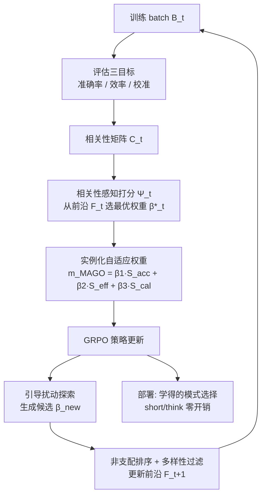

# MAGO: Beyond Fixed Hyperparameters with Multi-Objective Pareto Optimization for Hybrid LLM Reasoning

**会议**: ICLR 2026  
**OpenReview**: [https://openreview.net/forum?id=i8vZvBFNJg](https://openreview.net/forum?id=i8vZvBFNJg)  
**代码**: 待确认  
**领域**: LLM 推理 / 高效推理  
**关键词**: 混合推理, 多目标优化, Pareto 前沿, 自适应权重, GRPO, token 效率  

## 一句话总结
MAGO 把"该不该开启长链推理"这一混合推理问题重写成多目标优化，用 Pareto 前沿维护 + 相关性感知的动态权重，在训练阶段自动平衡准确率、效率与决策校准三个目标，免去手动调超参，推理时零额外开销即可获得 2.2×–3× 的 token 节省。

## 研究背景与动机
**领域现状**：DeepSeek-R1、Claude 这类推理模型靠 chain-of-thought 把复杂问题拆步求解，在数学、逻辑任务上表现亮眼。但部署时对所有 query 一律展开长链推理会造成巨大浪费——简单事实题本可直接回答，却被生成几百上千 token，资源消耗是非推理路径的 5–20 倍。

**现有痛点**：为此出现了混合推理（hybrid reasoning）——让模型在 `<short>`（直接答）和 `<think>`（长链推理）两种模式间动态选择。代表方法 DeGRPO 在 GRPO 基础上引入一个控制权重 $\alpha$ 来平衡"选模式"与"答对题"。但这类方法依赖**固定超参 + 启发式单目标优化**，存在两个被本文实证指出的性能缺口：

- **静态权重失配**：作者扫了一系列 $\alpha$ 值发现，$\alpha=0.0001$ 时 90%+ query 走 short 模式、牺牲难题准确率；$\alpha=0.01$ 时 80%+ 走 think 模式、效率全无。且最优 $\alpha$ 随数据集剧烈变化，没有任何单一固定值能跨数据集稳定。穷举搜 $\alpha$ 又要为每个配置独立训练，代价随搜索空间线性爆炸。
- **多目标相关性陷阱**：准确率、效率、决策校准三者相互纠缠（高准确常需更长链 → 与效率冲突；保守的模式选择又同时拖累两者）。固定权重的标量化 $\sum_i \lambda_i f_i$ 只能把搜索约束在目标空间里一条预定方向上，形成"锥形"受限区域（cone entrapment），错过其它区域里更优的解。

**核心矛盾**：混合推理的本质是一个**多目标、目标间强相关、且最优权衡随任务复杂度漂移**的问题，而现有方法却用固定标量权重去逼近它。

**本文目标**：构造一个无需手动调参、能动态探索完整权衡空间、且推理时零开销的混合推理训练框架。

**核心 idea**：把混合推理重写成多目标优化，用 **Pareto 前沿维护**取代固定权重，并用**相关性感知的权重选择**专门破解 cone entrapment，让权重随训练进度和批次特性自适应漂移。

## 方法详解

### 整体框架
MAGO 在训练阶段把 GRPO 目标里那个静态控制权重换成一个自适应权重函数 $m(x)$，该函数由三个竞争目标（准确率/效率/校准）按动态权重 $(\beta_1,\beta_2,\beta_3)$ 线性组合得到；而这组权重不是手调的，而是每一步从一个不断演化的 Pareto 前沿里、用相关性感知打分函数挑出来的。训练形成闭环——选权重 → 用它做策略更新 → 在 batch 上评估三目标 → 更新前沿；部署时模型已学会自主在 `<short>`/`<think>` 间切换，零额外参数与计算。

### 关键设计

**1. 三目标重构：把"准确-效率-校准"显式化**。MAGO 不再用一个标量 $\alpha$ 笼统平衡，而是把控制权重写成 $m_{\text{MAGO}}(x)=\beta_1 S_{\text{acc}}(x)+\beta_2 S_{\text{eff}}(x)+\beta_3 S_{\text{cal}}(x)$，三个目标各有清晰定义。准确率目标 $S_{\text{acc}}(x)=\mathbb{E}[\mathbb{I}(\phi(a)=y^*)]$ 度量答案正确性；效率目标 $S_{\text{eff}}(x)=\mathbb{E}[1-\frac{|a|}{T_{\max}}]$ 把生成长度归一化成"越短越高"的得分；校准目标则是本文最有意思的一个——它要求模型选 short 模式时确实有把握直接答对、选 think 模式时确实是题难需要长推理。校准用 $S_{\text{cal}}(x)=1-\mathbb{E}[|P_{\text{model}}(\text{correct}|x,c)-\mathbb{I}(\phi(a)=y^*)|]$ 衡量，其中 $P_{\text{model}}$ 不是直接拿原始 softmax 置信度（那往往系统性过/欠自信），而是先把原始置信度 $\text{RawConf}(a)=\max(\text{softmax}(L_{\text{answer}}))$ 离散到 $N_{\text{bins}}$ 个桶里，再查该模式该桶的**历史经验准确率** $\text{HistoricalAccuracy}(c,b)$，并用指数衰减 $\lambda$ 维护这一统计以偏向近期表现。这样校准目标不引入任何额外神经组件，却比裸 token 概率更可靠。

**2. Pareto 前沿维护：用一群权重取代一个权重**。这是破解 cone entrapment 的核心。MAGO 维护一个不断演化的权重配置集合 $F_t=\{\beta^{(1)},\dots,\beta^{(k)}\}$，每个 $\beta^{(i)}$ 是三目标的一种权衡。每步在当前 batch 上算出各配置的目标向量 $S_t(\beta^{(i)})$，只保留非支配解 $F_t=\{\beta^{(i)}\mid \nexists\,\beta^{(j)}: S_t(\beta^{(j)})\succ S_t(\beta^{(i)})\}$。靠维护一批多样的非支配权重，优化轨迹就不再被锁死在标量化所限定的窄锥里，而能在整个目标空间里铺开探索。实现上前沿规模在早期逐步增长、稳定在 20–25，上界 $|F_{\max}|=30$，超限时用余弦相似度剪掉冗余向量。

**3. 相关性感知权重选择：专治目标纠缠**。光有前沿还不够——当三目标高度相关时，简单挑"加权和最高"的配置会让相关目标互相裹挟。MAGO 先按 batch 算出三目标间的经验相关矩阵 $C_t[i,j]$，再用一个相关性自适应打分函数挑权重：$\Psi_t(\beta)=\sum_{i=1}^3 \beta_i \hat{S}^{(i)}_t-\beta_{\text{corr}}\sum_{i<j}|C_t[i,j]|\cdot|\beta_i-\beta_j|$。第一项奖励"押注表现好的目标"，第二项 $|\beta_i-\beta_j|$ 在目标 $i,j$ 强相关时惩罚权重分配不均，逼着相关目标拿到更均衡的关注；最终选 $\beta^*_t=\arg\max_{\beta\in F_t}\Psi_t(\beta)$。这一项是本文相对于"只做 Pareto"的额外创新点，直接对应 Challenge #2。

**4. 引导扰动探索 + 闭环集成：防早熟、零推理开销**。为避免前沿过早收敛，MAGO 用受约束扰动生成新候选 $\beta_{\text{new}}=\beta^*_t+\epsilon_t\cdot d$，其中扰动方向 $d$ 采样自约束面 $\{\|d\|_2=1,\sum_i d_i=0\}$ 以保持权重归一化，步长 $\epsilon_t=\epsilon_0\exp(-D(F_t)/D_{\text{target}})$ 随前沿多样性 $D(F_t)$ 自适应——前沿越多样、探索越克制。新候选经非支配排序与多样性过滤并入 $F_{t+1}$。整套机制只在**训练阶段**替换 GRPO 里的静态权重（最终训练目标见 Eq. 22），配合一个极简奖励 $r(a,y^*,c)$（short 答对得 1.0、think 答对得 $1.0-\gamma$、答错 $-1.0$，$\gamma$ 偏好高效正确）；部署时模型已内化模式选择策略，**推理零额外参数、零额外计算**。

## 实验关键数据

### 主实验表格
基座 DeepSeek-R1-Distill-Qwen-1.5B，先 SFT 1 epoch 再 MAGO RL 600 步；数学推理 4 个 benchmark（Pass@1 / 平均 token）：

| 方法 | 类型 | AIME24 Pass@1 | AIME #Tok | MATH-500 Pass@1 | MATH-500 #Tok | GSM8K Pass@1 |
|------|------|---------------|-----------|-----------------|---------------|--------------|
| DeepSeek-R1-1.5B | Base | 0.2800 | 18063 | 0.8608 | 5675 | 0.8347 |
| CoT-Valve α=4 | Short CoT | 0.2267 | 17722 | 0.8036 | 5820 | 0.8108 |
| Router Q-7B | Hybrid | 0.1480 | 9296 | 0.7781 | 2748 | 0.8587 |
| DeGRPO-1.5B | Hybrid | 0.2506 | 7262 | 0.8037 | 2644 | 0.8418 |
| **MAGO-1.5B (Ours)** | Pareto | **0.2741** | **7164** | **0.8247** | **2578** | 0.8469 |

同骨架下 MAGO 对启发式基线给出 2.2×–3× token 效率提升与 0.6%–9.4% 相对准确率提升，AIME 用 7164 token（vs 基座 18063）达到更高 Pass@1。

### 消融实验表格
扩展到更大骨架（7B/14B/32B），容量越大 Pass@1 单调上升、token 反而略降，说明 Pareto 优化随规模良好泛化且不增推理成本：

| 模型 | AIME24 | MATH-500 | GSM8K | AIME #Tok |
|------|--------|----------|-------|-----------|
| MAGO-7B | 0.2960 | 0.8424 | 0.8611 | 6890 |
| MAGO-14B | 0.3112 | 0.8538 | 0.8723 | 6724 |
| MAGO-32B | 0.3254 | 0.8652 | 0.8834 | 6587 |

跨域泛化（CommonsenseQA，无微调）：MAGO 74.9% 准确率，比 DeGRPO/CoT-Valve 高 1.8%/1.1%，token 从 312 降到 152（2.05× 效率）；MedQA-USMLE 上同样 >2.0× 效率且准确率有竞争力。

### 关键发现
- **防模式坍缩**：vanilla GRPO 在 ~120 步内 think 样本数骤降到近零（坍缩成只会 short）；MAGO 靠维护多样权重配置使两模式始终保持平衡分布。
- **U 形/稳定学习曲线**：think 模式稳定在 0.6–0.7 准确率、short 从 0.4 渐升到 0.5，约 300 步平滑收敛；DeGRPO 则在 0.3–0.8 间剧烈震荡。think/short 正确样本的交点出现得更晚（~400 步），说明 MAGO 在定型策略前做了更充分的权衡探索。

## 亮点与洞察
- **把"调 α"上升为多目标优化**：本文最有价值的视角是指出固定标量权重在几何上等价于把搜索锁进锥形区域，从而把"为什么 DeGRPO 这类方法跨数据集不稳"解释清楚，并用 Pareto 前沿给出原则性解法。
- **校准目标 + 历史准确率分桶**：用经验校准纠正原始 token 置信度的系统性偏差，不加任何网络组件，是个轻量但讲究的设计。
- **相关性感知打分**：很多 Pareto/MOO 方法忽视目标间相关性，本文显式用相关矩阵惩罚相关目标的权重失衡，对应到第二个性能缺口，逻辑闭环。
- **训练换推理**：所有复杂度都摊到训练阶段，推理零开销且训练成本被海量在线 query 摊薄，工程上对部署友好。

## 局限与展望
- **依赖在线 RL 与历史统计**：校准目标的历史准确率分桶需要在训练中持续累积统计，冷启动阶段桶内样本稀疏时估计可能不稳，论文未深入讨论这一过渡期。
- **三目标固定**：框架写死了准确/效率/校准三目标的线性组合，若要加入第四类约束（如安全、格式）是否能无缝扩展、相关性矩阵随目标数增长的开销，留待验证。
- **前沿规模与超参**：虽号称免调 $\alpha$，但仍引入了 $\beta_{\text{corr}}$、$\epsilon_0$、$\tau_{\text{div}}$、$|F_{\max}|$、$N_{\text{bins}}$、$\lambda$、$\gamma$ 等一批新超参，是否真正"零调参"取决于这些值的鲁棒性。
- **评测偏数学**：主战场是数学推理，跨域只验了 CommonsenseQA/MedQA 两个 QA 任务，对代码、长文档、agent 等更复杂场景的迁移性仍待观察。

## 相关工作与启发
- **混合/高效推理**：与 DeGRPO、CoT-Valve、Model Merging、token-budget-aware reasoning、test-time compute scaling 等同属"让推理更省"的脉络；MAGO 的差异是用多目标 + Pareto 取代单目标启发式。
- **多目标优化（MOO）**：借鉴 Pareto-optimal trade-off、加权标量化、多奖励 RL、演化算法等思路，但指出"在推理模式选择上做 MOO"这一子问题此前几乎空白。
- **启发**：把"看似一个超参在调权衡"的问题重写成 MOO 并显式建模目标相关性，这一思路可迁移到 RLHF 多奖励平衡、长短输出控制、多约束对齐等大量"权衡型"训练问题。

## 评分
- **新颖性**: ⭐⭐⭐⭐ — 把混合推理重写成 Pareto 多目标优化、并用相关性感知破解 cone entrapment，是有清晰几何动机的原则性创新，而非又一个调权重 trick。
- **实验充分度**: ⭐⭐⭐⭐ — 覆盖 4 个数学 benchmark + 2 个跨域 QA、1.5B→32B 四种规模、训练动态/模式坍缩分析齐全；但跨域任务类型偏窄、缺更强基座对照。
- **写作质量**: ⭐⭐⭐⭐ — Challenge 驱动叙事清晰，公式与图（静态权重锥形约束、训练动态）配合到位，方法与缺口一一对应。
- **价值**: ⭐⭐⭐⭐ — 推理零开销 + 免手调 α + 2–3× token 节省，对推理模型的高效部署有直接实用价值，框架也可迁移到其它多目标训练场景。

<!-- RELATED:START -->

## 相关论文

- [\[ICLR 2026\] TRIM: Hybrid Inference via Targeted Stepwise Routing in Multi-Step Reasoning Tasks](trim_hybrid_inference_via_targeted_stepwise_routing_in_multi-step_reasoning_task.md)
- [\[ICLR 2026\] Reference-guided Policy Optimization for Molecular Optimization via LLM Reasoning](reference-guided_policy_optimization_for_molecular_optimization_via_llm_reasonin.md)
- [\[ICLR 2026\] Beyond Markovian: Reflective Exploration via Bayes-Adaptive RL for LLM Reasoning](beyond_markovian_reflective_exploration_via_bayes-adaptive_rl_for_llm_reasoning.md)
- [\[ICLR 2026\] Hybrid Reinforcement: When Reward Is Sparse, Better to Be Dense](hybrid_reinforcement_when_reward_is_sparse_better_to_be_dense.md)
- [\[ICLR 2026\] Slow-Fast Policy Optimization: Reposition-Before-Update for LLM Reasoning](slow-fast_policy_optimization_reposition-before-update_for_llm_reasoning.md)

<!-- RELATED:END -->
