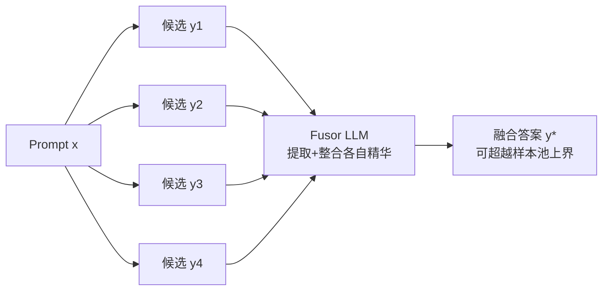

# Making, Not Taking, the Best of N

**会议**: ICLR 2026  
**OpenReview**: [https://openreview.net/forum?id=oWDEbvEA97](https://openreview.net/forum?id=oWDEbvEA97)  
**代码**: 待确认  
**领域**: LLM 推理 / 测试时扩展  
**关键词**: Best-of-N, 生成融合, 测试时扩展, 合成数据生成, 多语言, LLM-as-judge  

## 一句话总结
把 LLM 输出聚合从"从 N 个候选里挑一个最好的"（Best-of-N 选择范式）改成"用一个 fusor 模型把 N 个候选各自的精华合成一个更好的答案"（Fusion-of-N 合成范式），在测试时扩展和合成数据生成两个场景下都稳定超越 BON，甚至能超过 oracle 上界。

## 研究背景与动机
- **领域现状**：现代 LLM 的高质量生成普遍依赖推理时聚合，主流做法是 Best-of-N（BON）——采样 N 个候选，再用奖励模型打分 / 多数投票 / self-consistency 选出唯一"最好"的那个，广泛用于数学推理、机器翻译、开放生成以及合成数据 SFT，尤其在多语言场景。
- **现有痛点**：BON 本质是**零和游戏**——硬选择一个、丢弃其余 N−1 个。这带来三个问题：(1) 丢掉了不同候选里互补的推理路径与片段；(2) 浪费了为生成这些样本花掉的算力；(3) 容易 reward hacking——打分最高的候选未必最正确最有用。更关键的是，BON 的质量天花板就是候选池里最好的那个（oracle），**选择永远突破不了样本池的上界**。
- **核心矛盾**：把"质量"当成一个单一标量（monolithic）去比较，和"实际上每个候选都有高质量片段和低质量片段"（polylithic 多元质量观）之间存在根本冲突——对长文本、复杂 prompt 尤其明显，一个答案里往往这段好那段差。
- **本文目标**：设计一个能**充分利用全部 N 个样本**、且能突破样本池上界的聚合方法，作为 BON 的即插即用替代品，无需任何额外训练。
- **核心 idea**：**【从选择到合成】** 用一个强生成式 LLM 当 fusor，把 N 个候选各自最有信息量的片段"mix and match"地合成出一个全新答案 $y^\star \notin Y$——真正"做出"（making）而非"拿走"（taking）N 个里的最好。

## 方法详解

### 整体框架
给定 prompt $x$ 和一池候选 $Y=\{y_1,\dots,y_N\}$（可来自同一模型多次采样，也可来自多个不同 teacher），FUSION 用一个标准 LLM 充当 fusor $F$，直接生成融合答案 $y^\star = F(x, Y)$。与 BON 的硬选择 $y^* = \arg\max_{y\in Y} S(y,x)$ 不同，融合答案条件依赖于整个候选池，因此**不属于原池**、可以超过原池中任何单个候选的质量。BON 被自然包含为 FUSION 的特例：当某个候选整段都最优时，fusor 直接整段照抄即可。

### 关键设计

**1. 合成式聚合：把质量看成可拆解的多元体**　FUSION 的灵魂是把质量从"单一标量"重构为"多元（polylithic）"——承认每个候选内部都有高质量与低质量的片段。fusor 因此可以在 token、词、句子等不同粒度上"取长补短"，挑出每个候选里出彩的部分缝合成新答案。这一视角让复杂问题被分解成更可解的组合性问题：$y^\star = F(x,Y)$ 不再受限于 $\max_{y\in Y}S(y,x)$ 这个上界，从而在翻译实验里能直接**超过 oracle**（按 ground truth 选出的最优候选）。本质上它是一种协作式精炼，对长生成、复杂 prompt 收益最大。

**2. fusor 即 prompt，零训练可适配**　相比 BON 依赖专门训练的奖励模型，FUSION 的核心组件只是一段 fusor prompt，因此天然支持 in-context learning 与即时适配，无需任何训练就能调整行为：可以注入 constitution 控制安全标准、调整语气与模型身份、或控制"整合所有样本"与"丢弃最差片段"之间的力度。作者发现一个关键经验——必须明确指示模型**不仅关注最好的、也要主动丢弃最差的部分**，否则会被低质片段拖累。配合 CoT prompting 或直接用 reasoning 模型当 fusor，还能按需放大 FUSION 的计算量。

**3. fusor 能力存在规模阈值**　FUSION 能否"开箱即用"取决于 fusor 是否具备"对比评估—提取—聚合"的综合能力，而这种生成式融合能力需要**跨过一个模型规模阈值**才会解锁：从 4B 的 Gemma-3 到 111B 的 Command A，FUSION 的 Arena 胜率随 fusor 增大持续上升（27B→111B 提升 +5.5%）；反观把同样的模型当 BON 的标量打分器时，小模型反而更好用、且收益在大规模处消失（这与"最强生成模型在经典 reward 打分基准上仍输给分类器型 RM"一致）。另一个发现是：给定模型规模后，**fusor 的具体选择不如样本池的构成重要**，小 fusor 若想做 FUSION 则需要专门训练。

**4. 双场景即插即用替换 BON**　FUSION 与 BON 唯一的差别只在"如何聚合同一批候选"，因此在两个 BON 主战场都能零侵入替换：(i) **测试时扩展**——从单个模型采样 $N$ 个候选后用 fusor 合成最终输出；(ii) **合成数据生成**——从一池多样化 teacher 各采一个低温补全，用 fusor 融合后作为 SFT 训练数据蒸馏进 student。两种场景下 BON 与 FUSION 收到完全相同的候选集、相同 prompt，只是聚合方式不同。

## 实验关键数据

### 主实验（FUSION vs BON 头对头，胜率 / XCOMET）

| 任务 | 指标 | BON 均值 | FUSION 均值 | Δ |
|------|------|---------|------------|---|
| Arena（开放生成，11 语言，FUSION vs BON 直比） | 胜率 % | 43.8 | 46.3 | **+2.5** |
| WMT（机器翻译，en→10 语言） | XCOMET_XL | 83.0 | 83.8 | **+0.8** |
| 测试时扩展（Aya-8B，对 Gemini2.5-Pro） | 胜率最大增益 | — | — | 法语 **+10.8%** |
| 翻译 FUSION vs ORACLE | XCOMET_XL | — | — | 德/俄/中 **超过 oracle**（中文 +0.8） |

测试时扩展场景中，仅用 5 个样本融合，Command A 在德语（+9.5%）、西语（+7.8%）等语言上把绝对胜率推过 50%，**战胜 Arena 榜首的 Gemini2.5-Pro**；Command A 在 11 种语言中有 9 种 FUSION 优于 BON。

### 合成数据生成下游评测（111B student SFT 后）

| 任务 | 指标 | BON 训练 | FUSION 训练 | Δ |
|------|------|---------|------------|---|
| Arena（对 Gemini2.5-Flash，10 语言） | 胜率 % | — | — | **+2.5** |
| WMT24++（en→·） | XCOMET_XL | 83.0 | 83.8 | **+0.8**（多语言显著） |
| GeoFactX 事实推理（5 语言） | 答案正确率 / 推理分 | — | — | 4/5 语言更优 |

FUSION 数据微调的 student 不仅超过 base（答案正确率 +9.1% vs BON 的 +8.1%），还**超过 fusor 模型本身**（+4.4%），甚至在 fusor（Command A）官方不支持的斯瓦希里语、泰语上也成立——印证"集体智慧可被蒸馏、且不被执行融合的模型所封顶"。

### 消融实验

| 候选池 / 方法 | Arena 胜率 % |
|---------------|-------------|
| 单样本（Command A 1 sample）| 57.9 |
| 5 teacher + BON | 61.0 |
| 5 teacher + FUSION | **65.4** |
| 弱池 + FUSION | 65.0 |
| fusor=DeepSeek-V3 + FUSION | 63.9 |

- **fusor 规模**：FUSION 胜率随 fusor 从 4B→111B 单调上升，27B→111B 提升 +5.5%；BON 打分则小模型更好、大模型收益消失。
- **样本效率**：FUSION 在低预算（$N<10$）显著更省样本——仅 $N=2$ 就把对 Gemini2.5-Pro 胜率提升 +6%，BON 需双倍样本才追平；$N>7$ 后两者趋于平台。

### 关键发现
1. **合成 > 选择**：FUSION 在相同采样预算下稳定超越 BON，且能突破 oracle 上界——证明选择不是聚合的天花板。
2. **弱池也能受益**：即便用较弱的 teacher 池或较弱 fusor（DeepSeek-V3），FUSION 仍优于 BON，说明多样性本身可被利用。
3. **局限于强约束任务**：在 MGSM 等数学任务上 FUSION 偶尔低于 BON——答案被严格约束、片段无法"取长补短"时合成优势消失。

## 亮点与洞察
- **范式重构而非技巧堆叠**：把"质量是单一标量"换成"质量是多元可拆解体"，从概念层面打开了"聚合可超越样本池上界"这条此前被选择范式封死的路径。
- **零训练、即插即用**：唯一组件是一段 prompt，可直接替换任何现有 BON 流水线，且支持 in-context 调安全/语气/融合力度，工程落地成本极低。
- **超过 oracle 与超过 fusor 两个反直觉结果**：前者证明选择有上界、合成没有；后者（student 超过执行融合的 teacher）证明合成是真正的知识蒸馏而非简单复制。
- **多语言鲁棒性**：跨 11 语言、3 类基准、不同规模模型一致有效，甚至在 fusor 官方不支持的语言上仍提升。

## 局限与展望
- **数学等强约束任务收益反转**：答案高度受限、不存在可缝合片段时，合成可能不如直接选对的那个，MGSM 上出现 FUSION < BON 的案例。
- **fusor 规模门槛**：小模型做 fusor 需要专门训练才能开箱即用，纯 prompt 方案对算力有下限要求。
- **并行性弱于 BON**：BON 的 N 个样本可独立并行采样，而 FUSION 需把所有候选一起编码进 fusor（长上下文），单次推理更重；作者指出需要高效长上下文实现来缓解。
- **展望**：为小 fusor 设计专门训练、把 FUSION 与 reasoning 模型 / CoT 结合放大计算、以及探索更细粒度的片段级融合控制。

## 相关工作与启发
- **vs Best-of-N / 多数投票 / self-consistency / RM 打分**：这些都是选择范式，受限于样本池上界且面临 reward hacking；FUSION 用生成式合成绕开了硬选择。
- **vs self-refinement**：当 fusor 与采样模型相同时，FUSION 可视为一种高效的自精炼，但它天然支持多 teacher 异构池。
- **vs 数学专用融合训练（Qi et al. 2025; Zhao et al. 2025）**：前人为数学场景训练过专门的小 fusor，FUSION 证明在开放/多语言场景下大 fusor 无需训练即可工作。
- **启发**：聚合不该被当成评测/排序问题，而应被当成"协作合成"问题——把多模型生成当协作者而非竞争者，这一视角对 agent 集成、多教师蒸馏、合成数据 pipeline 都有迁移价值。

## 评分
- **新颖性**: ⭐⭐⭐⭐⭐ —— "选择→合成"的范式转换简洁却有力，"超过 oracle"这一结果在概念上打破了聚合的固有上界。
- **实验充分度**: ⭐⭐⭐⭐⭐ —— 覆盖测试时扩展 + 合成数据两大场景、11 语言、3 类基准、4B–235B 多种模型规模，并系统消融 fusor 规模/样本效率/池构成。
- **写作质量**: ⭐⭐⭐⭐ —— 概念叙事清晰，monolithic/polylithic 的对比贯穿全文；部分图表（图 2/3/6）以散点+偏移呈现，需结合附录表才能精读。
- **价值**: ⭐⭐⭐⭐⭐ —— 即插即用替换 BON、零训练、跨语言鲁棒，对测试时扩展与合成数据生成两条主流 pipeline 都有直接落地价值。

<!-- RELATED:START -->

## 相关论文

- [\[ICLR 2026\] Making Slow Thinking Faster: Compressing LLM Chain-of-Thought via Step Entropy](making_slow_thinking_faster_compressing_llm_chain-of-thought_via_step_entropy.md)
- [\[ICLR 2026\] Sample Smart, Not Hard: Correctness-First Decoding for Better Reasoning in LLMs](sample_smart_not_hard_correctness-first_decoding_for_better_reasoning_in_llms.md)
- [\[ICLR 2026\] Smarter Not Harder: Generative Process Evaluation with Intrinsic-Signal Driving and Ability-Adaptive Reward Shaping](smarter_not_harder_generative_process_evaluation_with_intrinsic-signal_driving_a.md)
- [\[NeurIPS 2025\] Scalable Best-of-N Selection for Large Language Models via Self-Certainty](../../NeurIPS2025/llm_reasoning/scalable_best-of-n_selection_for_large_language_models_via_self-certainty.md)
- [\[ICML 2026\] Many-Shot CoT-ICL: Making In-Context Learning Truly Learn](../../ICML2026/llm_reasoning/many-shot_cot-icl_making_in-context_learning_truly_learn.md)

<!-- RELATED:END -->
