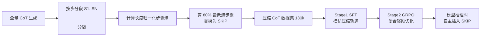

# Making Slow Thinking Faster: Compressing LLM Chain-of-Thought via Step Entropy

**会议**: ICLR 2026  
**OpenReview**: [https://openreview.net/forum?id=cGLqQfS5wH](https://openreview.net/forum?id=cGLqQfS5wH)  
**代码**: [https://github.com/staymylove/COT_Compresstion_via_Step_entropy](https://github.com/staymylove/COT_Compresstion_via_Step_entropy)  
**领域**: LLM 推理 / 高效推理  
**关键词**: Chain-of-Thought 压缩, 步骤熵, 过度思考, GRPO, [SKIP] token  

## 一句话总结
本文提出用"步骤熵"（step entropy）量化 CoT 中每一步推理的信息贡献，发现剪掉 80% 最低熵的步骤几乎不损精度，并设计 SFT+GRPO 两阶段训练让模型在推理时自主插入 [SKIP] token，token 量降低 16–57% 而精度持平甚至提升。

## 研究背景与动机
- **领域现状**：DeepSeek-R1、Qwen3 这类大推理模型（LRM）靠"慢思考"式的长 CoT 在数学、代码、符号逻辑上大幅提升性能，但生成的思维链冗长啰嗦。
- **现有痛点**：长 CoT 带来推理延迟高、算力成本大、效率低的"过度思考"（overthinking）问题；规模化部署时这是关键瓶颈。已有压缩工作要么把推理隐式化/潜空间化（iCoT、COCONUT、动态潜空间压缩），牺牲了可解释性和可验证性；要么在 token 级或 chunk 级裁剪（TokenSkip、R1-Compress、CoT-Valve），缺乏原则性地识别"哪些整步是语义冗余"的手段。
- **核心矛盾**：人类解题只记录关键里程碑、省略显而易见的思考，但当前方法没有一个**信息论意义上系统性的信号**来判断推理链中哪一步是关键、哪一步是多余的。
- **本文目标**：给出一个有理论依据、可量化每一步重要性的度量，并据此既能静态压缩已有 CoT、又能训练模型在推理时自主压缩。
- **核心 idea**：**【熵即冗余】** 模型生成某一步时若置信度高（不确定性低），这一步多半是可预测、低信息量的冗余内容——用 token 级熵聚合成"步骤熵"，低熵步骤可安全剪除。

## 方法详解

### 整体框架
方法分两条线：先用**步骤熵**这个度量做静态剪枝（生成全量 CoT → 算每步熵 → 把最低熵的 κ 比例步骤替换成 [SKIP] → 拼回 prompt 让模型只生成答案），验证"低熵=冗余"假设并据此构造压缩训练数据；再用 **SFT + GRPO 两阶段训练**让模型把"何时该跳过"内化成推理时的自主行为。

### 关键设计

**1. 步骤熵：把 token 级不确定性聚合成步骤级信息度量。** 先把 CoT 按 `\n\n` 切成步骤序列 $C=(S_1,\dots,S_N)$，每步 $S_i$ 含 $M_i$ 个 token。自回归生成第 $j$ 个 token 时模型在词表 $V$ 上给出分布，其 Shannon 熵 $H(t_{i,j}|c_{i,j})=-\sum_{w\in V}p(w|c_{i,j})\log_2 p(w|c_{i,j})$ 刻画该步的瞬时不确定性。把整步内所有 token 熵相加即得步骤熵 $H(S_i|S_{<i})=\sum_{j=1}^{M_i}H(t_{i,j}|c_{i,j})$。直觉是：熵高说明模型生成时很犹豫、信息量大；熵低说明几乎确定性输出、内容可预测。为消除步长偏置，实际采用**长度归一化步骤熵** $H(S_i|S_{<i})=\frac{1}{M_i}\sum_{j=1}^{M_i}H(t_{i,j}|c_{i,j})$。

**2. 理论依据：步骤熵是该步与答案互信息的上界。** 论文用 Lemma 1 证明，单步 $S_j$ 在给定其余所有步骤条件下与最终答案 $A$ 的条件互信息被其步骤熵约束：$I(S_j;A|\bar{S}_j)\le H(S_j|S_{<j})$；Theorem 1 进一步推广到任意 $K{+}1$ 步子集 $\tilde S$，有 $I(\tilde S;A|C\setminus\tilde S)\le\sum_{i=0}^{K}H(S_{k_i}|S_{<k_i})$。含义是：低熵步骤对答案的信息贡献存在一个很小的上界，因而可判定为低信息、潜在冗余——这给"剪低熵步骤"提供了信息论而非纯启发式的支撑。

**3. 低熵步骤剪枝 + [SKIP] 占位推理。** 把所有步骤按熵升序排，挑出最低的 $\kappa\times N$ 步替换为特殊 `[SKIP]` token，保留高熵步骤原样，构成压缩链 $C'$；推理时把 $C'$ 与用户问题、`</think>` 分隔符拼接，提示模型直接生成最终答案。关键消融发现：用显式 [SKIP] 占位比直接删除步骤在高压缩比下更鲁棒（保住了剩余步骤的结构）。受控实验确定阈值 $\kappa=0.8$——剪到 80% 低熵步骤精度仍稳定，超过这条线才开始下滑并最终收敛到"no-thinking"模式的精度。

**4. SFT+GRPO 两阶段自主压缩训练。** 静态剪枝只能压已有链，要让模型推理时自己压缩需训练。**Stage 1（SFT）**：在 (问题, 压缩 CoT, 答案) 三元组上微调，让模型学会预测压缩路径并生成 [SKIP]，做 RL 的稳健初始化。**Stage 2（GRPO）**：因为 SFT 只是静态模仿、不显式优化精度-效率权衡，故对每个 prompt 采样 $K$ 个补全，用复合奖励 $R(C)=[R_{correctness},R_{skip\,ratio},R_{skip\,num},R_{response\,length}]$ 驱动学习——答对给 +2.0；跳过比例 $\ge\kappa_{high}$ 给 1.0、介于 $[\kappa_{low},\kappa_{high})$ 给 0.5；[SKIP] 数超 $\tau_{skip}$ 或响应超 $\tau_{length}$ 各罚 -1.0 以防退化。由此模型学到一个上下文感知的自适应策略：该细推时细推、该跳时跳。

## 实验关键数据

### 主实验表格（80% 低熵静态剪枝，Pass@1 ACC% / 平均思考 token）

| 模型 | GSM8k | Math500 | AIME 2024 | AIME 2025 |
|---|---|---|---|---|
| DeepSeek-R1-7B | 78.54 / 298 | 88.17 / 3704 | 63.33 / 15843 | 35.71 / 18203 |
| R1-7B (Our) | 80.82 / 294 (↓1.3%) | 88.17 / 2604 (↓29.7%) | 56.67 / 10093 (↓36.3%) | 35.71 / 11471 (↓37.0%) |
| DeepSeek-R1-14B | 82.64 / 284 | 84.37 / 2854 | 65.52 / 15415 | 58.62 / 18000 |
| R1-14B (Our) | 84.00 / 278 (↓1.9%) | 82.16 / 1981 (↓30.6%) | 58.62 / 8706 (↓43.5%) | 51.72 / 10842 (↓39.8%) |
| Qwen3-8B | 94.46 / 3054 | 91.37 / 7138 | 79.31 / 20937 | 76.92 / 19902 |
| Qwen3-8B (Our) | 94.39 / 2557 (↓16.2%) | 91.13 / 5209 (↓27.0%) | 81.48 / 11534 (↓44.9%) | 76.00 / 11717 (↓41.1%) |

跨 DeepSeek-R1 与 Qwen3 两个架构一致有效，token 降 16–45%，GSM8k 上精度还略升。

### 两阶段训练 + 与 SOTA 对比

| 训练阶段 (R1-7B) | GSM8k | Math500 | AIME 2024 | AIME 2025 |
|---|---|---|---|---|
| Baseline | 78.54 | 88.17 | 63.33 | 35.71 |
| SFT | 78.47 (↓43% tok) | 85.92 (↓25%) | 56.67 (↓42%) | 30.00 (↓35%) |
| SFT+GRPO | 79.15 (↓44%) | 85.00 (↓35%) | 57.14 (↓57%) | 33.33 (↓41%) |

| 方法 (相对 Full-CoT) | Math500 ACC/Tok | AIME2024 ACC/Tok |
|---|---|---|
| CoT-Valve | ↓10.6% / ↓48.4% | ↓15.0% / ↓34.6% |
| TokenSkip | ↓5.2% / ↓11.1% | ↓12.3% / ↓27.5% |
| R1-Compress | ↓3.2% / ↓20.3% | ↓6.2% / ↓12.9% |
| **Our (SFT+RL)** | ↓3.2% / **↓35.0%** | ↓6.2% / **↓57.0%** |

### 关键发现
- **80% 是安全阈值**：低熵剪枝在 80% 以内精度不动，超过才下滑；高熵剪枝一旦剪就掉，剪超 40% 甚至比"完全不思考"还差；随机剪枝介于两者之间（40% 起降）——三条曲线强力支持"低熵=冗余"假设。
- **步骤级 > token 级**：删 40% 思考 token 时步骤级剪枝仍保持基线精度，而直接按 token 熵删在 20% 就急剧掉点，说明"推理步骤"才是正确的语义压缩单元。
- **训练 > 静态**：在最难的 AIME 2024 上，训练后模型 token 降 57.0%（静态仅 36.3%）且精度反而略升，证明学到了比固定规则更聪明的上下文感知策略；在 130k/40k/90k 大规模数据上压缩后精度与全量几乎一致，也验证了可扩展性。

## 亮点与洞察
- 用一个**已经在生成过程中免费产生**的信号（token 熵）就能识别冗余步骤，无需额外打分模型或外部裁判，工程上极轻量。
- 把"剪枝单元"从 token 提升到"推理步骤"，符合人类"跳过整个想法而非省词"的认知直觉，并有 Lemma/Theorem 的互信息上界做理论背书。
- [SKIP] 占位 + SFT 让模型把跳步内化、GRPO 再用复合奖励精调权衡，是"先发现规律→再教会模型"的干净两段式范式。

## 局限与展望
- 仅在数学推理基准（GSM8k/Math500/AIME）和 MMLU 上验证，对代码、长链 agent、开放域推理的迁移性还需更多证据。
- 步骤熵需要拿到 token 级概率分布，对只能黑盒调用的闭源模型不可直接计算。
- 80% 阈值是经验确定的固定超参，不同任务/难度下最优 κ 可能不同；GRPO 的多项奖励权重与阈值（$\tau_{skip},\tau_{length}$）也需调。
- 个别难题（如 R1-7B 的 AIME2024）静态剪枝会牺牲几个点精度，说明"低熵即冗余"在高难度长链上并非绝对。

## 相关工作与启发
- **显式 CoT 压缩**：TokenSkip / LC-Prompt（token 级可控跳过）、R1-Compress（chunk 级压缩搜索）、CoT-Valve（可变长架构）、长度约束 RL 奖励——本文在"步骤级 + 信息论信号"上更进一步。
- **隐式/潜空间推理**：iCoT、COCONUT、知识蒸馏内化、动态潜空间压缩——效率极高但丢了可解释性，本文选择保留显式链。
- **过度思考与高效推理**：呼应 overthinking 现象研究，为"该长则长、该短则短"的自适应推理提供了一个可量化、可训练的实现路径。

## 评分
- **新颖性**: ⭐⭐⭐⭐ 步骤熵这个度量简洁且有理论上界支撑，"低熵步骤可剪 80%"的实证发现有冲击力，相比 token 级方法是清晰的概念升级。
- **实验充分度**: ⭐⭐⭐⭐ 三模型两架构、四基准、静态/训练双路线、与 5 个 SOTA 对比、token vs step 消融齐全；但局限在数学领域，跨域仅 MMLU 附录。
- **写作质量**: ⭐⭐⭐⭐ 动机—理论—实证—训练逻辑顺畅，图表清楚；个别符号（$\kappa$ 与 $\tau$）混用稍乱。
- **价值**: ⭐⭐⭐⭐ 直击 LRM 部署的效率痛点，轻量信号 + 即插即用剪枝 + 可训练策略，落地价值高。

<!-- RELATED:START -->

## 相关论文

- [\[ICLR 2026\] Slow-Fast Policy Optimization: Reposition-Before-Update for LLM Reasoning](slow-fast_policy_optimization_reposition-before-update_for_llm_reasoning.md)
- [\[ICLR 2026\] PEAR: Phase Entropy Aware Reward for Efficient Reasoning](pear_phase_entropy_aware_reward_for_efficient_reasoning.md)
- [\[ICLR 2026\] Making, Not Taking, the Best of N](making_not_taking_the_best_of_n.md)
- [\[ICLR 2026\] Rectifying LLM Thought from Lens of Optimization](rectifying_llm_thought_from_lens_of_optimization.md)
- [\[ACL 2026\] CRISP: Compressing Redundancy in Chain-of-Thought via Intrinsic Saliency Pruning](../../ACL2026/llm_reasoning/crisp_compressing_redundancy_in_chain-of-thought_via_intrinsic_saliency_pruning.md)

<!-- RELATED:END -->
