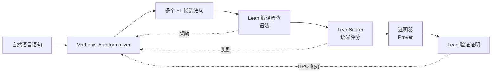

# Mathesis: Towards Formal Theorem Proving from Natural Languages

**会议**: ICLR 2026  
**OpenReview**: [https://openreview.net/forum?id=CJdX82odge](https://openreview.net/forum?id=CJdX82odge)  
**代码**: [https://github.com/Huawei-AI4Math/Mathesis](https://github.com/Huawei-AI4Math/Mathesis)  
**领域**: LLM 推理 / 自动形式化 / 形式化定理证明  
**关键词**: autoformalization, formal theorem proving, reinforcement learning, GRPO, semantic evaluation, Lean 4  

## 一句话总结
Mathesis 第一次系统地打通「自然语言数学题 → 形式化语句 → 机器可验证证明」整条链路，核心是用在线强化学习（GRPO + 分层偏好优化 HPO）训练出的 autoformalizer，再配上能给出连续语义分的 LeanScorer 评估框架与高难度 Gaokao-Formal 基准。

## 研究背景与动机
**领域现状**：以 DeepSeek-Prover-V2、Kimina-Prover、Goedel-Prover 为代表的 LLM 定理证明器，在 MiniF2F、PutnamBench 等基准上已经很强，但这些基准的输入语句都是**专家手写好的形式化语句**（formal-to-formal，F2F）。

**现有痛点**：真实世界的数学问题几乎都是自然语言写的，无法直接喂给证明器；人工形式化又费时费力。把这一步交给模型做的「自动形式化（autoformalization）」存在两类长期短板——其一，主流 autoformalizer（如 Kimina-Autoformalizer）只在静态 NL-FL 配对数据上做 SFT，**无法从语法/语义正确性的直接反馈里动态学习**；其二，语义评估只有「Lean 编译通过」加「LLM 二元判断」，**抓不住细粒度语义错误**（图 1 的两个经典坑：把待证目标误当作前提塞进假设里、把求和区间译错）。

**核心矛盾**：形式化质量是整条链路的瓶颈——形式化得不好，证明器要么被误导出「假成功」，要么面对一个根本无法证明的语句；但既没有好用的 autoformalizer，也没有靠谱的语义评估器和能暴露语义错误的难基准。

**本文目标**：第一次系统研究「从自然语言出发的形式化定理证明」全流程，同时补齐 autoformalizer、语义评估、难基准三块。

**核心 idea**：**把语法验证（Lean 编译）、语义正确性（LeanScorer）、证明器反馈三种信号统一成强化学习的奖励**，让 autoformalizer 在线学会生成既能编译、又语义忠实、还利于下游证明的形式化语句。

## 方法详解

### 整体框架
Mathesis 是一条三阶段流水线：**自动形式化 → 验证 → 证明**。给定自然语言（NL）问题，先由 Mathesis-Autoformalizer 生成多个 Lean 4 候选语句；候选语句进入验证阶段，先过 Lean 编译器做语法检查，再过 LeanScorer 做语义检查；通过双重检查的语句才送进证明器生成完整可验证的 Lean 证明。训练侧的关键是用 GRPO + HPO 把这条链路的反馈反向灌进 autoformalizer。

### 关键设计

**1. 复合奖励的 GRPO 自动形式化：把「能编译」和「语义对」拧成一个奖励**。模型策略 $\pi_\theta$ 从 Kimina-Autoformalizer（7B SFT 模型）初始化，对每个 NL 输入 $x$ 采样一组 $G$ 个候选 $\{o_1,\dots,o_G\}$，用 Group Relative Policy Optimization 在组内做相对偏好优化。奖励由两个二值项简单相加构成：语义正确性奖励 $R_{sem}(x,o_i)$ 由辅助 LLM 评判器判断形式化是否「Appropriate」给 1/0，语法验证奖励 $R_{ver}(o_i)$ 由 Lean 4 验证器检查（到 `:= by sorry` 为止）是否类型合法给 1/0，最终 $r_i = R_{sem} + R_{ver}$。作者刻意不加权——因为 GRPO 优化的是组内相对偏好而非绝对幅度，组内归一化后对均匀缩放不敏感，所以朴素求和反而简单且足够拿到 SOTA。两项的分工很清楚：语法有效是「必要条件」（不编译的语句证明器根本用不了），语义正确则保证形式化对应的是真正要证的那道题。

**2. 分层偏好优化 HPO：先对齐局部语法语义，再对齐全局证明成败**。光有 GRPO 只能让 autoformalizer 对齐「能编译、语义对」这些局部目标，但形式化的最终目的是**让下游证明器证得出来**。于是在 GRPO 之后再叠一层 DPO（Direct Preference Optimization）：对每个 NL 语句采样候选形式化，过语法+语义检查后送证明器尝试证明，按 Lean 验证的证明成败构造偏好对——成功的形式化 $\{x, o_i^w, z_i^w\}$ 作正样本、失败的 $\{x, o_i^l, z_i^l\}$ 作负样本，DPO 的 KL 系数 $\beta=0.1$。这套「GRPO 打底 + DPO 对齐证明成败」的两阶段流程合称 Hierarchical Preference Optimization。之所以要先 GRPO 再 DPO，是因为 DPO 离线偏好学习虽然稳定省样本、且无需单独奖励模型，但严重依赖一个强 base model 才能采出有意义的候选，GRPO 正好提供这个强初始化。

**3. LeanScorer：把语义评估从二元判断升级成连续分数**。不再让 LLM 直接吐「对/错」，而是先把 NL 语句**分解成若干子任务**（前提、结论等），逐个与 FL 语句对齐并打三档标签：Match（M1）、Minor Inconsistency（M½）、Major Inconsistency（M0）——数学上明显不等价或漏条件记 M0，语义等价但表达有出入记 M½，内容结构完全对齐记 M1；形式化里多出的额外假设、或 NL 里缺失的子任务都算 misalign，因此能同时抓「多译」和「漏译」。然后用 **Sugeno 模糊积分**聚合：设评价映射 $f(M1)=1.0,\ f(M\tfrac12)=0.5,\ f(M0)=0$，模糊测度

$$\mu(s) = \begin{cases} 0 & \exists l \in s,\ l = M0 \\ \max\left\{\dfrac{n_s}{n}\cdot(1-\delta\cdot n_{M\frac12}),\ 0\right\} & \text{otherwise} \end{cases}$$

其中 $n_s$ 是子集大小、$n_{M\frac12}$ 是其中 M½ 的个数，$\delta$ 在 $n_{M\frac12}\le1$ 时取 0.1、否则 0.2。这个设计「软硬兼施」：只要有一个子任务被判 M0 就直接清零（严惩硬伤），全 Match 给满分，多个 Minor 则按比例扣分。最终把标签升序排列取后缀集 $s_i$，LeanScore 为

$$S(L,f,\mu) = \max_{1\le i\le n} \min\big(f(l_{\pi(i)}),\ \mu(s_i)\big)$$

可选阈值 $\alpha$（默认 0.6）把连续分映射成二元判定。这套机制对 LLM 输出的波动更鲁棒，又守住了严格评判的底线。

**4. Gaokao-Formal 基准：专挑难形式化的真实题**。现有基准要么只测 F2F，要么干脆剔除几何、组合、应用题等「难形式化」的题型。Gaokao-Formal 反其道而行，收录中国高考（2008-2025）的 **495 道证明题**，每题含原始中文、英文翻译和人工形式化的 Lean 4 语句，覆盖函数（168）、数列（148）、解析几何（76）等 7 大类，专门暴露自动形式化在多样复杂 NL 语句上的弱点。训练数据则用 BERTopic 做主题聚类筛题，配合 base model rollout（k=14）过滤掉奖励零方差的样本，最终约 32k 题。

## 实验关键数据

### 语义评估框架（LeanScorer vs 基线）
在人工标注的 Gaokao-Formal 子集上，阈值 $\alpha=0.6$：

| Method | Precision | Recall | F1 |
|--------|-----------|--------|-----|
| LLM-as-a-Judge | 73 | 100 | 0.85 |
| Re-informalization | 93 | 50 | 0.65 |
| **LeanScorer (Ours)** | **94** | **89** | **0.92** |

LLM-as-a-Judge 召回满分但精度只有 73%（大量假阳）；Re-informalization 精度高但召回崩到 50%；LeanScorer 高精度高召回兼得，比 LLM-as-a-Judge 高 7 个点、比 Re-informalization 高 27 个点。

### 自动形式化质量（LC@6 / LC+LSC@6，部分摘录）

| Model | MiniF2F LC | MiniF2F LC+LSC | Putnam LC+LSC | Gaokao LC+LSC |
|-------|-----------|----------------|---------------|---------------|
| Kimina-Autoformalizer | 100 | 91 | 10 | 49 |
| Mathesis-Autoformalizer | 100 | 95 | 25 | 67 |
| **Mathesis-HPO** | 100 | **96** | **30** | **71** |

Gaokao-Formal 上 Mathesis-HPO 把 LC+LSC@6 从 49% 提到 71%（+22 点，相对 +45%）；Putnam 从 10% 提到 30%（相对 +200%）；MiniF2F 刷到 96% 新纪录。Mathesis-HPO 在 LC@6/LC+LSC@6 上平均超过所有体量大得多的 API 模型 311%/86%。

### 消融与端到端证明（pass@32 提升）

| 对比 | Gaokao-Formal | MiniF2F |
|------|---------------|---------|
| GRPO → +HPO（autoformalization 分） | 67%→71% | 95%→96% |
| HPO vs GRPO（下游证明平均） | +13% | +2% |

把 autoformalizer 从 Herald 换成 Mathesis-HPO，在 Gaokao-Formal 上让 Goedel/Kimina/DeepSeek-Prover-V2 三个证明器分别提升 86%/116%/122%。

### 关键发现
- **形式化质量与证明准确率强正相关**，且换更强的 autoformalizer 带来的增益常常超过换更强的证明器——在难形式化的题上，形式化才是真正的瓶颈。
- HPO 的证明器反馈奖励确实带来超出「纯语法+语义检查」的端任务收益，说明对齐到「证得出来」这个全局目标是值得的。

## 亮点与洞察
- **把整条链路当一个系统来研究**：以往工作各管一段（要么只做 prover，要么只做 autoformalizer），Mathesis 第一次把 NL→FL→proof 串起来，并指出形式化是被长期忽视的瓶颈。
- **奖励工程的克制**：两个二值奖励直接相加而不加权，作者用「GRPO 组内相对优化对缩放不敏感」论证了简单求和的合理性，避免了过度调参。
- **LeanScorer 用模糊积分做聚合**很巧：既能对单个硬伤（M0）零容忍，又能对多个软伤按比例扣分，比二元判断细腻、比简单平均更符合「一票否决」的评估直觉。
- **HPO 的分层思路有迁移价值**：先用在线 RL 对齐局部可验证信号、再用离线 DPO 对齐难获取的全局成败信号，是一种通用的「先打底再精调」范式。

## 局限与展望
- 作者坦言「形式化正确性」本身难以直接定义——很多时候得看它**是否影响证明过程**（比如函数要不要显式声明定义域），这种模糊性同时给训练和语义评估带来持续挑战。
- 距离全自动、可实际部署仍很远；Gaokao-Formal 虽难但仍局限于高考题型，几何/组合等极难形式化的类别占比偏小。
- 方法原则上可迁移到 Isabelle/Coq，但论文只在 Lean 4 上验证，跨证明助手的普适性待考。

## 相关工作与启发
- **形式定理证明（F2F）**：DeepSeek-Prover-V2、Kimina-Prover、Goedel-Prover 等假设输入已是形式化语句，Mathesis 补上了「从 NL 起步」的缺口；与 Lego-Prover 这类需要额外非形式证明草稿的工作不同，Mathesis 全自动、只从非形式语句出发。
- **自动形式化**：从 prompt 预训练 LLM 到在静态 NL-FL 对上微调（Kimina-Autoformalizer 为前 SOTA），Mathesis 是首个引入在线 RL + 证明器反馈的 autoformalizer。
- **语义评估**：相比训练无关的 LLM-as-a-Judge / Re-informalization 和训练型的 FormalAlign，LeanScorer 用「子任务分解 + 模糊积分」给出更细粒度且更鲁棒的连续分。
- **启发**：当一个任务的「最终目标」难以直接监督（这里是证明成败）但存在多种廉价代理信号（编译、语义判断）时，「多信号复合奖励 + 分层 RL 对齐到终端目标」是一条值得复用的路线。

## 评分
- **新颖性**: ⭐⭐⭐⭐ 首个用在线 RL（含证明器反馈）训练的 autoformalizer，LeanScorer 的模糊积分聚合与 Gaokao-Formal 难基准都是实打实的新贡献。
- **实验充分度**: ⭐⭐⭐⭐ 覆盖 MiniF2F/Putnam/Gaokao 三基准、多证明器配对、语义评估对照与 HPO 消融，证据链完整；跨证明助手验证缺失略减分。
- **写作质量**: ⭐⭐⭐⭐ 任务定义清晰、图 1/2/3 把痛点与流程讲得很直观，公式与表格organized；个别符号排版稍乱。
- **价值**: ⭐⭐⭐⭐ 把形式化推理从「专家手写语句」推向「真实自然语言题」，并明确指出形式化是瓶颈，对自动数学推理落地有实质推动。

<!-- RELATED:START -->

## 相关论文

- [\[ICLR 2026\] Process-Verified Reinforcement Learning for Theorem Proving via Lean](process-verified_reinforcement_learning_for_theorem_proving_via_lean.md)
- [\[ICLR 2026\] Neural Theorem Proving for Verification Conditions: A Real-World Benchmark](neural_theorem_proving_for_verification_conditions_a_real-world_benchmark.md)
- [\[ICLR 2026\] EvolProver: Advancing Automated Theorem Proving by Evolving Formalized Problems via Symmetry and Difficulty](evolprover_advancing_automated_theorem_proving_by_evolving_formalized_problems_v.md)
- [\[ICLR 2026\] Long Chain-of-Thought Reasoning Across Languages](long_chain-of-thought_reasoning_across_languages.md)
- [\[ICLR 2026\] Hilbert: Recursively Building Formal Proofs with Informal Reasoning](hilbert_recursively_building_formal_proofs_with_informal_reasoning.md)

<!-- RELATED:END -->
