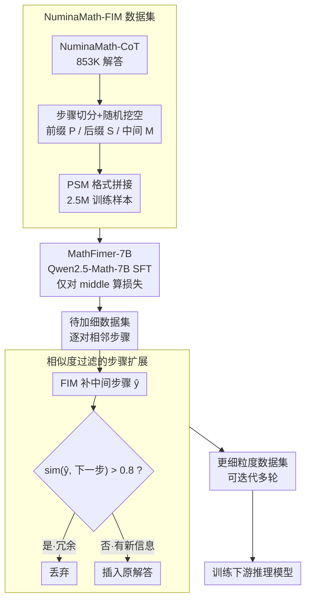

# MathFimer: Enhancing Mathematical Reasoning by Expanding Reasoning Steps through Fill-in-the-Middle Task

**会议**: ICLR 2026  
**arXiv**: [2502.11684](https://arxiv.org/abs/2502.11684)  
**代码**: 无  
**领域**: 代码智能  
**关键词**: 数学推理, Fill-in-the-Middle, 推理步骤扩展, Chain-of-Thought, 数据增强

## 一句话总结

借鉴代码补全中的 Fill-in-the-Middle (FIM) 范式，训练一个专门的步骤扩展模型 MathFimer-7B，在已有数学解题链中插入更细粒度的中间推理步骤，从而系统性提升下游模型的数学推理能力。

## 研究背景与动机

Chain-of-Thought (CoT) 已是 LLM 数学推理的主流范式，但训练数据中推理步骤的质量和粒度直接制约模型性能。已有研究 (Jin et al., 2024) 表明更详细的中间步骤可显著提升推理准确率。然而，现有的步骤扩展方法存在三大问题：

**依赖更强模型**：需要用更大的外部模型来生成更好的步骤，形成"越大越好"的循环依赖

**计算成本高昂**：像 MCTS 这样的搜索策略在探索推理路径时需要大量算力

**可靠性不足**：这些方法通常生成全新的推理链，而非在已有的人工验证步骤基础上进行增强，可能引入新的错误

核心研究问题：能否开发一种更高效、更可靠的方法来扩展推理步骤，同时保留已有人工生成解答的有效性？

## 方法详解

### 整体框架

MathFimer 把"让推理链更细"这件事拆成两步：先把一个专门的步骤补全模型训出来，再拿它去给已有数据集的每条解答"加细"。两步都建立在代码补全里的 Fill-in-the-Middle 思想上——给定前缀和后缀，模型补出中间缺失的那一块，只不过这里补的是数学推理步骤而非代码。整条管线自上而下是：把 NuminaMath-CoT 改造成"挖空—填空"的 FIM 训练集（设计 1）→ 在数学基座上微调出轻量补全器 MathFimer-7B（设计 2）→ 上线时对每对相邻步骤尝试补一步、再用相似度过滤掉冗余（设计 3）→ 得到更细粒度的数据集去训下游推理模型。

### 关键设计

**1. NuminaMath-FIM 数据集：把"补步骤"伪装成 FIM 任务**

要训一个会插入中间步骤的模型，得先有"挖空—填空"形式的监督数据。作者基于 NuminaMath-CoT（853K 数学问答对）做步骤级切分：把每个样本的解答写成有序步骤序列 $Y = \{y_1, y_2, ..., y_n\}$，随机挑一个步骤 $y_i$ 挖掉，让它前面的 $y_1...y_{i-1}$ 当前缀 $P$、后面的 $y_{i+1}...y_n$ 当后缀 $S$、被挖掉的 $y_i$ 当待预测中间步骤 $M$。每个样本重复 3 轮随机采样以覆盖不同挖空位置，最终得到 2.5M 条训练样本。序列按 PSM（Prefix-Suffix-Middle）格式拼接，并用 `<|fim_prefix|>`、`<|fim_suffix|>`、`<|fim_middle|>` 三个特殊 token 标界，让模型从结构上分清哪段是上下文、哪段要生成。

**2. MathFimer-7B：用数学基座学一个轻量补全器**

模型本身不需要很大。作者直接拿数学专用的 Qwen2.5-Math-7B 当基座做 SFT，学习目标就是 $\text{FIM}(Q, P, S) \Rightarrow M$——给定题目 $Q$、前缀和后缀，输出中间步骤。训练时只对 `<|fim_middle|>` 之后的 token 计算损失，前后缀作为条件不回传梯度，这样模型专注于"补中间"而不是复述上下文。后面消融显示 7B 和 72B 的扩展效果几乎持平，正是因为补一步中间推理这件事本身不吃模型容量。

**3. 相似度过滤的步骤扩展：只在真正缺细节的地方插**

训练好的模型上线时，对原始解答中每一对相邻步骤之间都尝试补一步：$\hat{y}_i = \text{FIM}(Q, y_1...y_{i-1}, y_i...y_n)$。但并非每个位置都值得插——如果原始的下一步已经写得很细，补出来的内容会和它高度重合，硬塞进去只是冗余。为此作者加了一道相似度过滤：算生成步骤 $\hat{y}_i$ 与原始下一步 $y_i$ 的序列相似度，设阈值 $\eta = 0.8$，相似度高于阈值就判为无效（原步骤已足够详细），只有低于阈值、确实带来新信息的步骤才被插入。这样既避免冗余膨胀，也保住了原始人工步骤的结构，不像重生成整条链那样有引入新错误的风险。

### 损失函数 / 训练策略

训练用标准交叉熵，但损失只作用在 middle 部分的 token 上。工程上以 Megatron-LM 框架做 SFT，max_length = 8192、全局 batch size = 128、学习率 1e-5，所有样本做 packing 以提升吞吐，在 64 块 Ascend H910B-64G 上完成训练。

## 实验关键数据

### 主实验

在 4 个基座模型 × 5 个数据集上进行了全面实验：

| 基座模型 | 数据集 | GSM8K | MATH | Odyssey | OB-EN | 平均提升 |
|---------|--------|-------|------|---------|-------|---------|
| Llama-3.1-8B | MathInstruct-CoT | 67.78→75.21 | 18.74→22.90 | 22.11→24.42 | 2.37→3.56 | **+3.77** |
| Llama-3.1-70B | MathInstruct-CoT | 89.31→90.98 | 41.96→44.72 | 36.50→39.33 | 9.19→12.15 | **+2.56** |
| Qwen2.5-Math-7B | MetaMathQA | 93.18→93.10 | 70.22→79.08 | 49.10→52.70 | 34.81→41.04 | **+4.65** |
| Qwen2.5-Math-72B | MetaMathQA | 90.22→92.95 | 57.68→63.40 | 42.93→47.30 | 20.00→24.89 | **+4.43** |

### 消融实验

| 配置 | 关键指标 | 说明 |
|------|---------|------|
| 蒸馏数据 vs 原始数据 | G+M 原始 +5.61 vs 蒸馏 +1.13 (GSM8K) | 部分提升来自模型蒸馏，但 FIM 步骤扩展本身也提供额外增益 |
| 迭代扩展 (1→3轮) | MI-CoT: 67.78→75.21→80.21→83.32 (GSM8K) | 迭代扩展持续提升性能，3轮提升 +15.54% |
| 模型规模 (7B vs 72B) | 7B: +7.43 vs 72B: +6.14 (GSM8K, MI-CoT) | 7B 和 72B 模型性能差距很小，说明步骤扩展不依赖大模型 |

### 关键发现

1. **普适性强**：MathFimer 在通用模型 (Llama) 和数学专用模型 (Qwen-Math) 上都有效，在 4 个基座模型和 5 个数据集上均观察到一致的提升
2. **迭代可扩展**：多轮步骤扩展可以持续累积改进效果，GSM8K 上 3 轮迭代可达 +15.54%
3. **小模型即可**：MathFimer-7B 和 72B 的扩展效果非常接近，表明步骤扩展任务不需要大模型容量
4. **数学专用模型受益更大**：Qwen2.5-Math 系列在 MetaMathQA 和 ScaleQuest 上获得了最大提升（MATH +8.86%）

## 亮点与洞察

- **巧妙的类比迁移**：将代码补全中成熟的 FIM 范式迁移到数学推理步骤扩展，思路新颖且有效
- **保留原始结构**：不像其他方法重新生成整条推理链，MathFimer 在保留原始步骤的基础上进行插入，更可靠
- **相似度过滤机制**：自动判断某位置是否需要扩展，避免冗余插入
- **实用性强**：无需外部更强模型，一个 7B 模型即可完成扩展
- **数据资产**：开源了 NuminaMath-FIM 数据集（2.5M 样本）和 MathFimer-7B 模型

## 局限与展望

1. **领域泛化性未知**：目前仅验证了数学推理，是否适用于代码推理、逻辑推演、常识推理等领域尚不清楚
2. **生成可靠性**：缺乏对插入步骤的逻辑一致性和数学正确性的自动验证机制，多轮迭代可能导致错误累积
3. **方法论局限**：主要扩展已有解题模式，对极其复杂或非常规问题的新解法探索有限
4. **未探索自适应扩展**：当前对所有步骤对统一执行扩展，缺乏对"哪些步骤真正需要扩展"的智能判断

## 相关工作与启发

- CoT Prompting (Wei et al., 2023) 和 Self-Consistency (Wang et al., 2023) 是推理增强的基础
- Jin et al. (2024) 证明了推理步骤长度对 LLM 的重要影响
- MCTS 方法 (Chen et al., 2024; Guan et al., 2025) 走的是搜索最优路径的方向
- 与 OpenMathInstruct (Toshniwal et al., 2024) 不同，MathFimer 不依赖强模型生成新数据
- **启发**：FIM 范式可能可以推广到任何需要"补全中间步骤"的序列任务

## 评分
- 新颖性: ⭐⭐⭐⭐ （FIM 迁移到数学推理是新颖的，但本质上是数据增强）
- 实验充分度: ⭐⭐⭐⭐⭐ （4 个基座模型 × 5 个数据集 × 4 个 benchmark，非常全面）
- 写作质量: ⭐⭐⭐⭐ （结构清晰，实验详实）
- 价值: ⭐⭐⭐⭐ （方法简单实用，可直接应用于现有数据集的增强）

<!-- RELATED:START -->

## 相关论文

- [\[ICLR 2026\] VoG: Enhancing LLM Reasoning through Stepwise Verification on Knowledge Graphs](vog_enhancing_llm_reasoning_through_stepwise_verification_on_knowledge_graphs.md)
- [\[ICLR 2026\] Expanding Reasoning Potential in Foundation Model by Learning Diverse Chains of Thought Patterns](expanding_reasoning_potential_in_foundation_model_by_learning_diverse_chains_of_.md)
- [\[ACL 2025\] ClozeMath: Improving Mathematical Reasoning in Language Models by Learning to Fill Equations](../../ACL2025/llm_reasoning/clozemath_improving_mathematical_reasoning_in_language_models_by_learning_to_fil.md)
- [\[ICLR 2026\] Generative Adversarial Reasoner: Enhancing LLM Reasoning with Adversarial Reinforcement Learning](generative_adversarial_reasoner_enhancing_llm_reasoning_with_adversarial_reinfor.md)
- [\[ICLR 2026\] Learning Global Hypothesis Space for Enhancing Synergistic Reasoning Chain](learning_global_hypothesis_space_for_enhancing_synergistic_reasoning_chain.md)

<!-- RELATED:END -->
