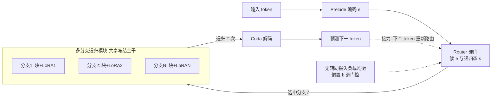

# MoDr: Mixture-of-Depth-Recurrent Transformers for Test-Time Reasoning

**会议**: ICLR 2026  
**OpenReview**: [https://openreview.net/forum?id=9Pba4rcQbE](https://openreview.net/forum?id=9Pba4rcQbE)  
**代码**: [https://github.com/zhangxjohn/MoDr](https://github.com/zhangxjohn/MoDr)  
**领域**: LLM 推理 / 隐空间推理 / 递归深度 Transformer  
**关键词**: 深度递归 Transformer、Huginn、隐空间推理、Mixture-of-Experts、LoRA、动态路由、测试时计算  

## 一句话总结
把深度递归 Transformer（Huginn）那条"单一链式"的隐空间循环模块，拆成多条共享主干、各带一个 LoRA 的递归分支，再用一个无辅助损失的硬门路由在生成每个 token 时动态接力选分支，仅训练 <0.2% 参数就把数学/常识推理准确率显著拉高。

## 研究背景与动机
**领域现状**：主流 LLM 靠 chain-of-thought 在自然语言里"显式"写出一长串中间步骤来增强推理，但这既费算力又增加延迟。一条替代路线是**隐空间推理（latent reasoning）**——用循环/looped 结构在连续隐空间里反复"深思"。其中 Geiping 等人 2025 年的 Huginn 把 3.5B Transformer 拆成 Prelude（编码）/ Loop（递归块）/ Coda（解码）三段，通过把同一个 Loop 块在隐空间里复用 $T$ 次来增加每个 token 的有效计算深度，随递归次数增加性能稳步上升，且内存与延迟都很低。

**现有痛点**：Huginn 的每个推理步都依赖**同一个固定的递归模块**，整条推理轨迹是一条单向、链式的传播。这种刚性结构限制了模型对解空间的探索与回溯能力。

**核心矛盾**：从思维结构看，链式（CoT）→ 树式（ToT，能探索/回溯）→ 图式（GoT，能聚合子问题/自验证）的演进说明"多路径探索"比"单链"更强；但 Huginn 这种单循环模块本质上类似链式结构，**探索能力天然受限**。难点在于：如何给 Huginn 加上自适应的"探索-反刍"模块，又**不引入额外的算力/显存负担**？

**本文目标**：在冻结 Huginn 主干、几乎零额外开销的前提下，把线性的隐空间推理升级为多分支、可动态切换的"接力探索"模式。

**核心 idea（Mixture-of-Depth-Recurrent）**：用多条共享主干权重、各带一个 LoRA 的递归分支构成"分支专家库"，再用一个硬门路由在生成每个 token 时根据上下文动态挑分支接力推理，并用无辅助损失的偏置策略防止路由坍缩。

## 方法详解

### 整体框架
MoDr 在 Huginn 的 Prelude/Loop/Coda 框架基础上，只改造中间的 Loop（递归模块）：把单一递归块复制成 $N$ 条"分支"，每条分支 = **共享的冻结递归块 + 一个独立 LoRA**；一个硬门路由网络读取上下文隐状态，为当前 token 选出一条分支去执行那 $T$ 次递归"深思"，下一个 token 可能换另一条分支，形成跨分支的"接力赛"。训练时只更新 LoRA 与路由器，并用偏置项做负载均衡。

### 关键设计

**1. LoRA-based 多分支递归模块：用低秩适配器堆出"廉价"的探索分支。** Huginn 的递归块沿用标准 Transformer "三明治"结构（注意力 + MLP，各带残差与 LayerNorm），原始第 $l$ 块的隐状态更新为 $\hat z^l_t = \text{LN}(\text{Attn}(\text{LN}(z^{l-1}_t)\mid W^l) + z^{l-1}_t)$、$z^l_t = \text{LN}(\text{MLP}(\text{LN}(\hat z^l_t)\mid W^l) + \hat z^l_t)$。若要靠"多份独立初始化的递归模块"来增加轨迹多样性，全量微调会带来巨大算力与显存开销。MoDr 的取巧之处在于让所有分支**共享同一份冻结主干 $W^l$**，只给每条分支挂一个独立 LoRA $\Delta W^l_j$，于是分支 $j$ 的前向变成 $z = W_0 x + \frac{\alpha}{r}\Delta W x = W_0 x + \frac{\alpha}{r}BAx$（$B\in\mathbb R^{h\times r}$、$A\in\mathbb R^{r\times k}$、秩 $r\ll\min(h,k)$）。这样既**冻结主干保住了世界知识**，又因 LoRA 参数极少而几乎不增算力/显存——全部可训练参数不到基座 Huginn 的 0.2%。

**2. 硬门分支路由：按上下文隐状态在每个 token 上"接力"选分支。** 路由器同时考虑两路信息——Prelude 的输出 $e$ 与当前递归态 $s$，先用一个 $\mathbb R^{2h}\to\mathbb R^h$ 的适配矩阵把二者拼接映射到隐维 $h$ 得到 $h$。设路由权重 $W_{\text{router}}\in\mathbb R^{N\times h}$，先算各分支打分 $u = W_{\text{router}}h^\top$，再对 token 维求均值并经 sigmoid 得 $r = \sigma(\frac1n\sum_{i=1}^n u_i)\in\mathbb R^N$，取 $\zeta = \arg\max_j r_j$ 选出置信度最高的那条分支（Top-1 硬门），并把选中分支的隐状态按其门控分 $g = r_\zeta$ 加权为 $z^{l,'}_{j,t} = g\cdot z^l_{j,t}$。推理时**每生成一个新 token 都重新路由一次**，于是连续 token 的"深思"由不同分支轮流承担，形成跨分支接力——这正是论文把推理重构成"组合解空间里的动态接力探索"的落点。

**3. 无辅助损失的负载均衡：用偏置项防路由坍缩、又不污染梯度。** MoE 路由常因坍缩而让少数分支被过度使用，传统做法是加辅助损失，但大辅助损失会引入冲突梯度、损害性能。MoDr 改为给每条分支的门控分 $r_i$ 加一个**偏置 $b_i$**：以 $\hat r = r + b$ 来选分支 $\hat\zeta = \arg\max_j \hat r_j$，但最终加权用的分数 $g = r_{\hat\zeta}$ **不含偏置**（偏置只影响"选谁"、不影响"权重多大"）。偏置在线更新：每个 batch 统计各分支被分到的样本数 $c_i$ 与平均数 $\bar c_i$，算负载违背误差 $e_i = \bar c_i - c_i$，再按 $b_i = b_i + \eta\cdot\text{sign}(e_i)$ 调整（$\eta$ 为更新率）。这样既把负载推向均衡，又避免把噪声梯度直接灌进模型。

## 实验关键数据
设置：基座为 3.5B Huginn，MoDr 用 4 条 LoRA 分支（秩与缩放因子均为 16，作用于递归块注意力的 q/k/v/o 投影）+ Top-1 硬门路由，平均递归数 32、BPTT 截断到最后 8 步，单张 H100 训练；可训练参数 <0.2%。基线包括原始 Huginn、LoRA 微调版 Huginn-SFT、以及无路由（随机选分支）的多分支 Huginn。

### 主实验表格（数学推理，单位 %）

| 方法 | GSM8K(ID) | MAWPS(ID) | AQuA(ID) | MultiArith(OOD) | AddSub(OOD) | SingleEq(OOD) | 六数据集平均 |
|------|-----------|-----------|----------|-----------------|-------------|---------------|--------------|
| Huginn | 43.59 | 71.85 | 27.95 | 79.83 | 71.90 | 76.97 | 62.02 |
| Huginn-SFT | 49.43 | 78.15 | 30.71 | 87.17 | 74.68 | 80.31 | 66.74 |
| **MoDr（本文）** | **49.89** | **80.67** | **33.07** | **91.17** | **79.24** | **81.30** | **69.22** |

平均较原始 Huginn / Huginn-SFT 提升 **+7.2% / +2.48%**；分域看 OOD 提升（+7.67% / +3.18%）大于 ID（+6.75% / +1.78%），泛化更强。常识推理上较两基线提升 **+21.21% / +1.52%**（附录 A.2）。

### 消融实验表格（路由的作用，平均准确率 %）

| 配置 | GSM8K | MAWPS | AQuA | MultiArith | AddSub | SingleEq | 平均 |
|------|-------|-------|------|------------|--------|----------|------|
| No Router（训推都随机选） | **50.72** | 79.41 | 31.89 | 90.17 | 75.70 | 76.57 | 67.41 |
| MoDr w/o Router（推理随机） | 48.60 | 77.73 | 29.92 | 89.17 | 74.68 | 78.35 | 66.41 |
| **MoDr w/ Router** | 49.89 | **80.67** | **33.07** | **91.17** | **79.24** | **81.30** | **69.22** |

带路由的 MoDr 全面优于两种随机选分支配置；单分支独立评测显示 MoDr 路由平均（69.22）超过任一单分支（最高 67.94）及它们的算术平均（66.71），印证分支学到了"分工"。

### 关键发现
- **负载均衡有效**：$\eta=0$ 会让路由坍缩到少数分支（balance entropy 低，Avg.Acc=68.66），$\eta=0.001$ 让负载更均衡、泛化更好（69.22）。
- **分支数 4 是甜点**：1→4 分支性能单调上升，超过 4 之后增益递减，4 分支在性能/算力间最优。
- **分支自发分工**：Branch-2 像"通才"承担多数计算，Branch-3 偏复杂算术（MultiArith 激活 46.72%）、Branch-4 偏 AQuA 这类多选题（33.16%），路由分布对任务高度敏感，证明分支学到了非冗余的差异化功能。

## 亮点与洞察
- **把 MoE+LoRA 从"层级专家"挪到"块级递归分支"**：传统 MoELoRA/MoLA 把 LoRA 当层内专家，MoDr 改成在递归模块这个"会被复用 T 次"的块上做分支，让多样性直接作用在隐空间推理轨迹上，这是个新颖且贴合递归架构的位置选择。
- **几乎零成本的探索能力升级**：冻结主干 + <0.2% 可训练参数，就把单链隐空间推理变成多分支接力探索，OOD 增益尤其明显，性价比高。
- **"接力赛"式的 token 级动态深度**：每个 token 重新路由，等价于给不同 token 分配不同的"深思路径"，比固定递归模块更贴近"自适应计算"的理想。

## 局限与展望
- **仍是 Top-1 硬门、单分支激活**：每个 token 只走一条分支，未探索多分支并行/软融合是否能进一步提升探索广度。
- **路由并非每题最优**：单分支消融显示 MoDr 在 AQuA/MultiArith 上仅排第三，说明路由有时选不到该题的最优分支，路由器的判别力仍有提升空间。
- **依赖 Huginn 这一特定基座**：方法绑定在 3.5B Huginn 的 Prelude/Loop/Coda 结构上，能否迁移到其他递归/looped Transformer 或更大规模基座未验证。
- **数据规模与任务范围有限**：实验集中在数学与常识推理的中小数据集，未覆盖代码、长链多跳等更复杂推理。

## 相关工作与启发
- **递归深度 / looped Transformer**：Universal Transformer、AlgoFormer、Huginn 等用复用层在隐空间增加有效深度；MoDr 是对 Huginn 单循环模块的直接扩展。
- **思维结构**：CoT（链）→ ToT（树）→ GoT（图）的演进启发了"单链探索不足"的判断，MoDr 用多分支动态接力在隐空间近似"多路径探索"。
- **MoE 与参数高效微调**：从 Sparsely-gated MoE / Switch Transformer 借来硬门路由，从 LoRA / MoELoRA / MoLA / MixLoRA 借来低秩适配，并采用 DeepSeek 系的无辅助损失负载均衡（Wang et al. 2024）思路。
- **启发**：在"会被反复复用的模块"上做专家化，是把 MoE 思想引入递归/隐空间推理的一个高杠杆切入点；偏置式负载均衡也提示我们辅助损失并非防坍缩的唯一手段。

## 评分
- **新颖性**: ⭐⭐⭐⭐ — 首次把 MoE+LoRA 的动态路由引入深度递归 Huginn 的循环模块，"块级递归分支接力"是有辨识度的新组合，而非简单堆叠已有技术。
- **实验充分度**: ⭐⭐⭐ — 六个数学 + 常识基准、ID/OOD 划分、路由/负载/分支数/路由分布多角度消融较扎实，但只在单一 3.5B Huginn 基座、中小数据集上验证，缺更大规模与更复杂推理任务。
- **写作质量**: ⭐⭐⭐⭐ — 动机链条（单链→多路径探索）清晰，图 1/2 与公式把"接力路由"讲得直观，方法与消融对应紧密。
- **价值**: ⭐⭐⭐⭐ — 以 <0.2% 参数显著提升隐空间推理且 OOD 泛化更好，为"自适应深度递归推理"提供了一个低成本、可复现的方向，对 latent reasoning 社区有实用参考价值。

<!-- RELATED:START -->

## 相关论文

- [\[ICLR 2026\] ChainGPT: Dual-Reasoning Model with Recurrent Depth and Multi-Rank State Updates](chaingpt_dual-reasoning_model_with_recurrent_depth_and_multi-rank_state_updates.md)
- [\[ICLR 2026\] TUMIX: Multi-Agent Test-Time Scaling with Tool-Use Mixture](tumix_multi-agent_test-time_scaling_with_tool-use_mixture.md)
- [\[ICLR 2026\] PERK: Long-Context Reasoning as Parameter-Efficient Test-Time Learning](perk_long-context_reasoning_as_parameter-efficient_test-time_learning.md)
- [\[NeurIPS 2025\] A Little Depth Goes a Long Way: The Expressive Power of Log-Depth Transformers](../../NeurIPS2025/llm_reasoning/a_little_depth_goes_a_long_way_the_expressive_power_of_logde.md)
- [\[ICLR 2026\] Learning to Reason via Mixture-of-Thought for Logical Reasoning](learning_to_reason_via_mixture-of-thought_for_logical_reasoning.md)

<!-- RELATED:END -->
