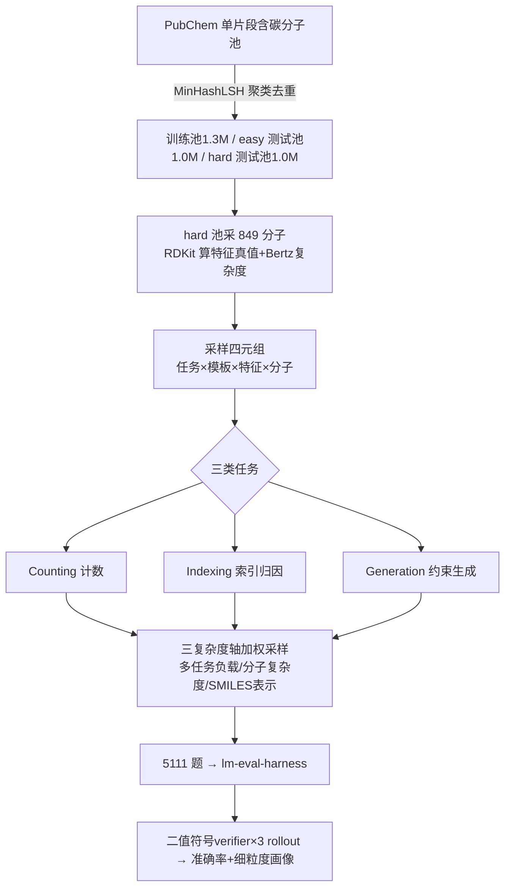

# MolecularIQ: Characterizing Chemical Reasoning Capabilities Through Symbolic Verification on Molecular Graphs

**会议**: ICLR 2026  
**OpenReview**: [https://openreview.net/forum?id=RqwEzZqMFv](https://openreview.net/forum?id=RqwEzZqMFv)  
**代码**: [https://github.com/ml-jku/moleculariq](https://github.com/ml-jku/moleculariq)（含 leaderboard、symbolic solver、数据集）  
**领域**: LLM 推理评测 / 化学结构推理 / Benchmark  
**关键词**: 分子图推理, 符号可验证, SMILES, RDKit, 可验证奖励, 化学 LLM  

## 一句话总结
MolecularIQ 是首个**完全符号可验证**的分子结构推理基准：所有答案都能用 RDKit 从分子图上精确算出，从而把"真正读懂结构"和"记住分子-属性配对"彻底解耦，并沿任务类型、分子复杂度、表示形式三个轴细粒度定位 38 个 LLM 在哪些任务、哪类结构上失败。

## 研究背景与动机
- **领域现状**：LLM 正被越来越多地用作统一的化学助手——单个模型就想覆盖命名转换、属性预测、反应预测、分子生成等过去需要专用 chemoinformatics 模型的任务，因此评测通用/专业 LLM 化学能力的需求激增。
- **现有痛点**：主流化学 benchmark 要么是多选/考试题，主要测**事实记忆**；要么依赖 MoleculeNet、USPTO 等公开数据集做标签——这些极可能已进入预训练语料，**数据泄漏**让人无法区分"结构推理"和"记住了分子-属性对"；当缺真值时又退而用 surrogate 预测器/启发式当裁判，引入可被刷分的**裁判偏差**。
- **核心矛盾**：化学的根本原理是"结构决定性质"，所以**结构理解是分子推理的前提而非众多能力之一**;但当前 benchmark 恰恰掩盖了一个关键问题——LLM 到底有没有在分子图上真推理，还是在做 token 模式匹配。
- **本文目标**：造一个只含符号可验证任务的基准，让每个答案都能程序化校验、保证标签正确、杜绝裁判偏差，并能精准定位"模型在哪、为什么"崩掉。
- **核心 idea**：**【符号可验证当诊断探针】** 这些任务用 cheminformatics 软件可瞬间解出，正是其价值所在——它们设定了一条"地板线"，真正内化了分子结构的模型不该跌破；一个属性预测刷得很高却连基础子结构都识别不出的模型，几乎肯定在利用数据集相关性而非真推理。**【从 1D 串推 2D 图】** LLM 把分子当 SMILES token 序列处理，这些任务隐式考验它能否从线性串里还原 2D 图拓扑。

## 方法详解

### 整体框架
MolecularIQ 把"分子结构推理"分解为**三类任务 × 六类符号可验证特征 × 三条正交复杂度轴**的笛卡尔组合：对每个特征都配一个 RDKit 符号求解器算真值，再按 (任务, 模板, 特征, 分子) 四元组采样出题；每题用二值符号 verifier 打分（三次 rollout 取均值）。静态版含 849 个分子、5111 道题，并配套可动态扩样的 MolecularIQ$_D$ 防过拟合/饱和。

### 关键设计

**1. 三类任务阶梯：从计数到索引堵死捷径，再到约束生成测落地能力。** Counting（数官能团/环/原子数）建立对分子图的基础理解，但高分可能来自绕过真推理的捷径；为此**对几乎每道计数题都配一道同分子的 Indexing 题**——要求模型给出参与该特征的具体原子/键索引（如"哪些位点是 HBA"答 1,3,6,8,10,13），把"靠模式记住计数"的虚假解路堵死，逼模型把答案 ground 到具体子结构上；Generation 则把分子设计形式化为"生成满足给定约束的分子"，测实用能力。除氢计数和分子式无法索引外，counting↔indexing 一一对应，因此可直接对比"对的计数"是否真来自正确定位子结构。

**2. 六类符号可验证特征，全由 RDKit 求解器兜底真值。** 特征覆盖图拓扑（环/桥头/分支点/最小环）、化学类型化拓扑（芳香/杂环/手性 R-S、E-Z、sp³）、组成（碳/杂/卤/重原子计数、分子式）、化学感知（HBD/HBA、可旋转键、氧化态）、官能团（醇/胺/羧酸等）、合成与碎裂（BRICS 碎片、模板反应、Murcko 骨架）。每个特征都有 RDKit-based 符号 solver，既能算计数真值也能定位参与原子索引，从而**保证标签可程序化校验、消除 surrogate 偏差**；尽管这些题对软件是 trivial 的，但正因如此它们才是合格的"地板线"。

**3. 三条正交复杂度轴，把"在哪失败"沿 bespoke 维度展开。** **SMILES 表示**：对每个分子以各 50% 概率独立施加 randomized / kekulized 扰动（外加 ring-index 重标号），若模型真在结构上推理则规范化应无关紧要，反之从 canonical 掉到 non-canonical 的下滑就暴露了对记忆化 token 模式的依赖。**分子复杂度**：按 Bertz 指数分 0–250 / 250–1000 / 1000+ 三档，覆盖比 ChemIQ、ChemCoTBench 更广的复杂度区间。**多任务负载**：在一条 prompt 里同时要 1/2/3/5 个子任务，n 任务题须全对才算对——用以分离"任务本身难"和"模型管不了多个子任务"两种失败来源。

**4. 鲁棒符号抽取 + living benchmark + 可验证奖励。** 为避免弱抽取人为抬高/压低分数，用**分层抽取 + key-specific 规范化匹配**把格式合规和化学正确解耦，并报告 type-validity rate（输出语法是否合规）以区分"语义错"和"格式坏"。基准集成进 lm-evaluation-harness 做标准化评测，并托管在线 leaderboard（在非公开的后继版本上评测以保完整性）；MolecularIQ$_D$ 支持动态扩样，其符号 solver 还能直接当 RLVR（可验证奖励强化学习）的高效 reward model。

## 实验关键数据

### 主实验表格（MolecularIQ 总体 & 分任务准确率，%，top 模型节选）

| 模型 | 规模 | R | C | Overall | Counting | Indexing | Generation |
|---|---|---|---|---|---|---|---|
| TxGemma-27B（化学） | 27B | ✓ | ✓ | 5.0 | 7.0 | 1.8 | 6.2 |
| Ether0（化学） | 24B | ✓ | ✓ | 6.5 | 3.2 | 0.1 | 17.5 |
| ChemDFM-R-14B（化学） | 14B | ✓ | ✓ | 8.7 | 12.9 | 2.8 | 10.5 |
| GLM-4.6 | 355B(A32B) | ✓ | | 16.2 | 15.9 | 11.3 | 22.0 |
| Qwen-3 235B | 235B(A22B) | ✓ | | 39.2 | 37.1 | 34.5 | 46.7 |
| **GPT-OSS 120B (High)** | 120B(A5B) | ✓ | | **47.5** | 46.8 | 42.5 | 53.7 |

> 共评测 38 个开源 LLM（27 通用 + 11 化学专用）。最强模型总体也仅 ~48%，结构理解仍是关键瓶颈。

### 消融/细粒度分析（关键发现表）

| 维度 | 现象 |
|---|---|
| 推理预算 | 预算越高越好；GPT-OSS 内部"预算差"比"模型尺寸差"影响还大 |
| 多任务负载 | 总体随负载下降，且影响远大于 Bertz 复杂度；但观测 n 任务成功率 > $p_{single}^n$，说明多任务 prompt 反而帮模型解单个子任务 |
| Counting→Indexing | top 模型仅降 ~5–30%，说明对的计数多源于真定位子结构（真图推理），非记忆统计 |
| SMILES 扰动 | randomized/kekulized/ring-enum 下全 top10 一致掉分 → 依赖 canonical token、闭环约定、芳香记法 |
| 特征类别 | 组成类最易（70–90%），合成/碎裂最难；organosulfur、C≡N/N=O motif 成功率低 |

### 关键发现
- **失败是真推理缺失，而非抽取假象**：type-validity 常达 80–90% 但准确率远低，错答多是语义错而非格式坏；错答的 CoT 平均显著更长（啰嗦 CoT 与困惑相关）。对 300 条全员失败的 trace 分析显示：模型能做基础 SMILES 解析和环拓扑，但在官能团识别、属性归因、立体化学、约束跟踪、定量精度上崩盘。
- **朴素化学微调系统性变差**：现代通用 LLM 全面超过化学专用模型；化学微调相对其 base 模型反而平均掉分，type-validity 平均低 18 个百分点（中位 11），说明窄任务指令微调把通用语言/格式遵循能力过拟合坏了，仅 ChemDFM-R 略有提升。
- **约束生成的强项不泛化**：约束越罕见、约束数 ≥3 时准确率骤降 → 缺真正的组合推理。

## 亮点与洞察
- **"地板线"哲学**：用对软件 trivial 的任务做诊断，恰恰因为可被符号精确验证、杜绝泄漏与裁判偏差，才成为衡量结构内化的硬标尺——这是 benchmark 设计上很漂亮的反直觉立论。
- **counting↔indexing 配对**是设计精髓：只看计数无法判断是否真推理，强制索引归因把"蒙对计数"的捷径堵死，并量化证明 top 模型确实在做图推理。
- **多轴可定位失败**：不只给一个总分，而是沿任务/复杂度/表示/官能团展开成"能力画像"，能精确说出某模型在哪类分子、哪个官能团、哪种 SMILES 写法上崩。
- **符号 solver 一物两用**：既当评测真值，又能直接当 RLVR 的 reward model，把 benchmark 和训练打通。

## 局限与展望
- **特征面窄**：只覆盖符号可验证任务，排除了溶解度、活性、反应结果等无精确符号解的问题，未覆盖分子设计/药物发现全谱；未来可结合 QM 数值近似在保可验证性下扩面。
- **仅 2D 单分子单模态**：只用 SMILES、只处理单个分子，无法覆盖立体/构象/空间约束等 3D 现象，也无法测反应预测、逆合成、候选排序等跨分子高阶推理。
- **作者主张演化为 living benchmark**：靠 MolecularIQ$_D$ 在模型饱和/过拟合时刷新扩样，并为特定子领域（如天然产物）定制评测集。

## 相关工作与启发
- 对比 MolPuzzle（谱图推结构、易污染+多模态）、ChemIQ（多为 SMILES 解析检查、被 base 模型刷爆）、FGBench（标签直接继承 MoleculeNet）、ChemCoTBench（用 USPTO+非确定性 LLM 裁判）、TOMG-Bench/MEGA（生成约束满足但不测结构理解）——MolecularIQ 的差异在于**系统化变动任务/复杂度/表示来定位崩点**，且完全符号可验证。
- 启发：(1) 评测设计应优先消除数据泄漏与裁判偏差，符号可验证是值得推广的范式；(2) "能力画像"优于单一总分，便于诊断与指导训练；(3) 警惕窄域化学微调反伤通用推理与格式遵循的"负迁移"，提示领域适配要兼顾基础能力保持。

## 评分
- **新颖性**: ⭐⭐⭐⭐ — 首个完全符号可验证的分子结构推理基准，counting↔indexing 配对 + 三正交复杂度轴的诊断设计立意清晰且有方法学贡献。
- **实验充分度**: ⭐⭐⭐⭐⭐ — 38 个模型 × 多轴细粒度分析 + 失败模式人工评判 + 微调负迁移分析，覆盖面与深度俱佳。
- **写作质量**: ⭐⭐⭐⭐ — 动机层层递进、"地板线"论证有力，图表丰富；信息密度大略需耐心。
- **价值**: ⭐⭐⭐⭐ — 开放 leaderboard + solver + 训练池 + RLVR reward 一体，对化学 LLM 的评测与训练都有直接落地价值。

<!-- RELATED:START -->

## 相关论文

- [\[ICLR 2026\] VoG: Enhancing LLM Reasoning through Stepwise Verification on Knowledge Graphs](vog_enhancing_llm_reasoning_through_stepwise_verification_on_knowledge_graphs.md)
- [\[ICLR 2026\] Reference-guided Policy Optimization for Molecular Optimization via LLM Reasoning](reference-guided_policy_optimization_for_molecular_optimization_via_llm_reasonin.md)
- [\[AAAI 2026\] Graph of Verification: Structured Verification of LLM Reasoning with Directed Acyclic Graphs](../../AAAI2026/llm_reasoning/graph_of_verification_structured_verification_of_llm_reasoning_with_directed_acy.md)
- [\[ICLR 2026\] Variation in Verification: Understanding Verification Dynamics in Large Language Models](variation_in_verification_understanding_verification_dynamics_in_large_language_.md)
- [\[ICLR 2026\] Characterizing and Mitigating Reasoning Drift in Large Language Models](characterizing_and_mitigating_reasoning_drift_in_large_language_models.md)

<!-- RELATED:END -->
