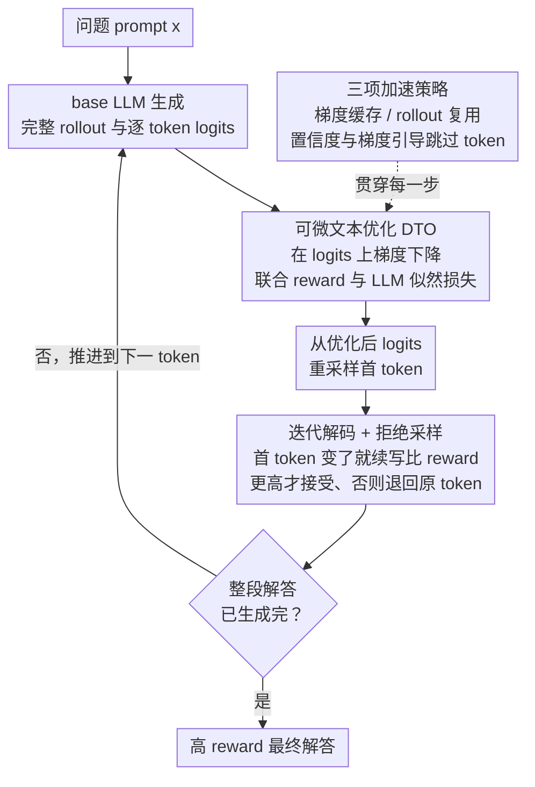

# ∇-Reasoner: LLM Reasoning via Test-Time Gradient Descent in Latent Space

**会议**: ICLR 2026  
**arXiv**: [2603.04948](https://arxiv.org/abs/2603.04948)  
**代码**: [https://github.com/VITA-Group/Nabla-Reasoner](https://github.com/VITA-Group/Nabla-Reasoner)  
**领域**: 优化  
**关键词**: test-time scaling, gradient-based optimization, differentiable optimization, reward model, inference-time reasoning

## 一句话总结
提出 ∇-Reasoner，将推理时的搜索从零阶（采样+评估）升级为一阶（梯度下降），在 token logits 空间上通过可微文本优化（DTO）结合 reward 梯度和 LLM 似然来迭代改进解码策略，在数学推理任务上提升 10-40% 准确率的同时减少 10-40% 的模型调用次数。

## 研究背景与动机
**领域现状**：推理时计算缩放（inference-time scaling）已成为提升 LLM 推理能力的重要途径。现有方法包括 Best-of-N、Self-Consistency、Tree-of-Thought、RAP 等，通过多次采样和评估来寻找高质量答案。

**现有痛点**：这些方法本质上都是**零阶搜索**——仅利用 reward 的标量值来筛选候选，没有利用 reward 的梯度方向信息。当搜索空间随序列长度指数增长时，无方向的搜索变得低效，性能随计算预算增加而饱和。

**核心矛盾**：reward model 本身是可微的（基于 transformer 的分类器），梯度信息唾手可得却被完全浪费。零阶方法无法有效利用 reward landscape 的结构信息。

**本文目标**：如何在推理时利用 reward 梯度来高效地引导 LLM 输出向高 reward 区域移动，同时保持生成的流畅性？

**切入角度**：将 LLM 推理重新表述为连续优化问题——在 token logits 空间上做梯度下降，用 straight-through estimator 桥接离散与连续空间。

**核心 idea**：用一阶梯度下降代替零阶搜索来做推理时策略优化，在 logits 空间上同时最大化 reward 和 LLM 似然。

## 方法详解

### 整体框架
∇-Reasoner 是一个迭代解码框架：给定 prompt，base LLM 先生成一个完整的 rollout 及其逐 token logits，作为初始策略；然后用可微文本优化（DTO）在 logits 上做梯度下降把策略往高 reward 方向推，从优化后的 logits 重采样第一个 token；再用拒绝采样（rejection sampling）判断这个改动是否真涨 reward——涨了才接受，否则退回原 token；接受后推进到下一个 token、回到循环，直到整段解答生成完。整个过程逐 token 推进，每步都可能经过一轮梯度优化，三项加速策略则贯穿每一步把开销压到接近一次前向传播。

### 关键设计

**1. 可微文本优化（DTO）：把"采样—评估"的零阶筛选换成在 logits 上的一阶梯度下降**

这是全文的核心机制，针对的正是零阶搜索"只看 reward 标量、丢掉梯度方向"的浪费。DTO 直接在 token logits 空间上做梯度下降，优化目标把 reward 和 LLM 似然写进同一个 loss：

$$\mathcal{L}(\mathbf{y}) = -\lambda\, r(\mathbf{y}\mid\mathbf{x}) - \log \pi_{LLM}(\mathbf{y}\mid\mathbf{x})$$

其中 reward 项 $r$ 提供"往哪个方向改"的引导，NLL 项 $-\log\pi_{LLM}$ 像一根缰绳把优化结果拉回 LLM 自己的分布、防止 reward hacking。难点在于 token 是离散的、梯度本来流不过去，DTO 用 Gumbel-softmax straight-through estimator 把离散 token 参数化成连续 logits，让 reward 的梯度能一路反传到每个 token 上。这样做的额外好处是梯度会**双向传播**：前缀 token 通过 NLL 正则约束后面的 token 保持连贯，后面的 token 又通过 attention 把 reward 信号反传给前面的 token，相当于不显式做树搜索就实现了 look-ahead 式的全局优化。

**2. 迭代解码 + 拒绝采样：把 DTO 嵌进逐 token 解码，只采纳确实涨 reward 的修改**

光有梯度优化还不够——梯度方向带噪声，盲目采纳可能越改越差。所以 ∇-Reasoner 把 DTO 套进逐 token 的解码循环：每生成一个 token，先用 DTO 优化对应的 logits，再从 $\text{softmax}(\tilde{\mathbf{z}}_1/\tau)$ 重新采样首 token $\tilde{y}_1$。如果 $\tilde{y}_1$ 和原 token $y_1$ 不同，就用它续写一段、和原续写比 reward，**只有新续写 reward 更高才接受这个修改**。这层拒绝采样保证了每一步落地的改动都是有益的，把梯度噪声挡在门外；实验里它把 rejection rate 从无 DTO 时的约 66% 压到 29–40%，说明优化后的提议确实更容易被接受。

**3. 三项加速策略：让逐 token 做梯度优化的额外开销接近一次前向传播**

逐 token 反传听起来很贵，论文用三个互补的 trick 把成本压下来。其一是**梯度缓存**：因为 softmax 偏硬，one-hot token 在优化中并不频繁翻转，于是缓存 $\partial\mathcal{L}/\partial\mathbf{y}$ 复用，仅在 token 真的翻转时才重算。其二是 **rollout 复用**：某一步若被拒绝，它生成的 rollout 轨迹可以直接拿来当下一步的 rollout，不必重采。其三是**置信度 + 梯度引导的 token 选择**：只对高熵且高梯度的 token 跑 DTO，对那些模型已经很有把握（低熵）或梯度本就很小的 token 直接跳过。三者叠加后，配合 transformer 的并行执行，整体梯度计算的开销逼近一次前向传播，这也是它能在更少模型调用下取胜的工程基础。

### 损失函数 / 训练策略
无需训练（纯推理时方法）。DTO 的优化目标：$\mathcal{L} = -\log \pi_{LLM}(\mathbf{y}|\mathbf{x}) - \lambda \cdot r(\mathbf{y}|\mathbf{x})$，其中 $\lambda$ 平衡 reward 和 NLL 正则化。理论证明 DTO 的 sample-space 梯度下降等价于 PPO 的 Wasserstein gradient flow（Theorem 4.1），统一了预训练缩放和推理时缩放的理论框架。

## 实验关键数据

### 主实验

| 模型 + 基准 | Greedy | SC (N=8) | BoN (N=8) | RAP | GRPO | ∇-Reasoner |
|---|---|---|---|---|---|---|
| Qwen-2.5-7B MATH-500 | 43.8 | 69.8 | 70.2 | 68.6 | 70.8 | **71.0** |
| Qwen-2.5-7B AMC | 33.0 | 49.4 | 50.1 | 50.1 | 52.8 | 51.5 |
| Qwen-2.5-7B-Inst MATH-500 | 71.2 | 76.6 | 77.8 | 80.2 | - | **80.4** |
| Qwen-2.5-7B-Inst AMC | 43.0 | 55.5 | 55.9 | 54.6 | - | **56.8** |
| Qwen-2.5-7B-Inst AIME24 | 5.3 | 25.0 | 22.5 | 1.6 | - | **26.6** |
| Llama-3.1-8B-Inst MATH-500 | 40.6 | 54.8 | 52.2 | 55.4 | - | **55.8** |

### 消融实验

| 配置 | 效果 | 说明 |
|------|------|------|
| DTO rejection rate (Qwen-Inst) | 28.9% | 对比无 DTO baseline 的 66.5%，大幅降低 |
| DTO rejection rate (Llama-Inst) | 40.1% | 对比 baseline 66.9% |
| Reward model 4B vs 8B (MATH-500) | 80.4 vs 80.8 | 更大 reward model 仅提升 0.4% |
| 模型调用次数 | 减少 10-40% | 对比 BoN/SC |

### 关键发现
- DTO 将 rejection rate 从理论值 66% 降到约 30%，证明梯度优化确实有效改进了每一步的策略
- 计算效率优势：transformer 的并行执行使梯度计算接近一次前向传播的开销；confidence/gradient-guided selection 跳过大量不需要优化的 token
- 对 reward model 质量不敏感（4B vs 8B 差距 <1%）
- test-time scaling 曲线上，∇-Reasoner 的帕累托前沿始终优于 BoN 和 SC

## 亮点与洞察
- **从零阶到一阶的范式转换**：test-time scaling 领域的本质性改进，首次证明一阶梯度在推理时同样可用且更高效
- **理论优美**：证明了 DTO 的 sample-space 梯度下降等价于 PPO 的 Wasserstein gradient flow，统一了预训练缩放（参数空间优化）和推理时缩放（样本空间优化）
- **梯度缓存 trick 可复用**：由于 softmax 的硬化性质，one-hot token 不频繁变化的观察可以推广到其他需要对离散结构做梯度优化的场景

## 局限与展望
- 性能受限于 base model 和 reward model 的能力上限，无法超越两者的联合瓶颈
- base model 和 reward model 必须共享同一词表才能做 end-to-end 的 logit 优化，限制了模型组合的灵活性
- 当前只验证了数学推理任务，在代码生成、开放问答等场景的表现未知
- 与 serving engine（如 vLLM）的集成需要额外工程，需在解码循环中插入反向传播

## 相关工作与启发
- **vs Best-of-N / SC**: 纯零阶采样筛选，∇-Reasoner 用一阶梯度直接优化，用更少采样获得更好结果
- **vs ToT / RAP**: 同样是引导搜索，但依赖启发式树搜索和 Q 值估计，∇-Reasoner 用可微优化直接求解更高效
- **vs GRPO (训练时方法)**: 不修改模型权重达到接近 GRPO 的效果，且理论证明了两者的数学等价性

## 评分
- 新颖性: ⭐⭐⭐⭐⭐ 从零阶到一阶的范式转换，理论和方法都很新
- 实验充分度: ⭐⭐⭐⭐ 数学推理覆盖充分，但任务类型偏少
- 写作质量: ⭐⭐⭐⭐⭐ 理论推导清晰，图示直观，叙事流畅
- 价值: ⭐⭐⭐⭐⭐ 为 test-time scaling 开辟了新方向，有望成为重要基线

<!-- RELATED:START -->

## 相关论文

- [\[ICLR 2026\] On the Design of KL-Regularized Policy Gradient Algorithms for LLM Reasoning](on_the_design_of_kl-regularized_policy_gradient_algorithms_for_llm_reasoning.md)
- [\[ICLR 2026\] Generative Adversarial Reasoner: Enhancing LLM Reasoning with Adversarial Reinforcement Learning](generative_adversarial_reasoner_enhancing_llm_reasoning_with_adversarial_reinfor.md)
- [\[ICLR 2026\] CaTS: Calibrated Test-Time Scaling for Efficient LLM Reasoning](cats_calibrated_test-time_scaling_for_efficient_llm_reasoning.md)
- [\[ICLR 2026\] Efficient Test-Time Scaling for Small Vision-Language Models](efficient_test-time_scaling_for_small_vision-language_models.md)
- [\[ICML 2026\] Beyond Test-Time Memory: State-Space Optimal Control for LLM Reasoning](../../ICML2026/llm_reasoning/beyond_test-time_memory_state-space_optimal_control_for_llm_reasoning.md)

<!-- RELATED:END -->
