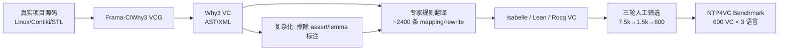

# Neural Theorem Proving for Verification Conditions: A Real-World Benchmark

**会议**: ICLR 2026  
**OpenReview**: [https://openreview.net/forum?id=MfDyickxQA](https://openreview.net/forum?id=MfDyickxQA)  
**代码**: 已开源（论文声明 open-sourced，链接待确认）  
**领域**: LLM 推理 / 神经定理证明 / 程序验证 / Benchmark  
**关键词**: Neural Theorem Proving, Verification Condition, Program Verification, Isabelle/Lean/Rocq, Why3/Frama-C, Benchmark  

## 一句话总结
本文提出 NTP4VC——首个面向"验证条件（VC）证明"这一程序验证核心瓶颈的真实世界、多语言（Isabelle/Lean/Rocq）神经定理证明 benchmark，用工业级流水线（Why3/Frama-C）从 Linux/Contiki-OS 等真实项目抽取 600 条 VC，并揭示当前最强 LLM/证明器 pass@8 不足 12%、甚至打不过经典 hammer 的巨大差距。

## 研究背景与动机
- **领域现状**：程序验证（program verification）的核心工作流是：验证条件生成器（VCG）把"源码+规约+标注"编译成一堆逻辑命题——验证条件（VC），再由证明器逐一证明。传统上 VC 由自动定理证明器（ATP，如 Z3/CVC4）来证。神经定理证明（NTP）让 LLM 直接生成形式化证明，近年在数学竞赛（miniF2F、PutnamBench）上大放异彩。
- **现有痛点**：ATP 只在特定问题域内擅长，真实工程里大量"硬 VC"超出其能力，必须靠人手写证明和标注来兜底——例如用 Frama-C 验证一个链表库要写约 600 行标注，几乎和 C 源码一样长。这份巨量手工成本正是程序验证迟迟无法普及（只用于安全攸关领域）的根因。
- **核心矛盾**：NTP 在"数学题"上很强，但"VC 证明"和数学证明所需的推理能力本质不同（涉及内存、溢出、自定义数据类型、库依赖等工程语义）；而此前**没有任何 benchmark 专门针对 VC 证明这个瓶颈**——已有工作要么只含少量验证相关引理（VC 占比 <20%），要么只是 Lean 里的编程谜题（VC 占比 0%）。
- **本文目标**：把"NTP 能否自动化 VC 证明"这个问题做实——构造首个真实世界、多语言的 NTP4VC benchmark，并系统评测通用 LLM、定理证明专用模型与经典 hammer，量化差距、指明方向。
- **核心 idea**：**复用工业 VCG 抽真 VC + 专家规则翻译到多 ITP + "复杂化"还原难度**——既不靠 LLM 翻译（不可靠），又通过擦除人工标注把"被喂熟的简单 VC"还原成全自动验证下应有的难度。

## 方法详解

### 整体框架
benchmark 构造分两步：先用工业流水线从真实验证项目里抽出"已被证明因而保证可证"的 VC，并通过约 2400 条专家手写规则翻译到 Isabelle/Lean/Rocq 三种 ITP 语言；但这些 VC 因为带了充分人工标注而"太简单"，于是再用一个**复杂化（complication）过程**擦除辅助标注、在保持可证性的前提下把难度还原到全自动验证应有的水平。最后从 >7500 条候选里经三轮人工筛选出 600 条、平衡领域广度与难度。

### 关键设计

**1. 复用工业 VCG 抽真 VC，规避 Lean 原生缺验证生态的难题：** 作者本想直接在 Lean（NTP 社区主流语言）里取 VC，但发现 Lean 缺乏成熟的程序验证框架和大规模工业项目，没有足够的原生 VC 可用。解法是退一步——用工业界久经考验的 Why3 和 Frama-C 作 VCG：Frama-C 处理 C 源码并翻译成 Why3 规约语言，Why3 跑 VCG 产生 VC。之所以选 Why3 作中转，是因为其逻辑系统是简单类型论（Simple Typed Theory），层级足够高且被主流 ITP 的逻辑所蕴含，保证了向 Isabelle/Lean/Rocq 翻译的可行性。由此还能顺带从 Linux 内核调度器、Contiki-OS 内存分配器/链表库、C++ STL、X.509 解析器等真实工业项目里榨出 VC。

**2. 约 2400 条专家手写规则做"地道"翻译，而非 LLM 翻译：** 鉴于 LLM 翻译不可靠，作者为三种目标语言各写约 800 条（共 ~2400 条）人工 mapping & rewriting 规则。翻译先把 VC 的 AST dump 成 XML，再经 Python 框架映射到目标 ITP。规则不只追求语法正确，更追求"地道"：语法层用 printing rule 把 term 结构映射到 ITP 的漂亮语法（前缀/中缀、`if-then-else`、`match-case`、`list[index]` 等语法糖）；语义层用 rewriting 系统把"整数运算"重写成 ITP 里更常见的"自然数运算"等惯用表达。规则正确性由语法检查 + 多位专家交叉验证保证——这套人工规则是翻译质量的根基，建好后整条流水线就全自动了。

**3. 复杂化过程：擦除标注把"喂熟的简单 VC"还原为真实难度：** 既然 VC 来自已通过验证的项目，它们必然可被 ATP 证——但这只是因为开发者写了充分标注喂熟了它们，而非 ATP 本身强。作者识别并擦除三类专门用于简化的标注：(1) `assert` 标注（引入子目标当引理用）；(2) `lemma` 标注（显式引入全局引理）；(3) 引理应用标注（显式实例化引理并提示使用）。这三类标注都有清晰语法模式可识别，且擦除后不影响 VC 在"足够强证明器下"的可证性。效果立竿见影：Why3 自带样例上，最强 ATP 的 pass rate 从约 99% 跌到约 62%，难度被成功还原。

**4. 难度对齐 + 广度/多样性平衡的三轮筛选：** 用 Why3 最强复合 tactic AL3（融合 Z3/CVC4/SPASS/Alt-Ergo/E-prover 五大 ATP 的启发式）的 pass rate 度量难度——AL3 在 10 分钟内证不出即判为"硬 VC（开放问题）"。设计目标是让每个类别的 AL3 pass rate 落在 20%–25%，既保留足够开放问题推动 NTP，又能有效区分现有方法。benchmark 等分两半（各 50%）：**Pearls of Programs**（算法/数据结构/计算/工程/竞赛等经典验证痛点，如二项堆、VerifyThis'24、Hillel 挑战）与 **Real C Verification**（按 VC 验证的性质分 Function/Loop/Memory/Invalid Arg. 四类，来自 8 个真实 C 项目共 17413 行代码）。三轮筛选：第一轮定域并隔离训练/测试项目防泄漏，第二轮一位专家初筛出 ~1.5k 候选，第三轮三位专家协同评估、兼顾类别与项目的均衡覆盖，最终定 600 条。

## 实验关键数据

### 主实验：各模型 Pass@k（跨 Lean/Rocq/Isabelle）

| 模型 | Lean P@1/P@8 | Rocq P@1/P@8 | Isabelle P@1/P@8 |
|---|---|---|---|
| GPT-o4-mini-high | 0.50 / – | 0.00 / – | 1.17 / – |
| DeepSeek-V3.1 | 0.50 / 1.67 | 0.50 / 3.17 | 1.34 / 6.25 |
| Qwen3-235B-A22B | 0.67 / 1.00 | 0.83 / 3.33 | 1.19 / 3.13 |
| DeepSeek-Prover-V2-671B | 1.67 / 3.00 | – | – |
| Minilang | – | – | 2.08 / **11.46** |
| **CoqHammer / Sledgehammer** | – | **5.67 (P@1)** | **18.00 (P@1)** |

> 所有 NTP 模型 pass@8 均 **< 12%**；而经典 hammer（Sledgehammer 18%）反超所有 LLM。对照：DeepSeek-Prover-V2 在 miniF2F 上 pass@1 高达 55.5%——VC 证明与数学证明的差距触目惊心。

### 分类别结果（NTP 模型 vs Hammer，Pass/Total）

| 类别 | NTP 模型 | Hammer |
|---|---|---|
| Pearls of Prog. | 15/300 (5.00%) | 32/300 (10.67%) |
| Real C Verif. | 16/300 (5.33%) | 82/300 (27.33%) |
| **Total** | **34/600 (5.67%)** | **114/600 (19.00%)** |

> Hammer 在所有类别都持平或反超 NTP，且在 Real C Verification 上优势尤其悬殊（27.33% vs 5.33%）——说明真实工程 VC 比"编程珍珠"更让 LLM 吃瘪。

### 关键发现
- **数学强 ≠ 验证强**：定理证明专用模型在数学 benchmark 上接近 SOTA，但在 NTP4VC 上几乎全军覆没，证实 VC 证明需要本质不同的推理能力。
- **NTP 尚未超越经典技术**：即便 Minilang 内置了 Sledgehammer，单独跑仍打不过 Sledgehammer 本身，说明 LLM 没给经典方法带来增量。
- **三类失败模式**：错误分析归纳出"语法错误（如括号不匹配导致 parse 失败）、语义混淆、幻觉"三大反复出现的问题。

## 亮点与洞察
- **直击真痛点**：不追"数学竞赛刷分"，而是瞄准程序验证里最烧人力的 VC 证明瓶颈——这个"瓶颈视角"本身就有价值。
- **可靠自动的语料抽取方法**：用工业 VCG + 专家规则翻译 + 复杂化擦标注，既保证可证性又还原难度，且整条流水线自动、可扩展到更多语言/项目，是一份能持续产数据的"母机"。
- **多语言对齐**：同一 VC 跨 Isabelle/Lean/Rocq 语义等价，方便横向比较不同 ITP 生态与模型。
- **诚实的负结果**：用全面评测把"LLM 还不行"这件事钉死，给社区一个清晰、可量化的新战场。

## 局限与展望
- **可证性无法 100% 保证**：VC 经 Frama-C/Why3/翻译多级流水线，任一环节的实现 bug 都可能让个别 case 实际不可证，作者只能尽力检查并加 caveat。
- **规则维护成本高**：约 2400 条专家规则是质量根基，但也意味着扩展到新语言/新构造需要大量专家投入。
- **数据来源偏 C/Why3 生态**：Real C 部分全来自 Frama-C 可处理的 C 项目，对 Rust/Java 等其他工业语言覆盖有限。
- **展望**：benchmark 同时附带训练语料抽取能力（剩余 124 个 Pearl 项目留作训练），为未来"在 VC 域上微调/检索增强 NTP 模型"铺路；与 hammer 的差距也提示"LLM+经典 ATP 协同"是务实方向。

## 相关工作与启发
- **NTP / 数学定理证明**：DeepSeek-Prover-V2、Goedel-Prover、miniF2F、PutnamBench——本文正是要把这些"数学强模型"拉到 VC 域照妖。
- **既有验证相关 benchmark**：Lin et al.(2024)、Thompson et al.(2025) 含少量验证引理（VC<20%），Thakur/Dougherty/Lohn 等是 Lean 编程谜题（VC=0%）；本文是首个 VC 占比 100%、且来自工业流水线、四语言覆盖的 benchmark。
- **工业验证工具链**：Why3、Frama-C、Cameleer、Creusot 等——本文把它们当作"VC 工厂"复用，是把成熟工程基础设施反哺到 ML benchmark 的范式。
- **启发**：当一个 ML 任务缺乏原生数据时，"借成熟工程流水线产数据 + 人工规则保质量 + 反向加难度"是一条可复制的 benchmark 构造路线；同时"经典符号方法仍是强基线"提醒 NTP 研究别忽视 hammer/ATP 的协同价值。

## 评分
- **新颖性**: ⭐⭐⭐⭐⭐ 首个真实世界、多语言、VC 占比 100% 的程序验证 NTP benchmark，"复用工业 VCG + 复杂化擦标注"的构造思路独到。
- **实验充分度**: ⭐⭐⭐⭐ 覆盖 7 个模型 + 2 个 hammer、三语言、Pass@1/4/8、分类别与错误分析，量化扎实；hammer 基线对比尤其有说服力。
- **写作质量**: ⭐⭐⭐⭐ 动机—瓶颈—方法—负结果逻辑清晰，图表（流水线/类别统计）完整，工程细节交代到位。
- **价值**: ⭐⭐⭐⭐⭐ 给 NTP 社区开辟了一个高价值、低污染、有明确改进空间的新战场，benchmark + 抽取方法均开源，长期价值高。

<!-- RELATED:START -->

## 相关论文

- [\[ICLR 2026\] Mathesis: Towards Formal Theorem Proving from Natural Languages](mathesis_towards_formal_theorem_proving_from_natural_languages.md)
- [\[ICLR 2026\] Process-Verified Reinforcement Learning for Theorem Proving via Lean](process-verified_reinforcement_learning_for_theorem_proving_via_lean.md)
- [\[ICLR 2026\] OpenEstimate: Evaluating LLMs on Reasoning Under Uncertainty with Real-World Data](openestimate_evaluating_llms_on_reasoning_under_uncertainty_with_real-world_data.md)
- [\[ICML 2025\] No Soundness in the Real World: On the Challenges of the Verification of Deployed Neural Networks](../../ICML2025/llm_reasoning/no_soundness_in_the_real_world_on_the_challenges_of_the_verification_of_deployed.md)
- [\[ICLR 2026\] EvolProver: Advancing Automated Theorem Proving by Evolving Formalized Problems via Symmetry and Difficulty](evolprover_advancing_automated_theorem_proving_by_evolving_formalized_problems_v.md)

<!-- RELATED:END -->
