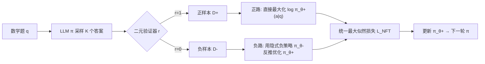

# NFT: Bridging Supervised Learning and Reinforcement Learning in Math Reasoning

**会议**: ICLR 2026  
**arXiv**: [https://openreview.net/forum?id=ujBrsQm6Zu](https://openreview.net/forum?id=ujBrsQm6Zu)  
**代码**: [https://research.nvidia.com/labs/dir/Negative-aware-Fine-Tuning](https://research.nvidia.com/labs/dir/Negative-aware-Fine-Tuning)  
**领域**: LLM 推理 / 后训练算法  
**关键词**: 数学推理, 负样本利用, 监督学习, 强化学习, GRPO, 隐式策略  

## 一句话总结
NFT（Negative-aware Fine-Tuning）证明监督学习也能做"验证驱动"的自我提升：通过给负样本构造一个由目标正策略隐式参数化的负策略，把所有自生成答案（对的和错的）统一进最大似然训练，性能追平甚至超过 GRPO/DAPO，并在严格 on-policy 下与 GRPO 梯度完全等价。

## 研究背景与动机
- **领域现状**：LLM 数学推理近年的飞跃来自从"模仿"到"自我提升"的范式切换——只需题目 + 二元验证器（判对错）即可训练，不再依赖人工参考答案。这一范式几乎被默认是强化学习（RL）的专属：PPO、GRPO 天生为最大化奖励信号设计，二元正确性正好当奖励用。
- **现有痛点**：监督学习（SL）一侧最简单的 Rejection Fine-Tuning（RFT）只把验证器判对的正样本收集起来再做 SFT，直接丢掉所有负样本。这让模型只会"强化已经做对的"，无法"从错误中反思"——而后者被普遍认为是通往通用智能的关键能力，也是 SL 落后于 RL 的核心原因。
- **核心矛盾**：主流观点（Chu et al. 2025）认为 SL 天生只能记忆正样本，无法从负反馈学习，因此自我反思式提升是 RL 的独有优势。但 RL 与 SL 真的有本质鸿沟吗，还是只是 SL 一直没找到用负样本的方法？
- **本文目标**：在监督学习范式内实现"利用负反馈的自我提升"，并从理论上厘清 SL 与 RL 在二元反馈学习系统中的真实关系。
- **核心 idea**：**【隐式负策略】** 不丢弃负样本，而是给负样本数据构造一个隐式负策略 $\pi_\theta^-$，它与我们真正想优化的正策略 $\pi_\theta^+$ 通过老策略 $\pi_{old}$ 紧密耦合——于是"在负样本上做最大似然训练负策略"等价于"直接优化正策略"，所有生成都能用，全程只需维护单个模型。

## 方法详解

### 整体框架
NFT 把一次在线迭代拆成两步：**数据收集**——LLM 对每道题采样 $K$ 个答案，验证器打二元标签 $r\in\{0,1\}$，分成正子集 $D^+$ 与负子集 $D^-$；**策略优化**——对正样本像 RFT 一样做监督最大似然，对负样本则通过隐式负策略反推回正策略，两路损失合一后用最大似然统一优化目标 LLM $\pi_\theta^+$。

### 关键设计

**1. 策略分裂恒等式：让正负策略相互锁定。** NFT 的全部根基是一条由贝叶斯规则推出的耦合关系。把目标正策略写成 $\pi^+(a|q)=\pi(a|q,r{=}1)$、负策略写成 $\pi^-(a|q)=\pi(a|q,r{=}0)$，二者与老策略满足线性组合 $r_q\,\pi^+(a|q)+(1-r_q)\,\pi^-(a|q)=\pi_{old}(a|q)$，其中 $r_q=p(r{=}1|q)$ 是模型在该题上的正确率，实践中用 $\hat r_q=\text{mean}\{r_{1:K}\}$ 估计。这个恒等式意味着：一旦 $\pi_{old}$ 和 $r_q$ 已知，"塑造负策略"就等于"反向塑造正策略"，为从负样本反推正策略提供了数学许可。

**2. 隐式负策略：把负样本训练重写成正策略优化。** 直接训练负策略没意义，关键是用上面的恒等式把 $\pi_\theta^-$ 重参数化为目标正策略 $\pi_\theta^+$ 的函数：$\pi_\theta^-(a|q):=\dfrac{\pi_{old}(a|q)-r_q\,\pi_\theta^+(a|q)}{1-r_q}$。于是在负样本 $D^-$ 上对 $\pi_\theta^-$ 做最大似然 $\max_\theta \mathbb{E}_{\pi^-}[\log\pi_\theta^-(a|q)]$，根据定理 3.1，在无限数据/容量下最优解恰好满足 $\pi_\theta^{+*}=\pi^+$——即训练隐式负策略直接收敛到我们想要的正策略。这是 NFT 区别于 RFT 的本质："丢弃负样本"变成了"负样本也在优化同一个正策略"。

**3. 统一最大似然损失 + token 级稳定化。** 合并正负两路得到实用目标：对正样本 $r=1$ 最大化似然比 $R_\theta^t(q,a)=\pi_\theta^+(a_t|q,a_{<t})/\pi_{old}(a_t|q,a_{<t})$ 的对数，对负样本 $r=0$ 最大化隐式负似然比 $\log\frac{1-\hat r_q R_\theta^t}{1-\hat r_q}$。论文给出实践版本：
$$L_{NFT}=-\sum_{q,a,r}\omega(q)\sum_t\Big[r\log R_\theta^t+(1-r)\log\,\text{maxv}\big(\tfrac{1-\hat r_q R_\theta^t}{1-\hat r_q},\,\epsilon\big)\Big]$$
三个工程要点缺一不可：**token 级损失**把每个 token 当独立单元求和，避免序列似然随长度积累导致的高方差与数值不稳；**负似然比截断**——负路对数的自变量必须为正，当 $R_\theta^t$ 未优化时可能为负引发崩溃，故强制下界 $\epsilon>0$ 并用直通梯度（straight-through）保留梯度流；**难题加权** $\omega(q)$ 给低正确率的难题更高权重，既聚焦信息量大的样本，又正好让 NFT 对齐 GRPO 系列。

**4. 与 GRPO 的等价性：揭穿 SL/RL 的鸿沟。** 论文对比 NFT 与 GRPO 的损失梯度（命题 4.1），发现 GRPO 那个被当作经验技巧的"组内优势归一化"$\hat A_q$ 其实已隐含在 NFT 损失里——取 $\omega(q)=\sqrt{(1-\hat r_q)/\hat r_q}$ 时正负优势恰为 $A_q^+=\sqrt{(1-\hat r_q)/\hat r_q}$、$A_q^-=-\sqrt{\hat r_q/(1-\hat r_q)}$，与 GRPO 一致。命题 4.2 进一步证明在严格 on-policy（$R_\theta^t=1$）下二者梯度完全相等；唯一差异在 off-policy 的梯度截断策略：GRPO 在偏离老策略时直接把梯度清零，NFT 则用更"软"的衰减。调整 $\omega(q)=1-\hat r_q$ 还能让 NFT 对齐 Dr. GRPO。这从根上说明 SL 与 RL 在二元反馈系统中是同一枚硬币的两面。

## 实验关键数据

设置：在 Qwen2.5-Math-7B 与 Qwen2.5-32B 上做在线微调，数据集 DAPO-Math-17k，约 5000 梯度步、batch 512、温度 1.0；在 AIME24/25、AMC23、MATH500、OlympiadBench、Minerva Math 六个基准上评测平均准确率。

### 主实验表格（7B / 32B 平均准确率）

| 模型 / 算法 | AIME24 | MATH500 | AIME25 | AMC23 | Olympiad | Minerva | Average |
|---|---|---|---|---|---|---|---|
| Qwen2.5-Math-7B（基座） | 13.3 | 69.0 | 5.5 | 45.8 | 34.7 | 21.3 | 31.6 |
| + DPO | 29.8 | 79.8 | 13.8 | 83.2 | 48.0 | 39.0 | 48.9 |
| + GRPO | 30.2 | 80.4 | 17.1 | 79.5 | 51.8 | 38.2 | 49.5 |
| + Dr. GRPO | 31.8 | 83.4 | 15.7 | 80.2 | 49.6 | 38.2 | 49.8 |
| + DAPO | 33.1 | 81.6 | 18.7 | 85.0 | 49.9 | 39.3 | 51.2 |
| + RFT（SL 基线） | 33.7 | 79.8 | 13.4 | 79.7 | 44.3 | 38.6 | 48.3 |
| **+ NFT（本文）** | 32.0 | **83.2** | 18.3 | **88.5** | 47.3 | **40.8** | **51.7** |
| Qwen2.5-32B（基座） | 4.1 | 68.6 | 1.0 | 45.0 | 31.1 | 27.9 | 29.6 |
| + DAPO | 44.1 | 89.2 | 33.4 | 90.9 | 54.1 | 47.5 | **59.9** |
| + RFT | 29.9 | 86.2 | 19.1 | 92.4 | 45.3 | 44.1 | 52.8 |
| **+ NFT（本文）** | 37.8 | 88.4 | 31.5 | **93.8** | **55.0** | **48.9** | 59.2 |

7B 上 NFT 平均 51.7 反超 DAPO（51.2）与所有 RL 算法；32B 上 NFT 59.2 几乎追平 DAPO 59.9，远超同为 SL 的 RFT（52.8）。

### 消融实验表格

| 消融项 | 设置对比 | 结论 |
|---|---|---|
| 难题加权 $\omega(q)$ | 常数 1 / $1-\hat r_q$ / $\sqrt{(1-\hat r_q)/\hat r_q}$ | 后两者（对齐 Dr.GRPO/GRPO）表现相近且都优于常数加权 |
| 负似然比截断 $\epsilon$ | 0.1 → 4.0 | $\epsilon\to 0$ 过度惩罚错误反而掉点，默认 $\epsilon=1.0$ 最稳 |
| 正/负数据贡献（32B） | RFT 正样本 vs NFT 负样本 | 正样本贡献约 80% 增益，负样本贡献剩余 20% |

### 关键发现
- **负反馈带来探索与提升**：NFT 持续显著超过 RFT；RFT 训练中熵单调下降，而 NFT/DAPO 鼓励熵上升，意味着更强探索，可能是 NFT 优于 RFT 的原因。
- **模型越大负反馈越重要**：32B 上 RFT 与 NFT 的差距比 7B 拉得更快，呼应 DeepSeek-R1 观察——大模型已记忆充分，"从错误中反思"成为新瓶颈。
- **on-policy 下 NFT≈GRPO**：训练曲线收敛速度与终点和 DAPO 持平，印证理论等价性。

## 亮点与洞察
- **概念去魅**：把"自我反思是 RL 专属"这一流行论断证伪——只要会用负样本，纯 SL 也能做验证驱动的自我提升。
- **理论桥梁**：首次给出 SL（NFT）与 RL（GRPO）在严格 on-policy 下梯度等价的证明，并解释了 GRPO 组归一化为何"碰巧"有效——它其实隐含在最大似然目标里。
- **工程极简**：全程单模型、无需 critic/参考模型，老策略似然在生成时即可预计算，内存开销与 RFT 相当却拿到 RL 级性能。
- **可扩展性**：损失天然支持连续奖励 $r\in[0,1]$，收敛性质不变，不局限于二元验证。

## 局限与展望
- 实验集中在数学推理 + Qwen 系列，对代码、通用推理、其他模型族的迁移性未验证。
- 负样本只贡献约 20% 增益，"如何更充分地利用负反馈"仍是开放问题——当前隐式负策略可能没榨干负样本的价值。
- off-policy 下 NFT 与 GRPO 的软/硬截断差异对最终性能影响缺乏更细致的实验拆解。
- $\hat r_q$ 用 $K$ 个采样估计，当 $K$ 小或题目极难/极易（被 prompt filtering 过滤）时估计噪声对训练稳定性的影响未充分讨论。

## 相关工作与启发
- **RLVR 谱系**：相比依赖奖励模型模拟人类反馈的传统 RLHF，RLVR（GRPO、DAPO、Dr. GRPO）转向 ground-truth 验证器提供可靠二元监督；NFT 把这条线"翻译"回 SL 侧。
- **隐式模型参数化**：用策略网络隐式定义另一个模型以实现直接优化，与 DPO 的隐式奖励模型、视觉生成里的隐式条件/残差模型一脉相承，是 NFT 隐式负策略的思想来源。
- **启发**：当一类方法（RL）被认为有"独家能力"时，往往不是范式本质差异，而是另一范式（SL）缺了某个关键机制（这里是负样本利用）；找到那个缺失机制即可统一两者，这种"梯度对齐式"分析值得推广到偏好学习、对齐等其他场景。

## 评分
- **新颖性**: ⭐⭐⭐⭐⭐ — 隐式负策略 + SL/RL 梯度等价证明是真正打通两个范式的原创贡献，概念冲击力强。
- **实验充分度**: ⭐⭐⭐⭐ — 7B/32B 双规模、多基准、多随机种子、完整消融，扎实；但局限于数学 + Qwen，跨域验证不足。
- **写作质量**: ⭐⭐⭐⭐⭐ — 从恒等式到隐式策略到等价性层层递进，图 1 谱系图与图 4 梯度对比把抽象理论讲得很清楚。
- **价值**: ⭐⭐⭐⭐⭐ — 既给出可落地的单模型高性能后训练算法，又在理论上澄清了 SL/RL 之争，对整个 LLM 后训练社区有指导意义。

<!-- RELATED:START -->

## 相关论文

- [\[ICLR 2026\] Learning to Reason over Continuous Tokens with Reinforcement Learning (HyRea)](learning_to_reason_over_continuous_tokens_with_reinforcement_learning.md)
- [\[ICLR 2026\] Emergent Hierarchical Reasoning in LLMs through Reinforcement Learning](emergent_hierarchical_reasoning_in_llms_through_reinforcement_learning.md)
- [\[ICLR 2026\] Learning What Reinforcement Learning Can't: Interleaved Online Fine-Tuning for Hardest Questions](learning_what_reinforcement_learning_cant_interleaved_online_fine-tuning_for_har.md)
- [\[ICLR 2026\] Generative Adversarial Reasoner: Enhancing LLM Reasoning with Adversarial Reinforcement Learning](generative_adversarial_reasoner_enhancing_llm_reasoning_with_adversarial_reinfor.md)
- [\[ICLR 2026\] Temperature as a Meta-Policy: Adaptive Temperature in LLM Reinforcement Learning](temperature_as_a_meta-policy_adaptive_temperature_in_llm_reinforcement_learning.md)

<!-- RELATED:END -->
