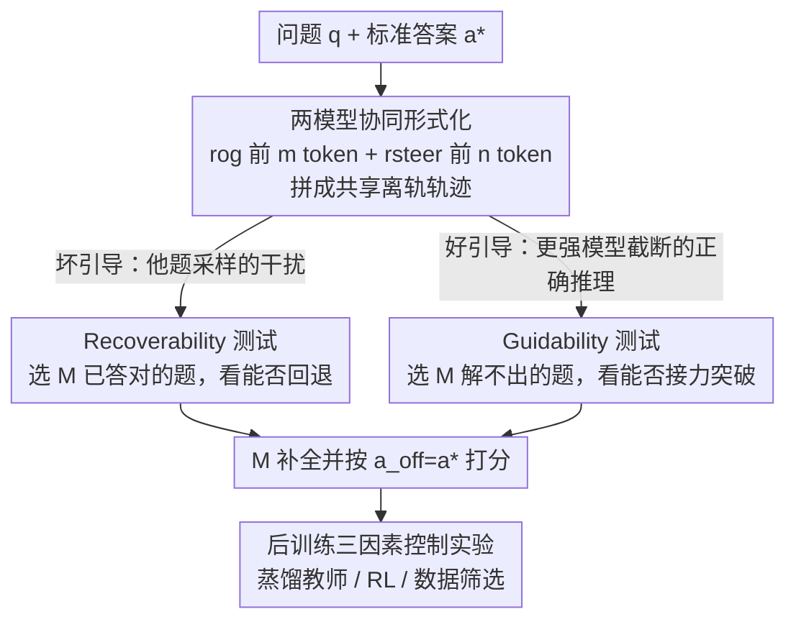

# Off-Trajectory Reasoning: Can LLMs Collaborate on Reasoning Trajectories?

**会议**: ICLR 2026  
**OpenReview**: [https://openreview.net/forum?id=hVUIguIm14](https://openreview.net/forum?id=hVUIguIm14)  
**代码**: 无  
**领域**: LLM推理  
**关键词**: 离轨推理, 多模型协同, 可恢复性, 可引导性, 蒸馏迁移

## 一句话总结
这篇论文提出"离轨推理"（off-trajectory reasoning）这一新问题——多个推理模型能否在同一条思维链上接力协作——并设计 Recoverability / Guidability 这对"双生测试"系统评估了 15 个开源推理 LLM，发现 benchmark 越强的模型反而越容易被干扰跑偏，且几乎所有模型都无法利用更强模型给出的正确引导突破自身能力上限。

## 研究背景与动机
**领域现状**：以 OpenAI o 系列、DeepSeek-R1、Qwen3-Thinking 为代表的推理 LLM 都通过 RLVR 或蒸馏学会"把思考过程显式说出来"（verbalize），这种透明性带来一个诱人的方向：既然模型已经能把工具输出、代码执行结果、检索文档这些"别人产生的 token"穿插进自己的推理里，那多个推理器能不能干脆直接在**同一条共享思维链**上协作？例如让大模型主攻难推导、把算术核对甩给小模型（效率），或让互补专长的模型分叉探索（探索），或让监管者中途把推理掰向安全方向（安全）。

**现有痛点**：今天绝大多数 LLM 都是被训练成"独自从头推到尾"——作者称之为 solo-reasoning（独立推理）。但协作要求主模型 M 处理一条**同分布与离分布 token 混合**的轨迹 $r = [r_M, r_{M'}, r_{M''}, \dots]$，这是一种全新的能力需求，标准 solo-reasoning 训练管线从未针对它优化过。

**核心矛盾**：benchmark 分数衡量的是模型"自己一个人能解多少题"，但协作能力衡量的是"模型在别人的部分思考上能否正确判断有用性并接着往下推"。这两者是否一致，此前完全没人系统测过——很可能存在一道被 benchmark 优化掩盖的隐藏裂缝。

**本文目标**：把"离轨推理能力"拆成两个互补的子问题——模型能否从误导性引导中**回退**（抵抗坏 token）、能否在更强模型的**正确引导**上接力突破自身上限（吸收好 token）——并给出一个可自动构造数据、可扩展的评测协议。

**切入角度**：作者把任意复杂的多模型协作简化成"两模型协作"，并用同一个模型在不同问题上采样出的轨迹来人造干扰/引导，从而把"被别人影响后的表现"与"模型自身能力"干净地解耦开。

**核心 idea**：用一对走极端的"双生测试"（Recoverability 测最坏的干扰、Guidability 测最好的引导）来正交地刻画离轨推理能力，并进一步做控制实验，追查蒸馏教师、RL、数据筛选这三个后训练决策如何塑造这种能力。

## 方法详解

### 整体框架
本文不提出新模型，而是提出一个**评测框架 + 受控分析**。核心对象是主模型 $M$ 在一条"半截自己写、半截别人插"的轨迹上的补全表现。给定问题 $q$ 与标准答案 $a^*$，框架先从 $M$ 采样得到其独立推理轨迹 $r$ 并截取前 $m$ 个 token 作为原始段 $r_{og}$，再构造一段长度为 $n$ 的引导段 $r_{steer}$，把两段拼成一条共享离轨轨迹，最后让 $M$ 在此条件下补全并打分：

$$(r_{off}, a_{off}) \sim M(\cdot \mid q, [r_{og}, r_{steer}])$$

成功与否以最终答案 $a_{off}$ 是否等于 $a^*$ 衡量。$r_{steer}$ 落在两个极端时，框架分裂成 Recoverability（坏引导）和 Guidability（好引导）两条评测线；最后再用控制实验追问"什么后训练决策决定了这两条线的表现"。整体流向如下：

### 关键设计

**1. 两模型协同的离轨形式化：把"接力推理"压成可测的拼接轨迹**

要测"模型能否在别人的思考上接力"，难点在于真实协作千变万化、无法标准化。作者把它简化成两模型协作：主模型 $M$ 贡献原始段 $r_{og}$，协作者 $M_{steer}$ 贡献引导段 $r_{steer}$，二者拼成 $[r_{og}, r_{steer}]$ 后交给 $M$ 续写。$r_{og}$ 通过对 $M$ 的 solo 轨迹截断到前 $m$ 个 token 得到（且总在最近句末截断以保持语义连贯），$r_{steer}$ 截断到 $n$ 个 token。两个旋钮 $m$（插入位置）和 $n$（引导强度）让作者能扫描不同"被插入的早晚"和"被插入的多少"。这个形式化的巧妙处在于：它把无穷复杂的协作压缩成一个**两参数可控、可自动批量构造**的探针，而且对数学/代码这类可验证奖励任务，成败判定是客观的。

**2. Recoverability 测试：用模型自己制造的"强干扰"逼它回退**

这条线针对"模型会不会被带偏"这个痛点。作者只挑选 $M$ 在 solo 模式下**本来就能答对**的题（$a = a^*$），这样一旦答错就能干净地归因于干扰、而非模型本身不会做。难点在于：怎么制造一个对 $M$ 真正有杀伤力的干扰？事先无法预知哪个 $M_{steer}$、哪段 $r_{steer}$ 会奏效。作者的解法很妙——**让 $M$ 在另一道题 $q'$ 上采样出轨迹 $r'$，截取其前 $n$ 个 token 当干扰**。因为这段推理来自一道完全不同的题，若 $M$ 盲目顺着它写下去，结论必然是错的；于是"模型能否答对"就等价于"模型能否识破这段离题推理并回退到自己原来的正确思路"。默认设 $n = 0.2 \times |r'|$，并扫描插入位置 $m \in \{0, 0.2, 0.4, 0.6, 0.8\}\times |r|$。

**3. Guidability 测试：把更强模型的正确推理截半，看主模型能否接得住**

这条线测的是"好的引导能不能被吸收"。作者反过来挑选 $M$ **靠自己几乎解不出**的题（8 次采样中 solve rate 为 0 或 1），这样任何提升都只可能来自引导。两个关键设置：其一，**令 $m = 0$**，即不放 $M$ 自己的原始段——因为 $r_{og}$ 可能本身就含错误、会把 $M$ 锚到歪路上，混淆对"可引导性"的测量；引导直接放在思考最开头。其二，$r_{steer}$ 来自一个 benchmark 更高的更强模型 $M_{steer}$（用 DeepSeek-R1、Qwen3-235B、QwQ-32B 等），且只给其完整正确轨迹的前 $n$ 个 token（$n$ 取 $0.2/0.4/0.6/0.8$ 比例），看主模型能否在"正确但不完整"的引导上续完。作者还特意检查了引导段是否已经"剧透"答案：发现平均 18.6% 的引导段已含正确答案，扣掉这部分后真实可引导性更低。

**4. 后训练三因素控制实验：把"为什么有的模型更稳"追到训练配方**

第 3 节发现 benchmark 相近的模型离轨稳健性可以天差地别，但那些模型基座、数据、配方全不一样，无法定因。作者于是做了三组受控实验，全部固定在数学 benchmark 上：(a) **蒸馏教师**——用 AM-32B / QwQ-32B / Qwen3-32B 三个教师分别蒸馏 Qwen2.5-1.5B/3B，且**只用教师的正确轨迹**；(b) **RL**——拿 SFT 已饱和（step 400）的 AM-Distill 检查点作初始策略，用 GRPO 在 MATH8K 上继续训；(c) **数据筛选**——对比 FULL-8K 与 LIMO-600/800 这种"少而精"数据。这三组实验把单一因素隔离出来，直接回答"是什么后训练决策在塑造可恢复性/可引导性"。

### 一个完整示例
以 Recoverability 为例走一遍：主模型 $M$ 拿到题"求解 $x = \sqrt{11 - 2x} + 4$"，它自己能解对（$x = 5$）。框架取其前 40% 的思考作为 $r_{og}$（已开始平方两边、移项），然后从 $M$ 在另一道"碳-14 测年最大年龄"题上的推理里截一段插进来当 $r_{steer}$——这段在讨论"半衰期 5730 年""最大年龄 350 年"，与原题毫不相干。把 $[r_{og}, r_{steer}]$ 拼好交回 $M$ 续写：若 $M$ 写出一句"Wait. Let me check my calculation…"识破跑题并退回平方求解，就能答对（recovered）；若被带着算碳测年，则答错。统计这样一批题里能回退的比例，就是 recoverability 分数。

## 实验关键数据

### 主实验
评测 15 个开源模型（1.5B–32B），数学 5 个 benchmark 共 1507 题、代码 4 个 benchmark 共 1762 题，每题采样 8 次取 Pass@1。recoverability 分 shared（15 个模型都能 8/8 解出的题）与 individual 两个子集。

| 模型 | 家族 | Benchmark Avg. | 数学 Recover.(Sh.) | 数学 Guidab.(Sh.) |
|------|------|------|------|------|
| Qwen3-1.7B | Qwen3 | 59.9（低档） | **98.4** | 6.1 |
| OpenThinker3-1.5B | QwQ | 59.2（低档） | 95.2 | 5.7 |
| Qwen3-32B | Qwen3 | 81.0（高档） | 71.8 | N/A |
| AM-Thinking-32B | Comm. | **82.6（最高）** | **33.4** | N/A |
| LIMO-32B | Comm. | 67.3（中档） | 29.3 | 8.8 |

数学 shared 子集平均 recoverability 仅 74.9%（相对原始 100% solve rate 掉了 25.1 个百分点）；代码更低，平均 59.1%。Guidability 上数学没有任何模型超过 9.2%（shared）。

### 消融与分析

| 分析 | 关键指标 | 说明 |
|------|---------|------|
| 干扰插入位置（Fig.4） | 0% 处退化最严重 | 越靠开头插干扰越致命，远超 20% 位置 |
| 保留首段重述题面 | 平均 recover. >83.5% | 仅保留原始首段（复述题目）就大幅回血 |
| Guidability 去剧透（Table 2） | Teach. 26.7 → 扣答案后 18.6 含答案 | 平均 18.6% 引导段已含正确答案，真实可引导性更低 |
| 蒸馏教师（§4.1） | AM-Distill 显著低于 QwQ/Qwen3-Distill | 仅用正确轨迹蒸馏，step 300 后差距显著（p≤.005） |
| RL after SFT（§4.2） | recover. +15.3~28.9% | GRPO 在 SFT 饱和后仍大幅提升可恢复性 |
| LIMO 少数据（§4.3） | recover. 高方差 | "少而精"数据令可恢复性在相近 benchmark 下剧烈波动 |

### 关键发现
- **benchmark 强 ≠ 协作强**：数学第一名 AM-Thinking-32B（82.6%）recoverability 倒数第二（33.4%），而小模型 Qwen3-1.7B（59.9%）高达 98.4%——重度 benchmark 优化的模型可能藏着离轨脆弱性。
- **存在一道"可引导性天花板"**：所有数学模型都几乎无法利用更强模型的正确引导突破自身上限，即便配对的是自己的蒸馏教师也不行；很多看似有效的引导其实是因为引导段已剧透答案，而模型常常**还认不出这段正确推理、反而否定它跑去错的方向**。
- **推理开头至关重要**：模型在开头往往只是复述题目、几乎没有实质求解，但偏偏在 0% 处被干扰退化最严重——说明"复述题面"是模型锚定后续推理的关键，仅保留首段就能把平均 recoverability 拉到 83.5% 以上。
- **教师的脆弱性会经蒸馏遗传给学生**，哪怕训练数据全是正确轨迹——说明脆弱性编码在**推理风格**里而非单条解答的对错；因此双生测试可作为挑选蒸馏教师的额外标准（不只看正确率）。
- **RL 能补 SFT 的短板**：SFT 只见成功示范、教模型"对的推理长什么样"；RL 会暴露失败轨迹并显式奖励"纠错恢复"，因此能在 SFT 饱和后把 recoverability 缺口补平。

## 亮点与洞察
- **"用模型自己造干扰"是整套评测最巧的一笔**：从同一模型在他题上的推理截一段当干扰，天然保证"盲从即错"，把"被干扰"和"本来不会"彻底解耦——比随便找个外部坏 prompt 干净得多。
- **把协作问题降维成两参数 $(m, n)$ 探针**：插入位置与引导长度两个旋钮，就能扫出"开头最脆弱""引导多少才有用"这些细粒度结论，可复用到任何可验证任务。
- **"剧透校正"这个 caveat 很诚实**：作者主动揭穿了 guidability 被引导段含答案虚高的事实，并量化为 18.6%，避免把假象当成能力。
- **脆弱性藏在推理风格而非答案对错**——这个洞察可直接迁移到数据/教师筛选：选蒸馏教师时除了看正确率，还该看它的离轨稳健性。

## 局限与展望
- 实验只做了"两模型协作"这一最简化设定，真实的多模型、多轮交替协作、人在回路监管尚未覆盖。
- 只系统测了**推理正确性**这一个维度；框架虽可扩展到安全等对齐维度（如能否稳健拒绝不安全的协作者轨迹），但本文未实证。
- 横向比较需谨慎：数学与代码的 recoverability/guidability 不能直接比大小，任务难度与可验证性不同；guidability 的数学/代码差异也部分源于代码引导段更易剧透。
- RL 为何能补 recoverability 只给了"暴露失败轨迹+奖励纠错"的假说，机制层面留待未来工作。

## 相关工作与启发
- **vs 标准 solo-reasoning benchmark**：现有 benchmark 测"自己解题"，本文测"在别人思考上接力"，二者正交——本文证明前者高分不蕴含后者强，提供了一个被忽视的评测维度。
- **vs 推理子步卸载 / 元思考编排等协作方法**（Akhauri、Yan、Wan 等）：那些工作直接构造协作系统并报收益，本文退一步问"现成 solo 模型到底具不具备协作的前提能力"，给出的是诊断而非新系统。
- **vs LIMO「少即是多」假说**：LIMO 主张极少高质量数据即可激发推理，本文发现这种数据会让 recoverability 出现高方差——"少而精"在离轨稳健性上可能并不稳。

## 评分
- 新颖性: ⭐⭐⭐⭐⭐ 首次把"离轨推理"形式化为问题，并用双生测试给出可操作的评测框架
- 实验充分度: ⭐⭐⭐⭐⭐ 15 个模型×数学/代码双域 + 三因素受控蒸馏/RL/数据实验，证据链完整
- 写作质量: ⭐⭐⭐⭐ 概念清晰、图示直观，个别协议细节需翻附录
- 价值: ⭐⭐⭐⭐⭐ 揭示 benchmark 与协作能力脱节，对多智能体推理与蒸馏教师选择有直接指导

<!-- RELATED:START -->

## 相关论文

- [\[ICLR 2026\] Rethinking LLM Reasoning: From Explicit Trajectories to Latent Representations](rethinking_llm_reasoning_from_explicit_trajectories_to_latent_representations.md)
- [\[ICLR 2026\] When Silence is Golden: Can LLMs Learn to Abstain in Temporal QA and Beyond?](when_silence_is_golden_can_llms_learn_to_abstain_in_temporal_qa_and_beyond.md)
- [\[ICLR 2026\] The Path of Least Resistance: Guiding LLM Reasoning Trajectories for Efficient Consistency](the_path_of_least_resistance_guiding_llm_reasoning_trajectories_for_efficient_co.md)
- [\[ICLR 2026\] The Path of Least Resistance: Guiding LLM Reasoning Trajectories with Prefix Consensus](the_path_of_least_resistance_guiding_llm_reasoning_trajectories_with_prefix_cons.md)
- [\[ICLR 2026\] A Simple "Motivation" Can Enhance Reinforcement Finetuning of Large Reasoning Models](a_simple_motivation_can_enhance_reinforcement_finetuning_of_large_reasoning_mode.md)

<!-- RELATED:END -->
