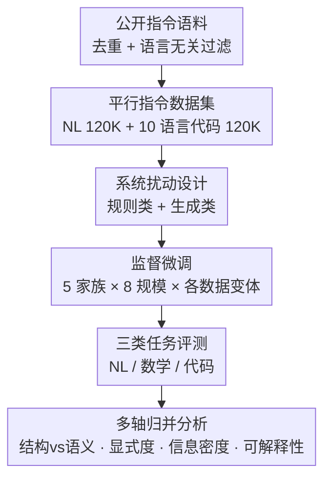

# On Code-Induced Reasoning in LLMs

**会议**: ICLR 2026  
**OpenReview**: [https://openreview.net/forum?id=LIv0bfJZIi](https://openreview.net/forum?id=LIv0bfJZIi)  
**代码**: 待确认（论文提供 Code / Data 链接）  
**领域**: LLM推理  
**关键词**: 代码训练数据, 推理能力, 受控扰动, 数据中心分析, 监督微调

## 一句话总结
这篇论文用一套数据中心的受控实验框架（10 种编程语言的平行指令数据 + 十余种结构/语义扰动 + 5 个模型家族 8 个规模、共 3,331 次实验），系统拆解"代码数据到底是哪一部分在帮助 LLM 推理"，得出结论：真正关键的是代码的**结构性骨架**而非冗长的表层细节，伪代码/流程图等抽象能等价替代代码，甚至被破坏的代码只要保留表层规律性仍然有效。

## 研究背景与动机
**领域现状**：近几年大量工作发现，在预训练或后训练阶段加入代码数据，能提升 LLM 在数学、逻辑等"和编程无关"的推理任务上的表现。普遍的解释是：代码具有逻辑一致性、组合式结构、相比自然语言更少的歧义，这些性质给模型提供了有益的推理信号。

**现有痛点**：但这些解释停留在"假设"层面——没人真正搞清楚到底是代码的**哪一种具体属性**在起作用：是语法的规整性（syntactic regularity）？是结构化的抽象（structural abstraction）？还是某种语言风格（linguistic style）？由于代码是多种属性的混合体，过去的对照实验无法把它们拆开单独归因。

**核心矛盾**：要做因果归因，必须能在"只改变某一个属性、其他保持不变"的前提下做对照——而真实代码语料天然把语法、语义、注释、缩进等纠缠在一起，无法直接分离。

**本文目标**：构造一套可控的实验设计，把代码的结构属性与语义属性逐个剥离/破坏，观察每种破坏对下游推理的影响，从而回答三个 RQ：(1) 加代码微调是否真的提升推理；(2) 各类扰动如何影响表现；(3) 不同编程语言带来的差异。

**切入角度**：从"平行数据 + 受控扰动"出发——先造一份内容对齐的自然语言版与代码版指令数据，再对代码版施加一系列只破坏某一属性的扰动，把每个扰动单独微调一个模型，用大规模实验当"显微镜"逐一观测。

**核心 idea**：把"代码为什么帮推理"变成一个可做消融的数据工程问题——通过受控扰动单独关掉代码的某个属性，看推理掉多少，从而定位真正起作用的成分。

## 方法详解

### 整体框架
整篇工作不是提出一个新模型，而是搭建一条"数据中心"的实验流水线，目标是把"代码的哪个属性帮推理"拆成可测量的对照。整体分三步串行：先**构造平行指令数据**（一份 12 万条的自然语言版 + 一份 12 万条、覆盖 10 种编程语言的代码版），再对代码版施加一整套**受控扰动**（规则类 + 生成类，每种扰动只破坏代码的某一属性、且不改变样本数量），最后把每个数据变体各自**监督微调**出一个模型，在自然语言、数学、代码三类任务上评测，并把扰动按四个分析轴归并解读。

### 关键设计

**1. 平行指令数据集：把"代码 vs 自然语言"放到同一内容、可比的天平上**

要判断"代码"相对"自然语言"的增益来自哪里，前提是两份数据传达的信息量可比、只是表达形式不同。作者构造两份各 12 万条的指令-回答对：自然语言版从 OpenHermes 2.5 采样并剔除 coding/agent/summarization 等类别、只留英文通用指令；代码版聚合多份代码指令语料，先做精确去重、再过滤掉绑定特定语言或领域的指令（如"把这段代码从 Python 翻译到 Java"、含 SQL/HTML/webpage 的题），然后用 GPT-4o-mini 为每条指令生成 10 种主流语言（Java/JavaScript/PHP/Python/C#/TypeScript/C/C++/Go/Rust）的答案，按 20 套语言指定模板随机套用，最终采样 12 万条、十种语言均匀分布。为保证代码不是"伪代码"，作者对全部样本做语法/编译检查（如 Python 用 `ast.parse`、C 用 `gcc -fsyntax-only`、Java 用 `javac`），平均通过率 82.59%（Python 99.25%、TypeScript 最低 64.08%）。这份"内容对齐、形式不同"的平行数据，是后续一切对照的地基。

**2. 双类系统扰动：每次只破坏代码的一个属性，把结构与语义剥离开**

这是论文的方法核心——通过精心设计的扰动，单独"关掉"代码的某一属性，且**不改变数据集样本数量**，从而把表现变化干净地归因到被破坏的那一项。扰动分两大类。**规则类（确定性变换）**有五种：去除全部空白（测模型是否依赖缩进/视觉分块这类格式线索，对 Python 这种缩进有语义的语言尤其敏感）、变量重命名为 `var_i` 占位符（抹掉标识符携带的语义，如 `counter`、`isSorted`）、关键字替换（把 `if`/`return`/`def` 等保留字换成无意义 token 或换成"真实但语义无关的非英文词"，破坏对熟悉语法构件的依赖）、注释移除、注释错位交换（局部乱序 / 全局从语料池随机替换，让文档与代码完全错配）。**生成类（GPT-4o-mini 改写）**有六种，在保留原意的前提下做语义等价的形式变换：注释增强（补高质量文档/行内注释）、注释混淆（写误导/荒诞/带 emoji 的假注释测抗噪）、伪代码（去掉具体语法只留 `IF...THEN`、`FOR EACH` 等控制流）、Markdown 流程图（用 Mermaid 画控制流图）、逐步自然语言解法（把代码写成编号的叙述步骤）、虚构语言代码（保留结构与控制流、但把所有语法/标识符换成生造 token，测模型是否靠表层熟悉度而非真语义）。作者还请两名标注者抽查 390 例验证扰动是否忠实，整体正确率 90%（规则类 ≈84%，生成类 ≈97%）。

**3. 多轴归并分析：把十余种扰动重组成四条可解读的对照轴**

单看每种扰动会很碎，作者的巧思是把它们按所探查的性质重新分组成四个分析轴，让结论可读：**结构 vs 语义**——结构类扰动改的是语法骨架/排版（去空白、伪代码、流程图），语义类改的是承载意义的 token（标识符、关键字、注释）；**结构显式度**——从可运行代码 → 破损但像代码 → 线性算法形式（伪代码）→ 图形抽象（流程图）→ 纯自然语言过程，沿"代码结构保留得多明确"排成谱系；**相对信息密度**——定义为 $\rho=\frac{\text{扰动数据集 token 数}}{\text{原始代码数据集 token 数}}$，衡量同样内容被压缩得多紧（流程图/伪代码强压缩，冗长重命名/增强文档反而增密）；**人类可解释性**——高（增强解释/可视脚手架）、中（局部小改、代码大体可读）、低（被遮蔽或带误导信号）。每条轴对应一个独立的科学问题，使"哪类破坏更伤推理"得以被定量回答。

**4. 大规模微调与评测：用规模和多样性把单点观察变成稳健趋势**

为避免结论只在某个模型上成立，作者用同一预训练 backbone、相同 SFT 目标 $\mathcal{L}_{\text{SFT}}=-\sum_{t=1}^{n}\log P_\theta(y_t\mid x,y_{<t})$，在每个数据变体上分别微调，横跨 5 个模型家族（Qwen3、LLaMA-3、Gemma3、OLMo2、SmolLM2）、8 个规模（0.6B–8B），并额外训练"单语言子集"模型（每语言约 1.2 万条）来回答 RQ3。评测分三类：自然语言与通用知识（常识/科学/逻辑/指令遵循，用准确率）、数学（GSM8K、HRM8K 用精确匹配，算术与 MMLU 数学子集用准确率）、代码理解与生成（因小模型常生成不可执行代码，弃用执行式评测，改用 GPT-4o-mini 先按指令生成实例级 1–10 评分量表、再当 judge 打分，并做跨 judge 一致性检验确认稳定）。全部加起来共 3,331 次实验，正是这个规模让"结构比语义更关键"这类趋势可信。

## 实验关键数据

### 主实验（RQ1：加代码微调是否提升推理）
以 Qwen3-4B-Base 为例，对比零样本、代码微调（code-ft）、自然语言微调（nl-ft）、50/50 混合（mixed-ft）：

| 任务 | zero-shot | nl-ft | mixed-ft | code-ft |
|------|-----------|-------|----------|---------|
| NL & 通用知识（acc） | 0.531 | 0.536 | 0.531 | **0.552** |
| 数学（acc/EM） | 0.553 | 0.661 | 0.584 | **0.745** |
| 代码理解（acc） | 0.570 | 0.529 | 0.545 | **0.621** |
| 代码生成（1–10 judge） | 7.033 | 6.943 | 7.576 | **8.454** |

跨 14 个模型 base，code-ft 或 mixed-ft 在 64% 的 NL 任务、86% 的数学与代码理解任务、以及**全部**代码生成任务上取得最佳；提高混合数据里代码占比通常进一步提升表现，数学对配比最敏感。

### 扰动分析（RQ2：四条分析轴的关键对照）

| 分析轴 | 关键对照 | 结论 |
|--------|---------|------|
| 结构 vs 语义 | 结构扰动 vs 语义扰动 vs 未扰动代码 | 结构扰动更伤，数学/代码尤甚（如 Qwen3-4B 数学 0.696 vs 0.729） |
| 结构显式度 | 可运行 → 伪代码/流程图 → 纯 NL 过程 | 伪代码/流程图常追平甚至超过原代码；纯自然语言过程最差 |
| 信息密度 $\rho$ | 强压缩 vs 近基线 vs 增密 | 强/中压缩常追平甚至超过基线（小模型更敏感，代码生成例外） |
| 人类可解释性 | 高 / 中 / 低（含误导信号） | 低可解释性掉点有限，常追平甚至超过中等——模型在利用残留的表层规律 |

### 关键发现
- **结构 > 语义**：破坏语法骨架/排版比破坏标识符、注释等含义 token 更伤推理，且随模型变大差距更明显——说明数学/代码任务更依赖格式与布局线索来组织推理。
- **抽象可替代代码**：伪代码、流程图这类突出算法结构、剥离表层语法的抽象，在多数任务上能等价甚至优于原始代码；但代码生成因需要可执行输出，仍偏好保留显式代码结构。
- **冗长无用，密度才重要**：强/中度的 token 压缩往往不掉点甚至更好，代码帮推理靠的不是冗长而是"用更少 token 高效保留关键信息"；唯独代码生成需要更多表层细节。
- **被破坏的代码仍有效**：低可解释性、含误导注释的变体也不会大幅掉点——模型能利用即便在噪声/晦涩形式下仍残存的表层规律和重复结构线索。
- **语言风格塑造任务增益**（RQ3）：Python 表层最接近自然语言、在 NL 任务上常居前；Java、Rust 等低层/系统语言在数学上常排前列（更丰富的结构细节有利数学推理）；单语言微调虽优于零样本但逊于多语言全量，说明代码生成受益于语言多样性。

## 亮点与洞察
- **把"玄学解释"变成可消融的数据实验**：过去"代码因为结构化/低歧义而帮推理"是定性假设，本文用"平行数据 + 单属性扰动 + 不改样本量"把它拆成可定量归因的对照，方法论本身就值得借鉴到任何"某类数据为何有用"的问题。
- **四条分析轴的归并很聪明**：十余种碎扰动若各说各话很难得结论，按结构/显式度/密度/可解释性重组后，每条轴对应一个清晰科学问题，使"结构最关键"这种洞见得以浮现。
- **反直觉结论有实践价值**：既然伪代码/流程图能替代代码、且压缩 token 不掉点，那训练数据完全可以用更省 token 的抽象表示来获得同等推理增益——这对数据 curation 和成本是直接的设计指引。
- **信息密度 $\rho$ 是个可复用指标**：把"同样内容压得多紧"量化成 token 比值，给"数据效率"提供了一个简单可算的刻画。

## 局限与展望
- 受算力限制只覆盖 0.6B–8B 的中小 base 模型，最大只微调到 8B，趋势能否外推到更大或 instruction-tuned 模型未验证。
- 扰动虽多但不穷尽，未覆盖代码复杂度、训练数据多样性等可能影响推理的因素。
- 人类评估仅抽查小子集（每扰动 30 例），未做全量校验，扰动忠实度在尾部仍有不确定性。
- 评测任务虽广，仍只覆盖推理谱系的一部分；代码评测依赖 GPT-4o-mini 作 judge，虽做了跨 judge 一致性检验，但 LLM-as-judge 的系统偏差难完全排除。
- 作者展望把框架推广到更大/指令模型、扩展到思维链与偏好优化场景，并把"抽象层级 + 信息密度"的发现落成自动化数据筛选流水线。

## 相关工作与启发
- **vs Lam et al. (2025) 代码扰动压力测试**: 同样用结构/语义扰动 stress-test LLM，发现小破坏会显著降低推理；本文更进一步，不止"测脆弱性"，而是用平行数据 + 多轴归并做**正向归因**，回答"哪个属性在起作用"并给出训练数据设计指引。
- **vs "To code or not to code" 等代码-推理协同工作**: 那类工作确认了加代码有益、强调代码的结构化与可验证性支持逻辑分解；本文把"有益"细化到"结构 > 语义、抽象可替代、密度比冗长重要"的可操作层面。
- **vs 数据影响类工作（Longpre et al. 2024、Zhang et al. 2024c 等）**: 它们研究数据年龄/组成/投毒对下游的系统影响；本文聚焦"代码这一种数据"的内部属性拆解，是数据中心视角在代码-推理子问题上的细粒度延伸。

## 评分
- 新颖性: ⭐⭐⭐⭐ 不是新模型，但"平行数据 + 单属性扰动 + 多轴归并"的因果归因框架在代码-推理问题上很新颖
- 实验充分度: ⭐⭐⭐⭐⭐ 5 家族 × 8 规模 × 10 语言 × 十余扰动、共 3,331 次实验，规模和对照都扎实
- 写作质量: ⭐⭐⭐⭐ RQ 驱动、分析轴清晰，结论一句话可复述
- 价值: ⭐⭐⭐⭐ 给"用什么形式的代码/抽象做推理训练数据"提供了直接可操作的设计原则

<!-- RELATED:START -->

## 相关论文

- [\[ICLR 2026\] Executable Counterfactuals: Improving LLMs' Causal Reasoning Through Code](executable_counterfactuals_improving_llms_causal_reasoning_through_code.md)
- [\[ICLR 2026\] Beyond Prompt-Induced Lies: Investigating LLM Deception on Benign Prompts](beyond_prompt-induced_lies_investigating_llm_deception_on_benign_prompts.md)
- [\[ICML 2026\] Is Code Better Than Language for Algorithmic Reasoning?](../../ICML2026/llm_reasoning/is_code_better_than_language_for_algorithmic_reasoning.md)
- [\[ICLR 2026\] AceReason-Nemotron 1.1: Advancing Math and Code Reasoning through SFT and RL Synergy](acereason-nemotron_11_advancing_math_and_code_reasoning_through_sft_and_rl_syner.md)
- [\[ICLR 2026\] Reasoning Scaffolding: Distilling the Flow of Thought from LLMs](reasoning_scaffolding_distilling_the_flow_of_thought_from_llms.md)

<!-- RELATED:END -->
