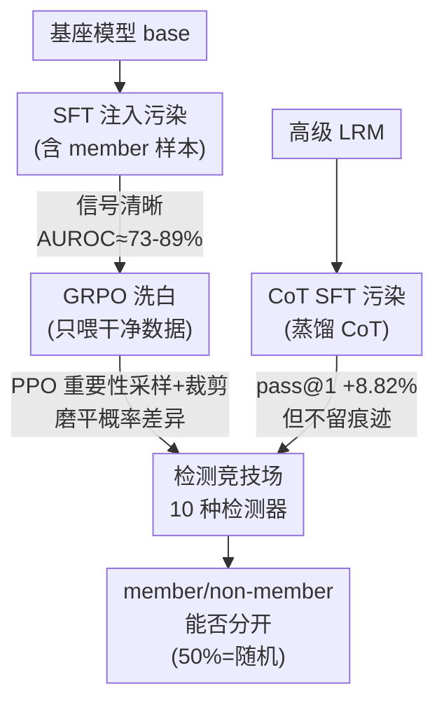

# On The Fragility of Benchmark Contamination Detection in Reasoning Models

**会议**: ICLR 2026  
**arXiv**: [2510.02386](https://arxiv.org/abs/2510.02386)  
**代码**: [https://github.com/ASTRAL-Group/LRM_Conta_Detection_Arena.git](https://github.com/ASTRAL-Group/LRM_Conta_Detection_Arena.git)  
**领域**: LLM推理  
**关键词**: 基准污染, 推理模型, GRPO, 检测脆弱性, 评估完整性

## 一句话总结
系统性研究发现 LRM 的基准污染检测极其脆弱：SFT 阶段引入的污染在经过 GRPO 训练后检测信号几乎消失（PPO 式重要性采样/裁剪是根因），而对高级 LRM 直接用 CoT 做 SFT 污染则几乎不留任何可检测痕迹，现有 10 种检测方法均接近随机猜测。

## 研究背景与动机

**领域现状**：LLM 排行榜已成为竞争舞台，模型开发者有动机将评估基准混入训练数据以获得虚高分数。已有多种污染检测方法（基于生成、扰动、参考模型等）。

**现有痛点**：
   - 现有检测方法设计时假设污染=记忆化（模型对见过的样本概率更高），但 LRM 通过 CoT 推理达到答案，检测器通常无法获取训练时的 CoT 数据
   - LRM 获取推理能力经历 SFT→RL 两阶段，开发者可在早期阶段（SFT）污染，后期（RL）训练"洗白"
   - 对高级 LRM 直接做 CoT SFT 污染的可检测性完全未知

**核心矛盾**：评估公平性依赖于污染可检测——但如果 RL 训练本身就能隐藏污染证据，且 CoT SFT 几乎不留痕迹，那么整个排行榜系统的完整性都受到威胁

**切入角度**：两个实际场景——Stage I: SFT 污染→RL "洗白"（base model→LRM）；Stage II: 对已有 LRM 直接 CoT SFT 污染（post-LRM）

**核心 idea**：GRPO/PPO 的重要性采样+裁剪目标函数会系统性地消除成员/非成员的可分离性，RL 训练是污染证据的天然"消毒器"。

## 方法详解

### 整体框架
本文不提出新检测器，而是搭建一个受控的"污染—洗白—检测"竞技场，拷问现有 10 种检测方法在推理模型（LRM）上是否还可靠。整体覆盖两个贴近真实的场景。Stage I 模拟开发者从基座模型（base model）出发，先用含污染样本的数据做监督微调（SFT），再用干净数据跑 GRPO 强化学习得到 LRM，观察检测信号在 RL 前后怎么变；Stage II 则直接对一个已经很强的 LRM 做思维链（CoT）SFT 污染，看检测器能不能抓到痕迹。两条线汇到同一套评估口径：把基准样本随机切成 member / non-member 两半，用 AUROC 衡量检测器区分两者的能力，50% 就等于随机猜测。

### 关键设计

**1. Stage I：GRPO 把 SFT 阶段的污染"洗白"**

这一阶段要回答的问题是：早期混进去的污染，会不会在后续 RL 训练里被悄悄抹掉。实验先确认 SFT 污染本来是看得见的——Min-K%、Max-K%、LOSS 这类基于概率的方法 AUROC 约 73%，依赖参考模型的 LiRA 更是高达 89%。但只要接着跑一轮 GRPO（且 GRPO 用的全是不含 member 的干净数据），几乎所有方法的 AUROC 都塌回 50% 附近。为了排除"只是多训练了一些数据冲淡了记忆"这种解释，作者做了对照：继续用干净数据做 SFT 并不会消除检测信号，唯独换成 GRPO 才会。这把矛头从"数据量"指向了"优化目标本身"。

**2. PPO 式重要性采样与裁剪：隐藏污染的机制级根因**

找到现象后还要解释为什么。GRPO 沿用 PPO 的目标，对每个样本乘上重要性采样比率 $r(\theta) = \pi_\theta / \pi_{\theta_{\text{old}}}$ 并施加裁剪（clipping）。对那些 SFT 阶段被记牢、概率本就很高的 member 样本，裁剪门会给它们的梯度套上一个上界，阻止模型继续把概率推得更高；而 non-member 样本没有这层约束，概率得以相对抬升。一拉一压之下，原本可分的 member / non-member 概率分布逐渐重叠，检测器赖以工作的"见过的样本概率更高"这一信号就被磨平了。为坐实这条因果链，作者设计了一组最小改动的消融：纯拒绝采样的 RAFT 不带重要性采样/裁剪项，跑完后检测信号依然在（AUROC 仍约 70%）；只要补上裁剪项变成 RAFT++，隐藏能力立刻出现（AUROC 掉到约 52%），与 GRPO 表现一致。差异仅在那一项，因此根因被精确锁定在裁剪目标的数学结构上，而非训练时长或数据。

**3. Stage II：对高级 LRM 直接做 CoT SFT 几乎不留痕迹**

即便不靠 RL 洗白，直接污染高级 LRM 同样防不胜防。作者从更强的 LRM 蒸馏出 CoT 当作 SFT 数据去污染目标模型，pass@1 平均涨了 8.82%，说明污染确实"吃进去"了，但 10 种检测方法的 AUROC 仍全部贴在 50% 上下。根源在于"污染=记忆化"这条检测界的默认假设在 LRM 上失效了：LRM 对分布内的相似样本本来就有很高置信度，哪怕它没真见过某个样本，其 log-prob 也不比见过的样本低多少。逐样本的 log-prob 分析显示 member 与 non-member 的概率分布高度重叠，于是任何靠概率差异下刀的检测器都无从分辨。

### 损失函数 / 训练策略
污染模拟统一从高级 LRM 蒸馏 CoT 作为 SFT 数据，随机抽取半数样本构成 member set；GRPO 训练采用标准设置且只喂干净数据（不含 member），以确保"洗白"效果不是污染数据自身带来的。检测评估时，对每个问题采样 8 轮响应取平均检测分数，再用 AUROC 区分 member / non-member，整套口径在两个模型（Qwen2.5-7B、Llama-3.1-8B）上保持一致。

## 实验关键数据

### Stage I: GRPO 前后 AUROC 变化（Qwen2.5-7B-Instruct）

| 检测方法 | SFT 后 AUROC↑ | SFT+GRPO 后 AUROC↑ | 变化 |
|---------|-------------|-------------------|------|
| Min-K% | ~73% | ~52% | -21% |
| Max-K% | ~72% | ~51% | -21% |
| LOSS | ~75% | ~53% | -22% |
| LiRA (参考基) | ~89% | ~55% | -34% |
| 生成式方法 | ~60% | ~50% | -10% |

### Stage II: LRM CoT SFT 污染检测

| 检测方法 | AUROC↑ |
|---------|--------|
| 所有 10 种方法 | **~50%**（≈随机猜测） |
| 污染带来的 pass@1 提升 | **+8.82%** 平均 |

### 消融：纯RL vs RL+裁剪

| RL 变体 | 污染检测 AUROC |
|---------|-------------|
| RAFT（纯拒绝采样） | ~70%（仍可检测） |
| RAFT++（+重要性采样裁剪） | ~52%（隐藏了） |
| GRPO | ~52%（隐藏了） |

### 关键发现
- **SFT 污染+GRPO 洗白 = 完美犯罪**：开发者可先在 SFT 阶段混入基准数据获得 +8.82% 提升，然后用干净数据做 GRPO 训练消除所有检测痕迹
- **PPO 裁剪是机制级根因**：不是"更多训练数据"而是"优化目标的数学结构"导致隐藏——RAFT 不隐藏但 RAFT++ 隐藏
- **CoT SFT 对高级 LRM 几乎免疫检测**：即使不做 RL "洗白"，CoT SFT 本身就不留痕迹
- **"污染=记忆化"假设不成立**：LRM 对分布内未见样本也有高置信度→基于概率差异的检测方法全部失效
- **跨模型一致**：Qwen2.5-7B 和 Llama-3.1-8B 都展现相同脆弱性

## 亮点与洞察
- **首次在算法层面揭示污染隐藏机制**——不是数据处理、不是训练时长，而是 PPO/GRPO 的裁剪目标函数本身会收敛到成员/非成员不可分离的分布。这是一个全新的视角。
- **对 LRM 排行榜系统的严重警告**：如果开发者可以轻松污染并逃避所有检测，那么基于基准的评估体系需要根本性改革。论文最后提出的可信评估协议方向值得关注。
- **RAFT vs RAFT++ 的精确消融**堪称教科书级的因果推断实验设计——通过最小改动精确定位根因。

## 局限与展望
- 仅测试 7B/8B 规模模型——更大模型（70B+）可能有不同行为
- 污染样本使用了来自高级 LRM 的蒸馏 CoT——更简单的 CoT（如人写的）效果可能不同
- 未探索基于模型行为（而非概率）的新型检测方法——如分析推理路径的结构特征
- 理论分析假设简化——实际 GRPO 动力学更复杂
- 未讨论对策的可行性——是否能设计对 PPO 裁剪免疫的检测方法

## 相关工作与启发
- **vs 传统污染检测工作 (Shi, Mattern, Dong 等)**: 这些方法在标准 LLM 上有效但在 LRM 上全部失效
- **vs Dekoninck/Samuel (数据增强逃避)**: 他们通过改写数据逃避检测；本文发现 RL 训练本身就是天然的"逃避器"——更危险因为无需额外操作
- **vs Bordt (训练动力学视角)**: 他们研究预训练中污染效应的自然衰减；本文发现 RL 微调主动加速这种衰减

## 评分
- 新颖性: ⭐⭐⭐⭐⭐ 首次揭示 RL 训练隐藏污染的算法级机制，问题极其重要
- 实验充分度: ⭐⭐⭐⭐⭐ 10 种检测方法 × 6 个基准 × 2 个模型 × 消融/理论分析
- 写作质量: ⭐⭐⭐⭐⭐ 两阶段分析框架清晰，RAFT vs RAFT++ 消融设计精妙
- 价值: ⭐⭐⭐⭐⭐ 对 LRM 评估生态的存在性威胁，应引起整个社区的重视

<!-- RELATED:START -->

## 相关论文

- [\[ICLR 2026\] Neural Theorem Proving for Verification Conditions: A Real-World Benchmark](neural_theorem_proving_for_verification_conditions_a_real-world_benchmark.md)
- [\[ICLR 2026\] Conditional Advantage Estimation for Reinforcement Learning in Large Reasoning Models](conditional_advantage_estimation_for_reinforcement_learning_in_large_reasoning_m.md)
- [\[AAAI 2026\] From Classification to Ranking: Enhancing LLM Reasoning for MBTI Personality Detection](../../AAAI2026/llm_reasoning/from_classification_to_ranking_enhancing_llm_reasoning_capabilities_for_mbti_per.md)
- [\[ICLR 2026\] Tina: Tiny Reasoning Models via LoRA](tina_tiny_reasoning_models_via_lora.md)
- [\[ICLR 2026\] FATE: A Formal Benchmark Series for Frontier Algebra of Multiple Difficulty Levels](fate_a_formal_benchmark_series_for_frontier_algebra_of_multiple_difficulty_level.md)

<!-- RELATED:END -->
