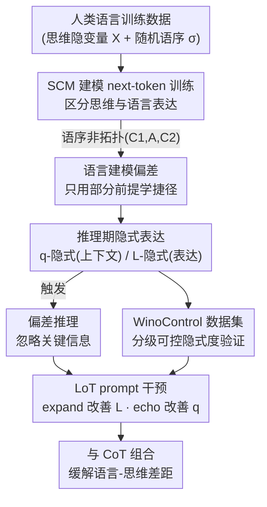

# On the Thinking-Language Modeling Gap in Large Language Models

**会议**: ICLR 2026  
**OpenReview**: [https://openreview.net/forum?id=lSWIzMX2Ie](https://openreview.net/forum?id=lSWIzMX2Ie)  
**代码**: https://causalcoat.github.io/lot  
**领域**: LLM推理  
**关键词**: 结构因果模型, 隐式表达, 语言-思维差距, prompt 干预, 推理偏差

## 一句话总结
本文用结构因果模型刻画"LLM 从人类语言学思考"这一过程，指出语言只是知识的载体而非思维本身，因此训练数据里的表达习惯会把偏差注入模型——当关键信息以"隐式表达"出现时 LLM 会忽略它，并提出一个 prompt 级干预 LoT（observe / expand / echo）在 11 个任务、4 个代表性 LLM 上缓解这种偏差。

## 研究背景与动机
**领域现状**：LLM 通过在海量人类书写的自然语言上做 next-token 预测，学会了模仿人类的思考过程，再配合 CoT 等提示策略，能在数学推理等复杂任务上甚至超过人类。主流叙事是"语言建模 = 学会了思考"。

**现有痛点**：可即便最强的 LLM，仍会在对人类极简单的任务上翻车——忽略 prompt 里的关键信息、无法处理"反向表达"（如 A is B 学会了却答不出 B is A 的反转诅咒）、识别不出上下文里的简单逻辑（Alice 有 N 个兄弟、M 个姐妹，问 Alice 的兄弟有几个姐妹，答 M 而非 M+1）。这些失败彼此孤立、缺一个统一解释。

**核心矛盾**：根子在于语言和思维并不是一回事。认知科学（Fedorenko 等）指出语言主要是人类**沟通知识**的工具而非思考工具，语言表达和底层思维分属不同脑区；"思维语言假说"（LOTH）也认为真正的思考运行在心理语言上。于是同一个思维可以有多种语言表达，而人类对句式、语序有偏好——LLM 直接从书写语言里学思考，就会把这些**表达偏好**当成思维结构学进去。

**本文目标**：回答"书写语言的表达方式如何影响 LLM 的推理过程"，并据此给出一个可落地的缓解手段。

**切入角度**：把"思维"建模为隐变量、"语言"建模为这些隐变量的 token 化表达，用结构因果模型（SCM）显式区分二者，从而能在理论上推导出表达偏差何时、如何被学进模型、又如何在推理时被触发。

**核心 idea**：用 SCM 形式化 next-token 训练，证明"非拓扑序的语言表达"会让模型学到只看部分前提的捷径（language-modeling bias）；进而定义"隐式表达"并给出语言-思维差距的下界定理；最后用一句 prompt 让模型主动展开并复述全部信息来对冲这种差距。

## 方法详解

### 整体框架
全文方法分两层：**理论层**用结构因果模型解释偏差从哪来，**实践层**据此设计可控数据集与 prompt 干预来验证并缓解。理论上，作者把一句话的生成看成"先采样隐变量（思维）X，再按某个随机顺序 σ 把每个变量写成 token（语言）"。当书写顺序不符合因果图的拓扑序时（结论 A 出现在它的某个原因之前），next-token 目标会逼着模型只用已出现的那部分前提去预测 A，从而在训练阶段就学到一个"捷径"分布；推理阶段，凡是以"训练里少见的表达形式"给出的前提（即隐式表达），模型就用不好它，触发同样的捷径推理。沿着"哪一项信息隐式"这条线，隐式又细分为 q-implicitness（上下文不利）和 L-implicitness（表达本身不利）。对应地，缓解 prompt 也拆成两支：echo 改善上下文 q、expand 改善表达 L，合起来就是 LoT。

### 关键设计

**1. 结构因果模型刻画 next-token 训练与语言建模偏差**

针对"LLM 到底学到了思维还是表达"这个根本困惑，作者把思维设为一组服从因果图 $G=(X,E)$ 的隐变量 $X=(X_1,\dots,X_d)$，每个 $X_i:=f_i(\mathrm{Pa}(X_i),N_i)$；当 $X$ 取值 $x$ 后，再随机抽一个排列 $\sigma$，把每个变量 $X_k=x_k$ 写成来自 token 集 $L_{X_k=x_k}$ 的一个 token，拼成观测序列 $l$。这样"语言"就成了"思维"的一种带随机顺序的 token 化投影。在两前提问答（$X=(C_1,C_2,A)$、因果图 $C_1\to A\leftarrow C_2$）这个最小例子上，作者证明（命题 2.3）：当语序是反拓扑的 $(C_1,A,C_2)$——结论 $A$ 排在原因 $C_2$ 之前——next-token 目标会让模型把 $A$ 当成只由已出现的 $C_1$ 决定，拟合的是一个把 $C_2$ 边缘化掉的分布

$$\Pr(L_A\mid L_1)=\sum_{C_1,C_2,A}\Pr(C_1\mid L_1)\Pr(C_2)\Pr(A\mid C_1,C_2)\Pr(L_A\mid A,L_1).$$

也就是说，偏差不是模型"不会推理"，而是被语序逼着在训练时学了一个只看半截信息的捷径。这一条把"反转诅咒""前提顺序敏感"等已知失败统一解释为同一个语言建模偏差。

**2. 隐式表达与语言-思维差距下界定理**

命题 2.3 只说了训练时学到捷径，但本文要解释的是"信息明明都在 prompt 里、模型却还是忽略它"。为此作者定义**隐式表达**：某个表达形式在训练中出现得少，模型就难以用好它。再把模型对前提的理解分解为 $\Psi(c_1^\*,\dots,c_k^\*\mid L_1,\dots,L_k)=\prod_i\Psi(c_i\mid q_i,L_i)$，从而区分两类隐式——若存在更优的替换表达 $L_i'$ 能提高条件概率，则 $c_i^\*$ 是 **L-implicit**（表达本身不利）；若存在更优的上下文 $q_i'$ 能提高它，则是 **q-implicit**（上下文不利）。核心结论是定理 2.4（语言-思维差距），它给出预测分布与真值之间 KL 散度的下界：

$$D_{\mathrm{KL}}\ge\Big(\tfrac{1-\Psi(C=c^\*\mid L=l)}{2}\Big)^2\cdot V^2\big(\Pr(A\mid C=c^\*),\,\Psi(A\mid L=l,C\ne c^\*)\big),$$

其中 $V(p,q)=\sum_x|p(x)-q(x)|$ 是变分距离。直观上，变分距离项度量"彻底理解错"的代价，而 $\big(1-\Psi(C=c^\*\mid L=l)\big)$ 度量"任务被理解得有多差"。这个下界说明：**即便 next-token 预测器完全学对了隐变量间的关系（$\Psi(A\mid C)=\Pr(A\mid C)$），只要表达是隐式的，推理依然会有偏差**——把"理解"和"推理"两件事在理论上解耦开了。

**3. WinoControl：可控隐式度的验证数据集**

理论里的 $\Psi(c_1^\*,c_2^\*\mid L_1,L_2)$ 含隐变量、无法直接测，于是作者基于 WinoBias 构造 WinoControl，把隐式度做成可定性调节的三档。针对 L-implicitness，通过追加"确定性/部分提示句"把表达的清晰度从 0（易，加一句直接排除错误答案）到 2（难，原始 WinoBias 句、不加任何辅助句）分级；针对 q-implicitness，通过插入若干"相关但无用、用不同代词"的干扰句，从 0（不插入）到 2（插入更多干扰句）分级。只取需要理解上下文的 Type 1 句子来评测（更难）。这样就能在 3×3 的隐式度网格上观察准确率随哪一维隐式度升高而下降，直接对照定理 2.4 的预测。

**4. LoT：observe / expand / echo 的 prompt 级干预**

既然定理 2.4 指出偏差来自 $\big(1-\Psi(c_1^\*,\dots,c_i^\*\mid L_1,\dots,L_i)\big)$ 这一项过大，缓解就该去压这一项，而非提升推理本身。作者据此设计**LoT（Language-of-Thoughts）**：一句 prompt "Please **observe**, **expand**, and **echo** all the relevant information based on the question"。其中 **expand** 利用指令跟随让模型从 $L_{C_i=c_i^\*}$ 里生成更有用的表达，针对性改善 L-implicitness；**echo** 让模型在推理中复述关键信息、刷新其周边上下文，针对性改善 q-implicitness。还给出只 expand+echo 的变体 LoT′。由于 LoT 只管"把信息理解好"、不管"会不会算"（后者取决于 $\Psi(A\mid c_1^\*,\dots,c_i^\*)$），所以它被设计成与 CoT 等推理方法**组合使用**，而非替代。消融上，expand 单用更擅长 L-隐式场景、echo 单用更擅长 q-隐式场景，恰好对上两类隐式的理论定位。

### 一个完整示例
以经典代词消解句 "The manager promoted the housekeeper because she appreciated the dedication"（she 指谁？）为例：在 q-隐式度 0、L-隐式度 0 时 CoT 准确率约 76.3%；当把两维都拉到 2（不加任何辅助句、且塞入多个用不同代词的无用干扰句），CoT 准确率掉到约 48.5%——纯粹因为关键信息变"隐式"了，模型的推理能力没变却答错。此时加上 echo，在 q-隐式偏高的右上角区域涨幅最大（如 +11.4%）；加上 expand，则在 L-隐式偏高的左下角更有效（如 +7.8%）。两种干预的增益分布与它们各自针对的隐式类型一一吻合，正是定理 2.4 的经验落地。

## 实验关键数据

### 主实验
在 4 个 LLM（DeepSeek-V3 / GPT-4o-mini / Qwen2-72B / Llama-3.1-70B）、多个 benchmark 上对比 Direct / CoT / RaR / RaR+CoT / LtM 等基线，温度设为 0。

| 基准 | 指标 | 代表对比 | 关键结果 |
|------|------|----------|----------|
| WinoBias | 一致性 Con / Delta | CoT vs LoT | LoT 多数模型取最优或次优，DeepSeek 上 Delta 由 CoT 的 10.6 降到 5.8 |
| Alice（数学常识） | 准确率 | CoT vs LoT | GPT-4o-mini 上较 CoT +8%，Qwen2-72B 上 +43.5% |
| BBQ（社会偏见） | 准确率 | 5 基线 vs LoT | LoT 在 11/12 个 (模型×偏见类型) 上优于全部 5 个基线 |
| HotpotQA（多跳） | macro-F1 | CoT vs LoT (ToT/GoT/ReAct) | LoT 在 9/12 个设置上提升，ToT 设置下提升最一致 |

### 消融实验

| 配置 | 作用 | 现象 |
|------|------|------|
| LoT（observe+expand+echo） | 完整干预 | 总体最优/次优，与 CoT 组合 |
| LoT′（expand+echo） | 去掉 observe | 多数情形略逊于 LoT，仍优于全部基线 |
| Expand only | 仅改善 L-隐式 | 在 Alice、WinoBias 等需理解隐式事实处显著更好 |
| Echo only | 仅改善 q-隐式 | 在 BBQ 上所有情形显著优于 Expand 和 CoT（强 q-隐式）|

### 关键发现
- 隐式度与性能的关系清晰且一致：固定一维、升高另一维（q 或 L）准确率都下降，3×3 网格的下降模式与定理 2.4 高度吻合。
- 增益**不是**靠多花 token 换来的：echo / expand 的提升与额外 token 成本无显著相关（Pearson r 分别为 −0.132、0.063，p 值 0.735、0.871），且 echo 比 CoT token 更少还更准。
- 两类干预各司其职：BBQ 这类强 q-隐式任务上 echo 大幅领先、expand 反而引入无用信息掉点；Alice 这类强 L-隐式任务上 expand 显著更好——印证 q/L 二分。
- LLM-as-a-judge 验证显示 LoT 确实诱发了"echo / expand"行为，且 echo 是 expand 起正作用的必要前提：单 expand 时"expand 成功率"与正确性负相关，一旦 echo 被激发该项就转正。
- 失败模式与具体模型强相关：在 Llama-3.1-70B 上 expand 在 WinoBias/Alice 反而不如 CoT，说明干预生效还需模型自身具备一定内在能力。

## 亮点与洞察
- 用一个最小的两前提 SCM + 随机语序，把"反转诅咒""前提顺序敏感""无关上下文干扰"等一堆零散失败统一成同一个"语言建模偏差"，理论解释力强且优雅。
- 把"理解"与"推理"在定理 2.4 里解耦：即使隐变量关系学对了，隐式表达仍会拉低性能——这说明很多 LLM 失败该归因于"没读懂题"而非"不会推理"，对诊断 LLM 错误很有指导意义。
- q-implicitness / L-implicitness 的二分既有理论定义又有可控数据集与对应干预（echo↔q、expand↔L），三者闭环，是少见的"理论—数据—方法"自洽设计。
- 干预成本极低（一句 prompt）、可与任意推理协议正交组合，且增益与 token 成本无关，迁移性很好——可直接套到现有 CoT/ToT/Self-Consistency 流水线上。

## 局限与展望
- 理论推导依赖若干简化假设（完美知识 $\Psi(A\mid C)=\Pr(A\mid C)$、Markov 性等），假设被违反时下界的有效性只在附录定性讨论。
- 干预效果对模型敏感：弱模型（如 Llama-3.1-70B）上 expand 可能反伤性能，说明方法需要模型本身具备一定指令跟随与理解能力，并非普适灵药。
- 隐式度只能定性分三档、无法定量测 $\Psi(c^\*\mid L)$，q/L 隐式的划分仍偏经验；在 ReAct + 外部 API（RAG/工具）设定下 LoT 收益不稳，作者也承认需进一步研究检索/工具场景。
- 评测集中在 QA、消歧、社会偏见与单数学基准，是否能推广到长链数学证明、代码等更复杂推理仍待验证。

## 相关工作与启发
- **vs 既有"LLM 推理失败"研究（前提顺序敏感、无关上下文干扰等）**：这些工作多是经验地报告某类失败，本文则给出一个统一的结构因果模型，把它们都解释为定理 2.4 中 $\big(1-\Psi(c^\*\mid L)\big)$ 项被抬高——从"发现现象"升级到"形式化机制"。
- **vs RaR / Rephrase-and-Respond**：RaR 也改写问题，但缺少对"为什么改写有效"的因果刻画；本文从 q/L 两类隐式出发解释改写为何有时有用（改善 L）有时无用（引入无关上下文、伤 q），并据此把干预拆成 echo/expand 两支精准对症。
- **vs CoT / LtM 等推理提示**：CoT 提升的是"会不会推理"，LoT 提升的是"有没有读懂"，二者正交且实验上组合最佳——提示了一条"先把理解补齐再上推理协议"的工程思路。

## 评分
- 新颖性: ⭐⭐⭐⭐⭐ 用 SCM 形式化语言-思维差距并统一解释多种 LLM 失败，视角独到。
- 实验充分度: ⭐⭐⭐⭐ 覆盖 4 模型、11 任务、消融+token+LLM-judge 多角度，但基准类型偏窄。
- 写作质量: ⭐⭐⭐⭐ 理论与实践衔接清晰，定理与可控数据集配合好，符号略密。
- 价值: ⭐⭐⭐⭐⭐ 既有理论解释力又给出零成本可组合的实用干预，诊断与缓解 LLM 推理偏差都有用。

<!-- RELATED:START -->

## 相关论文

- [\[ICLR 2026\] TSLM: Tree-Structured Language Modeling for Divergent Thinking](tslm_tree-structured_language_modeling_for_divergent_thinking.md)
- [\[ICLR 2026\] Enhancing Language Model Reasoning with Structured Multi-Level Modeling](enhancing_language_model_reasoning_with_structured_multi-level_modeling.md)
- [\[ICLR 2026\] Variation in Verification: Understanding Verification Dynamics in Large Language Models](variation_in_verification_understanding_verification_dynamics_in_large_language_.md)
- [\[ICML 2026\] Modeling Hierarchical Thinking in Large Reasoning Models](../../ICML2026/llm_reasoning/modeling_hierarchical_thinking_in_large_reasoning_models.md)
- [\[ICLR 2026\] Inpainting-Guided Policy Optimization for Diffusion Large Language Models](inpainting-guided_policy_optimization_for_diffusion_large_language_models.md)

<!-- RELATED:END -->
