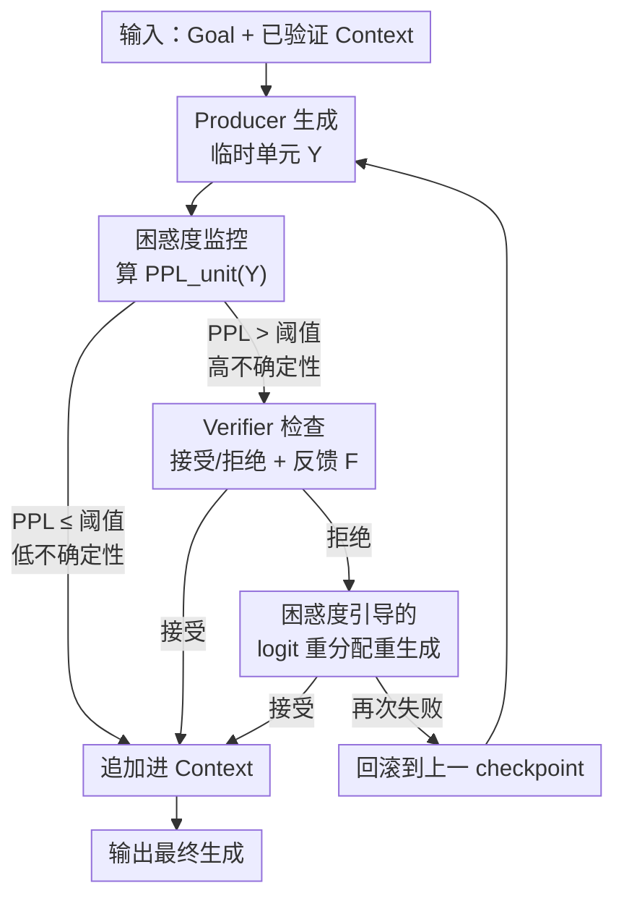

# Once-More: Continuous Self-Correction for Large Language Models via Perplexity-Guided Intervention

**会议**: ICLR 2026  
**OpenReview**: [https://openreview.net/forum?id=3CKdjb5SuH](https://openreview.net/forum?id=3CKdjb5SuH)  
**代码**: 待开源（论文承诺发表后放出 GitHub）  
**领域**: LLM推理  
**关键词**: 自我纠错、困惑度、logit 干预、推理时引导、多智能体

## 一句话总结
Once-More 是一个免训练、模型无关的推理时自我纠错框架：在生成过程中按"单元"（句子/公式/代码块）实时算困惑度，对高不确定性单元触发 Verifier 检查，被拒绝的单元用"反馈 + 困惑度引导的 logit 重分配"重新生成，从而在错误传播之前就把生成轨迹掰回正轨，在 AIME / GPQA / LiveBench 等多个推理 benchmark 上超过 Self-Refine、CRITIC 等代表性自纠方法。

## 研究背景与动机

**领域现状**：LLM 的自回归生成会"滚雪球"——早期一个 token 错了，会沿着后续 token 不断传播，最终让整段推理跑偏、重复或逻辑崩坏。为缓解这个问题，自我纠错（self-correction）成了热门方向，目前主要有两条路线：一是用监督微调把纠错行为"烧进"模型（如 S3c-MATH），二是推理时的迭代精化（如 Self-Refine、CRITIC）。

**现有痛点**：监督微调路线需要专门收集纠错数据，且受训练分布限制，遇到分布外任务就退化、错误照样级联。迭代精化路线虽然通用，但它们都在**完整草稿或粗粒度步骤**上做反馈——必须等模型把一大段写完才能给意见，此时错误早已传播扩散；而且仅靠 prompt 形式的最终输出反馈"太粗"，模型嘴上说"知道错了"，采样时却因为强先验又走回老路，导致同样的错误反复出现、精化循环不收敛。

**核心矛盾**：有效的纠错应该是**连续、细粒度、随生成同步进行**的，让每一步"更正确"的增量累积成更好的最终结果；但现有方法要么是事后一次性纠（粒度太粗、介入太晚），要么把纠错能力固化进参数（牺牲通用性）。"何时介入"和"如何让反馈真正改变轨迹"这两件事都没解决好。

**本文目标**：在不训练、不限定模型架构的前提下，做到（1）在生成中途就能检测潜在错误，（2）介入后能真正改变采样轨迹而不是空喊口号。

**切入角度**：作者观察到一个关键经验现象——**错误单元的困惑度（perplexity）系统性地高于正确单元**（论文 Figure 3 在 AIME24/GPQA/LiveBench 上都验证了这一分布分离）。困惑度是免费的、逐 token 就能算的不确定性信号，天然适合做"什么时候该检查"的触发器。

**核心 idea**：把生成过程改造成 Producer–Verifier 多智能体交互，**用困惑度当哨兵决定何时触发验证，用困惑度引导的 logit 重分配强制模型探索旧路之外的 token**，从而实现"边生成边纠错"的连续引导。

## 方法详解

### 整体框架

Once-More 把标准 LLM 生成改造成一个"生成—监控—纠错"的连续闭环，由三个核心组件构成：**Producer**（一个冻结的预训练 LLM，按单元增量生成内容，唯一要求是能拿到解码时的 token 概率）、**Verifier(s)**（一个或多个评估器，对每个临时单元给出"接受/拒绝"的二元判断 + 可选的自然语言反馈 $F$，可以是 LLM、普通程序或工具增强模块）、**Generation Units**（自适应的生成粒度——数学推理里是一个公式/推导步，代码里是一个函数/块，散文里是一句话/段，靠标点、缩进等句法标记切分）。

整个流程是一个 loop：Producer 在 (Goal, Context) 条件下生成一个临时单元 $Y=[y_1,\dots,y_n]$ → 算它的单元困惑度 $\text{PPL}_{\text{unit}}(Y)$ → 若低于阈值 $P_{th}$（低不确定性）直接信任并追加进 Context；若高于阈值（高不确定性）才唤起 Verifier 显式检查 → 被接受则追加 Context 并打 checkpoint，被拒绝则触发"引导式重生成"（结合反馈 + 概率调整）→ 如果重生成还失败，就回滚到上一个 checkpoint 从那里重来（因为错误可能更早就埋下了）。这套"困惑度先筛、Verifier 再判、logit 强制纠"的分层设计，让昂贵的验证只花在真正可疑的单元上。

### 关键设计

**1. 单元级困惑度监控：用免费的不确定性信号决定何时该检查**

现有方法对"何时介入"没有可靠信号，要么每个 token 都验证（太贵）要么等全文写完（太晚）。Once-More 利用困惑度这个标准语言模型指标作为实时质量哨兵。在位置 $t$，Producer 输出词表分布 $q_t(v)$，为避免遍历整个词表，只用 top-$K$ 个最可能 token 近似计算 token 级困惑度：

$$\text{PPL}_t^{(K)} = \exp\!\left(\frac{1}{K}\sum_{i=1}^{K}\big(-\log q_t(v_{t,i})\big)\right)$$

当某个 token 一家独大时 $\text{PPL}_t^{(K)}\approx 1$，概率质量越分散值越大。再把单元内 token 困惑度平均得到单元级信号 $\text{PPL}_{\text{unit}}(Y)=\frac{1}{n}\sum_{t=1}^{n}\text{PPL}_t^{(K)}$，当它超过阈值 $P_{th}$ 时才触发验证。$P_{th}$ 在小验证集上标定，使验证只命中最不确定的一部分单元（如最不确定的 25%）。这个设计之所以有效，是因为论文经验证实"错误单元困惑度更高"——困惑度天然把验证算力集中到真正可疑的地方，避免了对每个 token 都做外部验证的开销。

**2. Producer–Verifier 多智能体闭环：把细粒度反馈做成接受/拒绝 + checkpoint 回滚**

针对"粗粒度最终反馈无法有效纠偏"的痛点，Once-More 把生成拆成一个个自适应单元，让 Verifier 对每个临时单元做"接受/拒绝"判断而非等整段写完才评价。粒度越细，反馈对 Verifier 来说越容易给（一句话/一个公式的对错远比一整篇好判断），介入也越及时。被接受的单元会创建 checkpoint，被拒绝则进入引导式重生成；若重生成仍不通过，框架会回滚到上一个 checkpoint 重来——这一步承认"错误可能源于更早的位置"，而不是死磕当前单元。Verifier 可以是 LLM、确定性程序或工具增强模块，框架对此不挑。

**3. 困惑度引导的 logit 重分配：让模型真正走出旧路，而不是嘴上认错**

这是全文最核心的机制，针对"模型接受反馈却因强先验又采样回同样 token"这个顽疾。简单地让模型"再试一次"往往原地踏步，所以 Once-More 在重生成时**直接改概率分布**：把被拒绝单元的 token 困惑度归一化成抑制强度 $\hat{u}_i^{(1)}=\frac{\text{PPL}_i-\min(\text{PPL})}{\max(\text{PPL})-\min(\text{PPL})+\varepsilon}\in[0,1]$，高不确定 token 抑制权重接近 1、自信 token 接近 0。由于重生成序列和原序列长度/内容不同，再建一个单调对齐矩阵 $A$ 把抑制权重迁移到新位置，并用距离衰减 $\hat{u}_j^{\rightarrow}=A_{ij}\cdot\exp\!\big(-(|i-j|/\tau)^{\gamma}\big)\cdot\hat{u}_i^{(1)}$ 防止"远处巧合匹配"被误抑制，外加高斯平滑避免过度局部化，得到位置 $j$ 的有效抑制 $\alpha_j=\alpha\cdot u_j^{\star}$。

接着做概率重分配：对目标 token 抑制、对其他 token 提升，

$$s_j(v)=\begin{cases}1-\alpha_j\,r_j(v), & v=\text{target}_j\ (\text{抑制})\\ 1+\kappa_j\,r_j(v)^{\beta}, & v\neq\text{target}_j\ (\text{提升})\end{cases}$$

其中 $r_j(v)=q_j^{(2)}(v)/\max(\varepsilon,\bar{q}_j^{(1)}(v))$ 衡量模型对 token $v$ 的信念在两次尝试间的变化，系数 $\kappa_j$ 经过精心计算使"从目标 token 拿走的概率"正好等于"分给其他 token 的概率"，保证总质量守恒；最终归一化得到合法分布 $\tilde{q}_j(v)$。这样做的妙处在于：它既靠反馈给语义指引、又靠 logit 干预强制探索，二者修不同的病——消融显示在 GPQA 上二者效果"超过加性"，说明缺一不可。

### 一个完整示例

论文 Figure 2 给了一个 AIME 2024 第 83 题的例子：Producer 在 unit 3 把某个数错误地解读成"单数字"，困惑度偏高触发 Verifier，Verifier 拒绝并给出反馈；重生成时 logit 重分配压低了原来那条错误解读路径，模型于是**显式地推理"为什么单数字解读不可能"**，转向正确的"两位数"解读。这个过程展示了 Once-More 如何在错误传播开之前、在出错的那一步就地纠正，而不是等整道题做完再回头找哪步错了。

### 损失函数 / 训练策略

无训练。Once-More 完全在推理时工作，Producer 和 Verifier 都是冻结模型。默认超参：top-$K$ 困惑度 $K=5$、抑制因子 $\alpha=1.0$、重分配锐度 $\beta=1.0$、距离衰减 $\tau=1$、扩散带宽 $\sigma=1$、困惑度阈值取最不确定的 $25\%$。所有实验中 Verifier 反馈由与 Producer 同一个 LLM 充当的 agent 生成。

## 实验关键数据

### 主实验

基座用 Qwen3（4B/8B/14B，non-thinking），对比 Raw、Self-Refine、CRITIC、S3c-MATH 四个代表性 baseline。

| 模型 | Benchmark | Raw | Self-Refine | CRITIC | Once-More |
|------|-----------|-----|-------------|--------|-----------|
| Qwen3-14B | AIME24 | 26.7 | 28.8 | 28.8 | **36.7** |
| Qwen3-14B | AIME25 | 18.8 | 23.3 | 22.2 | **26.7** |
| Qwen3-14B | LiveBench(Reason.) | 44.0 | 46.5 | 45.5 | **52.5** |
| Qwen3-14B | GPQA Diamond | 48.0 | 49.2 | 50.5 | **55.6** |
| Qwen3-8B | AIME24 | 24.4 | 25.6 | 24.4 | **33.3** |
| Qwen3-4B | LiveBench(Reason.) | 20.3 | 21.0 | 20.7 | **33.0** |

数学推理上 Once-More 比 Raw 高 3.4~10 个点，而 Self-Refine/CRITIC 最多只涨 2.1~4.5 点；LiveBench 上 Once-More 涨 9.0~12.7 点、baseline 不到 1 点。对比监督微调方法（Table 2），无需训练的 Once-More 在 SVAMP 上达到两个模型族的最佳（Llama3-8B 82.0%、Qwen2-Math-7B 89.0%），与专门训练的 S3c-MATH 打平或反超。

### 消融实验

| 配置（Qwen3-14B） | AIME24 | GPQA | 说明 |
|------|--------|------|------|
| Raw | 26.7 | 48.0 | 不纠错 |
| w/o Redistribution（只留反馈） | 33.3 | 51.5 | 去掉 logit 重分配 |
| w/o Feedback（只留重分配） | 30.3 | 48.4 | 去掉 Verifier 反馈 |
| Full Once-More | **36.7** | **55.6** | 两者都在 |

| 单元长度（句） | AIME24 | LiveBench | GPQA-D |
|------|--------|-----------|--------|
| 1 | 36.6 | 52.3 | 55.6 |
| 4 | 35.5 | 52.3 | 56.1 |
| 32 | 30.0 | 49.8 | 49.7 |
| 128 | 26.7 | 45.3 | 50.0 |

### 关键发现

- **反馈和 logit 重分配修不同的病**：AIME24 上二者效果大致加性，GPQA 上明显"超过加性"——反馈给语义指引，重分配强制探索使指引真正改变轨迹，缺一不可。
- **细粒度才有效**：单元长度 ≤4 句时性能稳定，≥32 句时全面下降，128 句时退化到 Raw 水平——单元越长越接近"事后整段纠错"，介入机会越少。
- **能随模型规模 scaling**：AIME24 相对增益从 4B 的 25.6% 涨到 14B 的 37.4%，与"事后方法收益递减"相反；越大的模型反馈更有信息量、token 分布更细腻，logit 重分配更有效。
- **救活小模型**：Self-Refine 在 4B 上零提升、甚至让 8B 的 AIME25 掉点（16.7%→15.5%），而 Once-More 靠 logit 重分配在反馈质量低时也能纠对。
- **省 token**：尽管有重生成循环，Once-More 在 AIME 上比 Self-Refine 少用 17~21% 的 token，wall-clock 时间也持平或更优。
- **非对称配置**：强 Producer + 弱 Verifier 时性能只轻微下降；弱 Producer（4B）+ 强 Verifier（14B）则全面大涨，说明 Verifier 质量是性能上限的关键。

## 亮点与洞察

- **把困惑度同时当"哨兵"和"方向盘"**：困惑度既决定何时触发验证（高 PPL 才查），又被归一化成 logit 抑制强度去指导重生成——同一个免费信号被一鱼两吃，非常优雅。
- **直接动概率分布，而不是只动 prompt**：这是它能跑赢 Self-Refine/CRITIC 的根本——别的方法靠 prompt 喊"再试一次"，模型因强先验又走回老路；Once-More 用质量守恒的概率重分配硬性压低旧 token、抬升替代项，让"认错"真的落到采样上。
- **checkpoint + 回滚**：承认错误可能源于更早位置，重生成失败就回退，避免在错误单元上死循环——这套机制可迁移到任何带状态的生成纠错系统。
- **自适应单元粒度**：用句法标记切分单元，数学按推导步、代码按块、散文按句，让"介入粒度匹配任务"成为可调旋钮，消融证明细粒度（≤4 句）是性能关键。

## 局限与展望

- 作者承认：框架**难以追溯埋藏在生成历史深处的错误**，可能陷入重生成循环。
- **自信错误（false negative）** 会偶尔绕过困惑度触发器——困惑度低但其实错了的单元检测不到。
- 系统性能上限受 **Verifier 质量** 制约（非对称实验已印证），弱 Verifier 限制天花板。
- 自己观察：所有实验的 Verifier 都用与 Producer 同款 LLM，没有完全独立的外部验证器，"自己验自己"的有效性边界值得进一步考察；困惑度阈值是静态标定的，作者也把"自适应阈值 + 动态回滚"列为未来工作。

## 相关工作与启发

- **vs Self-Refine / CRITIC（迭代精化）**：它们在完整草稿或粗粒度步骤上做事后纠错，仅靠 prompt 反馈、错误已扩散；Once-More 在单元级连续监控、用 logit 干预直接改采样，介入更早更"硬"。
- **vs S3c-MATH（监督微调自纠）**：把纠错烧进参数、需训练数据、分布外退化；Once-More 免训练、模型无关，无需数据也能与之打平或反超。
- **vs 解码时引导（GeDi / Contrastive Decoding / DoLa）**：它们只在全局或高层属性上操控采样，缺细粒度控制；Once-More 借鉴推理时操控的思路，但做**局部化 logit 操控 + 外部反馈融合**，引导更精准。
- **vs 多智能体（Reflexion / MAgICoRe / ReAct）**：受其角色分工启发采用 Producer–Verifier 架构，但补上了连续监控与直接概率干预，解决了它们"粗粒度、纯 prompt 交互无法保证有效纠偏"的短板。

## 评分
- 新颖性: ⭐⭐⭐⭐⭐ 首个把 token 困惑度 + 外部反馈用于连续引导式自纠的事后方法，logit 重分配机制设计扎实
- 实验充分度: ⭐⭐⭐⭐ 6 个 benchmark × 3 种规模 + 反馈/重分配/单元长度/非对称配置多维消融，但 Verifier 始终同款模型略显单一
- 写作质量: ⭐⭐⭐⭐⭐ 动机—机制—公式—消融逻辑清晰，Figure 2/3 把直觉和现象都讲透了
- 价值: ⭐⭐⭐⭐⭐ 免训练、模型无关、省 token，对本地/边缘部署和 agentic workflow 的可靠性很实用

<!-- RELATED:START -->

## 相关论文

- [\[ICLR 2026\] Towards Safe Reasoning in Large Reasoning Models via Corrective Intervention](towards_safe_reasoning_in_large_reasoning_models_via_corrective_intervention.md)
- [\[ICLR 2026\] Inpainting-Guided Policy Optimization for Diffusion Large Language Models](inpainting-guided_policy_optimization_for_diffusion_large_language_models.md)
- [\[ICLR 2026\] Co-rewarding: Stable Self-supervised RL for Eliciting Reasoning in Large Language Models](co-rewarding_stable_self-supervised_rl_for_eliciting_reasoning_in_large_language.md)
- [\[ICLR 2026\] RFEval: Benchmarking Reasoning Faithfulness under Counterfactual Reasoning Intervention in Large Reasoning Models](rfeval_benchmarking_reasoning_faithfulness_under_counterfactual_reasoning_interv.md)
- [\[ICLR 2026\] On the Thinking-Language Modeling Gap in Large Language Models](on_the_thinking-language_modeling_gap_in_large_language_models.md)

<!-- RELATED:END -->
