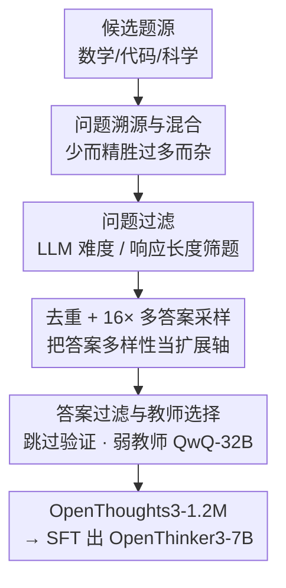

# OpenThoughts: Data Recipes for Reasoning Models

**会议**: ICLR 2026  
**OpenReview**: [https://openreview.net/forum?id=7xjoTuaNmN](https://openreview.net/forum?id=7xjoTuaNmN)  
**代码**: https://openthoughts.ai (数据与模型开源)  
**领域**: LLM推理  
**关键词**: 推理蒸馏, SFT数据配方, 数据筛选, 多答案采样, 教师模型选择

## 一句话总结
作者用 1000+ 组受控实验把"推理模型 SFT 数据该怎么造"这件事拆成六个流水线阶段逐个消融，得出一套简单却反直觉的数据配方（少而精的题源 + LLM 难度/长度筛题 + 每题采 16 次答案 + 跳过答案验证 + 用更弱的 QwQ-32B 当教师），据此造出 OpenThoughts3-1.2M 数据集并训出 OpenThinker3-7B，在 AIME25/LiveCodeBench/GPQA 上分别比 R1-Distill-7B 高出 15.3/17.2/20.5 个百分点，成为同规模开源数据 SOTA。

## 研究背景与动机
**领域现状**：DeepSeek-R1、o3 这类推理模型靠"先选强基座 → 后训练（SFT / RL）让模型输出长思维链"取得突破。其中一条被反复验证的路线是**纯 SFT 蒸馏**——把「问题 + 思维链 token + 答案」三元组喂给学生模型，思维链由一个强教师模型（如 R1）生成。R1-Distill、SkyT1、S1、LIMO 都说明：架构和训练流程几乎照搬普通指令微调，光靠**把训练数据做好**就能大幅涨点。

**现有痛点**：可前沿推理模型的**完整数据配方基本不公开**，社区只能凭直觉拼凑。更要命的是，已有开源项目往往只探索了设计空间的一个角落——要么只用人写的题、要么只拿 R1 当唯一教师，且常常在多个环节同时改动，导致"到底是哪一步带来增益"说不清楚。

**核心矛盾**：系统性地扫一遍"怎么生成问答对"的设计空间**代价高得吓人**——教师推理和模型训练都很贵，普通研究者根本扫不起，于是大家继续靠启发式和拍脑袋。

**本文目标**：把 SFT 推理数据的整条生产流水线（题从哪来 → 怎么混 → 怎么筛 → 怎么生成答案 → 答案要不要过滤 → 用谁当教师）逐个环节做受控消融，搞清楚每一步到底什么策略最优、为什么。

**切入角度**：固定流水线其余部分、每次只动一个环节，在一个"小到便宜、大到有信号"的统一规模（每个策略生成 31,600 条数据，即 10K 与 100K 的对数中点 $\sqrt{10}\approx 3.16$）下微调 Qwen2.5-7B-Instruct，用八个数学/代码/科学 benchmark 的平均分作为该环节的胜负裁判。

**核心 idea**：与其追求"数据多样性"，不如把流水线每一步都换成实测最优的那个选择并逐级叠加——很多被默认正确的直觉（教师越强越好、要做答案验证、题源越多越好）在受控实验下站不住脚。

## 方法详解

### 整体框架
OpenThoughts 不是一个新模型或新算法，而是一条**用实验逼近最优的数据生产流水线**。整体思路是：把"造一份 SFT 推理数据集"拆成六个串行阶段，每个阶段穷举若干候选策略，用统一规模（31,600 条）训出来的下游平均分挑出冠军策略，锁定后再进入下一阶段——这样每个决策都建立在前面已经定好的最优基础上。六个阶段依次是：① **问题溯源**（从全合成/半合成/人写三类、共数十个候选题源里挑题）→ ② **混合问题**（决定用 top-N 个题源拼数据）→ ③ **过滤问题**（从海量题里选高质量子集）→ ④ **去重 + 多答案采样**（决定每题向教师采几次答案）→ ⑤ **过滤答案**（要不要剔除疑似错误的答案）→ ⑥ **选教师模型**。把每阶段的胜者拼起来并放大到 120 万条，就得到 OpenThoughts3-1.2M（85 万数学 + 25 万代码 + 10 万科学），微调 Qwen2.5-7B-Instruct 得到 OpenThinker3-7B。

### 关键设计

**1. 问题溯源与混合：少而精胜过多而杂**

第一阶段先回答"题从哪来"。作者把题源分成三类——全合成（LLM 直接按模板生成，如 CodeAlpaca）、半合成（以 CommonCrawl/FineWeb 等做种子生成，如 TigerLabMath）、非合成（人写，如 StackExchange 论坛/竞赛题）——共测了代码 27 个、数学 21 个、科学 14 个题源，每个题源生成 31,600 道题、统一用 R1 答题后训练比较。结论是**题源质量影响巨大**：代码最强题源（StackExchange-CodeGolf 38.8）和最弱题源差出 17.2 分；而且**简单合成法常常不输甚至反超**复杂的人工流水线，没有"人写一定更好"这种规律。

紧接着的"混合"阶段更反直觉。直觉上多拼几个题源能增加多样性，但作者扫 $N\in\{1,2,4,8,16\}$ 个 top 题源后发现：**最多混两个题源效果最好**，混更多反而掉点——用 top-2 代码题源比用 top-16，全 benchmark 平均涨 5%。这说明下游性能吃的是**源数据质量**而非混合带来的多样性。最终配方因此极度精简：数学只用 OpenMath-2-Math 一个源，代码用 CodeGolf + OpenCodeReasoning，科学用 StackExchange-Physics + OrganicChemistry-PDFs。

**2. 问题过滤：用 LLM 难度/响应长度筛题，而非传统嵌入/fastText**

每个源都有数百万道题，全部答题训练不现实，必须选高质量子集。作者把预训练数据清洗里常用的 fastText 分类器、嵌入距离，与两种 LLM 驱动的新筛法放在一起比：**难度筛选**（让 GPT-4o-mini 评估每题难度、保留最难的）和**响应长度筛选**（让 LLM 直接作答、保留 LLM 回答最长的那些题——长回答约等于"这题更需要推理"）。

结果两种 LLM 筛法全面碾压传统方法：难度筛选是代码冠军，响应长度筛选是数学和科学冠军，相比随机筛分别带来约 6% 和 4% 的提升。一个细节是**用更强的 LLM 做响应长度筛通常更好**（GPT-4.1-mini > GPT-4.1-nano）。最终配方：代码用 GPT-4o-mini 难度筛，数学和科学用 GPT-4.1-mini 响应长度筛。

**3. 去重 + 16× 多答案采样：把"答案多样性"当成一条独立扩展轴**

这一阶段把两件事放在一起扫：题级去重（不去重 / 精确匹配去重 / 模糊去重）× 每题向教师采样几次答案（$1\times / 4\times / 16\times$）。去重提升的是**问题多样性**，而对同一题反复采样不同思维链提升的是**答案多样性**——后者本质上是用问题多样性换取答案多样性，从而提供了一条**新的数据扩展轴**：哪怕题不够多，靠多采答案也能把数据集放大至少 16 倍。

九种组合扫下来，去重方式没有清晰规律，但"多采答案"始终有效：数学上精确去重 + $4\times$ 最优、$16\times$ 次优；代码上不去重 + $16\times$ 几乎与最优持平。作者出于**可扩展性**统一取 $16\times$（数学/科学配精确去重、代码配不去重）。这条"采样多答案当扩展轴"正是论文最核心的扩展技巧之一——它解释了为何最终能轻松堆到 120 万条。

**4. 答案过滤与教师模型：验证无用，且弱教师反胜强教师**

最后两个环节同样反直觉。**答案过滤**上，直觉认为剔除疑似错误的答案应当涨点，作者于是测了多数投票一致性、GPT 验证、按长度/语言过滤等一堆策略（为公平先生成 63,200 条再筛回 31,600 条）。结果**没有任何过滤策略稳定超过"全都不过滤"的基线**——数学上随机过滤甚至最优，代码上仅 fastText 略好。结论是答案验证带来的收益不足以抵消丢样本的代价，**直接跳过这一步**。

**教师模型**选择则颠覆了"模型越强教得越好"的假设：作者对比 DeepSeek-R1、Phi-4-Reasoning-Plus-14B、QwQ-32B，发现 **QwQ-32B 全域最强教师**，给代码/数学分别比 R1 多带来 1.9%/2.6% 提升——尽管 QwQ-32B 在 benchmark 上明显弱于 R1（R1 在 CodeElo/GPQA/JEEBench 上反超 QwQ 达 9%/8%/23%）。这说明**教师在目标 benchmark 上的得分，并不能预测它作为蒸馏教师的好坏**。最终配方统一用 QwQ-32B 当教师。

### 损失函数 / 训练策略
全程是标准监督微调（SFT），无 RL、无课程学习。消融阶段统一在 Qwen2.5-7B-Instruct 上微调、每策略 31,600 条数据；最终把各阶段冠军策略逐级叠加并反推每域起始题量，放大到 OpenThoughts3-1.2M（85 万数学 / 25 万代码 / 10 万科学，比例沿用前作 OpenThoughts2-1M），微调出 OpenThinker3-7B。数据集还对 benchmark 做了去污染（删除高相似样本），并预留一组 held-out benchmark（AIME25、HMMT 02/25、HLE-MCQ、LCB 06/24-01/25）只在流水线全部定稿后测一次，以检验泛化。

## 实验关键数据

### 主实验
OpenThinker3-7B 与各类开源数据 7B/8B 推理模型对比（均从 Qwen2.5-7B-Instruct 微调；节选 12 任务平均与代表性任务）：

| 模型 | 数据规模 | 方法 | 平均 | AIME25 | LCB 06/24-01/25 | GPQA-D |
|------|---------|------|------|--------|------------------|--------|
| **OpenThinker3-7B（本文）** | 1.2M | SFT | **55.3** | **53.3** | **51.7** | 53.7 |
| DS-R1-Distill-Qwen-7B | 800K | SFT | 42.9 | 38.0 | 34.5 | 33.2 |
| Nemotron-Nano-1M | 1M | SFT | 47.3 | 41.3 | 42.2 | 52.9 |
| AM-1.4M | 1.4M | SFT | 42.1 | 28.7 | 40.3 | 48.3 |
| Qwen2.5-7B-Instruct（基座） | — | — | 24.0 | 8.0 | 16.3 | 24.6 |

相比 R1-Distill-7B，12 任务平均高 12.4 分；相比次优开源数据模型 Nemotron-Nano-8B 高 2.1 分。摘要口径下相比 R1-Distill-7B 在 AIME25/LCB/GPQA 上分别高 15.3/17.2/20.5 分。

### 消融实验（各阶段最优策略，节选）

| 阶段 | 关键对比 | 数值 | 说明 |
|------|---------|------|------|
| 混合问题 | Top-2 代码源 vs Top-16 | 41.3 vs 36.4 | 少而精胜出，约 +5% |
| 问题过滤 | 响应长度筛(数学) vs 随机 | 66.0 vs ~62 | LLM 筛法约 +4% |
| 多答案采样 | 16× vs 1×(科学) | 49.7 vs 46.9 | 多采答案稳定涨点 |
| 答案过滤 | 不过滤 vs 各过滤法(数学) | 65.6 ≈ 各法 | 过滤无显著收益 → 跳过 |
| 教师模型 | QwQ-32B vs R1(代码) | 29.5 vs 27.2 | 弱教师反胜 +1.9% |

### 关键发现
- **多答案采样是最关键的扩展杠杆**：对同一题向教师采 16 次答案，可把任一题源放大至少 16 倍，且涨点稳定——这是堆到 120 万条的核心手段。
- **强模型不等于强教师**：QwQ-32B benchmark 弱于 R1 却是更好的蒸馏教师，提示"教师 benchmark 分"不是选教师的可靠指标。
- **答案验证集体翻车**：多数投票、GPT 验证等没一个稳超"不过滤"基线，说明蒸馏数据里"留多"比"留对"更重要。
- **质量 > 多样性**：题源混合（≤2 源最优）和去重实验都指向同一结论——对这些推理 benchmark 而言，问题多样性的边际收益有限，尤其当答案多样性已经拉满时。
- **LLM 筛题 > 传统清洗**：难度/响应长度这类 LLM 信号，全面优于 fastText / 嵌入距离等预训练数据清洗工具。

## 亮点与洞察
- **把"数据配方"做成可复现的科学实验**：1000+ 组受控消融、每步只动一个变量、统一 31,600 规模裁判、外加 held-out benchmark 检验泛化——这套方法论本身就是对"靠直觉拼数据"的有力反驳，可直接迁移到任何 SFT 数据构建任务。
- **一连串反直觉结论很有"啊哈"感**：题源越多越差、答案验证没用、弱教师更会教——三条都和社区默认假设相反，且都有受控实验支撑，特别适合作为做数据时的避坑清单。
- **多答案采样作为扩展轴**可迁移到任何蒸馏场景：当高质量题稀缺时，与其费力找新题，不如对现有好题多采几遍答案，性价比更高。
- **全开源**（数据 + 模型 + prompt + 代码），让"开源数据追平 R1-Distill"第一次成为可验证的事实。

## 局限与展望
- 作者明确承认**完全没碰 RL**——而 RL 是当下推理模型的标准训练范式，纯 SFT 配方的结论未必能平移到 RL 数据构建。
- SFT 内部也**没探索分阶段 SFT / 课程学习**，最终只是把全部数据一把喂进去，可能仍有提升空间。
- 所有"冠军策略"都是用**八个特定 benchmark 的平均分**选出来的，"质量 > 多样性""验证无用"等结论是否在这套 benchmark 之外仍成立存疑——尤其多样性收益可能被当前评测集的同质性低估。
- 不少最优选择（如各域具体题源、$16\times$、QwQ-32B）是在 Qwen2.5-7B-Instruct + 这批教师下得出的，换基座/换教师代际后是否仍最优需要重验。

## 相关工作与启发
- **vs DeepSeek-R1-Distill**：R1-Distill 用单一强教师（R1）+ 大规模精选数据做 SFT，本文系统性地把"教师、题源、筛法、采样"全拆开扫，并发现弱教师 QwQ-32B 反而更好、答案验证可省，从而以同规模开源数据反超 R1-Distill-7B。
- **vs S1 / LIMO**：它们走"小而精、人工精选少量高难题"路线，本文则证明在更大规模下，LLM 自动难度/长度筛题 + 多答案采样能把规模和质量同时拉满，且简单合成题源不输人工精选。
- **vs OpenR1 / Nemotron**：这些项目常在多个阶段同时引入创新、难以归因，本文用"每次只动一步"的受控消融把每个设计选择的贡献量化清楚，是方法论上的关键区别。

## 评分
- 新颖性: ⭐⭐⭐⭐ 不是新模型而是系统性数据科学，反直觉结论扎实，但单项技术多为已有手段的重新评估
- 实验充分度: ⭐⭐⭐⭐⭐ 1000+ 受控消融 + held-out 泛化检验，是同类工作中最彻底的
- 写作质量: ⭐⭐⭐⭐⭐ 流水线分阶段叙事清晰，每步都有 takeaway，结论与表格自洽
- 价值: ⭐⭐⭐⭐⭐ 全开源数据/模型/prompt，给社区造推理 SFT 数据提供了可复现的最优配方与避坑清单

<!-- RELATED:START -->

## 相关论文

- [\[ICLR 2026\] Native Reasoning Models: Training Language Models to Reason on Unverifiable Data](native_reasoning_models_training_language_models_to_reason_on_unverifiable_data.md)
- [\[ICLR 2026\] Scaling Generalist Data-Analytic Agents](scaling_generalist_data-analytic_agents.md)
- [\[ICLR 2026\] Front-Loading Reasoning: The Synergy between Pretraining and Post-Training Data](front-loading_reasoning_the_synergy_between_pretraining_and_post-training_data.md)
- [\[ICLR 2026\] DESIGNER: Design-Logic-Guided Multidisciplinary Data Synthesis for LLM Reasoning](designer_design-logic-guided_multidisciplinary_data_synthesis_for_llm_reasoning.md)
- [\[ICLR 2026\] OpenEstimate: Evaluating LLMs on Reasoning Under Uncertainty with Real-World Data](openestimate_evaluating_llms_on_reasoning_under_uncertainty_with_real-world_data.md)

<!-- RELATED:END -->
