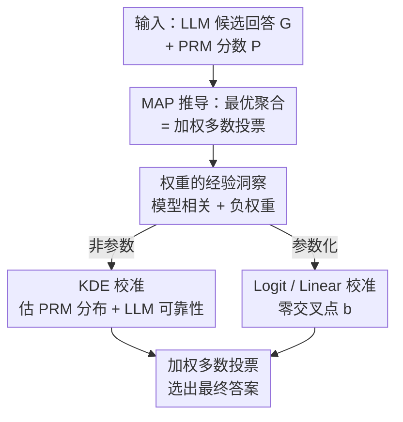

# Optimal Aggregation of LLM and PRM Signals for Efficient Test-Time Scaling

**会议**: ICLR 2026  
**OpenReview**: [https://openreview.net/forum?id=x85kiYqL4y](https://openreview.net/forum?id=x85kiYqL4y)  
**代码**: 待确认  
**领域**: LLM推理 / 测试时扩展  
**关键词**: 测试时扩展, 过程奖励模型, 加权多数投票, 信号聚合, 校准

## 一句话总结
这篇论文用 MAP 估计证明：把 LLM 的多数共识和 PRM 的打分最优地合在一起，等价于一次**加权多数投票**，并发现最优权重高度依赖具体的 LLM-PRM 组合、且对低分回答应给**负权重**；据此提出几种廉价的离线校准方法去近似这个权重函数，用约 21.3% 的算力就超过原始加权投票的表现。

## 研究背景与动机
**领域现状**：测试时扩展（Test-Time Scaling, TTS）是不重新训练就提升 LLM 推理能力的主流路线，最常见的范式是「生成-筛选」（generate-and-select）：对一道题采样出 N 个候选解，再用某种机制挑出最好的那个。挑选机制通常有两类——要么用过程奖励模型（PRM）按步打分、取分数最高的回答（Best-of-N），要么干脆忽略 PRM、只数答案出现次数（多数投票 / Self-Consistency）。

**现有痛点**：一个反直觉的现象动摇了 PRM 的地位——在最近的一些基准上，完全不看昂贵 PRM 的简单多数投票，反而能打败 PRM 指导的 Best-of-N。一个训练代价高昂的精细验证器，居然被一个数票数的方法比下去，这说明我们用 PRM 信号的方式本身就有问题，没把它细粒度的反馈用对。

**核心矛盾**：BoN 只看分数最高的那**一个**候选，丢掉了其他回答携带的共识信息；多数投票只数票、完全无视 PRM 分数。两者各取一端，都没有把「生成器的共识」和「验证器的打分」这两路证据**统一**起来。

**本文目标**：给出一个原则性的框架，回答「到底该怎么把 PRM 的验证信号和 LLM 的生成信号最优地结合」，并把它落地成不需要测试时真值标签、又省算力的实用方法。

**切入角度**：作者把「聚合多个回答得到最终答案」形式化为一个最大后验（MAP）估计问题——给定所有候选回答 $G$ 和它们的 PRM 分数 $P$，求最可能的真答案 $\hat{\alpha}$。从这个概率视角出发，最优解会自然浮现，而不是靠拍脑袋设计启发式。

**核心 idea**：最优聚合不是「挑最高分」，而是一次**加权多数投票**，每个回答的权重由「PRM 分数项」和「LLM 可靠性项」两部分组成；既然这个权重函数难以解析求出，就用一个一次性的离线校准集去**学**它的近似。

## 方法详解

### 整体框架
论文分两步走：先在理论上推导出最优聚合策略长什么样，再在实践上想办法廉价地逼近它。

理论部分把聚合形式化为 MAP 问题：LLM $M$ 对一道题生成 $L$ 个回答 $G=\{g_1,\dots,g_L\}$，每个回答含推理过程 $r_i$ 和最终答案 $s_i$；PRM $V$ 给每个回答打一个标量分 $p_i$。在均匀先验和两条条件独立假设下，最大化后验等价于最大化每个候选答案 $\alpha_k$ 的一个**得分**——而这个得分恰好是「所有投票给 $\alpha_k$ 的回答的权重之和」，即加权投票。关键在于每个权重 $w_i$ 拆成 PRM 信号项与 LLM 信号项。

接着作者实证刻画这个最优权重函数，发现它**因模型组合而异**、且对低分回答**赋负权重**——这两点直接否定了「直接拿 PRM 分数当权重」这种固定做法的合理性。

实践部分则用一个一次性预计算的校准集 $D_{cal}=\{(r_i,p_i,c_i)\}$（含每个回答的正确性标签 $c_i$）去学权重函数 $w(p)$，给出非参数（KDE）和参数化（Logit / Linear）两条路线。学好 $w(p)$ 后，测试时对每道新题直接做加权投票 $\hat{\alpha}=\arg\max_{\alpha_k}\sum_{i:s_i=\alpha_k} w(p_i)$ 即可，无需测试时真值。

### 关键设计

**1. MAP 推导：把最优聚合证明成加权多数投票**

针对「BoN 只看单个最高分、多数投票完全无视分数」这个痛点，作者从概率第一性原理重新推导聚合该怎么做。把求最可能真答案写成 $\hat{\alpha}=\arg\max_{\alpha_k} P(G,P\mid\alpha_k,M,V)$，再按因果链分解似然 $P(G,P\mid\alpha_k,M,V)=P(P\mid G,\alpha_k,V)\cdot P(G\mid\alpha_k,M)$（先由 LLM 生成回答、再由 PRM 打分）。引入条件独立假设（各回答的 PRM 分数互相独立、各回答本身也互相独立）后，对数似然变成对每个回答求和。其中 LLM 项用一个简单模型刻画：以概率 $q_M$ 生成正确答案、以 $(1-q_M)/(m-1)$ 生成某个特定错误答案（$m$ 是候选答案种类数）。最终得到定理 3.2：

$$\text{Score}(\alpha_k)=\sum_{i:s_i=\alpha_k} w_i,\quad w_i=\underbrace{\log\frac{P(p_i\mid c_i=1,V)}{P(p_i\mid c_i=0,V)}}_{\text{PRM 信号项}}+\underbrace{\log\frac{q_M(m-1)}{1-q_M}}_{\text{LLM 信号项}}$$

这等于把 BoN 和多数投票统一进同一个框架：PRM 信号项是「分数 $p_i$ 在正确推理 vs 错误推理下出现的似然比」，刻画这条推理质量到底多可信；LLM 信号项由 $q_M$ 决定，本质对应题目难度。最优策略不是挑最高分，而是让每个回答带着自己的权重去投票。

**2. 最优权重的两点经验洞察：模型相关 + 负权重**

定理给出了权重形式，但作者进一步实证刻画 $w^*(p)$ 到底长什么样，得到两个直接指导后续方法设计的结论。其一，**权重函数高度依赖具体 LLM-PRM 组合**：在不同模型对上，最优函数的形状差别巨大，所以「拿 PRM 分数直接当权重」这种一刀切做法天然次优，必须针对在用的模型对做校准。其二，**低 PRM 分数被映射到负权重**：一个被 PRM 判为差的回答不应被简单忽略，它其实是「反对其答案」的强证据，反复出现的低质量回答不该增加该答案为真的可能性。BoN 只看最高分、多数投票无视分数，都浪费了这条负信号。这两点是后面校准方法必须满足的设计约束。为了实例化最优权重，作者对每道题在 logit 空间用核密度估计（KDE）拟合正确/错误回答的分数分布，并把 $q_M$ 设为该题 $L$ 个回答的真实准确率；这样得到的「最优聚合器」给出了比 Pass@N 更紧的性能上界。

**3. 非参数校准（KDE WV）：直接估出权重函数里的未知量**

最直接的逼近思路就是把定理里的未知量逐个估出来：PRM 分数分布 $P(p\mid c{=}1,V)$、$P(p\mid c{=}0,V)$，以及 LLM 可靠性 $q_M$。估分数分布时，由于 PRM 分数落在 $[0,1]$ 而 KDE 不受界、会把概率密度溢出区间外，作者先用 logit 函数 $\text{logit}(p)=\log\frac{p}{1-p}$ 把分数搬到 logit 空间，再在那里做 KDE：

$$\hat{f}_c(p)=\frac{1}{|D_c|\cdot h}\sum_{i\in D_c} K\!\left(\frac{\text{logit}(p)-\text{logit}(p_i)}{h}\right)$$

其中 $D_c$ 按正确性 $c_i$ 把校准集分成两堆，$K$、$h$ 是核与带宽。估 $q_M$ 时没有测试标签，于是先在校准集上训一个分箱概率校准器 $g(\cdot)$，测试时对该题 $L$ 个回答算校准概率再取平均 $\hat{q}_M=\frac{1}{|D_{test}|}\sum_i g(p_i')$。代回去就得到可用的权重 $w_{KDE}(p)=\log\hat{f}_1(p)-\log\hat{f}_0(p)+\log\hat{q}_M+\log(m-1)-\log(1-\hat{q}_M)$。它是最优估计器的实用版，区别仅在于最优版还额外用到测试回答的真值。

**4. 参数化校准（Logit WV / Linear WV）：用零交叉点 b 显式编码负权重**

KDE 虽灵活但要估整条分布，作者还给出更简单的参数化形式，用网格搜索在校准集上调参。核心是一个阈值参数 $b$——**零交叉点**：分数高于 $b$ 时权重为正、低于 $b$ 时权重为负，这恰好把「惩罚低质量回答」这条洞察直接写进函数里。受定理里 log-ratio 形式启发，Logit 加权取 $w_{logit}(p)=\text{logit}(p)-\text{logit}(b)$；更简单的线性基线取 $w_{linear}(p)=p-b$。网格搜索时 $b$ 分别在 $[0,1]$（Logit WV）和 $[-1,1]$（Linear WV）里搜，目标是留出校准集上的准确率。这条路线几乎不需要估分布，却因为显式带了负权重机制而表现稳健，实际上 Logit WV 在多数情况下是全场最好的方法。

## 实验关键数据

### 主实验
覆盖 5 个 LLM（Mistral-7B、Qwen2.5-1.5B/7B、DeepSeek-1.5B/7B）× 7 个 PRM 共 35 个组合，数据集为 MATH / MATH500，并额外验证 MMLU-Pro 等非数学任务。核心结论是：校准后的加权投票在更少算力下达到或超过基线。

| 数据集 | 对比对象 | 关键结果 |
|--------|----------|----------|
| MATH | Logit WV vs Vanilla WV | 用约 **37.1%** 算力即超过 Vanilla WV |
| MATH500 | Logit WV vs Vanilla WV | 用约 **21.3%** 算力即超过 Vanilla WV |
| MATH（Llama3.1-Mistral-8B PRM, n=32） | Logit WV vs 最佳基线 Vanilla WV | 平均 **61.2 vs 58.2**（+3 分） |

下表是 n=32 时 Qwen-PRM-7B 上各方法在 5 个 LLM 上的平均准确率（节选 Table 1）：

| 方法 | 平均准确率 | 说明 |
|------|-----------|------|
| Optimal（上界） | 66.5 | 用真值的理论最优聚合器 |
| BoN | 61.8 | 取最高分回答 |
| MV（多数投票） | 57.1 | 忽略 PRM 分数 |
| Vanilla WV | 60.8 | 原始 PRM 分数当权重 |
| KDE WV | 60.2 | 非参数校准 |
| Linear WV | 62.9 | 参数化线性 |
| **Logit WV** | **63.3** | 参数化 logit，最佳 |

### 消融 / 分析

| 配置 | 关键现象 | 说明 |
|------|----------|------|
| 直接用 PRM 分数当权重 | 各模型对上次优 | 权重函数模型相关，一刀切不行 |
| 不给低分负权重 | 浪费负证据 | 低质量回答应反对其答案 |
| 零交叉点 b | Logit/Linear 表现稳健 | 显式实现对低分的惩罚 |
| 换 MMLU-Pro 多领域 | 仍稳定有效 | 方法不局限于数学 |

### 关键发现
- 最优权重函数的形状在不同 LLM-PRM 对之间差异巨大，证明必须做模型特定校准，而非套用固定函数。
- 负权重是反复出现的关键信号：被 PRM 判差的回答携带「反对证据」，而 BoN 和多数投票都把它丢了。
- 参数化的 Logit WV 多数情况下是最佳方法，几乎不需估分布，性价比高于估整条分布的 KDE WV。
- 投资「更聪明的聚合策略」比单纯堆测试时算力更划算——这是全文最想传达的结论。

## 亮点与洞察
- **把 TTS 聚合写成 MAP 并解析出加权投票**：它给出了 BoN 与多数投票的统一上位框架，让「该怎么聚合」从启发式变成可推导的结论，理论很干净。
- **负权重这一发现很反直觉也很有用**：以往方法默认「差回答忽略即可」，本文指出差回答是强反对证据，这个视角可以迁移到任何用验证器打分的筛选场景。
- **零交叉点 b 是把理论落地的巧妙简化**：一个标量阈值就把「惩罚低质量回答」编码进权重函数，让参数化方法既简单又稳健。
- **省算力的实用价值**：用约 1/5 算力超过原始加权投票，对推理成本敏感的部署很有吸引力。

## 局限与展望
- 理论推导依赖两条条件独立假设（回答之间、PRM 分数之间互相独立），现实中同一 LLM 的多次采样未必独立，假设的偏离对最优性的影响未充分讨论。
- 校准需要一个带正确性标签的一次性预计算集；在缺乏可靠真值、或题目分布与校准集差异大时，学到的权重函数可能失配。
- LLM 信号项用了「正确概率 $q_M$ + 错误均匀分布」的简化模型，把所有错误答案当等概率，可能与真实错误分布不符。
- 主实验集中在数学（MATH/MATH500）+ 选择题式 MMLU-Pro，对开放式生成、答案难以精确比对的任务的适用性还需验证。

## 相关工作与启发
- **vs Best-of-N (BoN)**：BoN 只取单个最高分回答，丢弃其余共识；本文证明最优解是把所有回答按权重一起投票，BoN 是其退化特例。
- **vs 多数投票 / Self-Consistency**：SC 只数票、完全无视 PRM 分数；本文在加权投票里同时纳入 PRM 信号项和 LLM 可靠性项，且对低分回答赋负权重。
- **vs CISC（基于置信度的加权投票）**：CISC 用 LLM 自评置信度当权重；本文不依赖自评，而是从 MAP 框架推导出结合「LLM 共识 + 外部验证器分数」的权重，并强调权重的模型相关性与负权重。
- **vs Vanilla Weighted Vote**：直接拿原始 PRM 分数当权重；本文指出这忽略了权重函数的模型依赖性，校准后能用更少算力超过它。

## 评分
- 新颖性: ⭐⭐⭐⭐⭐ 把 TTS 聚合形式化为 MAP 并解析出加权投票 + 负权重洞察，视角新且有理论支撑
- 实验充分度: ⭐⭐⭐⭐ 35 个 LLM-PRM 组合 + 跨域验证较全面，但主要局限于数学/选择题
- 写作质量: ⭐⭐⭐⭐ 理论到实践推进清晰，洞察与方法对应紧密
- 价值: ⭐⭐⭐⭐⭐ 用约 1/5 算力超过原始加权投票，对推理部署成本有实际意义

<!-- RELATED:START -->

## 相关论文

- [\[ICLR 2026\] TATTOO: Tool-Grounded Thinking PRM for Test-Time Scaling in Tabular Reasoning](tattoo_tool-grounded_thinking_prm_for_test-time_scaling_in_tabular_reasoning.md)
- [\[ICLR 2026\] CaTS: Calibrated Test-Time Scaling for Efficient LLM Reasoning](cats_calibrated_test-time_scaling_for_efficient_llm_reasoning.md)
- [\[ACL 2026\] Efficient Test-Time Scaling via Temporal Reasoning Aggregation](../../ACL2026/llm_reasoning/efficient_test-time_scaling_via_temporal_reasoning_aggregation.md)
- [\[ICLR 2026\] Tracing the Traces: Latent Temporal Signals for Efficient and Accurate Reasoning](tracing_the_traces_latent_temporal_signals_for_efficient_and_accurate_reasoning.md)
- [\[ICLR 2026\] Efficient Test-Time Scaling for Small Vision-Language Models](efficient_test-time_scaling_for_small_vision-language_models.md)

<!-- RELATED:END -->
