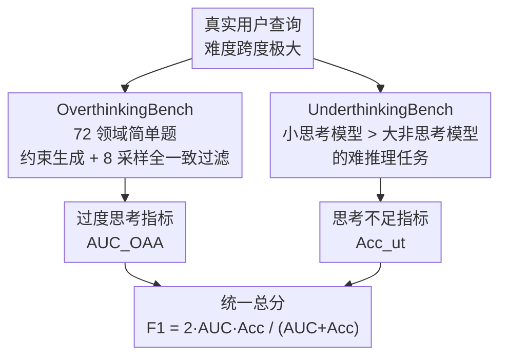

# OptimalThinkingBench: Evaluating Over and Underthinking in LLMs

**会议**: ICLR 2026  
**OpenReview**: [https://openreview.net/forum?id=N5kWa3sRJt](https://openreview.net/forum?id=N5kWa3sRJt)  
**代码**: https://github.com/facebookresearch/RAM/tree/main/projects/otb (有)  
**领域**: LLM推理  
**关键词**: 过度思考, 思考不足, 推理效率评测, 统一基准, thinking-adjusted accuracy

## 一句话总结
本文提出 OptimalThinkingBench，用一个统一基准同时度量 LLM 在简单题上的「过度思考」（生成几百个思考 token 却不提升准确率）和在难题上的「思考不足」，并用 thinking-adjusted accuracy + F1 把两者合成单一分数；对 33 个模型的评测显示没有任何模型能同时做好两端，现有提效方法也几乎都是按下葫芦浮起瓢。

## 研究背景与动机
**领域现状**：用户向 LLM 提的问题难度跨度极大——从「1 米等于多少厘米」到竞赛数学证明。理想的模型应当对简单题秒答、对难题多想。近两年 DeepSeek-R1、o1 这类「思考型」模型靠长链思考（CoT）在难推理上大幅领先，于是厂商普遍同时放出 thinking 与 non-thinking 两个变体。

**现有痛点**：思考型模型在简单题上**过度思考**——对「钢棒 1 米长是多少厘米」也要生成几百上千个思考 token，徒增延迟和成本，有时甚至降低准确率；而非思考型模型在难题上**思考不足**，即使参数远大于一个小思考模型也答不对。

**核心矛盾**：把「该不该想、想多久」的决策权甩给了终端用户——用户得自己在两个变体间手动选模型，这在规模化场景里根本不现实。而且学界现有评测要么只测准确率（鼓励过度思考），要么只测效率，没有一个基准能**同时**惩罚过度思考和思考不足。

**本文目标**：构造一个统一基准，(1) 同时量化过度思考与思考不足，(2) 用单一指标排名，(3) 借此评估并对比各种「让模型恰好思考」的方法。

**切入角度**：过度思考和思考不足是同一枚硬币的两面——一个模型只有在「简单题少想、难题多想」两端都达标时才算最优。于是把基准拆成针锋相对的两个子集，再用 F1 强制两端都好才得高分。

**核心 idea**：用「思考预算下的准确率（thinking-adjusted accuracy）」重新定义过度思考维度，配合一个专挑「小思考模型能做、大非思考模型做不了」任务的子集来定义思考不足维度，二者取 F1 得到 OptimalThinkingBench 总分。

## 方法详解

### 整体框架
OptimalThinkingBench 由两个互补子基准拼成：**OverthinkingBench** 装的是简单题（多想没用甚至更差），**UnderthinkingBench** 装的是难推理题（不想就做不对）。两个子集各自全自动合成、可持续扩展以防数据污染；评测时分别得到过度思考指标 $\text{AUC}_\text{OAA}$ 和思考不足准确率 $\text{Acc}_{ut}$，最后取 F1 合成单一总分 $F_1^{otb}$。整条管线的妙处在于：两个子集天然对立，任何只优化一端的模型都会在另一端塌掉，F1 会把它的总分拉到两者中较低的那个附近。

### 关键设计

**1. OverthinkingBench：约束式合成 + 8 采样全一致过滤，逼出「简单到不该想」的题**

为了量化过度思考，需要一批「非思考模型几乎全对、思考模型却白白烧 token」的简单题。直接让 LLM 出题会产出大量退化、雷同的问题，覆盖不到真实查询分布。本文用**约束式生成**：给定约束对 $C=\{D,T\}$（$D$ 是领域、$T$ 是答案类型），让生成器 $L$ 产出满足约束的问答对 $L(C)\to\{(q_i,a_i)\}_{i=1}^n$。领域取自 SuperGPQA 的 72 个学科（力学、量子物理、常识等），答案类型涵盖数值、选择题、单词短语、开放式四类——这种模块化约束既保证覆盖面，又方便后续按领域/答案类型做消融，还能随时换约束重新生成以对抗污染。

光生成不够，合成题的答案对不对、清不清晰、够不够简单都得验证。本文的**过滤**抓住一个原理：真正简单的题应当被反复一致地答对。于是对每道题用另一个模型 $L'$ 采样 $k=8$ 个回答 $L'(q_i)\to\{y_1,\dots,y_k\}$，只有当全部 8 个回答都被 LLM 裁判 $L_{judge}$ 判定与参考答案 $a_i$ 一致（$\forall j:\ L_{judge}(q_i,a_i,y_j)=\text{True}$）才保留。100% 一致这一硬要求同时锁住三个性质：答案正确（多样本互验）、题面无歧义（有歧义会答得发散）、难度足够低（需要推理的题不可能 8 次全对）。过滤后 OvT-General 得 1327 题（每种答案类型约 330 题、每领域约 18 题），OvT-Math 取 MATH 数据集 Level 1–2 的 133 题。

**2. UnderthinkingBench：用「小思考 > 大非思考」的能力差筛选难推理任务**

思考不足维度要的是另一类题：**无论非思考模型多大，都比不过一个小得多的思考模型**——这恰好说明「思考」本身（而非参数量）是解题关键。本文据此筛任务：从 Reasoning Gym 的 100 个推理任务和 4 个数学基准出发，对每个任务评估一个小思考模型 $P^{think}_{small}$（Qwen3-1.7B）和一个大非思考模型 $P^{non\text{-}think}_{large}$（Qwen3-235B-A22B），只保留满足 $P^{think}_{small}-P^{non\text{-}think}_{large}>\lambda$（$\lambda=0.1$）的任务。

筛出来得到 UT-Reasoning（games、algorithms、graphs、arithmetic、geometry、logic 六大类共 11 种任务，每类程序化生成 50 题、合计 550 题）和 UT-Math（AIME'25、HMMT'25 竞赛题共 60 题）。所有题都靠程序化验证器判分：抽取输出里最后一个 `\boxed{}` 交给任务验证器执行（如迷宫最短路任务会模拟路径合法性并和算法最优解比长度），数学题用 math-verify 工具匹配，最终取推理与数学两子集的宏平均。程序化生成的好处是可以不断造更难的新题，跟上模型进步、避免被刷穿。

**3. thinking-adjusted accuracy 与 F1：让指标自己惩罚「想太多」和「想太少」**

普通准确率无法惩罚过度思考，所以本文为 OverthinkingBench 定义 **Overthinking-Adjusted Accuracy**：只统计「思考 token 少于阈值 $t$ 时」的正确样本

$$\text{OAA}_t=\frac{1}{n}\sum_{i=1}^{n}\big(\text{Correctness}_i\cdot \mathbb{I}(\text{ThinkTokens}_i<t)\big)$$

单一阈值 $t$ 不好定（太小思考模型全 0，太大又不罚过度思考），于是对一段预算积分，取曲线下面积：

$$\text{AUC}_\text{OAA}=\int_0^{t_{max}}\frac{\text{OAA}_t}{t_{max}}dt\approx\sum_{t=0}^{t_{max}}\frac{\text{OAA}_t}{t_{max}},\quad t_{max}=1000$$

它的取值范围与准确率可比、易解读，且「答对但想太多」和「不想却答错」两种坏情况都拿低分；因为每条回答的 token 数固定，积分其实退化成简单求和，计算很轻。最后把过度思考侧的 $\text{AUC}_\text{OAA}$ 和思考不足侧的准确率 $\text{Acc}_{ut}$ 合成总分

$$F_1^{otb}=2\cdot\frac{\text{AUC}_\text{OAA}\cdot \text{Acc}_{ut}}{\text{AUC}_\text{OAA}+\text{Acc}_{ut}}$$

F1 的好处是它趋近于两个分量里较低的那个——模型必须两端同时达标才能拿高分，只擅长一端会被另一端拖死。生成、过滤、裁判统一用 Llama-4-Maverick。

## 实验关键数据

### 主实验
评测 33 个开源/闭源、思考/非思考模型（混合模型两种模式都测），下表为代表性结果（指标：$F_1^{otb}$ 越高越好，过度思考侧看 $\text{AUC}_\text{OAA}$，思考不足侧看准确率，token 越少越好）。

| 模型 | $F_1^{otb}$ ↑ | OvB AUC_OAA ↑ | OvB Tokens ↓ | UnB Acc(%) ↑ |
|------|------|------|------|------|
| o3（闭·思考） | **71.1** | 78.6 | 235 | **65.0** |
| GPT-OSS-120B（开·思考） | 68.3 | **83.3** | 154 | 57.9 |
| Sonnet-4（闭·思考） | 64.2 | 71.3 | 706 | 58.3 |
| GPT-OSS-20B（开·思考） | 57.3 | 72.7 | 467 | 47.3 |
| Sonnet-4（闭·非思考） | 48.3 | 97.4 | 0 | 32.1 |
| GPT-4.1（闭·非思考） | 35.4 | 97.1 | 0 | 21.7 |
| Qwen3-235B-A22B（思考） | 23.2 | 14.6 | 1632 | 55.5 |
| Magistral-Small-2506（思考） | 11.2 | 6.4 | 3303 | 42.9 |

### 改进方法对比（以 R1-Distill-Qwen-7B / Qwen3-8B 为底座）

| 方法 | $F_1^{otb}$ ↑ | OvB AUC_OAA ↑ | OvB Tokens ↓ | UnB Acc(%) ↑ |
|------|------|------|------|------|
| R1-Distill-Qwen-7B（基线） | 24.5 | 25.4 | 1172 | 23.6 |
| + AdaptThink（长度奖励整形） | **38.3 (+13.8)** | 77.2 (+51.8) | 211 (-82%) | 25.4 (+1.8) |
| + VeriThinker（验证辅助任务） | 27.4 (+2.9) | 46.2 (+20.8) | 689 (-41%) | 19.4 (-4.2) |
| + L1（长度奖励） | 20.8 (-3.7) | 19.9 (-5.5) | 1037 (-12%) | 21.8 (-1.8) |
| Qwen3-8B + Model Merging | 38.2 (+13.9) | 32.4 (+16.1) | 1024 (-36%) | 46.5 (-1.2) |
| Qwen3（平均） + Trained Router | 46.9 (+20.4) | 55.2 | 876 | 41.7 |
| Qwen3（平均） + Oracle Router | 61.2 | 94.5 | 0 | 45.9 |

### 关键发现
- **没有模型能两端兼顾**：o3 以 71.1 居首、开源最佳 GPT-OSS-120B 为 68.3，除 GPT-OSS 系列外所有开源模型 F1 都低于 50。原因正是大多数模型只在一个子集上强。
- **思考模型在简单题上普遍严重过度思考**：所有思考模型对简单题至少烧 100 个思考 token，多数超 1300，Magistral 超 3300，导致 $\text{AUC}_\text{OAA}$ 远低于其原始准确率；GPT-OSS-120B/o3 仅 154/235 token 是例外。
- **提效方法几乎都是顾此失彼**：6 个「模型+提效方法」组合里有 5 个在 UnderthinkingBench 上掉分（最多掉 13%），2 个组合总 F1 反而变差；只有 AdaptThink 是干净的提升。且数学上的提效（如 AdaptThink 省 82% token）迁移到非数学任务时明显缩水（只省 37%）。
- **路由仍有大缺口**：训练好的难度路由器比单一模式最优高 20.4%，但离 oracle 路由（61.2）仍差约 15%。
- **提示词能小幅调节**：加「Don't Overthink」后缀平均省 23% token 且不掉准确率（F1 +7.7）；而常见的「Let's think step-by-step」反而加剧过度思考、token +10% 且小幅掉分（F1 -8.0）。
- **思考量与难度脱钩**：在 OvT-General 上模型对 STEM 领域（工程、经济）想得更多，但思考长度与准确率无相关（Spearman $\rho=-0.46$）；数值类答案触发的过度思考远多于选择/开放式，哪怕那只是简单事实题。

## 亮点与洞察
- **AUC 形式的指标设计很巧**：用「思考预算阈值」做横轴对 OAA 积分，一举绕开「单阈值难定」的难题，又让指标天然同时惩罚「想太多」和「不想就错」，而且因 token 数固定积分退化成求和、几乎零额外成本。
- **用 F1 当总分是点睛之笔**：F1 趋近于两分量较小者，强制模型两端都达标，从机制上杜绝了「只优化一端刷分」，比简单加权平均诚实得多。
- **两个子集都是全自动合成 + 可程序化扩展**：约束生成 + 8 采样全一致过滤、以及「小思考 > 大非思考」的任务筛选原则，都能在模型变强后重新生成更难的题，是天然的抗污染设计，可迁移到任何需要持续更新的能力评测。
- **「step-by-step 反而更糟」的反直觉发现**：对思考型模型，经典的 CoT 提示词只会火上浇油，提醒大家提示工程在思考模型时代要重新校准。

## 局限与展望
- 生成、过滤、裁判全用 Llama-4-Maverick 一个模型，LLM-as-a-Judge 与生成同源可能引入系统性偏差，过滤的「100% 一致」也以裁判可靠为前提。
- OverthinkingBench 把「简单」操作化为「8 次全对」，可能漏掉一类「简单但模型偶尔出错」的真实查询；难度完全由模型一致性界定而非人工。
- UnderthinkingBench 的任务筛选锚定在特定的小/大模型对（Qwen3-1.7B vs 235B）和阈值 $\lambda=0.1$，换一对参照模型筛出的任务集会不同，跨论文比较需谨慎。
- 思考 token 的统计依赖各模型显式的思考标记（如 `<think>` 标签），对不显式标注思考过程的模型不一定可比。
- 改进方法均为「拿现成权重直接评测、不重训」，AdaptThink 等方法的真实上限可能被低估。

## 相关工作与启发
- **vs 纯准确率推理基准（MATH / AIME 等）**: 它们只奖励答对、默许甚至鼓励长思考；本文用 $\text{AUC}_\text{OAA}$ 把「思考成本」纳入指标，第一次把过度思考量化进评测。
- **vs 高效推理方法（L1 / AdaptThink / VeriThinker / Model Merging）**: 这些是「解法」，本文是「考卷」——并把它们放到统一基准上一测，发现多数只压低了 OverthinkingBench 的 token 却牺牲了 UnderthinkingBench 的准确率，暴露出它们的隐藏代价。
- **vs 难度路由（Tran et al. 2025 的 router）**: 路由把「该不该想」外包给一个分类器，本文证明它确实有效（+20.4%）但离 oracle 仍差约 15%，说明通用难度判别本身仍是开放问题。

## 评分
- 新颖性: ⭐⭐⭐⭐⭐ 首个同时量化过度/思考不足并用 F1 强制两端达标的统一基准，指标设计有原创性。
- 实验充分度: ⭐⭐⭐⭐⭐ 评测 33 个模型，系统对比奖励整形/模型融合/路由/提示词四类改进方法并给出诊断性分析。
- 写作质量: ⭐⭐⭐⭐ 动机清晰、指标推导完整；子基准与附录细节较多但主线易读。
- 价值: ⭐⭐⭐⭐⭐ 直击「思考型 vs 非思考型割裂」这一当下核心痛点，为「最优思考」统一模型提供了可持续、抗污染的评测底座。

<!-- RELATED:START -->

## 相关论文

- [\[ICLR 2026\] OpenEstimate: Evaluating LLMs on Reasoning Under Uncertainty with Real-World Data](openestimate_evaluating_llms_on_reasoning_under_uncertainty_with_real-world_data.md)
- [\[ICML 2026\] Evaluating Relational Reasoning in LLMs with REL](../../ICML2026/llm_reasoning/evaluating_relational_reasoning_in_llms_with_rel.md)
- [\[ICLR 2026\] When More Is Less: Understanding Chain-of-Thought Length in LLMs](when_more_is_less_understanding_chain-of-thought_length_in_llms.md)
- [\[ICLR 2026\] Plan and Budget: Effective and Efficient Test-Time Scaling on Reasoning LLMs](plan_and_budget_effective_and_efficient_test-time_scaling_on_reasoning_large_lan.md)
- [\[ICLR 2026\] On Code-Induced Reasoning in LLMs](on_code-induced_reasoning_in_llms.md)

<!-- RELATED:END -->
