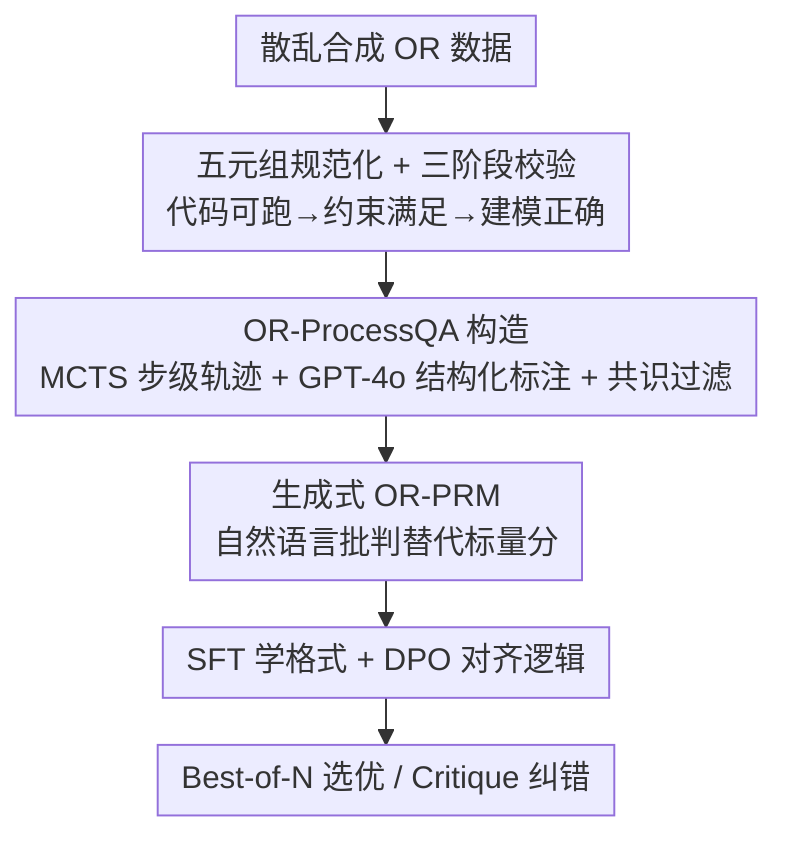

# OR-PRM: A Process Reward Model for Algorithmic Problem in Operations Research

**会议**: ICLR 2026  
**OpenReview**: [https://openreview.net/forum?id=tFEAzYdz92](https://openreview.net/forum?id=tFEAzYdz92)  
**代码**: 无  
**领域**: LLM推理  
**关键词**: 过程奖励模型, 运筹优化, 步级监督, 数据合成, 生成式PRM

## 一句话总结
针对运筹优化（OR）建模任务，作者发现现有 OR 数据集超过 30% 的标注严重错误，导致直接训练的 PRM 几乎失效；他们先用三阶段校验清洗出干净种子数据，再用 MCTS + GPT-4o 构造首个带步级正误标注的 OR-ProcessQA 数据集，训练出首个面向 OR 的生成式过程奖励模型 OR-PRM，在 Best-of-N 设置下让基座模型平均提升约 12.5%。

## 研究背景与动机
**领域现状**：过程奖励模型（PRM）通过给推理过程的每一步打分而非只看最终答案，已经在数学、编程等领域显著提升了 LLM 的推理可靠性，并广泛用于 Best-of-N 采样和离线数据筛选。运筹优化要把自然语言描述的决策问题翻译成可被求解器处理的数学模型，既要最终答案正确、又要每一步逻辑自洽，看上去是 PRM 的天然战场。

**现有痛点**：作者真的去训练第一个面向 OR 的 PRM 时，结果远低于预期，即便换上最强的 LLM 骨干也救不回来。系统排查后定位到根因不在模型而在数据：现有 OR 数据集质量"危险地不可靠"——IndustryOR 这类数据集里超过 30% 的样本最终答案就是错的，更别提大量不完整、含噪声的中间推理步骤。这种噪声让 PRM 根本学不到"忠实的推理"，只会学出看着合理、却悄悄违反隐藏约束或破坏逻辑的解。

**核心矛盾**：PRM 训练高度依赖步级正误标签，而 OR 领域既没有大规模步级监督数据、现有数据的最终答案本身又大面积错误，"用脏数据训不出能判脏数据的裁判"形成死锁。

**本文目标**：（1）造出一批最终答案可信、且带可靠步级标注的 OR 数据；（2）在其上训练出能逐步评估并纠正 OR 推理的 PRM；（3）验证过程级监督确实能提升 LLM 在 OR 上的可靠性。

**切入角度**：与其在脏数据上硬训，不如先把"数据可信度"这块地基夯实——用可执行求解器代码作为客观判据来过滤种子数据，再用搜索 + 强模型交叉验证生成步级标注。

**核心 idea**：先用"代码能跑通 + 约束满足 + 建模正确"三道闸清洗出干净种子，用 MCTS 扩展出多样推理轨迹、GPT-4o 做结构化步级标注、并用两者标签一致性做共识过滤，最终训练一个输出自然语言批判与修正（而非单一标量分数）的生成式 OR-PRM。

## 方法详解

### 整体框架
整篇方法围绕一条三阶段流水线：**先建干净种子数据 → 再扩成带步级标注的 OR-ProcessQA → 最后训练生成式 OR-PRM**。输入是散落在各处、质量参差的合成 OR 数据，输出是一个能对 OR 推理每一步给出"哪里错、为什么错、该怎么改"的裁判模型。第一阶段用统一的五元组表示 + 求解器代码 + 三阶段校验，把噪声样本过滤掉，得到可信但只够做 SFT 的种子；第二阶段在种子上用 MCTS 采样多条解题轨迹拿到步级正误标签，再用 GPT-4o 独立复核每一步并产出结构化反馈，两者标签一致才保留；第三阶段先 SFT 教会模型"按四组件顺序生成批判"的格式，再用 DPO 把"格式对但逻辑虚"的输出对齐到真正可靠的判断。

### 关键设计

**1. 五元组规范化 + 三阶段校验种子数据：用"代码能跑通"当客观判据过滤噪声**

OR 数据脏在最终答案和中间步骤都可能错，而人工核验代价高。作者沿用 LLMOPT 作为生成策略，把每个问题统一表示成标准五元组 $p=(S,\theta,x,f(x),g(x)\le c)$，其中 $S$ 是指标集、$\theta$ 是参数、$x$ 是决策变量、$f(x)$ 是目标、$g(x)\le c$ 是约束，整体定义了规范形式的优化任务 $\min_x f(x)\ \text{s.t.}\ g(x)\le c$。这种"求解器无关"的结构让自动校验成为可能：先由 LLMOPT 直接为每个五元组生成求解器代码，再过三道闸——**代码执行**（代码要无报错跑出结果，并把数值解 $\hat{x}$ 当作后续校验的 ground truth）、**约束满足**（用 Qwen3-8B 作为推理验证器，把 $\hat{x}$ 代回 $g(x)\le c$ 做符号/数值替换检查是否全部满足）、**建模正确**（用 GPT-4o 判断五元组是否忠实反映原始问题语义）。三关全过才保留。关键在于：可执行代码把"对不对"从主观判断变成了可自动复现的客观信号，这是后面一切标注可信的前提。

**2. OR-ProcessQA：MCTS 采样 + GPT-4o 结构化标注 + 双重共识过滤**

种子数据只能支撑 SFT，训不了 PRM——PRM 需要的是"每一步正误"的标签。作者沿 OmegaPRM 思路，对种子问题用 MCTS 采样多条解题轨迹：正确步标 1.0，失败路径中的首个错误步标 0.0，得到超过 55 万条标注步的原始数据。但 MCTS 标签仍可能有偏，于是再用 GPT-4o 对每个候选步做结构化复核：模型按固定顺序检查 (1) 参数定义 → (2) 目标与约束 → (3) 生成代码 → (4) 执行输出，一旦发现首个错误就停止，并输出四个结构化字段——Issue（错误的自然语言描述）、Judgement（Correct/Incorrect 二元标签）、Corrected Version（出错组件的修正内容）、Corrected Step（融入修正后的完整推理步）。最后做**共识过滤**：只有当 $\text{Label}_{\text{MCTS}}(s)=\text{Label}_{\text{GPT-4o}}(s)$ 时才保留该步。两路独立标签互为交叉验证，把"搜索给的标签"和"强模型给的标签"对齐，显著压低噪声，得到首个规模与精度兼顾的 OR 步级监督数据集。

**3. 生成式 PRM：用自然语言批判替代标量分数**

传统 PRM 给每步打一个标量分，再用加权和或取最小值聚合成最终奖励。但 OR 任务要分析变量关系（$x$ over $S$）、约束满足（$g(x)\le c$）、目标 $f(x)$ 的逻辑结构，还要识别代码里的语法/逻辑 bug——一个标量数字根本装不下这些信息，尤其当代码必须对齐规范形式 $\min_x f(x)\ \text{s.t.}\ g(x)\le c$ 时。受 GM-PRM 启发，作者改用生成式建模：给定问题 $p$ 及其分步解，模型顺序分析四个组件——(1) 变量定义（$x$ over $S$，由 $\theta$ 参数化）、(2) 目标 $f(x)$ 与约束 $g(x)\le c$、(3) 代码实现、(4) 最终输出，对每个组件产出简短的意图陈述、聚焦关键问题的分析和一个二元判断；若任一组件被判错，只对**第一个**有缺陷的部分输出修正版本。它还把代码细分为"正确代码 / 可运行但有错的代码 / 不可运行的代码"，给出可操作的精修指引，而不是冷冰冰一个分数——这正是它能既评最终答案、又评每个中间步的关键。

**4. SFT + DPO 两阶段训练：先学格式，再对齐逻辑**

只做 SFT 会得到"格式正确但逻辑不可靠"的模型，因为它只是在模仿样例、没有真正理解。所以训练分两阶段。**SFT** 用标准自回归下一 token 预测，把问题描述 + 候选解作为输入、把数据标注阶段生成的完整结构化批判（含 Issue/Judgement/Corrected Version/Corrected Step 四字段）作为目标，损失为
$$\mathcal{L}_{\text{SFT}}(\theta)=-\mathbb{E}_{(x,y)\sim D_{\text{SFT}}}\left[\sum_{t=1}^{T}\log P_\theta(y_t\mid x,y_{<t})\right]$$
教会模型生成批判的格式与风格。**对齐阶段**用 DPO：重新跑 SFT 模型的推理、找出它产生错误或较差推理的失败样例，构造偏好对 $(x,y_w,y_l)$（$y_w$ 是正确/更优的推理步，$y_l$ 是 SFT 模型生成的有缺陷步），优化
$$\mathcal{L}_{\text{DPO}}(\pi_\theta;\pi_{\text{ref}})=-\mathbb{E}_{(x,y_w,y_l)\sim D}\left[\log\sigma\left(\beta\log\frac{\pi_\theta(y_w\mid x)}{\pi_{\text{ref}}(y_w\mid x)}-\beta\log\frac{\pi_\theta(y_l\mid x)}{\pi_{\text{ref}}(y_l\mid x)}\right)\right]$$
其中 $\beta$ 控制偏好强度、$\sigma$ 是 logistic 函数。DPO 不需要单独的奖励模型，就把模型从"会装"推向"真判得对"，消融显示它带来 +8.0% 的平均提升。

### 一个完整示例
以 Best-of-N（N=8）为例走一遍推理期用法：基座模型用温度 1.0 生成 8 条不同的 CoT 推理路径；OR-PRM 对每条路径的每一步判 correct/incorrect，统计正确步数最多的那条路径作为最终输出，从而挑出最连贯、最可信的推理轨迹。另一种用法是 Modeling–Critique–Code 流水线：模型先做分步形式化建模 → OR-PRM 逐步批判指出潜在错误 → 把原建模与批判拼接后回灌模型，引导它生成满足输入输出规范的可执行 Python 代码，形成一个"自纠错、面向实现"的迭代反馈闭环。

## 实验关键数据

### 主实验
在六个清洗过的 OR 基准（IndustryOR、Easy-LP、Complex-LP、NL4LP、NL4OPT、ReSocratic）上，以 OR-PRM 作裁判做 Best-of-8 选优，相对各基座模型一致涨点（下表 Overall 为六基准平均）：

| 模型 | IndustryOR | Easy-LP | Complex-LP | NL4OPT | Overall |
|------|-----------|---------|-----------|--------|---------|
| Qwen2.5-7B | 19.0 | 49.7 | 12.6 | 41.3 | 34.9 |
| + OR-PRM | 23.8 | 61.8 | 16.2 | 52.1 | **42.9** (+8.0) |
| Qwen2.5-14B | 35.7 | 66.2 | 3.6 | 61.0 | 48.8 |
| + OR-PRM | 45.2 | 89.4 | 12.6 | 67.6 | **61.3** (+12.5) |
| Qwen2.5-32B | 47.6 | 80.0 | 8.2 | 68.5 | 59.6 |
| + OR-PRM | 57.1 | 96.0 | 32.4 | 74.2 | **70.3** (+10.7) |
| LLMOPT | 52.4 | 96.0 | 48.6 | 81.7 | 73.6 |
| + OR-PRM | 59.5 | 97.8 | 67.6 | 85.0 | **80.5** (+6.9) |

14B 模型平均提升最高（+12.5%）；在最难的 Complex-LP 上 Qwen2.5-32B 绝对涨 24.2%，连已为 OR 高度优化的 LLMOPT 也在 Complex-LP 上再涨 19.0%。Modeling-Critique-Code 流水线下，Qwen2.5-14B 在 Complex-LP 的 pass@1 从 3.6% 升到 27.0%（+23.4%）、pass@8 从 23.4% 升到 59.5%（+36.1%），GPT-4o 也分别再涨 8.1% / 6.3%。

### 消融实验
在 Qwen2.5-14B 上分析 DPO 与不同难度表现（Average 为 Easy-LP / Complex-LP 平均）：

| 配置 | Easy-LP | Complex-LP | Average | 说明 |
|------|---------|-----------|---------|------|
| Pass@8（上界） | 94.7% | 23.4% | 59.1% | 8 次采样理论上界 |
| OR-PRM (Ours, SFT+DPO) | 89.4% | 12.6% | 51.0% | 完整模型 |
| OR-PRM (SFT only) | 79.6% | 6.3% | 43.0% | 去掉 DPO，掉 8.0% |
| self-consistency (filtered null) | 88.3% | 9.9% | 49.6% | 过滤无效解后多数投票 |
| self-consistency | 50.8% | 3.6% | 27.2% | 朴素多数投票 |
| Qwen2.5 (Zero shot) | 72.1% | 9.9% | 41.0% | 未训练基座 |

### 关键发现
- DPO 是关键一环：SFT-only 仅 43.0%，加 DPO 后到 51.0%（+8.0%），印证"SFT 学格式、DPO 才对齐逻辑"的设计动机。
- OR-PRM 在 Easy 和 Complex 两端都稳定超过多数投票基线，说明它确实能识别推理路径中的大部分错误，而非只在简单题上取巧。
- 越难的任务收益越大（Complex-LP 上多个模型涨幅最高），表明过程级反馈对"看似合理却违反隐藏约束"的复杂建模错误尤其有效。

## 亮点与洞察
- **把"数据可信"做成可执行的客观判据**：用"求解器代码能跑通 + 约束代回满足 + 建模语义正确"三关过滤，把 OR 标注从主观判断变成可自动复现的信号，这套思路可迁移到任何"答案可被程序验证"的领域（如定理证明、SQL 生成）。
- **双路标签共识过滤**：MCTS 搜索标签与 GPT-4o 复核标签必须一致才保留，用两个独立来源互验来压噪声，比单靠任一来源都更稳，是构造高质量步级数据的实用配方。
- **生成式批判 + 只修第一处错**：输出自然语言 Issue/Judgement/Corrected Version/Corrected Step 四字段、且只修第一个出错组件，既可解释又便于迭代纠错，比单标量分数信息量大得多。
- **裁判即纠错器**：OR-PRM 不只用于 Best-of-N 选优，还能在 Modeling-Critique-Code 闭环里直接驱动模型自我修正，把"评估"和"改进"统一进一个模型。

## 局限与展望
- 作者承认缺乏可比对象：现有 OR 数据集无法用于 PRM 训练，导致 OR-ProcessQA 上的结果难以与他人横向对比，可信度论证主要靠内部消融。
- Best-of-N 虽强，但仍明显低于理论上界（Pass@8 的 59.1% vs OR-PRM 的 51.0%），作者归因于数据集与模型规模仍偏小，计划扩充数据以提升对细微推理错误的辨别力。
- 自评局限：清洗与标注重度依赖 GPT-4o 与 LLMOPT，若这些上游模型在某类问题上系统性出错，过滤与标注会同步带偏；五元组表示对超出该范式的 OR 问题（如随机规划、强非线性）覆盖度存疑。
- 改进思路：增加问题类型与求解器环境的多样性、引入更强或多样化的验证器降低对单一标注模型的依赖。

## 相关工作与启发
- **vs 传统标量 PRM（Skywork-PRM / Qwen2.5-Math-PRM）**：它们给每步打一个标量分再聚合，主攻数学/科学/编程且常在分布外推理上失效；本文改成生成式自然语言批判，并专为 OR 的变量-约束-目标-代码四组件结构定制，信息量与可解释性更高。
- **vs RetrievalPRM / Fin-PRM**：同属"把 PRM 推向垂直域/增强泛化"的路线，但前者靠检索、后者面向金融；本文强调垂直域 PRM 必须配套合成领域专属数据 + 训练，并给出 OR 上的完整数据-训练方案。
- **vs OR 数据合成（OR-Instruct / ReSocratic / OptiMath）**：这些方法侧重生成更多问题或从形式化反向构造，本文则先正视"现有基准错误率高达 50%+"的质量危机，把重点放在清洗与步级标注，首次提供可训练 PRM 的步级正误监督。

## 评分
- 新颖性: ⭐⭐⭐⭐ 首个面向 OR 的过程奖励模型与首个 OR 步级监督数据集，问题定位（数据质量瓶颈）切中要害。
- 实验充分度: ⭐⭐⭐⭐ 六基准 + 两种推理设置 + 多尺度模型 + DPO 消融，覆盖较全；但缺乏与其他 PRM 的直接对比（作者也承认）。
- 写作质量: ⭐⭐⭐ 思路清晰、图表完整，但正文有重复句与少量数字表述瑕疵。
- 价值: ⭐⭐⭐⭐ 提供了一套"数据清洗 + 步级标注 + 生成式 PRM"的可复用方案，对 OR 乃至其他可验证推理域有借鉴意义。

<!-- RELATED:START -->

## 相关论文

- [\[ICLR 2026\] StepORLM: A Self-Evolving Framework with Generative Process Supervision for Operations Research Language Models](steporlm_a_self-evolving_framework_with_generative_process_supervision_for_opera.md)
- [\[ICLR 2026\] Why is Your Language Model a Poor Implicit Reward Model?](why_is_your_language_model_a_poor_implicit_reward_model.md)
- [\[ICML 2026\] GRPO is Secretly a Process Reward Model](../../ICML2026/llm_reasoning/grpo_is_secretly_a_process_reward_model.md)
- [\[ICLR 2026\] Optimal Aggregation of LLM and PRM Signals for Efficient Test-Time Scaling](optimal_aggregation_of_llm_and_prm_signals_for_efficient_test-time_scaling.md)
- [\[ICLR 2026\] Linking Process to Outcome: Conditional Reward Modeling for LLM Reasoning](linking_process_to_outcome_conditional_reward_modeling_for_llm_reasoning.md)

<!-- RELATED:END -->
