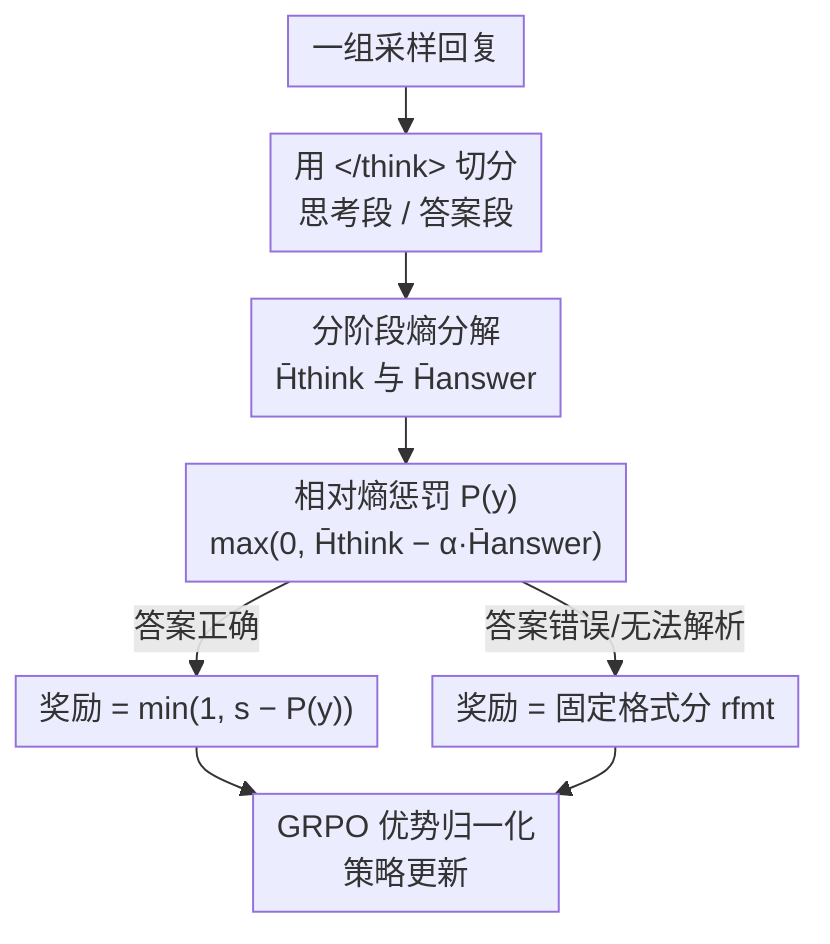

# PEAR: Phase Entropy Aware Reward for Efficient Reasoning

**会议**: ICLR 2026  
**OpenReview**: [https://openreview.net/forum?id=HLc2igXEA3](https://openreview.net/forum?id=HLc2igXEA3)  
**代码**: https://github.com/iNLP-Lab/PEAR  
**领域**: LLM推理  
**关键词**: 高效推理, 熵奖励, GRPO, 思考阶段, 长度压缩

## 一句话总结
本文发现大推理模型（LRM）的 token 熵与回复长度正相关、且「思考阶段」熵远高于「最终答案阶段」，据此提出 PEAR——一个把分阶段熵塞进 GRPO 奖励里的奖励机制：惩罚思考阶段的过高熵、对答案阶段保留适度探索，在六个 benchmark 上把回复长度砍掉 32%–57% 而准确率几乎不变（掉点 <1%），且对训练分布外任务有很强鲁棒性。

## 研究背景与动机
**领域现状**：以 DeepSeek-R1、Qwen3、QwQ 为代表的大推理模型靠显式「思考阶段」（`<think>...</think>` 之间的长链 CoT）大幅提升复杂推理能力，已成为数学/科学推理的主流范式。

**现有痛点**：这些模型倾向于生成冗长的思维链，充斥重复计算和啰嗦解释，推高推理成本、损害可用性。如何「让模型少想但不掉点」是公认的难题。

**核心矛盾**：现有压缩方法主要靠「在过滤后的简短数据上继续训练」——把训练语料改成短推理轨迹，用监督信号硬性约束长度。但这样做有两个根本问题：一是过死的监督让模型难以适应新推理风格或分布外（OOD）问题（这些问题的最优推理长度可能完全不同）；二是会连带丢掉一些本可提升准确率的中间推理。换言之，「数据级硬约束」和「推理灵活性」之间存在 trade-off。

**本文目标**：找到一个不依赖人工筛数据、不设显式长度目标、不做硬截断的自适应机制，让模型自己学会精简推理。

**切入角度**：作者把目光投向 token 级熵（预测分布的不确定度）。已有工作发现高熵段对应探索性推理、低熵段对应确定性计算，但「熵与高效推理的联系」一直被忽略。作者做了系统实证：(1) 跨模型规模和 benchmark，平均熵与回复长度一致正相关；(2) 这种关系在不同推理阶段不均匀——思考阶段熵显著高于答案阶段；(3) 过滤掉一定比例的高熵 token，模型性能在某个比例内不受影响，说明过量熵可以被剪掉而不伤推理质量。

**核心 idea**：把熵当成控制推理冗余的「旋钮」——在奖励里惩罚思考阶段的过量熵、允许答案阶段保留适度熵，从而软性、自适应地压缩推理长度。

## 方法详解

### 整体框架
PEAR 不改 RL 算法骨架，只改 GRPO 里每条采样回复的标量奖励。GRPO 通过对同一 prompt 的一组回复做奖励归一化来估计优势、省掉 critic 模型，原始奖励是规则化的二值信号（答对得 1、答错得 0）。PEAR 的核心改动是：在「答对」这个前提下，再用一个由分阶段熵算出的惩罚项去微调奖励，让答对的回复中「思考阶段熵越低、越简洁」的那些拿到更高奖励。整条流程是：采样一组回复 → 用 `</think>` token 把每条回复切成思考段和答案段 → 分别算两段的平均熵 → 组合成分阶段惩罚项 → 在答对时从基础分里扣掉这个惩罚、答错则给固定的格式分 → 把新奖励喂回 GRPO 的优势归一化。

### 关键设计

**1. 分阶段熵分解：把探索和收敛分开度量**

针对的痛点是——以往要么把所有 token 的熵一视同仁，要么干脆不用熵，导致无法区分「该探索的思考阶段」和「该确定的答案阶段」。PEAR 以 `</think>` 闭合 token 的位置 $k$ 为界，把一条回复 $y=(y_1,\dots,y_T)$ 切成两段，分别在旧策略 $\pi_{\theta_{old}}$ 下计算逐 token 熵 $H_t = -\sum_{v\in V}\pi_{\theta_{old}}(v\mid y_{<t})\log\pi_{\theta_{old}}(v\mid y_{<t})$，再求两段的平均熵（都排除 `</think>` 本身）：

$$\bar H_{think}=\frac{1}{k-1}\sum_{t=1}^{k-1}H_t,\qquad \bar H_{answer}=\frac{1}{T-k}\sum_{t=k+1}^{T}H_t.$$

这一步之所以有效，是因为前置实证已经证明两段熵的统计性质截然不同（思考段高、答案段低），分开度量才能「只压思考段的冗余探索，而不误伤答案段的必要灵活性」。

**2. 相对熵惩罚项：用答案熵做基准，防止熵塌缩刷分**

如果直接惩罚 $\bar H_{think}$ 的绝对值，模型会发现「把整体熵无差别压到最低」就能最大化奖励，从而触发 reward gaming——所谓「熵塌缩」，模型过早收敛、推理变脆、准确率掉。PEAR 的做法是把惩罚定义成两段熵之差：

$$P(y)=\max\big(0,\ \bar H_{think}-\alpha\,\bar H_{answer}\big).$$

减去 $\alpha\bar H_{answer}$ 不是要鼓励答案不确定，而是把思考段熵「相对化」——拿「正确表述一个答案所需的自然熵水平」当基准来归一，于是惩罚只在思考段熵相对答案段「不成比例地大」时才真正激活。外层 $\max(0,\cdot)$ 保证惩罚非负，让组合奖励留在 GRPO 惯用的 $[0,1]$ 区间内、避免优势被病态放大。

**3. 阶段感知奖励与边界处理：只在答对时做熵塑形**

把惩罚接回奖励时，PEAR 只在答案正确时启用熵塑形，答错则给固定格式分。给定正确答案的基础分 $s\in(0,1]$、错误/格式不良时的格式分 $r_{fmt}\in[0,1)$，奖励为：

$$r(y)=\begin{cases}\min\big(1,\ s-P(y)\big), & \text{抽取答案 = 标准答案}\\ r_{fmt}, & \text{否则}\end{cases}$$

随后用 $r(y_i)$ 替换 GRPO 优势公式里的 $r_i$，归一化 $A_i=\frac{r(y_i)-\mathrm{mean}(\{r(y_j)\})}{\mathrm{std}(\{r(y_j)\})}$，策略更新仍用与 GRPO 完全相同的 clipped-surrogate 目标。这样设计保证了正确性始终是主导信号、熵项只是「正确回复之间的二阶偏好」。边界情况也处理得很干净：若回复缺 `</think>`，则令 $k=T$、$\bar H_{answer}=0$（只有思考段熵生效）；若答案无法解析，直接给 $r_{fmt}$。由于缺闭合 token 的回复绝大多数本就残缺/错误，会落入错误类拿固定分，这个 fallback 不会让坏回复系统性地骗到高奖励。

### 损失函数 / 训练策略
基础算法是 GRPO，目标函数为带 KL 正则的 clipped-surrogate：

$$J_{GRPO}(\theta)=\mathbb{E}\Big[\tfrac{1}{G}\sum_{i=1}^{G}\tfrac{1}{|o_i|}\sum_{t}\big(\min[r_{i,t}\hat A_{i,t},\ \mathrm{clip}(r_{i,t},1-\epsilon,1+\epsilon)\hat A_{i,t}]-\beta D_{KL}(\pi_\theta\|\pi_{ref})\big)\Big]$$

PEAR 不动这个目标，只把样本级标量奖励换成 $r(y)$。训练用 verl 框架、GSM8K 训练集的 7,473 条样本，batch size 128，学习率 $1\times10^{-6}$，答案阶段熵系数 $\alpha=1$。

## 实验关键数据

### 主实验
三个规模的 LRM（DeepSeek-R1-Distill-Qwen-1.5B、Qwen3-4B、Qwen3-8B），六个 benchmark 上 Acc@1 与生成 token 数的平均结果（↓为相对各模型 Original 行的 token 缩减）：

| 模型 | 方法 | 平均 Acc | 平均 Tok | Tok 缩减 |
|------|------|----------|----------|----------|
| DS-1.5B | Original | 55.73 | 4805 | — |
| DS-1.5B | LCPO | 56.03 | 3591 | ↓25.3% |
| DS-1.5B | **PEAR** | 56.45 | **3250** | **↓32.4%** |
| Qwen3-4B | Original | 74.85 | 7428 | — |
| Qwen3-4B | LCPO | 74.65 | 4485 | ↓39.6% |
| Qwen3-4B | **PEAR** | 74.27 | **3221** | **↓56.6%** |
| Qwen3-8B | Original | 77.48 | 6845 | — |
| Qwen3-8B | Step Entropy | 76.85 | 4738 | ↓30.8% |
| Qwen3-8B | **PEAR** | 77.56 | **3200** | **↓53.3%** |

PEAR 在所有模型上都取得最大的长度缩减，平均掉点仅 0.58%。值得注意的是 Qwen3-8B 上 PEAR 反而把平均准确率从 77.48 微升到 77.56，同时砍掉一半以上 token；而 Step Entropy / LCPO 虽也压短，却各掉了约 3.3 个点。越大的模型「过度解释」越严重，从 PEAR 受益越多（4B/8B 都 >50% 缩减）。

### 消融实验
关键超参 $\alpha$ 在 Qwen3-4B 上的影响（答案阶段熵系数）：

| $\alpha$ | 准确率(%) | 平均 Tokens | 说明 |
|----------|-----------|-------------|------|
| -1.0 | 73.5 | 2307 | 两段都被罚，过度约束、短但不可靠 |
| 0.0 | 77.4 | 2843 | 只压思考段、忽略答案段，丢失答案灵活性、掉点 |
| 0.5 | 78.1 | 3098 | — |
| **1.0** | **80.5** | 3498 | 稳定最优工作点：压冗余又保性能 |
| 2.0 | 79.9 | 3612 | 惩罚过弱、退化回 baseline |

### 关键发现
- **冗余集中在思考阶段**：熵过滤实验（Qwen3-4B）显示，保留 80%/60% 低熵 token 时准确率稳定甚至提升（88.2%、87.1% vs baseline 81.1%），只有压到 40% 以下才骤降；且答案段长度几乎不随过滤变化——证明高熵冗余几乎全在思考段。
- **PEAR 同时砍「步数」和「每步 token」**：训练后 Qwen3-4B 推理步数和平均每步 token（50.1→35.7）都下降，且缩减集中在思考阶段，AIME24 上思考步数砍掉一半以上。
- **熵的相对调整**：训练后整体熵下降，但思考段降幅最大、答案段反而略升——印证了「压探索、保收敛」的设计意图。
- **$\alpha\approx1$ 的鲁棒性**：$\alpha$ 太小→过激压熵导致过早收敛掉点；太大→惩罚失效退回 baseline；中间 $\alpha\approx1$ 在各 benchmark 和模型规模上一致稳定。
- **OOD 鲁棒**：仅在 GSM8K 上训练，却在数学（MATH500/AIME24/AMC23）和知识类（GPQA/MMLU）六个 benchmark 上都稳定提效不掉点，说明分阶段熵是「领域无关」的通用控制信号。

## 亮点与洞察
- **把「内部信号」变成「奖励旋钮」**：PEAR 最妙的地方是没引入任何外部长度标签或截断规则，而是利用模型自身的熵——一个本就可得的内部量——来软性引导，因此天然 OOD 友好。这种「拿模型内部状态做 reward shaping」的思路可迁移到其他需要自适应控制的 RL 任务。
- **相对化防 reward gaming**：用 $\bar H_{answer}$ 给 $\bar H_{think}$ 做基准、而非惩罚绝对熵，是个很轻但很关键的设计——它直接堵住了「熵塌缩刷分」这个 RL 奖励工程常见陷阱，值得记住。
- **二阶偏好的奖励结构**：「正确性主导 + 熵作为正确回复间的二阶偏好」这种分层奖励设计很优雅，保证了压缩不会以牺牲正确性为代价，是高效推理奖励设计的一个可复用模板。

## 局限与展望
- **依赖思考/答案的显式分界**：方法强绑定 `</think>` token，对没有显式思考阶段标记的模型或自由格式推理不直接适用；缺 token 时退化为只用思考段熵，是个粗糙 fallback。
- **训练集单一**：只用 GSM8K（小学数学）训练，虽展示了 OOD 鲁棒，但训练分布的多样性有限，更复杂/长程任务上的表现仍待验证。
- **$\alpha$ 仍需调**：虽然 $\alpha\approx1$ 普适，但它是个需要按模型/任务微调的全局超参，没有做到完全自适应。
- **熵作为代理的边界**：熵≈冗余的假设在大多数情况成立，但某些任务里高熵可能恰是必要的多路探索，过度压熵的风险需要更细粒度的判别。

## 相关工作与启发
- **vs 数据过滤式压缩（SFT on filtered data）**：他们改训练语料、用短轨迹硬约束模型；PEAR 不动数据，靠奖励软性引导，因而保留了对新推理风格和 OOD 问题的适应力，也不会连带丢掉有用的中间推理。
- **vs LCPO（长度控制策略优化）**：LCPO 要用户指定长度约束、显式优化长度合规；PEAR 无需任何长度目标，靠熵自适应决定该压多少，且在大模型上同时取得更大压缩和更小掉点。
- **vs Step Entropy**：Step Entropy 用两阶段训练 + 插入 `[SKIP]` token 来压 CoT；PEAR 不改生成机制、只改 reward，更轻量，且在 Qwen3-8B 上压得更狠还不掉点（Step Entropy 掉 3.3 点）。

## 评分
- 新颖性: ⭐⭐⭐⭐ 「分阶段熵 + 相对化惩罚」的奖励设计角度新颖，且有扎实的前置实证支撑
- 实验充分度: ⭐⭐⭐⭐ 三规模 ×六 benchmark + 熵过滤/超参/步数分析，OOD 验证完整
- 写作质量: ⭐⭐⭐⭐ 从观察到方法的逻辑链清晰，公式与边界情况交代到位
- 价值: ⭐⭐⭐⭐ 高效推理的即插即用奖励机制，几乎不掉点砍半长度，实用性强

<!-- RELATED:START -->

## 相关论文

- [\[ICLR 2026\] DRPO: Efficient Reasoning via Decoupled Reward Policy Optimization](drpo_efficient_reasoning_via_decoupled_reward_policy_optimization.md)
- [\[ACL 2026\] ETR: Entropy Trend Reward for Efficient Chain-of-Thought Reasoning](../../ACL2026/llm_reasoning/etr_entropy_trend_reward_for_efficient_chain-of-thought_reasoning.md)
- [\[ICLR 2026\] Making Slow Thinking Faster: Compressing LLM Chain-of-Thought via Step Entropy](making_slow_thinking_faster_compressing_llm_chain-of-thought_via_step_entropy.md)
- [\[ICLR 2026\] Retrieval-of-Thought: Efficient Reasoning via Reusing Thoughts](retrieval-of-thought_efficient_reasoning_via_reusing_thoughts.md)
- [\[ICLR 2026\] Harder Is Better: Boosting Mathematical Reasoning via Difficulty-Aware GRPO and Multi-Aspect Question Reformulation](harder_is_better_boosting_mathematical_reasoning_via_difficulty-aware_grpo_and_m.md)

<!-- RELATED:END -->
