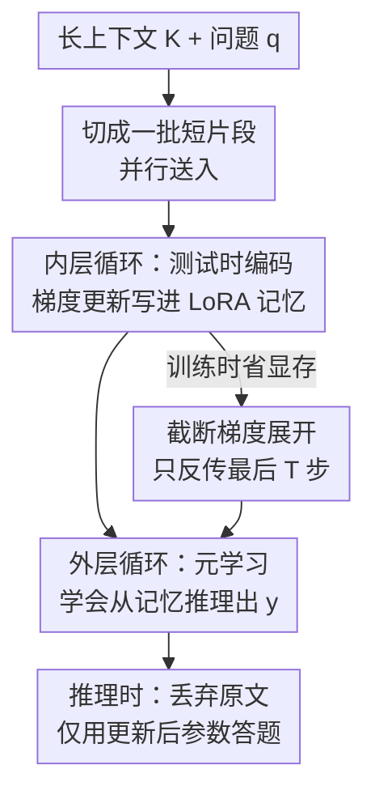

# PERK: Long-Context Reasoning as Parameter-Efficient Test-Time Learning

**会议**: ICLR 2026  
**OpenReview**: [https://openreview.net/forum?id=qxDTe8fIyA](https://openreview.net/forum?id=qxDTe8fIyA)  
**代码**: https://perk-long-context.web.app (项目页)  
**领域**: LLM推理 / 长上下文 / 元学习  
**关键词**: 长上下文推理, 测试时学习, 元学习, LoRA, 截断梯度展开

## 一句话总结
PERK 把长上下文推理重新表述为「测试时学习」：推理时不再把超长文本塞进上下文窗口，而是用梯度下降把上下文「写进」一个 LoRA 适配器里，再让模型从这块参数化记忆中回忆并推理；配合元学习两层循环与截断梯度展开，0.5B 的 Qwen 就能在长上下文推理上把同规模 in-context 微调基线平均拉高约 20%，并超过专门训练过的 7B+ 长上下文模型。

## 研究背景与动机
**领域现状**：让大模型处理长上下文，主流有两条路。一是把上下文窗口做大——靠位置插值、改注意力、或在长文档上继续训练（本文把这类称为 FT-ICR，即在长上下文上微调做经典 in-context reasoning）；二是换更高效的架构（线性注意力、RNN、状态空间模型如 Mamba）。两条路都把「长文本」当成要在推理时一次性读进上下文的 token 序列。

**现有痛点**：上下文越长，干扰信息越多、推理跳数越多，模型性能掉得越厉害；更糟的是长上下文模型有强烈的位置偏置，注意力集中在开头结尾，中间信息常被忽略（lost-in-the-middle）。结果就是：哪怕模型号称支持 128K、512K、1M 窗口，真要在噪声里精确定位并多跳推理时仍然很差。

**核心矛盾**：作者点出一个反直觉的观察——同一个 CLM 在预训练时已经把海量知识压进了参数、并能从参数里检索推理，可面对信息量远小于预训练语料的长上下文却频频失手。也就是说，**模型用「参数里的知识」推理，比用「上下文里的知识」推理更可靠**。这暗示：与其把长文本留在上下文，不如把它编码进参数。

**本文目标**：把长上下文推理拆成两步——(1) 推理时把上下文用梯度更新编码进模型参数；(2) 丢掉原文，仅凭更新后的参数回答问题。难点是：直接对全部参数做测试时更新、再用 MAML 这类双层优化训练，会因为要反传整条多步优化轨迹而带来爆炸式显存开销，根本扩展不到大模型 / 长上下文。

**切入角度**：既然瓶颈是「更新什么 + 反传多深」，那就两头都做参数高效化——把上下文只编码进一个轻量 LoRA 适配器（而非整模），并且外层只反传内层最后几步轨迹。

**核心 idea**：用「测试时把上下文写进 LoRA 记忆 + 元学习学会从这块记忆里推理」代替「把长文本硬塞进上下文窗口」。

## 方法详解

### 整体框架
PERK（Parameter-Efficient Reasoning over Knowledge）是一个双层优化（bi-level）的元学习算法。把一个推理问题记为 $r=(K,q,y)$，$K$ 是长上下文、$q$ 是问题、$y$ 是答案。PERK 在训练阶段跑两个嵌套循环：**内层循环**把长上下文 $K$ 切成一批短片段，用因果语言建模损失对一个 LoRA 适配器做几步梯度更新，把上下文「记」进这块适配器（称为 memory scratchpad，记忆便笺）；**外层循环**则在「已被上下文更新过」的适配器之上，优化适配器的初始状态，让模型学会**不看原文、只凭参数化记忆**就能回答 $q$。两层都只更新 LoRA 参数，base 模型始终冻结。

关键转折在于：长文本不是 token-by-token 顺序读，而是被切成一批（或多批）短于原生窗口的片段，**并行**做梯度编码。这让 PERK 能处理远超模型原生上下文窗口的序列，而且因为是「一批片段」而非「一条连续序列」，编码天然对片段顺序置换不变，从而对信息出现位置不敏感。推理时只跑内层那一段（把上下文编码进 LoRA），原文随即丢弃，由参数承载。

### 关键设计

**1. LoRA 记忆便笺：只把上下文写进低秩适配器，而非整模**

最直接的痛点是：测试时学习要对参数做梯度更新，若更新整模、再在 MAML 里反传，显存随参数量线性爆炸，大模型根本带不动。PERK 的做法是把可更新对象限定为一个 LoRA 适配器：记 base 参数为 $\theta_{base}$（永不更新）、适配器参数为 $\theta_{adapter}$。内层（也就是测试时）的目标是对上下文做因果语言建模 $L_{NLL}(K,(\theta_{base},\theta_{adapter}))$，但梯度只更新 $\theta_{adapter}$；适配器扮演一块可写的「记忆便笺」，把 $K$ 的信息编码进低秩参数。外层则把 $\theta_{adapter}$ 元学习到一个**好的初始状态**，使得「随便给一段上下文、做几步内层更新」之后，模型就能答对相关问题：

$$\theta^*_{adapter}=\arg\min_{\theta_{adapter}}\ \mathbb{E}_{r\sim R}\Big[L_{reason}\big(\theta_{base},\ \phi_{adapter}((\theta_{base},\theta_{adapter}),K),\ \{(q,y)\}\big)\Big]$$

其中 $\phi_{adapter}(\cdot)=\mathrm{Alg}(L_{NLL},K,(\theta_{base},\theta_{adapter}),h)$ 表示内层把适配器适配到 $K$ 后的参数。把记忆做成低秩、且 base 冻结，既压住了显存，又让这块「上下文记忆」在不同问题间是可快速重写、可丢弃的。

**2. 把长序列切成置换不变的片段批：突破原生窗口并消除位置偏置**

把上下文当一条长序列顺序喂，既受限于原生窗口（32K），又会继承 lost-in-the-middle 的位置偏置。PERK 改为把 $K$ 拆成一批短子序列，内层在这「一批」上算 $\nabla L_{NLL}$ 做梯度编码。怎么切是算法的超参数（训练时为效率设为一批）。这样做有两层收益：其一，单个片段长度可远小于原生窗口（latency 实验里片段有效长度仅 128 token），于是 128K 这种序列也能靠梯度累积分批吃下；其二，因为信息是作为「置换不变的一批」编码进参数空间，绝对位置对结果影响被大幅削弱——这正是 PERK 对位置分布偏移鲁棒的根因，而 FT-ICR 在训练时把「特定位置」和「答案」直接对齐，一旦测试时相关信息换了位置就崩（最多掉 90%）。

**3. 截断梯度展开（TGU）：让双层优化在大模型上训得起**

即便只更新 LoRA，外层要对内层的 $N$ 步优化求梯度仍涉及高阶导数与保存整条轨迹。把 $N$ 步内层状态记为 $\phi^{(0)}_{adapter}=\theta_{adapter}$、$\phi^{(n+1)}_{adapter}=\phi^{(n)}_{adapter}-\alpha\,g^{(n)}$，则按链式法则外层元梯度是逐步 Jacobian 的连乘：

$$\nabla_{\theta_{adapter}}L_{reason}=\frac{\partial L_{reason}}{\partial \phi^{(N)}_{adapter}}\prod_{n=0}^{N-1}J^{(n)},\qquad J^{(n)}=I-\alpha H^{(n)}$$

其中 $H^{(n)}$ 是内层损失的 Hessian。每个 $J^{(n)}$ 都要保存该步计算图，显存随 $N$ 线性增长。PERK 沿用 Shaban 等人的截断思路：内层照样跑满 $N$ 步，但**只保留最后 $T\ll N$ 步的计算图**，把 $n<N-T$ 的 Jacobian 当常数、从连乘里截断：

$$\nabla_{\theta_{adapter}}L_{reason}\approx\frac{\partial L_{reason}}{\partial \phi^{(N)}_{adapter}}\underbrace{\prod_{n=N-T}^{N-1}J^{(n)}}_{\text{最后 }T\text{ 步}}$$

代价是元梯度略有偏差，换来的是显存大幅下降，使 PERK 能扩展到更大模型和更长上下文。这一步与设计 1（LoRA 记忆）共同构成 PERK「scalable」的两个支点：一个砍「更新多少参数」，一个砍「反传多深」。

### 损失函数 / 训练策略
内层 / 测试时目标是对上下文的因果语言建模 NLL；外层目标是公式 (3) 的推理损失 $L_{reason}$（在更新后的适配器上预测答案 token）。内层用 AdamW 优化 $\theta_{adapter}$，测试时实测做 4 步梯度更新；外层用截断展开（仅保留最后 $T$ 步轨迹）计算元梯度。推理时把上下文按 128 token 有效长度切片，并用梯度累积（2–16 步）以显存换运行时。

## 实验关键数据

### 主实验
评测覆盖三类长上下文推理：NIAH（BabiLong，单/双/三跳 QA1/QA2/QA3）、多文档开放域 QA（HotpotQA、TriviaQA），以及作者新提出的 Drops-in-the-Ocean（DIO，Student Records：Recall/Relation/Aggregate，干扰项与相关信息分布相似，比 NIAH 更难）。所有 PERK 与 FT-ICR 均在 8K 上下文训练。

| 设置 | 对比 | PERK 相对 FT-ICR |
|------|------|------------------|
| NIAH（32K 外推，平均） | 同样 8K 训练 | +23% |
| Multi-Doc（8K，0.5B） | FT-ICR | +20% 绝对 |
| Multi-Doc（8K，7B） | FT-ICR | +15% 绝对 |
| Multi-Doc（32K 外推，0.5B / 7B） | FT-ICR | +30% / +14% |
| Multi-Doc | Qwen-1M / ProLong | 差距仅 3%（HotpotQA）/ 1.5%（TriviaQA） |

PERK（Qwen-0.5B）相对同规模 FT-ICR 平均绝对提升最高达 20%，且匹配甚至超过经长上下文训练的 7B+ 专用模型；7B 版在部分符号推理任务上还超过 GPT、Gemini 等商用模型。

### 长度外推（BabiLong，8K 训练 → 64K/128K 测试）

| 模型 | QA1@128K | QA2@128K |
|------|----------|----------|
| GPT-4.1 | 69.4 | 48.2 |
| Gemini-1.5-pro | 73.1 | 40.2 |
| Qwen2.5-7B-Instruct-1M | 21.4 | 12.2 |
| ProLong-8B-512K | 24.3 | 17.7 |
| FT-ICR (Qwen-0.5B) | 0 | 0 |
| FT-ICR + Yarn+DCA | 25.4 | 18.5 |
| **PERK (Qwen-0.5B)** | **61.4** | **44.4** |

仅用 8K 训练的 PERK-0.5B 在 128K 上仍有 61.4 / 44.4，碾压同样 8K 训练的 FT-ICR（128K 直接归零），也超过原生 256K/512K 训练的开源大模型，逼近 GPT-4.1。

### 关键发现
- **难度越大，优势越明显**：DIO 上 PERK 与 FT-ICR 的差距随任务难度单调拉大（Aggregate > Relation > Recall），说明 PERK 真正增强的是复杂推理，而非简单检索。
- **位置鲁棒**：相关信息换位置时 FT-ICR 最多掉 90%，PERK 因「置换不变批编码」几乎不受影响。
- **跨模型族/规模稳定**：FT-ICR 在 GPT-2 上仅 18.2%、LLaMA-8B 89.8%，方差极大；PERK 在 GPT-2/Qwen-2.5/LLaMA-3 全线高位，LLaMA-8B 达 99.1%，即便最大模型上仍领先 FT-ICR 9.3 个百分点。
- **超长上下文更省**：128K 时 FT-ICR OOM 失败，PERK 用 16 步梯度累积仅 35.2GB、20.9s 跑完；64K 时 FT-ICR 32.6s/55.7GB，PERK（16 步）11.4s/19.6GB。8K 时把累积步数从 1 提到 16，显存 35.2GB→5.9GB（运行时 1.9s→8.5s）。

## 亮点与洞察
- **把「读长文」变成「写参数」**：核心 reframe 极简洁——长上下文推理 = 测试时学习。它绕开了上下文窗口和位置偏置这两个老大难，因为信息一旦进了参数就不再受 token 位置摆布。
- **两处参数高效化是同一目标的两条腿**：LoRA 限定「更新什么」、TGU 限定「反传多深」，二者缺一就训不动大模型——这是把一个理论上漂亮但工程上昂贵的 MAML 思路真正做 scalable 的关键。
- **置换不变批编码顺手解决位置偏置**：把长序列拆成无序的一批片段，既能超出原生窗口，又天然消除 lost-in-the-middle，这个「副作用」比方法本身更优雅，可迁移到任何需要长上下文检索的任务。
- **小模型打大模型**：0.5B 训练于 8K 却在 128K 上压过 512K/1M 专用模型，提示「参数化记忆 + 测试时适配」可能是比「无脑堆窗口/堆训练数据」更划算的长上下文路线。

## 局限与展望
- **推理时多了梯度更新开销**：PERK 每次回答都要先做几步内层梯度更新来编码上下文，短上下文时 FT-ICR 反而更快；其省的是「超长上下文」的显存与时间，短文本场景不划算。
- **运行时-显存的硬权衡**：靠梯度累积压显存会显著拉长运行时（8K：1→16 步累积，1.9s→8.5s），实际部署需按上下文长度调参。
- **128K 仍有明显衰减**：QA1/QA2 在 128K 掉到 61.4/44.4，离 in-distribution 还有差距，极长上下文未完全解决。
- **超参敏感**：上下文如何切批、内层步数 $N$、保留窗口 $T$ 都需调，论文主要给了一组配置，缺系统性敏感度分析（细节在附录）。

## 相关工作与启发
- **vs FT-ICR（长上下文微调做 in-context reasoning）**：FT-ICR 把长文留在上下文、并在训练时把位置与答案对齐，导致窗口受限、位置偏移即崩；PERK 把上下文编码进参数、用置换不变批，长度外推与位置鲁棒性都远胜。
- **vs MAML / Chen et al. 2023b（测试时学习先驱）**：经典做法对全参数做测试时更新并整条轨迹反传，显存爆炸难以扩展；PERK 用 LoRA + 截断展开把它做成可扩展版。
- **vs Titans / TTT-RNN / ATLAS（架构内测试时学习）**：这些把可微记忆做进网络结构、常需从头训练；PERK 直接增强现成预训练 LLM，无需改架构或大规模预训练，且天然参数高效。
- **vs 长上下文架构（Mamba、线性注意力等）**：这类常需从头训练且长上下文召回有先天短板；PERK 站在现成 Transformer 上做适配，规避了重训成本。

## 评分
- 新颖性: ⭐⭐⭐⭐⭐ 把长上下文推理彻底 reframe 为参数高效测试时学习，并用 LoRA+TGU 让它 scalable，角度新颖且自洽。
- 实验充分度: ⭐⭐⭐⭐⭐ 覆盖 NIAH/多文档/自建 DIO 三类任务、多模型族多规模、长度外推到 128K、位置鲁棒性与延迟显存全测。
- 写作质量: ⭐⭐⭐⭐ 动机推导清晰、公式完整；图表偏多依赖正文串讲，部分结论需对照附录。
- 价值: ⭐⭐⭐⭐⭐ 用 0.5B 8K 训练打过 512K/1M 专用大模型，给长上下文提供了「参数化记忆」这条高性价比新路线。

<!-- RELATED:START -->

## 相关论文

- [\[ICLR 2026\] InftyThink: Breaking the Length Limits of Long-Context Reasoning in Large Language Models](inftythink_breaking_the_length_limits_of_long-context_reasoning_in_large_languag.md)
- [\[ICLR 2026\] Is In-Context Learning Learning?](is_in-context_learning_learning.md)
- [\[ICLR 2026\] CaTS: Calibrated Test-Time Scaling for Efficient LLM Reasoning](cats_calibrated_test-time_scaling_for_efficient_llm_reasoning.md)
- [\[ICLR 2026\] Plan and Budget: Effective and Efficient Test-Time Scaling on Reasoning LLMs](plan_and_budget_effective_and_efficient_test-time_scaling_on_reasoning_large_lan.md)
- [\[ICLR 2026\] Efficient Test-Time Scaling for Small Vision-Language Models](efficient_test-time_scaling_for_small_vision-language_models.md)

<!-- RELATED:END -->
