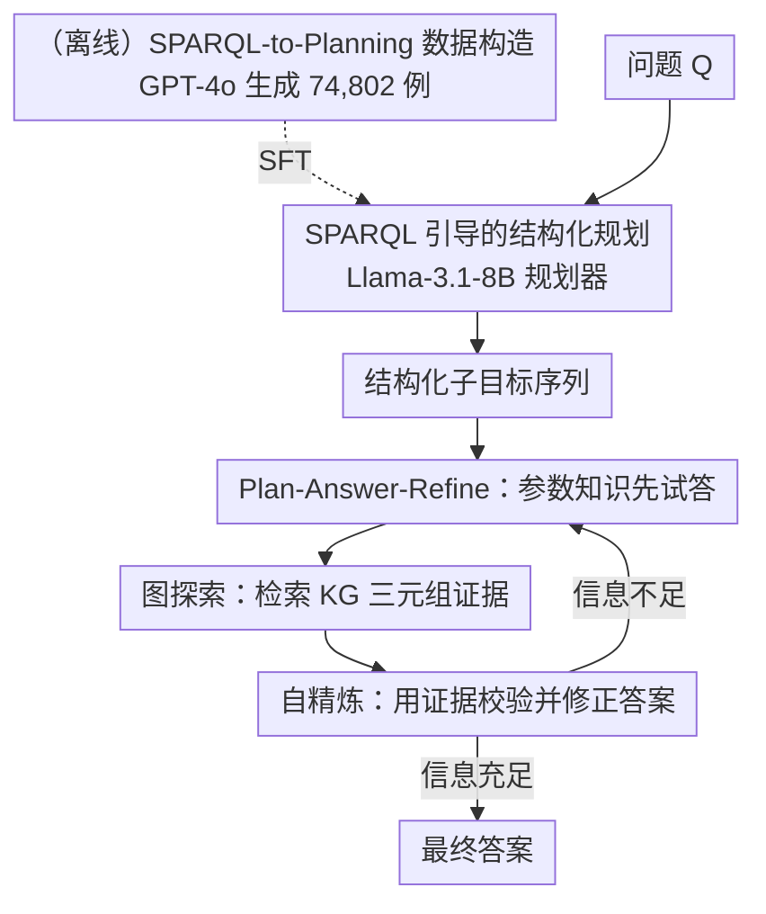

# Plan-Answer-Refine-on-Graph: Structured Planning and Self-Refinement for Large Language Model Reasoning on Knowledge Graphs

**会议**: ICLR 2026  
**OpenReview**: [https://openreview.net/forum?id=g6XnP7Sgui](https://openreview.net/forum?id=g6XnP7Sgui)  
**代码**: https://github.com/shiyuxin2000/PARoG  
**领域**: LLM推理 / 知识图谱问答  
**关键词**: KGQA, 知识图谱增强, 结构化规划, SPARQL, 自精炼

## 一句话总结
PARoG 用 SPARQL 查询作监督信号训练一个小规划器把复杂问题拆成可组合的结构化子目标，再用「先答—检索—自精炼」的循环让 LLM 先凭参数知识试答、再用图谱证据纠错，在 WebQSP / CWQ / GrailQA 上显著超过 PoG 等 SOTA，尤其在合取、比较、最高级这类复杂逻辑查询上提升巨大。

## 研究背景与动机

**领域现状**：把知识图谱（KG）接进 LLM 推理是缓解幻觉、补事实的主流路线。现有 LLM⊗KG 方法大体分两类：一类做逐步图探索（如 ToG），让 LLM 沿「实体—关系—实体」一步步走出推理路径；另一类先生成全局规划（如 RoG、PoG），把问题拆成子目标再沿规划路径查图。

**现有痛点**：作者系统分析后指出两个根本缺陷。其一是**搜索空间截断偏置（Search Space Truncation Bias）**：现有方法构造的是线性实体—关系路径，每步用 top-k 剪枝控制组合爆炸，但这种贪心剪枝常常**提前把正确实体裁掉**——比如要找「与法国接壤、且境内机场服务 Nijmegen 的国家」，正确答案 Germany 在早期剪枝中就被淘汰了。其二是**实体错误放大（Error Amplification）**：现有方法走的是 retrieve-and-answer（先检索再回答）范式，LLM 过度依赖检索到的证据，一旦路径上引入了虚假或弱相关的实体/关系，错误会沿后续步骤不断传播累积，最终给出错误答案。

**核心矛盾**：线性路径无法表达合取（conjunction）、组合（composition）、比较（comparative）、最高级（superlative）这些复杂逻辑结构，而 KGQA 的真实问题恰恰大量需要它们；同时「一锤定音地相信检索结果」让模型失去了自我纠错的能力。

**本文目标**：（1）让规划阶段能产出可组合的、非线性的推理路径，从源头避免正确候选被剪掉；（2）让回答阶段不再盲信检索，而是能用图谱证据去校验并覆盖早期错误。

**切入角度**：作者注意到 SPARQL 这种形式化查询语言天生就支持合取、组合、比较等逻辑操作，其图匹配过程本身就把复杂查询分解成了一串连续的搜索操作与约束——这正是一份现成的、精确的「规划路径」。于是用 SPARQL 当结构化监督信号去教 LLM 规划。

**核心 idea**：用 SPARQL 监督训练出会做结构化规划的小模型，再把 retrieve-and-answer 换成 plan-answer-refine——先用参数知识试答，再用 KG 证据自精炼纠错。

## 方法详解

### 整体框架
PARoG 是一个混合推理框架，把「结构化显式引导」与「LLM 参数化推理」紧密耦合，整体分两大阶段。**第一阶段（离线 + 规划）**：用 SPARQL 把复杂问题分解成结构化子目标，训练一个相对小的模型（Llama-3.1-8B）专门做这种规划；输入一个自然语言问题，输出是一串逻辑一致、粒度均匀的子目标序列。**第二阶段（在线推理，逐子目标循环）**：对每个子目标，模型先用自身参数知识给出一个试探答案，再启动 KG 探索去检索相关三元组，然后做自精炼——拿检索证据回过头校验并修正试探答案；每轮结束判断信息是否已足够回答原问题，足够则停止，否则继续探索直到收敛或达到最大轮数。

### 关键设计

**1. SPARQL 引导的结构化规划：把线性路径换成可组合的逻辑子目标**

这一设计直接针对「搜索空间截断偏置」。现有方法从一个实体出发沿 ⟨实体-关系-实体⟩ 线性扩展并逐步剪枝，遇到需要合取/组合/比较/最高级的问题就力不从心。作者用 SPARQL 作结构化监督：SPARQL 的 WHERE 子句天然把复杂查询表达成一组三元组模式与约束，对应着「先分别求解各子约束、再做逻辑组合」的非线性规划。以「与法国接壤且含服务 Nijmegen 机场的国家」为例，规划器不再从 France 顺序往邻国、再往机场走，而是生成两个并列子目标——「找与法国接壤的国家」和「找含服务 Nijmegen 机场的国家」——再对二者取**合取**。因为不再沿单一线性链贪心剪枝，正确候选（Germany）在中间阶段就不会被提前淘汰，从根上缓解了截断偏置。

**2. SPARQL-to-Planning 数据构造与小模型训练：让 8B 模型学会 SPARQL 的组合逻辑**

要把 SPARQL 的表达力迁进模型，作者设计了一条自动化数据流水线。**源数据采集**：从 WebQSP、CWQ、GrailQA 等公开 KGQA 训练集里选取多跳问题的 ⟨问题, SPARQL⟩ 对。**语义一致映射**：把 SPARQL 拆成原子操作，再用 GPT-4o 把每个原子操作翻译成一句流畅的自然语言子目标；为保证语义一致，还会把子目标序列**回译**成自然语言查询，并用回译后的查询（而非原问题）配上生成的子目标作为训练数据。流水线最终产出 **74,802** 条高质量分解样本，覆盖组合（29.68%）、合取（35.78%）、最高级（4.83%）、比较（4.49%）、线性（25.22%）等多种查询类型。训练用 Llama-3.1-8B 作 backbone，标准自回归语言建模损失：

$$\arg\min_{\theta} \mathcal{L}(\theta) = -\sum_{i}^{H}\sum_{j}^{T_h} \log P_\theta(o_{i,j} \mid o^h_{i,<j}, x)$$

其中 $H$ 是子目标总数、$T_h$ 是单个子目标的 token 数、$o_i$ 是第 $i$ 个子目标。妙处在于：靠 SPARQL 提供的强组合逻辑信号，仅 8B 的规划器在生成推理路径上能反超 GPT-3.5（约 20B）和 DeepSeek-R1（671B）。

**3. Plan-Answer-Refine 范式与自精炼：先答后纠，阻断错误放大**

这一设计针对「实体错误放大」。retrieve-and-answer 范式有两个毛病——错误传播（路径一旦引入虚假实体，后续步骤会累积放大）和过度依赖检索（即便外部信息只部分相关，LLM 也假定其正确充分，从而失去自纠能力）。PARoG 改成三步循环。**Answering**：对每个子目标 $o_i$，先让 LLM 仅凭参数知识产出试探答案 $\hat{a}_i = M(Q, o_i, I_A)$。**Exploration**：从主题实体出发迭代扩展推理路径，由 LLM 先过滤无关关系（过滤时把整份规划 $O$ 一并喂入，让模型始终对齐全局目标、不在局部跑偏），再用 SPARQL 模板 $(e, r, ?)$ 或 $(?, r, e)$ 取回候选实体，并按与子目标/问题的相关性保留最相关者，更新路径集 $P_i$。**Self-Refinement**：拿检索证据回头校验并修正试探答案 $a_i = M(P_i, o_i, \hat{a}_i, I_R)$；这里有个关键判断——若 LLM 判定检索知识与问题不对齐，就**直接采用试探答案而非被错误证据带偏**，正是这一步覆盖了早期的虚假证据、阻断错误放大。每轮还会判断 $a_i$ 是否足以回答原问题 $Q$，是则停止以避免过度探索，否则继续迭代。

### 一个完整示例
以「与法国接壤、且含服务 Nijmegen 机场的国家」为例（图 2）：规划器输出三个子目标——①找与法国接壤的国家；②找含服务 Nijmegen 机场的国家；③对①②取合取。执行 ①时，参数知识先试答「Germany, England, Italy, Spain…」，图探索给出接壤集合，自精炼后保留一致候选；执行 ②时检索到含相关机场的国家（如 Germany、Russia）；最后取合取得到 Germany。对比现有方法在线性扩展中早早把 Germany 剪掉，PARoG 因为分支并行 + 合取，正确答案始终被保留。

## 实验关键数据

### 主实验
数据集：WebQSP、CWQ、GrailQA，均基于 Freebase（8800 万实体、2 万关系、1.26 亿三元组）。指标：Exact Match 准确率（Hits@1），三个种子取均值 ± 95% 置信区间。底座 LLM 用 GPT-3.5 / GPT-4 两档。

| 数据集 | 设置 | PARoG | 最强基线 PoG | 提升 |
|--------|------|-------|--------------|------|
| WebQSP | GPT-3.5 | 89.0 | 82.0 | +7.0 |
| CWQ | GPT-3.5 | 73.1 | 63.2 | +9.9 |
| WebQSP | GPT-4 | 91.2 | 87.3 | +3.9 |
| CWQ | GPT-4 | 79.3 | 75.0 | +4.3 |
| GrailQA(Overall) | GPT-3.5 | 82.7 | 77.8 (DoG) | +4.9 |
| GrailQA(Overall) | GPT-4 | 87.1 | 84.7 | +2.4 |

在弱底座（GPT-3.5）和更复杂的 CWQ 上提升最明显——印证结构化规划 + 自精炼对复杂多跳/组合查询的价值。

### 分查询类型 & 消融实验

| 查询类型（vs PoG） | 提升 |
|--------------------|------|
| 组合 Compositions | +8.1% |
| 合取 Conjunctions | +14.4% |
| 比较 Comparatives | +12.7% |
| 最高级 Superlatives | +20.5% |
| 线性 Linear | +8.9% |

| 消融配置 | WebQSP | GrailQA | CWQ | 说明 |
|----------|--------|---------|-----|------|
| 完整(GPT-3.5) | 89.3 | 82.7 | 73.3 | 含自精炼 |
| w/o 自精炼(GPT-3.5) | 88.0 | 78.9 | 69.2 | 去掉后全面下降，GrailQA 掉 3.8 |
| 完整(GPT-4) | 91.2 | 87.2 | 79.3 | — |
| w/o 自精炼(GPT-4) | 89.7 | 85.5 | 77.2 | 去掉后同样下降 |

规划器替换消融：8B 的 SPARQL 监督规划器在 WebQSP/GrailQA/CWQ 上分别取 89.3 / 82.7 / 73.3，反超 GPT-3.5（83.2 / 76.9 / 65.2）和 DeepSeek-R1（88.5 / 80.2 / 68.7），在 CWQ 上最多领先 8.1 分。

### 关键发现
- **自精炼在弱底座上收益更大**：GPT-3.5 设置下去掉自精炼掉点更狠，说明它确实在补 LLM 自身能力的不足、纠正错误放大。
- **结构越复杂提升越大**：最高级 +20.5%、合取 +14.4% 远高于线性 +8.9%，证明结构化规划主要赢在复杂逻辑查询。
- **纠错能力可量化**：在初始试答错误的样本中，自精炼能改对约 70%（WebQSP 73.4%、CWQ 62.4%、GrailQA 77.1%），GrailQA 最高，与其更强的逻辑组合性一致。
- **跨 schema 泛化**：换成 WikiData 作源 KG（更大更异构）绝对值虽下降，但 PARoG 仍稳定领先 ToG/PoG，CWQ 上尤为明显。
- **更省**：效率分析显示 PARoG 在更高准确率的同时，LLM 调用与 token 消耗都更低。

## 亮点与洞察
- **用 SPARQL 当「免费的规划老师」**：不需要人工标规划，直接把现成 ⟨问题, SPARQL⟩ 对的图匹配结构蒸成自然语言子目标，巧在 SPARQL 的逻辑算子天然覆盖了线性路径表达不了的合取/比较/最高级。
- **小模型反超大模型做规划**：8B 规划器靠强结构监督打败 671B 的 DeepSeek-R1，说明「会规划」更多是结构化信号问题而非纯参数规模问题——这一思路可迁移到任何需要把复杂任务拆成可组合子任务的 agent 场景。
- **「先答后纠」+「证据不对齐就弃用证据」**：把 LLM 参数知识当先验、检索证据当校验而非真理，这个非对称信任设计是阻断 RAG 类系统错误放大的可复用 trick。

## 局限与展望
- **依赖 SPARQL 标注资源**：数据构造需要公开 KGQA 数据集里现成的 ⟨问题, SPARQL⟩ 对，迁移到没有 SPARQL 标注的领域 KG 时如何冷启动是开放问题。
- **GPT-4o 生成数据的噪声**：74,802 条子目标由 GPT-4o 自动生成 + 回译，质量虽经一致性约束但仍可能带系统性偏差，论文未深入分析其错误模式（案例研究放在附录）。
- **底座仍依赖闭源 LLM**：推理阶段用 GPT-3.5/GPT-4 作底座，端到端成本与可复现性受限；规划器虽小但回答/精炼仍调大模型。
- **最大迭代轮数等超参的敏感性**未在正文充分展开。

## 相关工作与启发
- **vs ToG / StructGPT（逐步图探索）**：它们沿线性实体-关系路径迭代剪枝，PARoG 用 SPARQL 监督生成非线性可组合规划，从源头避免正确候选被剪掉。
- **vs RoG / PoG（全局规划）**：PoG 也先规划再查图，但走 retrieve-and-answer 一锤定音；PARoG 多了「先用参数知识试答 + 用证据自精炼」的纠错回环，且规划质量靠 SPARQL 监督的小模型更强——这正是它在所有 benchmark 上反超 PoG 的两个来源。
- **vs DoG（Debate-on-Graph）**：在 GrailQA 上 PARoG（82.7/87.1）大幅领先 DoG（77.8/80.0），说明显式证据精炼比多智能体辩论在复杂/零样本查询上更稳。

## 评分
- 新颖性: ⭐⭐⭐⭐ 用 SPARQL 监督规划 + plan-answer-refine 纠错的组合切入点新颖且动机扎实
- 实验充分度: ⭐⭐⭐⭐⭐ 三数据集、两档底座、分查询类型、消融、泛化、纠错率、效率全覆盖
- 写作质量: ⭐⭐⭐⭐ 问题剖析清晰、图示直观，个别表述与公式有小笔误
- 价值: ⭐⭐⭐⭐ 对复杂逻辑 KGQA 提升显著，「小模型强规划 + 非对称信任纠错」思路可迁移

<!-- RELATED:START -->

## 相关论文

- [\[ICLR 2026\] Enhancing Language Model Reasoning with Structured Multi-Level Modeling](enhancing_language_model_reasoning_with_structured_multi-level_modeling.md)
- [\[ICLR 2026\] A Stitch in Time Saves Nine: Proactive Self-Refinement for Language Models](a_stitch_in_time_saves_nine_proactive_self-refinement_for_language_models.md)
- [\[ICLR 2026\] VoG: Enhancing LLM Reasoning through Stepwise Verification on Knowledge Graphs](vog_enhancing_llm_reasoning_through_stepwise_verification_on_knowledge_graphs.md)
- [\[AAAI 2026\] Graph of Verification: Structured Verification of LLM Reasoning with Directed Acyclic Graphs](../../AAAI2026/llm_reasoning/graph_of_verification_structured_verification_of_llm_reasoning_with_directed_acy.md)
- [\[ICLR 2026\] Exposing Weaknesses of Large Reasoning Models through Graph Algorithm Problems](exposing_weaknesses_of_large_reasoning_models_through_graph_algorithm_problems.md)

<!-- RELATED:END -->
