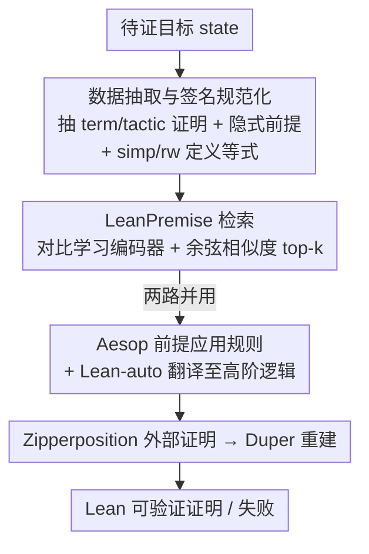

# Premise Selection for a Lean Hammer

**会议**: ICLR 2026  
**OpenReview**: [https://openreview.net/forum?id=m04JJNeRK6](https://openreview.net/forum?id=m04JJNeRK6)  
**代码**: https://github.com/hanwenzhu/premise-selection ; https://github.com/JOSHCLUNE/LeanHammer  
**领域**: LLM推理 / 形式化定理证明 / 神经符号  
**关键词**: 前提选择、Lean、Hammer、对比学习、神经符号

## 一句话总结
本文提出神经前提选择器 LeanPremise（对比学习训练的句子编码器）并把它接入 Aesop / Lean-auto / Duper，造出 Lean 上第一个端到端通用 hammer 工具 LeanHammer，相比现有前提选择器多证明 21% 的定理，并能泛化到训练时没见过的库。

## 研究背景与动机
**领域现状**：在 Lean、Isabelle、Coq 这类交互式证明助手里，用户写证明时最痛苦的事之一是要从几十万条已有引理/定义里**手动指名**当前这一步推理用到的前提（premise）。Isabelle 早就有 Sledgehammer 这类 "hammer" 工具来自动化这一步：给定目标，先做**前提选择**挑出一小撮可能有用的引理，再**翻译**成外部自动定理证明器（Vampire、E、Zipperposition、Z3 等）能吃的格式，最后把外部证明器找到的证明**重建**回证明助手内部。

**现有痛点**：尽管 Lean 社区已经很火（Liquid Tensor Experiment、球面外翻定理、Mathlib），但**Lean 一直没有可用的 hammer**。已有的 Lean 前提选择器（ReProver、Lean Copilot、随机森林）都不是为 hammer 设计的——它们要么只服务于"下一条 tactic 生成"、只抽显式前提、只针对修改目标而非闭合目标，要么无法在 Lean 里直接调用、无法纳入用户当场新定义的引理。

**核心矛盾**：hammer 想要的前提选择和 tactic 生成想要的前提选择**目标函数本质不同**。Hammer 要"一锤子证完整个目标"，所以更看重**召回**（漏掉关键引理就证不出来，多给几条无关引理外部证明器还能扛）；而 tactic 生成只需要给出下一步用的前提。直接复用 tactic 生成的选择器，抽到的训练信号、loss 形式、签名表示都不对路。

**本文目标**：(1) 训一个专为 hammer、专为 Lean 的依赖类型论场景设计的前提选择器；(2) 把它和现成的翻译/重建组件拼成 Lean 上第一个端到端通用 hammer；(3) 让整套东西能在 Lean IDE 里一句 tactic 直接调用、低延迟、且能动态吸收用户本地新定义的前提。

**核心 idea**：用面向 hammer 的数据抽取（抽 term 风格证明、抽隐式前提、抽 simp/rw 里的定义等式、规范化签名序列化）+ 带掩码的对比学习损失训练一个轻量句子编码器做检索，并把检索结果**同时**喂给 Aesop 的前提应用规则和 Lean-auto 的外部证明器翻译这两条路。

## 方法详解

### 整体框架
LeanHammer 的输入是一个待证目标（goal/state），输出是一个被 Lean 内核接受的形式化证明（或失败）。整条流水线把"神经检索"和"符号证明搜索"缝在一起：LeanPremise 负责从环境里所有可见前提中检索出最相关的一小撮引理，然后这撮引理被**两路并用**——一路作为 Aesop 的前提应用规则，一路经 Lean-auto 翻译成高阶逻辑送给外部证明器 Zipperposition，Zipperposition 证出来后再用其实际用到的前提交给 Duper 在 Lean 内重建出可信证明。

具体调度上，Aesop 先被调用并优先用自己内建规则找短证明；若短时间内没找到，它就转而尝试 LeanPremise 推荐的前提（作为 `add unsafe 20%` 规则直接 apply），同时把子目标连同推荐前提交给 Lean-auto（`add unsafe 10%`）。Lean-auto 把依赖类型论的子目标翻译成高阶逻辑问题并对接 Zipperposition；若 Zipperposition 成功，则只把它实际用到的前提集合交给 Duper，由 Duper 重建出一个 Lean 能验证的证明项。Duper 是个产证明（proof-producing）的搜索工具，专门负责把外部证明器的结果落地为可信证明。

### 关键设计

**1. 面向 hammer 的数据抽取：把"证完整个目标"需要的所有前提都喂进去**

这一步针对的痛点是：以往选择器（如 ReProver）只从 tactic 风格证明里抽、只抽下一条 tactic 里源码显式出现的前提、只学"修改目标"。但 hammer 要的是"闭合整个目标"，训练信号完全不同。本文的抽取做了四件事：(a) **同时从 term 风格和 tactic 风格证明里抽**，大幅增加短证明的训练样本（hammer 本就主打自动化这类短推理）；(b) 多 tactic 证明里，让模型学习选出**闭合目标所需的全部前提**而非只第一条 tactic；(c) **既抽显式也抽隐式前提**，包括 simp 这类自动化隐式调用的引理，以及 rw/simp 里用到的**定义等式**——这一点和 Lean 的依赖类型论强相关：Lean 里两个项可以**定义相等但语法不等**，tactic 证明会用到不出现在最终证明项里的定义等式，所以必须额外收集。最终每条样本是 (proof state, 定理签名, 用到的前提集合)。整个 Mathlib 抽出 469,965 个 state、265,348 条过滤后前提、约 581 万个 (state, premise) 对。

**2. 规范化签名序列化：让前提表示只依赖类型、不依赖表面语法**

前提"怎么呈现给模型"很关键。以往工作直接从源码抽原始字符串，会丢掉完整签名里的很多细节，还会被 open 的命名空间、自定义记号、表面语法干扰（这些在运行时还会变）。本文把每条定理/定义序列化成 `docstring? kind name arguments* : type` 的统一格式：关掉记号美化打印（`ℕ` 打成 `Nat`）、每个常量都用全限定名（`I` 打成 `Complex.I`）。这样前提表示**只取决于它的类型**，与开放命名空间、自定义记号无关，运行时也稳定。此外还过滤掉 479 条像 `and_true` 这种技术上相关但对自动化没用的基础逻辑定理，以及元编程类定义。这套签名抽取既静态用于训练，也**动态用于运行时**抽取用户本地新前提。

**3. 带掩码的对比学习损失：解决"批内假负例"问题**

检索本身是标准的双编码器套路：用 encoder-only transformer $E$ 把 state $s$ 和每个可见前提 $p$ 编码，按余弦相似度取 top-k，即 $\text{select\_premises}(s,k,P_s)=\text{top-}k_{p\in P_s}\,\text{sim}(E(s),E(p))$，其中 $\text{sim}(u,v)=u^\top v/\lVert u\rVert_2\lVert v\rVert_2$。训练用改进版 InfoNCE。直接对比学习有两个麻烦：库里大量前提从不出现在任何证明里（需额外采样负例），以及很多前提被多个证明共享（批内的"负例"可能其实是该 state 的正例，会被误标）。本文对每个 (state $s_i$, 正例 $p_i^+$) 采样 $B^-$ 个负例，但在计算损失时**把批内属于 $s_i$ 真值集合 $P_{s_i}^+$ 的前提从负例里掩掉**，得到掩码负例集合 $N_i$，损失为

$$L(E)=\frac{1}{B}\sum_{i=1}^{B}\frac{\exp(\text{sim}(E(s_i),E(p_i^+))/\tau)}{\exp(\text{sim}(E(s_i),E(p_i^+))/\tau)+\sum_{p_i^-\in N_i}\exp(\text{sim}(E(s_i),E(p_i^-))/\tau)}$$

温度 $\tau=0.05$。掩码避免把共享前提误当负例惩罚，消融显示采负例和掩码都实打实涨点。本文不另训重排序模型，因为 hammer 偏召回、最优 $k$ 至少 16，此时重排序收益不大且部署昂贵。

**4. 可在 Lean 内直接调用、动态吸收新前提的 API 集成**

这是本文很看重的"可用性"贡献。用户调用前提选择时，Lean 客户端收集环境里当前所有已定义前提 $P_s$ 和当前 state $s$ 发给托管编码模型的服务端；服务端编码 state 和前提列表后用 FAISS 算 top-k 返回。由于 $P_s$ 典型规模约 7 万，服务端**缓存固定 Mathlib 版本下的前提嵌入**，只对用户上传的新前提（在 Mathlib 之外工作、或上下文里有新引理时）重算嵌入；客户端也缓存这些新前提的签名。前提选择在 CPU 上摊销约 1 秒、单 GPU 远小于 1 秒，整套 LeanHammer 平均远小于 10 秒。据作者所知，这是**第一个能在 Lean 里直接调用、且能纳入用户自定义新前提**的语言模型前提选择器，无需用户做系统配置。

### 损失函数 / 训练策略
从三个通用句子嵌入预训练模型微调：small（MiniLM-L6，6 层、隐藏 384，23M）、medium（MiniLM-L12，12 层、384，33M）、large（DistilRoBERTa-base，6 层、768，82M）。学习率 2e-4，批大小 $B=256$，每正例采 $B^-=3$ 个负例（超参扫得）。训 large 需约 6.5 个 A6000-天。

## 实验关键数据

### 主实验
在 Mathlib-test 上对比不同前提选择器接入 LeanHammer 的召回与证明率（full 为完整流水线）：

| 前提选择器 | 参数量 | Recall@16 | Recall@32 | full 证明率 | cumul 证明率 |
|--------|------|------|------|------|------|
| None | — | 0.0 | 0.0 | 16.9 | 16.9 |
| Random forest* | — | 22.1 | 22.3 | 19.1 | 19.1 |
| MePo（符号） | — | 38.4 | 42.1 | 26.3 | 27.5 |
| ReProver | 218M | 35.1 | 38.7 | 12.0 | 22.3 |
| LeanPremise (large) | 82M | 63.5 | 72.7 | 30.1 | 33.3 |
| LeanPremise (large) ∪ MePo | — | — | — | 35.9 | 37.6 |
| Ground truth（上界） | — | — | — | 41.0 | 43.0 |

LeanPremise large 的 recall@32 达 72.7%，相对 MePo 高 73%；cumul 证明率 33.3% 相对 MePo 高 21%。神经+符号取并集（∪MePo）比单纯放大模型涨得更多，说明两类方法证明的定理集合互补。相比 ReProver，large（82M）在 full 设定下比 ReProver（218M）多证 **150%** 的定理、cumul 下多 50%。

跨库泛化（miniCTX-v2-test，用 Mathlib 训练的 large 模型，full）：

| 设定 | Carleson | ConNF | FLT | Foundation | HepLean | Seymour | 平均 |
|------|------|------|------|------|------|------|------|
| None | 0.0 | 10.0 | 27.3 | 38.0 | 8.0 | 6.0 | 14.9 |
| LeanPremise (large) | 0.0 | 16.0 | 36.4 | 38.0 | 10.0 | 24.0 | 20.7 |
| Ground truth | 7.1 | 16.0 | 39.4 | 40.0 | 20.0 | 34.0 | 26.1 |

LeanHammer 在 miniCTX 上证出的定理占"用真值前提能证出"的比例为 79.4%，甚至高于 Mathlib 上的 73.5%，说明换库后性能没有掉，且 None 行远低于有前提行，证明不是在证平凡定理。

### 消融实验
Mathlib-valid 上拆掉各组件（medium 模型）：

| 配置 | Recall@16 | Recall@32 | full 证明率 | cumul 证明率 | 说明 |
|------|------|------|------|------|------|
| LeanPremise (medium) | 61.1 | 71.9 | 34.6 | 37.6 | 完整 |
| + naive data | 57.5 | 66.8 | 33.1 | 35.2 | 退回朴素数据抽取（默认打印/无黑名单/不收 simp·rw） |
| − negatives | 51.8 | 59.5 | 33.0 | 36.8 | 不采负例（$B^-=0$） |
| − loss mask | 59.1 | 69.6 | 34.4 | 38.4 | 去掉对正例的掩码 |

### 关键发现
- **数据抽取对接 Lean-auto 最关键**：朴素数据抽取下，带 Lean-auto 的设定（auto / full）掉得最明显，说明面向 hammer 翻译的数据设计直接影响外部证明器路线。
- **负例采样影响召回最大**：去掉负例后 recall@16 从 61.1% 掉到 51.8%，是四项里掉得最狠的。
- **流水线各部分递增贡献**：auto < aesop < aesop+auto < full 证明率依次升高，平均耗时 4.3s / 0.92s / 4.9s / 6.6s，非 full 变体是更省算力的折中；cumul（试遍四种变体）反而比 full 更高，说明部分流水线有时能证出 full 证不出的定理。
- **去掉 loss mask 的 cumul 反而略高（38.4 vs 37.6）**：作者明确判断这是随机噪声——所有单设定都更低、recall 也更低、且证明率方差本就比召回大。

## 亮点与洞察
- **把"hammer 偏召回"这个领域常识落实到 loss 与抽取设计上**：因为外部证明器能容忍冗余前提、却受不了漏掉关键引理，所以作者刻意放弃重排序、把最优 k 推到 ≥16、并优化召回而非精度——这是把任务特性翻译成具体工程决策的好例子。
- **定义等式的收集是 Lean 依赖类型论独有的细节**：term 证明项里看不到、但 tactic 证明会隐式用到的定义等式，被专门抽出来当训练信号，这种"知道证明助手底层语义才想得到"的设计很难从通用检索套路里长出来。
- **同一撮检索结果两路并用**（Aesop 前提应用 + Lean-auto 翻译外部证明器）是把神经检索嵌进符号搜索的可迁移范式，未来加新自动化 tactic 只需当作 Aesop 的一条规则插入。
- **可用性本身被当成一等贡献**：服务端缓存固定 Mathlib 版本嵌入、只增量编码用户新前提，使得一句 tactic、低延迟、零系统配置成为可能——这正是以往 LM 检索器/证明器在实践中卡住的地方。

## 局限与展望
- 失败模式有三类：LeanPremise 漏检关键引理（真值前提仍优于所有选择器，说明召回有上限）；问题超出 Lean-auto 的翻译能力（依赖类型论里某些特性难翻成高阶逻辑）；解需要 Aesop/Zipperposition/Duper 不支持的推理（如归纳、算术）。相对地，Zipperposition 证出但 Duper 重建失败的情况很少。
- 神经与符号方法（LeanPremise vs MePo）互补性强但本文只用简单取并集，作者承认"更有效的集成方式"留待未来。
- 评测主要在 Mathlib 与 miniCTX，外部证明器只接了 Zipperposition；端到端证明率绝对值（large full 30% 量级）距真值前提上界（41%）仍有差距，瓶颈既在检索召回也在翻译/重建覆盖面。
- 作者指出前提选择本身可用于直接调内部自动化、给手动证明用户提建议、或用于神经/神经符号搜索，但论文只验证了 hammer 这一用途。

## 相关工作与启发
- **vs ReProver / Lean Copilot（面向 tactic 生成的检索）**：它们抽下一条 tactic 的显式前提、用 ℓ2 损失，目标是"修改目标"；本文抽全证明（含隐式前提、定义等式）、用带掩码对比损失，目标是"闭合目标"，且能纳入新前提、可在 Lean 直接调用。同等甚至更小参数下证明率大幅领先。
- **vs Magnushammer（Isabelle）**：同样用对比学习检索并直接喂给重建 tactic，但 Magnushammer 在 Isabelle、且训了重排序模型；本文在 Lean 依赖类型论场景、放弃重排序（hammer 偏召回时收益小、部署贵），并把检索同时接外部证明器翻译路。
- **vs MePo（符号前提选择）**：MePo 是 Sledgehammer 里久经考验的符号方法，能纳入新前提但不是 LM；本文 recall 大幅高于它，但二者并集证明率显著高于各自单用，凸显神经/符号互补，为后续混合方法指了方向。
- **vs Isabelle Sledgehammer 整体**：Sledgehammer 把三组件线性串联；本文提出统一流水线，让前提选择**同时**服务于前提应用与外部证明器翻译，是对经典 hammer 架构的一处改造。

## 评分
- 新颖性: ⭐⭐⭐⭐ 首个 Lean 端到端通用 hammer + 面向 hammer 的数据抽取/掩码对比损失，方法组合扎实但单点创新偏工程
- 实验充分度: ⭐⭐⭐⭐⭐ 多基线、多模型规模、跨库泛化、三项消融、真值上界对照齐全
- 写作质量: ⭐⭐⭐⭐ 动机与设计动因讲得清晰，部分细节外推到扩展版
- 价值: ⭐⭐⭐⭐⭐ 填补 Lean 无可用 hammer 的空白，已开源、可一句 tactic 调用，对形式化数学社区实用价值高

<!-- RELATED:START -->

## 相关论文

- [\[ICLR 2026\] Process-Verified Reinforcement Learning for Theorem Proving via Lean](process-verified_reinforcement_learning_for_theorem_proving_via_lean.md)
- [\[ICLR 2026\] ProofBridge: Auto-Formalization of Natural Language Proofs in Lean via Joint Embeddings](proofbridge_auto-formalization_of_natural_language_proofs_in_lean_via_joint_embe.md)
- [\[ACL 2026\] On the Step Length Confounding in LLM Reasoning Data Selection](../../ACL2026/llm_reasoning/on_the_step_length_confounding_in_llm_reasoning_data_selection.md)
- [\[ACL 2026\] Stabilizing Efficient Reasoning with Step-Level Advantage Selection](../../ACL2026/llm_reasoning/stabilizing_efficient_reasoning_with_step-level_advantage_selection.md)
- [\[ICML 2026\] From LLM-Generated Conjectures to Lean Formalizations: Automated Polynomial Inequality Proving via Sum-of-Squares Certificates](../../ICML2026/llm_reasoning/from_llm-generated_conjectures_to_lean_formalizations_automated_polynomial_inequ.md)

<!-- RELATED:END -->
