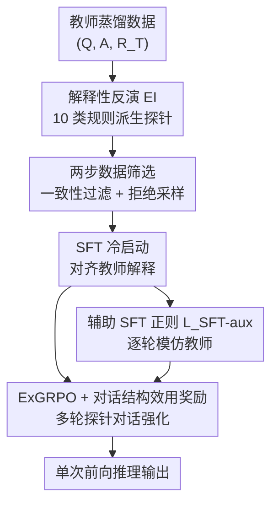

# Probing to Refine: Reinforcement Distillation of LLMs via Explanatory Inversion

**会议**: ICLR 2026  
**OpenReview**: [https://openreview.net/forum?id=rkIw2GqYEt](https://openreview.net/forum?id=rkIw2GqYEt)  
**代码**: https://github.com/Zhen-Tan-dmml/ExGRPO  
**领域**: LLM推理 / 知识蒸馏 / 强化学习  
**关键词**: 推理蒸馏, 解释性反演, GRPO, 泛化性, 多轮对话奖励

## 一句话总结
这篇论文指出蒸馏出来的小模型会"放大"泛化缺陷（只记套路、一换方向就崩），于是用"解释性反演"生成逼学生讲清底层逻辑的探针，再用带"对话结构效用奖励"的 ExGRPO 强化学习把这些探针串成多轮对话去精炼学生，12 个数据集上让 Gemma-7B 平均比零样本涨 20.39%、比最强蒸馏基线涨 6.02%。

## 研究背景与动机
**领域现状**：把大模型（教师）的链式推理能力蒸馏进小模型（学生）是降本部署的主流路线，做法基本都是监督微调（SFT）——让学生去模仿教师生成的 CoT 推理轨迹，即"老师怎么写学生就怎么抄"。

**现有痛点**：这种照抄式蒸馏让学生学到的是**表层模式记忆**，分布稍微一变就崩。最典型的是"反转诅咒"（reversal curse）：模型能算对正向题 $5-2=3$，却答不出它的逆问题"已知剩 3、给出 2，原本有几个"（$3+2=5$）。作者进一步发现一个新现象——**泛化缺陷在蒸馏模型里不是单纯存在，而是被放大了**（Figure 1a，蒸馏小模型在 EI-Test 上比教师掉得更狠）。

**核心矛盾**：已有的"逆向思维"补救（如 RevThink）只是再教学生学一条 A→Q 的方向映射，本质还是多记一个方向的套路，并没有让学生真正理解加减法之间的对偶关系这类底层原理；而 SFT 这种固定监督目标天然带来曝光偏差、缺乏探索，无法把教师揭示的复杂推理结构内化。问题的根子是：**学生在"模仿输出"而非"理解逻辑"**。

**本文目标**：从数据侧和优化侧两路同时解决——数据侧造出能逼学生解释"为什么"的训练信号，优化侧用 RL 替代纯 SFT 的内化机制。

**核心 idea**：用"解释性反演"（Explanatory Inversion, EI）生成探问底层逻辑的探针，再用为蒸馏定制的 ExGRPO（带对话结构效用奖励）把这些探针组织成多轮对话来强化学生，逼它建立对任务的概念性理解而不是死记。

## 方法详解

### 整体框架
整体流程围绕一条"造探针 → 筛数据 → 冷启动 → RL 精炼"的管线展开。输入是一批教师蒸馏数据 $(Q, A, R_T)$（问题、答案、教师 CoT 推理）；首先 EI 对每条数据施加 $N=10$ 类变换规则，派生出一批"解释性探针" $Q^{aug}_i$；这些候选探针经过两步筛选得到高质量数据集 $D_{EI}$；用 $D_{EI}$ 先做 SFT 把学生冷启动到能应对这些挑战；最后用 ExGRPO 把若干探针随机抽样串成多轮对话，靠规则奖励（答案正确性 + 对话结构效用奖励）做强化精炼。值得强调的是：**所有多轮探针、随机抽样、奖励计算都只发生在训练期**，推理时学生对一个 $Q$ 单次前向直接给答案，不增加任何推理开销。

### 关键设计

**1. 解释性反演（EI）：用追问"为什么"的探针把模仿变成理解**

针对学生只会照抄、换个方向就崩的痛点，EI 不再像 RevThink 那样只造 A→Q 的逆向题，而是受认知科学"解释驱动理解"启发，去解构、挑战、探究教师推理 $R_T = (s_1, \dots, s_T)$ 里的底层逻辑、假设和原理。具体做法是对每条原始数据 $(Q, A, R_T)$ 施加 $N=10$ 类基于模板的变换规则 $F = \{f_1, \dots, f_N\}$，生成一组探针 $Q^{aug}_i = f_i(Q, A, R_T)$，得到候选集 $D_{cand}(Q) = \{(Q^{aug}_i, A^{aug}_i, R^{aug}_{T,i})\}_{i=1}^N$。以苹果题 $5-2=3$ 为例，探针包括"为什么这里用减法？""若已知结果 3 和给出的 2，该用什么运算求起始数？""$5-2$ 和 $2-5$ 顺序重要吗？"等。两个代表性规则是 **R1 反事实情景生成**（改动前提看结论怎么变，考查条件依赖）和 **R2 解释性挑战**（要求为某个逻辑跳转给出论证，逼出细粒度推理）。由于不同规则对不同 $Q$ 适用，整个训练集仍能让学生暴露在全部 10 类规则下。区别于"再学一个方向映射"，EI 逼学生从多个角度回答需要理解逻辑的问题，从而建立更丰富的任务概念模型。

**2. 两步数据筛选：把无效和过易过难的探针剔掉**

直接拿全部候选探针训练会引入噪声，作者用两道过滤器构造最终数据集 $D_{EI}$。第一道是 **EI 一致性过滤**：保证探针及其教师推理不会把原问题带偏——把探针 $Q^{aug}_k$、它的推理与答案拼到原问题 $Q$ 前面喂给教师 $T$，若教师仍能答对原答案 $A$ 才保留，即 $\zeta_{EI}(d_k) \Leftrightarrow T([Q^{aug}_k \| R^{aug}_{T,k} \| A^{aug}_{T,k} \| Q]) = A$。第二道是 **拒绝采样过滤**：对每个原问题 $Q$，统计基线学生 $S_{base}$（SFT 前）答对的一致探针数 $\Lambda_{Q,S_{base}}$，要求它"既不能全对、又至少答对 $\tau_{hard}$ 个"——

$$\big(\lnot(\Lambda_{Q,S_{base}} = N'_Q \wedge N'_Q>0)\big) \wedge \big(\lnot(\Lambda_{Q,S_{base}} \geq \tau_{hard} \wedge N'_Q>0)\big)$$

第一项剔除"对学生太容易"（全答对说明没学习价值），第二项滤掉"太难"（连基本盘都达不到的样本学不动），$N'_Q=0$ 的问题也丢弃。这样留下的恰是对学生"踮脚够得着、又不至于太轻松"的探针，是 SFT、$L_{SFT\text{-}aux}$ 教师轨迹和 RL 阶段抽样规则类型的共同来源。

**3. ExGRPO 与对话结构效用奖励：用 RL 奖励"完整对话比残缺对话更好"**

SFT 冷启动只是热身，真正内化靠 ExGRPO。它把 GRPO 改造成适配蒸馏：对每个 $Q$，从 10 类规则中**无放回随机抽 $k$ 个**（如 $k=5$）生成探针序列，逐轮呈现给学生、把历史对话作为上下文，最后再用原问题 $Q$ 让学生给出最终答案——这一整串构成"完整对话"（Scenario A）。随机抽样既增加跨 epoch 的对话多样性、避免过拟合固定探针，又省算力、避免一次性塞太多探针造成认知过载。奖励上，基础是**结果奖励** $R_{outcome}$（最终答案对得 1、错得 0）。关键创新是**对话结构效用奖励** $r_{dsu}$：再构造只用 $k' < k$ 个探针的"残缺对话"（Scenario B），若完整对话的平均表现 $P_{full}$ 显著超过残缺对话 $P_{partial}$，就给奖励——

$$r_{dsu} = \begin{cases} \delta, & \text{if } P_{full} > \nu \cdot P_{partial} \\ 0, & \text{otherwise} \end{cases}$$

其中 $\delta>0$ 是奖励值、$\nu \geq 1.0$ 是性能边界。总奖励 $R_{total} = R_{base} + r_{dsu}$（仅当该轨迹答案正确且满足上式时加 bonus）。这等于显式奖励学生"真的从整条解释链里学到东西"，而非孤立蒙对单个探针。优势 $U^{(g)}$ 在组内归一化，再用带 clip 和 KL 正则的 ExGRPO 目标更新策略，参考策略 $\pi_{ref}$ 取 Stage 1 之后的模型。作者还给出 Theorem 3.1，证明仅在满足效用条件时施加 $r_{dsu}$，能保证更新后期望结果奖励不低于完整对话策略 $\pi_k$。

**4. 辅助 SFT 正则 $L_{SFT\text{-}aux}$：给中间轮次加监督防训练崩塌**

纯靠最终答案的稀疏奖励，多轮探针交互里的中间推理无人监督，RL 容易跑飞（消融里冷启动 RL 直接灾难性退化）。为此每个中间探针轮次都加一道辅助 SFT 损失，让学生在每轮模仿教师对该探针的回答 $R^{aug}_{T,j}$：

$$L_{SFT\text{-}aux} = -\sum_{j=1}^{k} \log \pi_\theta(R^{aug}_{T,j} \mid Q^{aug}_j, \text{context})$$

它与 $L_{ExGRPO}$ 组合或交替使用，给探针轮提供稠密的过程监督，把 RL 的探索约束在合理轨道上，是稳定训练的关键正则（消融显示去掉它会明显掉点）。

### 损失函数 / 训练策略
三阶段串行：Stage 1 数据筛选 → Stage 2 在 $D_{EI}$ 上做 $P$ 轮 SFT 冷启动（最小化负对数似然 $L_{SFT}$）→ Stage 3 用 $L_{ExGRPO}$（含 clip + $\beta D_{KL}(\pi_\theta \| \pi_{ref})$）联合 $L_{SFT\text{-}aux}$ 做强化精炼。教师用 Gemini-1.5-Pro，学生用 Gemma-7B-it（弱）和 Qwen2.5-7B-Instruct（强），$N=10$、$k\approx5$。

## 实验关键数据

### 主实验
8 个 held-in 推理数据集（覆盖常识/数学/表格/NLI/逻辑），主指标为准确率（%）：

| 学生模型 | 方法 | 平均 Acc | vs 零样本 |
|----------|------|----------|-----------|
| Qwen2.5-7B | Zero-shot | 77.99 | — |
| Qwen2.5-7B | RevThink | 80.89 | +2.90 |
| Qwen2.5-7B | On-Policy Distill | 81.60 | +3.61 |
| Qwen2.5-7B | **ExGRPO** | **82.54** | **+4.55** |
| Gemma-7B | Zero-shot | 46.80 | — |
| Gemma-7B | RevThink | 61.17 | +14.37 |
| Gemma-7B | On-Policy Distill | 65.40 | +18.60 |
| Gemma-7B | **ExGRPO** | **67.19** | **+20.39** |

ExGRPO 在两个学生上都是最优，对越弱的学生（Gemma）增益越大（+20.39%）；在 Qwen 已经很强的 GSM8K 上，它是**唯一**实现正迁移的方法。有趣的是，EI 增强甚至把教师 Gemini-1.5-Pro 的零样本也提了 +2.22%（83.48→85.70）。

### 消融实验
（Qwen2.5-7B，8 数据集平均 Acc，相对零样本 77.99）

| 配置 | 平均 Acc | 说明 |
|------|---------|------|
| SFT (3 ep) only | 79.17 | 仅冷启动 |
| RL (冷启动, $R_{base}$) | 15.99 | 无 SFT 直接 RL：灾难性崩塌（-62.00） |
| RL (冷启动) + $L_{SFT\text{-}aux}$ | 71.53 | 加辅助监督也救不回（仍 -6.46） |
| SFT (3ep) + RL ($R_{base}$) | 80.13 | 有冷启动才稳 |
| SFT (3ep) + RL + $L_{SFT\text{-}aux}$ | 81.23 | 加辅助监督再涨 |
| **SFT (3ep) + ExGRPO ($R_{base}+r_{dsu}$) + $L_{SFT\text{-}aux}$** | **82.54** | 完整模型 |

### 关键发现
- **SFT 冷启动是 RL 不崩的前提**：与大模型 post-training 不同，蒸馏场景里去掉 SFT 直接冷启动 RL 会从 77.99 暴跌到 15.99，这是最反直觉也最重要的发现。
- **$r_{dsu}$ 和 $L_{SFT\text{-}aux}$ 各自有贡献**：从 80.13 → 81.23（加辅助监督）→ 82.54（再加对话结构效用奖励），两者叠加才到最优。
- **样本/token 效率高**：用 10–25% 训练数据即可超过 vanilla 微调，并展现出对 OOD 任务的强泛化。

## 亮点与洞察
- **"放大的泛化缺陷"是个有价值的新观察**：指出蒸馏不只继承、还会放大教师的泛化短板，给整个 KD 领域提了个值得警惕的现象。
- **把 RL 从 post-training 工具搬进蒸馏过程本身**很巧：不是事后对齐，而是用 RL 当蒸馏的内化引擎，并意识到蒸馏场景必须先 SFT 冷启动否则 RL 崩，这个工程教训很实在。
- **对话结构效用奖励的设计思路可迁移**：用"完整 vs 残缺"的对比轨迹去奖励"模型真的利用了完整上下文"，这种对比式奖励可以借鉴到任何"想确认模型用上了某段信息"的多轮/长上下文任务。
- **EI 的探针思想跨任务通用**：逼模型解释"为什么对、换个条件会怎样"的探针生成，不止能蒸馏，也能当通用的推理数据增强。

## 局限与展望
- **依赖强教师生成探针与回答**：EI 的 10 类规则探针和过滤都要 Gemini-1.5-Pro 级别教师参与，成本不低，教师弱时质量存疑。
- **多轮对话训练开销大**：Scenario A/B 双场景、每场景 $G$ 条轨迹、$k$ 轮探针，RL 训练算力显著高于纯 SFT（虽然推理期零额外开销）。
- **超参敏感性**：$r_{dsu}$ 的 $\delta$、$\nu$、$\tau_{hard}$、$k$ 等阈值如何选论文主要靠经验，鲁棒性边界没充分刻画。
- **规则是模板化的**：10 类变换基于人工模板，能否自动发现更优探针类型、规则数量上限在哪，值得继续探索。

## 相关工作与启发
- **vs RevThink**: 都想治反转诅咒，RevThink 显式造 A→Q 逆向题让学生再学一条方向映射；本文认为这仍是机械记套路，用 EI 多角度探问底层逻辑追求概念性理解，且额外引入 RL 精炼，Gemma 上 67.19 vs 61.17。
- **vs 标准 GRPO**: GRPO 只用最终答案正确性当奖励，没有中间推理监督、也接不进教师轨迹，不适合蒸馏；ExGRPO 引入对话结构效用奖励 + 辅助 SFT 正则，让教师能显式监督多轮推理的连贯性。
- **vs On-Policy Distillation**: 同为较强基线，但本文靠 EI 探针 + 对话级奖励在两个学生、几乎所有数据集上稳定超过它（Qwen 82.54 vs 81.60，Gemma 67.19 vs 65.40）。

## 评分
- 新颖性: ⭐⭐⭐⭐⭐ "放大的泛化缺陷"观察 + EI 探针 + 对话结构效用奖励三点都不落俗套
- 实验充分度: ⭐⭐⭐⭐ 12 数据集 + 双学生 + 消融/效率/OOD 较全，但教师/超参依赖未充分剖析
- 写作质量: ⭐⭐⭐⭐ 动机层层递进、公式清晰，符号偏多需细读
- 价值: ⭐⭐⭐⭐ 给推理蒸馏提供了可迁移的数据增强 + RL 内化范式，工程教训实用

<!-- RELATED:START -->

## 相关论文

- [\[ICLR 2026\] Emergent Hierarchical Reasoning in LLMs through Reinforcement Learning](emergent_hierarchical_reasoning_in_llms_through_reinforcement_learning.md)
- [\[ICLR 2026\] SkillFactory: Self-Distillation for Learning Cognitive Behaviors](skillfactory_self-distillation_for_learning_cognitive_behaviors.md)
- [\[ICLR 2026\] Where Did This Sentence Come From? Tracing Provenance in LLM Reasoning Distillation](where_did_this_sentence_come_from_tracing_provenance_in_llm_reasoning_distillati.md)
- [\[ICLR 2026\] KaVa: Latent Reasoning via Compressed KV-Cache Distillation](kava_latent_reasoning_via_compressed_kv-cache_distillation.md)
- [\[ICLR 2026\] Explain in Your Own Words: Improving Reasoning via Token-Selective Dual Knowledge Distillation](explain_in_your_own_words_improving_reasoning_via_token-selective_dual_knowledge.md)

<!-- RELATED:END -->
