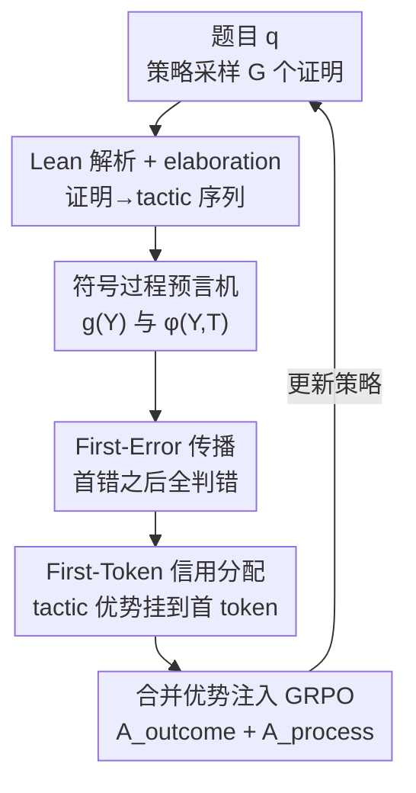

# Process-Verified Reinforcement Learning for Theorem Proving via Lean

**会议**: ICLR 2026  
**OpenReview**: [https://openreview.net/forum?id=P00k4DFaXF](https://openreview.net/forum?id=P00k4DFaXF)  
**领域**: LLM推理  
**关键词**: 形式化定理证明, Lean, 过程奖励, GRPO, 信用分配

## 一句话总结
本文把 Lean 证明助手本身当作"符号过程预言机"，从它的 elaboration 反馈中同时抽取整证明级（outcome）和逐 tactic 级（process）的可验证奖励，配合 first-error 传播和 first-token 信用分配注入 GRPO，让形式化定理证明的 RL 在 MiniF2F / ProofNet 上比仅用二值结果奖励的基线更稳更高（MiniF2F pass@64 +2.5%p）。

## 研究背景与动机
**领域现状**：用 LLM 做形式化定理证明（如 Lean）时，主流做法是把 Lean 当成一个"评判者"——模型整段生成一个证明，Lean 跑一遍给出"过/不过"的二值结果，这个 0/1 信号被当作可验证奖励（RLVR）喂进 PPO 或 GRPO。这就是 DeepSeek-Prover、STP 等系统的 online RL 框架。

**现有痛点**：二值结果奖励太稀疏。一个证明里可能前面 4 步都对、只有第 5 步用错了 tactic，但模型收到的只是一个笼统的"失败"，无法知道究竟哪一步坏了、前面哪些步其实是对的。结果是优化缓慢、性能早早进入平台期，且在 ProofNet 这类难数据集上 GRPO 经常给不出任何增益，甚至不如监督基线。

**核心矛盾**：Lean 实际上输出的是**结构化、树形、富信息**的符号反馈（info tree、proof state、错误定位），而 LLM 是**自回归、按 token、按标量奖励**学习的。这两种表示之间存在鸿沟——丰富的逐步验证信息被压成了一个标量，结构化的 process 信号被白白丢弃。这正是一个"信用分配"难题：怎么把符号验证器的反馈转成 token 级的训练信号。

**本文目标**：① 给出把细粒度 Lean 反馈纳入 RL 目标的形式化；② 给出一条把 Lean 符号反馈归约成"每个 tactic 一个分数"的原则性规则；③ 给出从 tactic 分数映射到 token 级优势的方法。

**切入角度**：作者注意到 Lean 的 elaboration 阶段天然就标注了**每个 tactic 是否局部健全**——只要一个 tactic 没出现在错误日志里，它就通过了 Lean 基于依赖类型论的内部验证，是一个"已验证的推理步骤"，哪怕整个证明最终没闭合。换句话说，Lean 早就给每一步打好了"对/错"标签，只是以前没人用。

**核心 idea**：不训练任何额外的过程奖励模型（PRM），直接把 Lean 当作免标注、免采样的过程预言机，从它的 AST/错误日志里读出逐 tactic 奖励，和整证明奖励一起注入 GRPO。

## 方法详解

### 整体框架
方法要解决的是"如何把 Lean 的结构化逐步反馈变成 RL 能用的 token 级标量信号"。整体流程是：策略模型对一道题 $q$ 采样一组 $G$ 个候选证明 $\{Y_1,\dots,Y_G\}$；每个证明 $Y_i$ 被 Lean 解析成 tactic 序列 $(T_1,\dots,T_N)$ 并做 elaboration，Lean 返回两类反馈——全局结果 $g(Y)\in\{0,1\}$（整证明过不过）和逐 tactic 的 elaboration 状态（哪些步局部健全、最早哪一步出错）；这些反馈经过 first-error 传播规则归约成每个 tactic 的分数 $\varphi$，再把 tactic 优势只挂到该 tactic 的第一个 token 上，最后与 outcome 优势相加，合并成一个 token 级优势 $A_{i,t}$ 注入 GRPO 目标。

### 关键设计

**1. 把 Lean 形式化为符号过程预言机：用 $f,g,\varphi$ 三个函数读出双层奖励**

针对"Lean 的富反馈被压成单个标量"这个痛点，作者先把 Lean 的角色严格形式化成三个函数。解析函数 $f:\mathcal{Y}\to\mathcal{T}^*$ 把一个证明 $Y$ 按 AST 中 tactic 的起始位置排序，得到 tactic 序列 $f(Y)=(T_1,\dots,T_{N(Y)})$，这个顺序恰好对齐 LLM 的自回归生成顺序。全局打分函数 $g:\mathcal{Y}\to\{0,1\}$ 给整证明判过/不过。逐 tactic 打分函数 $\varphi$ 则给每个 tactic 一个分数：

$$\varphi(Y,T)=\begin{cases}1, & g(Y)=1\\ d_1, & g(Y)=0\ \text{且}\ T\ \text{无错误}\\ d_2, & g(Y)=0\ \text{且}\ T\ \text{含错误}\end{cases}$$

关键在于第二行：即便整证明失败（$g=0$），只要某个 tactic 没出现在 Lean 错误日志里，它就被 Lean 验证为"局部健全"，给一个较温和的惩罚 $d_1$；真正出错的 tactic 才给更重的惩罚 $d_2$（主实验取 $d_1=-0.05$、$d_2=-0.1$）。这区分了"部分正确但没闭合"和"真错"两种步骤，正是二值奖励做不到的。整个 Lean 反馈被写成 $\mathrm{Lean}(Y)=\big(g(Y),[(T_1,\varphi(Y,T_1)),\dots]\big)$，既有 outcome 又有 process，且全部根植于依赖类型论、无需人工标注或蒙特卡洛采样。

**2. First-Error 传播：让"首错之后的步骤全部失效"符合证明的因果性**

Lean 把证明解析成树结构，而 LLM 是自回归、因果地生成的：一旦第 $j$ 个 tactic 出错，后面的 $T_{j+1},\dots,T_N$ 都是建立在一个无效前缀上的，不可能构成有效的推理。为此作者引入 first-error 传播规则——设 $j=\min\{i:T_i\ \text{含错误}\}$，则

$$\varphi(Y,T_k)=\begin{cases}1, & g(Y)=1\\ d_1, & g(Y)=0,\ k<j,\ \text{无错}\\ d_2, & g(Y)=0,\ k\ge j\end{cases}$$

也就是只把"首错位置之前且自身无错"的 tactic 当作部分正确（$d_1$），从首错开始（含首错）的所有后续 tactic 一律按错误处理（$d_2$）。这条规则保证了信用分配在因果和类型论意义上都自洽：在数学证明里，一步坏了就不该让后面"靠运气"的高回报把它救回来——这与一般 RL 里"次优步骤若后续奖励高仍可获正回报"恰恰相反。消融显示去掉这条规则会显著掉点。

**3. First-Token 信用分配：把 tactic 优势只挂到 tactic 的第一个 token**

有了逐 tactic 分数，还要决定怎么把它摊到 token 上。process 优势定义为

$$A_{\text{process},i,j}=r_{\text{process},i,j}-\mathrm{mean}\big(g(Y_1),\dots,g(Y_G)\big)$$

其中减去"组内平均结果奖励"充当一个**难度自适应基线**：题越简单平均 outcome 越高，对错误 tactic 的惩罚就越重；题越难基线越低、惩罚越轻。作者把这个 tactic 优势**只加到该 tactic 的第一个 token** 上：

$$A_{i,t}=A_{\text{outcome},i,t}+\mathbb{1}\{t=\mathrm{first}(T_{i,s(i,t)})\}\cdot A_{\text{process},i,s(i,t)}$$

这么做的理由很具体：Lean tactic 的第一个 token 恰是 tactic 关键词（`intro`、`apply`、`have` 等），它决定了接下来的证明策略、约束了子目标的结构，是真正的"决策分叉点"。消融对比了"摊到全部 token / 只给最后一个 token / 额外挑 10% 高熵 token"等策略，first-token 给出最稳定一致的提升，其它策略有时反而掉点。

**4. 合并 outcome 与 process 优势注入 GRPO：稀疏全局目标 + 稠密局部信用**

outcome 优势仍是 GRPO 标准的组内归一化形式 $A_{\text{outcome},i,t}=\frac{g(Y_i)-\mathrm{mean}(g)}{\mathrm{std}(g)}$，作用在 $Y_i$ 的所有 token 上；process 优势如上只作用在各 tactic 首 token。两者相加成 $A_{i,t}$，代入 GRPO 目标：

$$L(\theta)=\mathbb{E}\Big[\tfrac{1}{G}\sum_{i=1}^{G}\tfrac{1}{|Y_i|}\sum_{t=1}^{|Y_i|}\min\big(\rho_{i,t}A_{i,t},\ \mathrm{clip}(\rho_{i,t},1-\epsilon,1+\epsilon)A_{i,t}\big)-\beta D_{\mathrm{KL}}[\pi_\theta\|\pi_{\text{ref}}]\Big]$$

其中 $\rho_{i,t}$ 是新旧策略的 token 重要性比。这样 outcome 信号保证整证明级正确性（全局目标），tactic 信号提供可验证的中间反馈（局部信用），两者互补：前者防止 tactic-only 那种"局部正确但没全局目标"的早熟收敛，后者缓解 outcome-only 的稀疏。作者还在附录 J 用 potential-based reward shaping 给了理论解释——把"当前证明前缀能补成有效 Lean 证明的概率"当势函数、错误态作为势为 0 的吸收态。整个方法不需要价值网络（return-based 信用被发现优化不稳定），也不需要额外 PRM，几乎零额外开销（反正本来就要调 Lean REPL）。

## 实验关键数据

### 主实验
训练数据为从 STP 数据集（326 万证明）随机抽的 1 万样本，Lean 经 REPL 验证、每次尝试 15 秒超时，用非 CoT 提示风格。

| 模型 | Budget | MiniF2F-Test | ProofNet-Test |
|------|--------|--------------|---------------|
| STP-Lean | 32 / 64 | 55.9% / 56.7% | 17.2% / 19.1% |
| **STP-Lean + Ours** | 32 / 64 | **57.1% / 59.2%** | **18.6% / 19.0%** |
| DeepSeek-Prover-V1.5+STP | 32 / 64 | 54.9% / 57.2% | 16.8% / 17.7% |
| **+ STP + Ours** | 32 / 64 | **56.3% / 57.8%** | **17.6% / 18.5%** |

STP-Lean 上 MiniF2F pass@64 提升 +2.5%p、ProofNet pass@32 提升 +1.4%p（pass@64 微降 0.1%p）；单次整证明生成的 59.2% (pass@64) 已逼近重搜索基线 InternLM2.5-StepProver 的 58.5%，但避免了大量搜索时算力。

### 消融实验

| 配置 | MiniF2F (32/64) | 说明 |
|------|-----------------|------|
| Outcome only (GRPO) | 55.7% / 57.9% | 仅二值结果奖励 |
| Tactic only | 55.6% / 56.8% | 仅逐步奖励、缺全局目标 |
| **Outcome+Tactic (ours)** | **57.1% / 59.2%** | 二者互补最佳 |
| All tokens | 56.3% / 57.8% | tactic 优势摊到全部 token |
| Last token | 56.7% / 57.5% | 只给最后 token |
| **First token (ours)** | **57.1% / 59.2%** | 只给首 token 最稳 |
| No First-Error | 56.4% / 58.2% | 去掉首错传播，掉点 |
| Same tactic reward ($d_1{=}d_2$) | 57.7% / 58.7% | MiniF2F 涨但 ProofNet 不一致 |

### 关键发现
- **互补性最关键**：outcome-only 受稀疏性限制、早早平台；tactic-only 缺全局目标、早熟收敛；只有二者结合既快又高（训练曲线里 outcome+tactic 的 tactic 奖励持续上升，tactic-only 则平台）。
- **first-token 与 Lean 语义对齐**：tactic 首 token 即 tactic 关键词，是决定后续证明结构的决策点，集中信用于此最有效。
- **熵下降但不塌缩**：outcome+tactic 收敛到更低熵（策略更果断），但平均证明长度稳定，说明增益不是靠"把输出拉长"。
- **超时 15 秒最优**：5 秒太短、连简单证明都超时导致有效奖励太少；10–30 秒都好，15 秒最佳，且 10–15 秒有时反超 30 秒——丢弃过于复杂的证明反而把训练偏向更短更规范的策略。
- **三要素缺一不可**：首错传播 + 难度归一化基线 + $d_1\neq d_2$ 区分惩罚，去掉任一都会变差或不一致。

## 亮点与洞察
- **"验证器即奖励预言机"的视角转换**：以往 Lean 只在评测时当验证器，本文指出它在训练时也能当 process-level 奖励来源——免人工标注、免蒙特卡洛采样就拿到每步对错，这是省掉 PRM 的根本原因。
- **first-error 传播把"类型论健全性"翻译成 RL 信用规则**：一步错则后续皆错，既符合 Lean 的局部健全语义，又符合 LLM 自回归的因果性，是个很干净的对齐。
- **first-token 信用是可迁移的 trick**：当一个动作序列的"语义由首 token 决定"（如带关键词的结构化语言、DSL、代码 tactic）时，把信用集中在首 token 可能普遍有效。

## 局限与展望
- **绝对增益偏小**：多数设置只是 +1~2.5%p，且个别设置（ProofNet pass@64）还微降，方法更多是"更稳"而非"大幅超越"。
- **只在 7B、两个 prover、两个 benchmark 上验证**：MiniF2F/ProofNet 规模有限，是否能放大到更大模型或更难题集未知。
- **依赖 Lean REPL 与超时**：15 秒超时这一超参对结果敏感，长证明会被系统性丢弃，可能让模型偏向短证明而牺牲对复杂定理的覆盖。
- **process 奖励的 $d_1,d_2$ 取值**仍是手调超参，缺少自适应机制；first-error 之后一刀切判错，对"错一步但后续仍含有用子结构"的情形可能过于严厉。

## 相关工作与启发
- **vs Lean-STaR / RMaxTS**：它们把 Lean 只当推理时的 step-checker 做树搜索，本文把 Lean 当训练时的过程奖励预言机做单次整证明生成 RL，省掉搜索时算力。
- **vs 整证明验证的 RL（如 DeepSeek-Prover 系）**：它们训练时只用 Lean 的整证明二值结果，本文进一步用 Lean 的逐 tactic elaboration 反馈做 process 奖励。
- **vs 显式/隐式 PRM**：PRM 需要大量步骤级正确性标注或蒙特卡洛 rollout 成功率来训练，本文直接让 Lean 充当无标注的过程预言机，免去 PRM。

## 评分
- 新颖性: ⭐⭐⭐⭐ "Lean 既是验证器又是过程奖励预言机"的视角清晰且形式化扎实
- 实验充分度: ⭐⭐⭐⭐ 主实验+多组消融（token 分配/首错/超时/惩罚）覆盖到位，但模型与 benchmark 规模偏窄
- 写作质量: ⭐⭐⭐⭐ 形式化与动机讲得清楚，图表完整
- 价值: ⭐⭐⭐⭐ 给形式化推理 RL 提供了一条免 PRM 的稠密可验证信用分配路线

<!-- RELATED:START -->

## 相关论文

- [\[ICLR 2026\] Mathesis: Towards Formal Theorem Proving from Natural Languages](mathesis_towards_formal_theorem_proving_from_natural_languages.md)
- [\[ICLR 2026\] Neural Theorem Proving for Verification Conditions: A Real-World Benchmark](neural_theorem_proving_for_verification_conditions_a_real-world_benchmark.md)
- [\[ICLR 2026\] Emergent Hierarchical Reasoning in LLMs through Reinforcement Learning](emergent_hierarchical_reasoning_in_llms_through_reinforcement_learning.md)
- [\[ICLR 2026\] Generative Adversarial Reasoner: Enhancing LLM Reasoning with Adversarial Reinforcement Learning](generative_adversarial_reasoner_enhancing_llm_reasoning_with_adversarial_reinfor.md)
- [\[ICLR 2026\] EvolProver: Advancing Automated Theorem Proving by Evolving Formalized Problems via Symmetry and Difficulty](evolprover_advancing_automated_theorem_proving_by_evolving_formalized_problems_v.md)

<!-- RELATED:END -->
