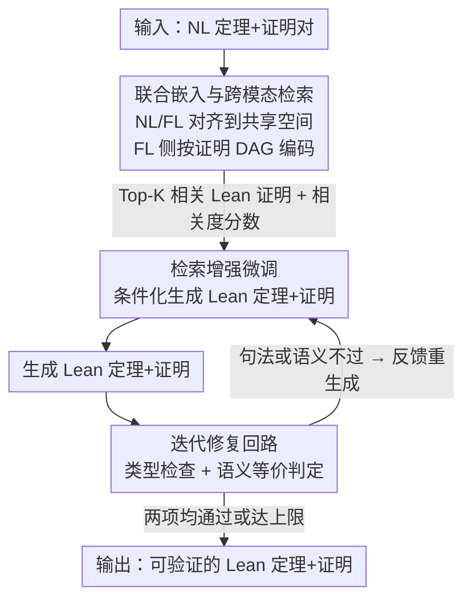

# ProofBridge: Auto-Formalization of Natural Language Proofs in Lean via Joint Embeddings

**会议**: ICLR 2026  
**OpenReview**: [https://openreview.net/forum?id=U2jxHXuOX9](https://openreview.net/forum?id=U2jxHXuOX9)  
**代码**: 待确认  
**领域**: LLM推理 / 自动形式化 / 神经符号  
**关键词**: 证明自动形式化, Lean 4, 联合嵌入, 跨模态检索, 迭代修复

## 一句话总结
ProofBridge 把"自然语言定理+证明 → Lean 4 定理+证明"整条形式化任务统一起来：先训一个把 NL 和 Lean 证明（按 DAG 结构编码）对齐到同一语义空间的联合嵌入模型，用它跨模态检索相似的 Lean 证明作为示范来做检索增强微调与推理，再配一个靠 Lean 类型检查 + 语义等价判定的迭代修复回路，在自建的 MINIF2F-TEST-PF 上比 Kimina-Prover-RL-1.7B 基线高出 +31.14% 语义正确率。

## 研究背景与动机
**领域现状**：把人写的数学定理和证明从自然语言（NL）翻译成 Lean 4 这类形式语言（FL），主流被拆成两个相对独立的方向。一是自动形式化（auto-formalization），但绝大多数工作只翻译**定理陈述**（Herald、Kimina-Autoformalizer 等），不碰证明；二是自动形式证明合成（AFPS），它假设你已经有了 FL 定理，目标是给它生成 FL 证明（DeepSeek-Prover、Kimina-Prover 等）。

**现有痛点**：把一整个 NL 证明形式化，实际上得先做"定理-only 自动形式化"把 NL 定理翻成 FL，再用 AFPS 补证明——这条流水线在实践里仍然要人工介入。最有代表性的就是 AlphaProof 在 2024 IMO 拿银牌时，题目陈述是**人工**形式化后才交给自动证明合成的。证明自动形式化（theorem + proof 一起翻）这件事本身被探索得很少，只有 Isabelle 上的 Draft-Sketch-Prove 和 Lean 上的 FormL4 算先例。

**核心矛盾**：作者把限制归结为四点。其一，配好的"NL 定理 ↔ Lean 4 证明"大规模数据极其稀缺，已有带证明的数据集要么小、要么 Lean 版本对不上 miniF2F（Lean 版本不向后兼容，跨版本评测常直接失败）。其二，通用大模型难满足 Lean 严格的句法语义约束，且算力贵，逼着人做更小的专用模型，但专用模型又大多只管定理或只管证明。其三，Lean 4 的动作空间近乎无限，证明里的 tactic 会复用已有定理、引入新变量，直接 NL→FL 生成而忽略 tactic 复用、DAG 依赖这些**语义结构**，模型很容易产生幻觉证明。其四，自动评测是瓶颈：Lean 类型检查只能验"证明能不能过"，验不了"形式化的定理和原 NL 定理是不是同一个意思"，很多方法干脆只检查定理（证明用 `sorry` 占位）或退而用 BLEU 这类不可靠代理。

**本文目标**：做一个统一框架，输入 NL 定理+证明对，直接输出 Lean 4 的定理+证明对，并且同时保证类型正确（能过 Lean 检查）和语义正确（形式化定理和原 NL 定理等价）。

**切入角度 / 核心 idea**：把证明自动形式化当成"从示范中学习"。不是让 LLM 凭空把 NL 翻成 Lean，而是用一个能感知 Lean 证明 DAG 结构的联合嵌入模型，**跨模态检索**出语义最相近的若干 FL 证明作为 in-context 示范——这些示范带着可复用的形式化模式（tactic 选择、DAG 结构），给生成提供"接地"的信号，把模型往 Lean 可验证的证明上推。

## 方法详解

### 整体框架
ProofBridge 要解决的是"NL 定理+证明 $M_{\text{NL}}=\langle T_{\text{NL}}, P_{\text{NL}}\rangle$ → Lean 定理+证明 $M_{\text{FL}}=\langle T_{\text{FL}}, P_{\text{FL}}\rangle$"的端到端翻译。整条系统由三块串起来：**联合嵌入 + 跨模态检索**先把一个大库里语义相近的 Lean 证明捞出来当示范；**检索增强微调**让 LLM（基座是 Kimina-Prover-RL-1.7B）在"NL 输入 + 检索到的 FL 示范"条件下学会生成 Lean 定理+证明；**迭代修复**在推理时用 Lean 类型检查器和语义等价判定反复纠错，直到句法、语义都过关或达到上限。

整个流程的关键在于 FL 侧不把证明当纯文本，而是把 Lean 证明的 tactic 序列线性化成 DAG 遍历来编码，这样"证明结构像"的样本才会被检索到一起。

### 关键设计

**1. NL/FL 联合嵌入：用 DAG 感知的对比学习把两种模态对齐到同一空间**

痛点直白说就是：之前的检索增强工作（LeanSearch、HERALD、RAutoformalizer）都用纯文本编码器，但 Lean 里大量证明共享同样的 tactic，关键词重叠根本区分不开"哪个证明结构真的相近"，检索质量上不去。ProofBridge 给两种模态各配一个编码器并联合训练：NL 侧用轻量的 all-MiniLM-L6-v2（22.7M 参数）把 $M_{\text{NL}}$ 编成 384 维向量再投影到共享维度 $d=512$；FL 侧是关键——先用 Lean REPL 把证明 $P_{\text{FL}}$ 抽成**线性化的 DAG 遍历**，即一串证明状态转移 $S_0 \xrightarrow{\text{tac}_0} S_1 \xrightarrow{\text{tac}_1} \cdots \xrightarrow{\text{tac}_{H-1}} S_H$（$S_0$ 就是定理本身，每个 $S_h$ 是一组待证目标），每个状态用 LeanDojo 的 ByT5 证明状态编码器（218M 参数）编成 1472 维，再 mean-pooling 成整证明向量、投影到 512 维。这样"DAG 结构相似的证明"得到相似嵌入。

对齐靠对称的双向 InfoNCE 对比损失：对每个正样本对 $(M_{\text{NL}}^{(i)}, M_{\text{FL}}^{(i)})$ 拉高余弦相似度、把同 batch 里的错配对当负样本推开，

$$\mathcal{L}(B) = -\frac{1}{2n}\sum_{i=1}^{n}\left[\log\frac{\exp([\hat{v}_{\text{NL}}^{(i)}, \hat{v}_{\text{FL}}^{(i)}]/\tau)}{\sum_{j}\exp([\hat{v}_{\text{NL}}^{(i)}, \hat{v}_{\text{FL}}^{(j)}]/\tau)} + \log\frac{\exp([\hat{v}_{\text{FL}}^{(i)}, \hat{v}_{\text{NL}}^{(i)}]/\tau)}{\sum_{j}\exp([\hat{v}_{\text{FL}}^{(i)}, \hat{v}_{\text{NL}}^{(j)}]/\tau)}\right]$$

其中 $\tau$ 是温度、$[\cdot,\cdot]$ 是 $\ell_2$ 归一化后的余弦相似度。训练好后对全库预计算归一化嵌入，给一个查询（NL 或 FL 都行）算与目标模态全库的余弦相似度、取 Top-K 近邻当示范。正是 DAG 编码让这个空间里"等价的 NL-FL 对抱团、不等价的拉远"，这是后面一切检索增强的地基。

**2. 检索增强微调：让 LLM 在相关 Lean 证明的条件下学翻译，而不是凭空生成**

针对的痛点是：直接 NL→FL 生成会忽略 tactic 复用和 DAG 依赖，模型容易瞎编。ProofBridge 给每个训练样本构造的 prompt 里塞进两部分——输入 NL 定理+证明 $M_{\text{NL}}$，以及检索到的 Top-K（实际取 5）个 FL 定理+证明对 $\{M_{\text{FL}}^{(k)}\}$ 连同它们的**相关度分数** $\{r^{(k)}\}$（分数让模型知道该给每个示范多少权重）。然后在自建数据集上用标准自回归语言建模损失微调 Kimina-Prover-RL-1.7B：

$$\mathcal{L}_{\text{CE}} = -\frac{1}{|T|}\sum_{t=1}^{|T|}\log P_\theta(\tau_t \mid \tau_{<t}, C)$$

其中 $T=\tilde{M}_{\text{FL}}$ 是生成的形式化结果，$C$ 是上下文（NL 对 + 检索到的 FL 示范）。这等于让模型从"相似数学概念在 Lean 里怎么被形式化"的真实范例里学，而非孤立地造定理。消融里这一步贡献最大：相对基线把 SC 拉了 +22.55%。

**3. 迭代证明修复：用 Lean 类型检查 + 语义等价判定的双重验证回路兜底**

LLM 是随机模型，一次生成的 Lean 证明可能有句法错或和原 NL 语义对不上。修复回路对生成的 $\tilde{M}_{\text{FL}}=\langle \tilde{T}_{\text{FL}}, \tilde{P}_{\text{FL}}\rangle$ 做两类验证：**句法验证**用 Lean 类型检查器编译，失败就抽出具体错误信息和位置；**语义验证**用一个 LLM-based 等价裁判判断生成的定理 $\tilde{T}_{\text{FL}}$ 是否准确表达了原 NL 定理 $T_{\text{NL}}$。只要有一项不过，就把反馈（错误信息 / 不等价提示）喂回 LLM 重新生成，循环到两项都过或达到上限 $R_{\max}=5$（Algorithm 1）。这一步在检索增强微调之上再加 +5.74% TC、把 SC 顶到最好，本质是把"形式化是否真的正确"这件本来靠代理指标糊弄的事，交给 Lean 编译器和可验证的等价证明来兜底。

### 损失函数 / 训练策略
两阶段：阶段一以对比损失 $\mathcal{L}(B)$ 训练联合嵌入（NL/FL 编码器各只微调一部分参数：NL 投影层 + FL 的 ByT5 状态编码与投影层，故参数量记作 22.7M + 218M + 1M）；阶段二以交叉熵 $\mathcal{L}_{\text{CE}}$ 检索增强微调 Kimina-Prover-RL-1.7B，检索固定取 Top-5。推理时叠加上限 5 次的迭代修复。训练用 NUMINAMATH-LEAN-PF 的 90%（35,056 条）当训练集兼检索库 $D$，剩 3,895 条评联合嵌入；最终在 MINIF2F-TEST-PF 上评形式化。

## 实验关键数据

### 主实验
作者自建两个数据集：训练用 **NUMINAMATH-LEAN-PF**（38,951 条 NL↔Lean 4 定理+证明对，从 NuminaMath-LEAN 出发、Lean 类型检查 + Gemini-2.5-Pro 修复 + 两阶段补 NL 证明而来），评测用 **MINIF2F-TEST-PF**（miniF2F-test 的 Lean v4.15.0 版，244 道 Olympiad 级题，统一 Lean 版本）。

跨模态检索质量（vs 基线编码器 all-MiniLM-L6-v2，NL→FL 方向）：

| 方法 | 参数量 | Recall@1 (%) | MRR | mMG（检索/非检索中位间隔）|
|------|--------|------|------|------|
| all-MiniLM-L6-v2（基线）| 22.7M | 16.06 | 0.237 | 0.31 |
| E5-Mistral-7B-Instruct | 7B | 35.60 | 0.441 | 0.10 |
| Qwen3-Embedding-8B | 8B | 46.75 | 0.567 | 0.29 |
| **ProofBridge** | 22.7M+218M+1M | **52.83** | **0.650** | **0.65** |

ProofBridge 以 32 倍更小的体量超过 8B 的 SoTA 编码器：Recall@1 相对基线 3.28×、MRR 2.74×，且 mMG 0.65 远高于别人（DAG-aware 才能把 tactic 高度重叠的证明区分开）。

证明自动形式化（MINIF2F-TEST-PF，pass@32，SC = 语义正确率、TC = 类型正确率）：

| 设置 / 工具 | SC (%) | TC (%) |
|------|------|------|
| Kimina-Autoformalizer-7B / Herald-Translator（定理-only）| 0.00 | 0.00 |
| GPT-5-mini（zero-shot）| 9.02 | 34.84 |
| Gemini-2.5-Pro（zero-shot）| 8.61 | 31.56 |
| Kimina-Prover-72B（zero-shot）| 43.03 | 79.51 |
| SoTA Two-Step（Herald→Kimina-Distill-8B）| 43.44 | 59.43 |
| Kimina-Prover-RL-1.7B（random few-shot 基线）| 31.56 | 93.85 |
| **ProofBridge（检索增强 SFT + 修复）** | **62.70** | **95.49** |

定理-only 模型把证明留成 `sorry`，所以 SC/TC 全 0；基础模型受困于 Lean 严格句法语义；Two-Step 受级联误差拖累（第一步定理错了第二步必错）。ProofBridge 建在小小的 1.7B 上，却相对其 random few-shot 基线 +31.14% SC、+1.64% TC，也超过 72B 的零样本。

### 消融实验

| 配置 | SC@32 (%) | TC@32 (%) | 说明 |
|------|------|------|------|
| PROOFBRIDGE（SFT only）| 34.84 | 78.69 | 仅微调 + 语义相关示范 few-shot |
| + 检索增强 SFT | 55.33 | 89.75 | 把相关 FL 证明喂进输入，SC 大涨 |
| + 检索增强 SFT + 修复 | **62.70** | **95.49** | 完整模型，TC 也补上来 |

### 关键发现
- **检索增强是 SC 的主引擎**：从 SFT-only 到检索增强 SFT，SC 从 34.84% 跳到 55.33%（+约 20%），说明"喂进语义相关的 Lean 证明"比单纯微调有用得多。
- **随机示范会反噬语义**：给 Kimina-Prover-RL-1.7B 加随机 few-shot，TC 从 75% 升到 93.85% 但 SC 从 40.16% 掉到 31.56%——随机例子改善了句法却诱导模型产出语义错位的证明；纯文本检索（Qwen3）也因偏好 tactic 相似而牺牲多样性、压低 TC。这正反证了需要 DAG-aware 的语义检索。
- **修复回路主要补 TC**：在检索增强 SFT 之上，迭代修复把 TC 再抬约 +5.7%、SC 顶到最好，因为它直接拿 Lean 编译错误和等价判定来纠句法、语义两类错。
- **分领域**：数论最好（SC > 85%），竞赛题（AIME/AMC/IMO）最难，SC 仅约 35%。

## 亮点与洞察
- **把"证明结构"做成可检索的一等公民**：FL 编码器不读纯文本，而是把 Lean 证明的 tactic DAG 线性化后逐状态编码，这是它能在 32 倍更小体量下吊打 8B 通用编码器的根因——可迁移到任何"结构比表面 token 更重要"的检索任务（代码、电路、SQL 计划）。
- **用可验证信号替代代理指标**：语义正确不是让 LLM 拍脑袋判，而是让 Gemini 生成一个 Lean 双向等价证明、由 Lean 来判，把"等价"这件事落到可机检的对象上，比 BLEU 这类代理可信得多。
- **检索增强 + 验证修复的分工很干净**：检索增强主攻语义（SC），修复回路主攻句法兜底（TC），两者贡献在消融里各自清晰可分，是个值得借鉴的"语义来自示范、正确性来自验证"范式。

## 局限与展望
- 语义正确性的判定依赖 Gemini-2.5-Pro 生成等价证明（最多 5 次、限定 `rfl`/`simp`/`ring` 等 tactic），裁判模型本身的能力上限会影响 SC 的判定边界；NL 证明也是 Gemini 从 FL 反向 informalize 出来的，可能把模型自身的偏置引进训练数据。
- 竞赛级题目 SC 仅约 35%，说明对真正难、tactic 组合新颖的题，检索示范帮不上太多——检索库里没有"结构相近"的样本时优势就退化。
- 强绑定 Lean v4.15.0 与 miniF2F 这套生态，Lean 版本不兼容问题在数据准备里被反复提及，跨版本/跨证明助手（Isabelle、Rocq）迁移成本未知。
- 可改进方向：把修复回路里的语义裁判也换成训练过的小专用模型以降成本；或把 DAG 编码从线性化遍历升级为真正的图编码，进一步保留分支依赖。

## 相关工作与启发
- **vs 定理-only 自动形式化（Herald-Translator / Kimina-Autoformalizer）**：他们只翻定理陈述、证明留 `sorry`，所以在 proof 形式化上 SC/TC 全 0；ProofBridge 把定理和证明一起端到端翻，且首次为 NL/FL 的"定理+证明对"联合学表示。
- **vs AFPS（DeepSeek-Prover / Kimina-Prover）**：他们假设 FL 定理已给定、只补 FL 证明；ProofBridge 要从 NL 同时生成 FL 定理和证明，任务更难，并把 Kimina-Prover-RL-1.7B 当基座做检索增强。
- **vs 数学检索增强（COPRA / REAL-Prover / LeanSearch / RAutoformalizer）**：他们用纯文本编码器检索引理或定理；ProofBridge 用 DAG-aware 联合嵌入做"定理+证明对"的跨模态检索，作者实验证明纯文本检索撑不起更难的"带证明"检索。
- **vs SoTA Two-Step（先定理形式化再 AFPS）**：这正是 AlphaProof 那条要人工介入的老路，受级联误差拖累（43.44% SC）；ProofBridge 用统一框架 + 修复回路把级联错误闭环掉。

## 评分
- 新颖性: ⭐⭐⭐⭐⭐ 首个把"定理+证明对"做 NL/FL 联合嵌入、并用 DAG 结构驱动跨模态检索来做端到端证明自动形式化。
- 实验充分度: ⭐⭐⭐⭐⭐ 对比 13 个 SoTA LLM + 多个编码器，含 pass@k、分领域、三段式消融，并自建两套数据集。
- 写作质量: ⭐⭐⭐⭐ 框架清晰、动机扎实，但符号与多表格密度高，需对照图 1 才好读。
- 价值: ⭐⭐⭐⭐⭐ 给"证明形式化仍需人工"这一长期痛点提供了可验证、可复用的统一方案，对 AI-for-Math 落地意义大。

<!-- RELATED:START -->

## 相关论文

- [\[ICLR 2026\] Hilbert: Recursively Building Formal Proofs with Informal Reasoning](hilbert_recursively_building_formal_proofs_with_informal_reasoning.md)
- [\[ICLR 2026\] ProofOptimizer: Training Language Models to Simplify Proofs without Human Demonstrations](proofoptimizer_training_language_models_to_simplify_proofs_without_human_demonst.md)
- [\[ICLR 2026\] Premise Selection for a Lean Hammer](premise_selection_for_a_lean_hammer.md)
- [\[ICLR 2026\] Mathesis: Towards Formal Theorem Proving from Natural Languages](mathesis_towards_formal_theorem_proving_from_natural_languages.md)
- [\[ICML 2025\] FMC: Formalization of Natural Language Mathematical Competition Problems](../../ICML2025/llm_reasoning/fmc_formalization_of_natural_language_mathematical_competition_problems.md)

<!-- RELATED:END -->
