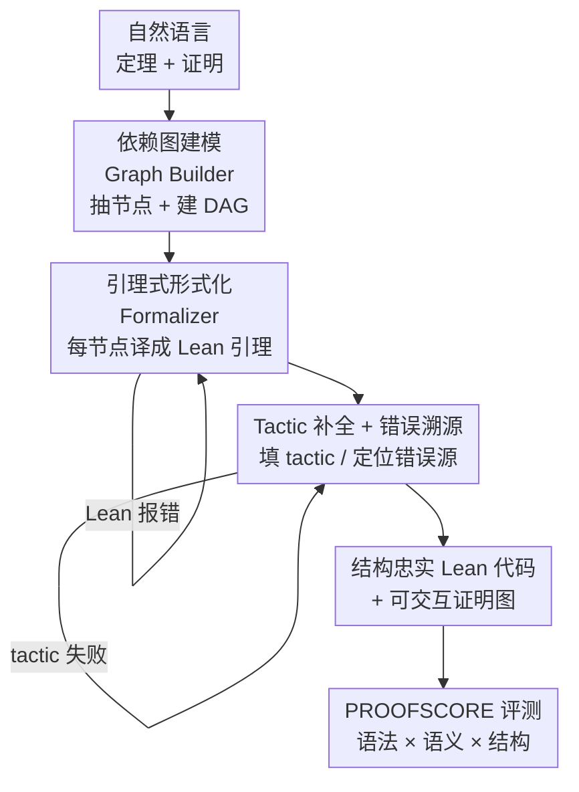

# ProofFlow: A Dependency Graph Approach to Faithful Proof Autoformalization

**会议**: ICLR 2026  
**OpenReview**: [https://openreview.net/forum?id=s9t2FJVsBH](https://openreview.net/forum?id=s9t2FJVsBH)  
**代码**: https://github.com/Huawei-AI4Math/ProofFlow  
**领域**: LLM推理 / 自动形式化 / 定理证明  
**关键词**: 证明自动形式化, 依赖图, Lean 4, 结构忠实度, 评测指标

## 一句话总结
ProofFlow 把自然语言证明先拆成一张刻画步骤依赖关系的有向无环图（DAG），再把每一步形式化成一条带显式依赖的高层 Lean 4 引理，从而在"语法正确"之外额外保住原始论证的逻辑结构，并配套提出综合评测指标 PROOFSCORE 和 184 题的大学级基准 PROOFFLOWBENCH，把自动形式化质量从基线的 0.279 推到 0.545。

## 研究背景与动机
**领域现状**：把自然语言定理和证明翻译成机器可验证代码（proof autoformalization），是让大模型进入严格数学工作流的关键一步。它和自动定理证明（ATP）不同——ATP 是从一个**已经形式化**的命题里去搜出一个证明，而本文要做的是把一段**已经存在的人类证明**忠实地翻译过去，用于核验正确性、发现缺失假设或补上逻辑漏洞。

**现有痛点**：主流做法是让 LLM 直接生成 Lean 4 的 tactic（如 `linarith`、`have`）。但 tactic 是低层、自由度高的操作，常常无法对齐原始证明的步骤结构。论文用一个多项式不等式的例子说明：原证明有 L1–L4、TS 五个逻辑步骤，而 tactic 方案里一句 `linarith` 就把 TS、L2、L4 三步压缩进去了，步骤的先后和依赖完全看不出来。这带来两个问题：一是很多自然语言表达根本无法直接落到低层 tactic 上，导致形式化失败；二是即使生成了可验证的证明，它也可能"抄近路"——绕开中间步骤、用了原证明里本不该用的前提，结果对了但逻辑和人写的不是一回事。

**核心矛盾**：人类语言是灵活、高层的，形式系统是僵硬、低层的；过去的方法只盯着"能不能编译通过"（syntactic correctness）或用 BLEU 粗测语义，却完全忽略了**结构忠实度**——证明的依赖结构是否被保留。一个典型反例是 STEP PROOF：它假设每一步都依赖所有前序步骤，这种过度简化让证明器可以在任意子图里抄近路（比如直接复用 L1 去证 L3，把 L2 架空）。

**本文目标**：（1）让形式化的每一步只使用原证明逻辑所指定的那一组前置引理和定理条件；（2）给"忠实"一个可量化的定义和指标；（3）提供一个专门评测证明形式化的基准。

**核心 idea**：不直接翻译成低层 tactic，而是把证明**解构成一串带显式依赖的高层引理**——先用 DAG 把"谁依赖谁"画清楚，再逐节点形式化，用图结构强制证明器只能沿着正确依赖走，从源头杜绝抄近路。

## 方法详解

### 整体框架
ProofFlow 是一条三阶段流水线，每个阶段都调用 LLM 来跨越自然语言与形式代码之间的鸿沟。输入是一段自然语言定理 + 证明，输出是一份结构忠实的 Lean 4 代码（每条引理带显式依赖），外加一张可交互的证明图。第一阶段 **Graph Builder** 从原证明解析出依赖 DAG；第二阶段 **Formalizer** 把图里每个节点的"自包含陈述"翻译成 Lean 4 引理（先用 `by sorry` 占位）；第三阶段 **Tactic Completer** 把 `sorry` 替换成真正的 tactic 完成证明。两个形式化/求证阶段都带 Lean 编译器校验和重试回环，且整套流程还附带一个错误溯源机制，能判断出错到底来自 Formalizer、Tactic Completer 还是原始自然语言证明本身。评测侧则由 PROOFSCORE 统一打分。

### 关键设计

**1. 依赖图建模：用 DAG 把证明的逻辑骨架显式画出来**

针对 tactic 方案"看不出步骤依赖、能抄近路"的痛点，Graph Builder 用 LLM 把证明解析成一张有向无环图 $G=(V,E)$。节点集被划分成四类互不相交的子集 $V = V_{TC} \cup V_D \cup V_L \cup V_{TS}$，分别对应定理条件（Theorem Conditions）、定义（Definitions）、引理（Lemmas）和定理结论（Theorem Solutions）；每条边 $(u,v)\in E$ 表示节点 $u$ 是证明 $v$ 的前置条件。定理条件和结论从定理陈述里抽，引理和额外定义从证明正文里抽。每个节点都被赋予三样东西：它的原始自然语言陈述、它的依赖列表、以及一段**自包含陈述**（self-contained statement，把这一步需要的所有前提补全，让它能脱离上下文独立成立）。建好后系统会校验图的合法性——查前向引用、查环、并确认除结论外每个节点都有出边；不合格就回炉让 LLM 改图。这一步是整条流水线"结构忠实"的根，因为后面所有形式化都被钉死在这张图上。

**2. 引理式形式化：用高层引理代替低层 tactic**

这是和现有方法最本质的区别。Formalizer 不去生成零散的低层 tactic，而是把每个节点的自包含陈述翻译成一条独立的 Lean 4 引理，引理签名里**显式列出它依赖的前置引理/条件**（如 `lemma TS (L2: ...) (L4: ...) : ...`），证明体先用 `by sorry` 占位。这样做有两个好处：一是高层引理能低摩擦地一一对应原证明的步骤序列，而 tactic 往往把好几步揉成一句、破坏结构；二是显式依赖直接把"哪一步能用哪些前提"写进类型签名，从机制上禁止证明器引入原证明里本不该有的依赖——而 Lean 里常用的 `have` 会把整个前序上下文都喂给当前步，正是抄近路的温床。形式化是迭代的：编译报错会连同上一次输出一起反馈给 LLM 重新修正。

**3. Tactic 补全与错误溯源：填证明，并定位错误到底出在哪**

Tactic Completer 负责把每条引理里的 `by sorry` 替换成真正的 Lean 4 tactic，让证明真正跑通；同样带编译校验和重试。更有价值的是它附带一套**逐节点的错误溯源机制**：先把该节点的语义忠实度分数和阈值 0.6 比，过不了就直接判这一步的自然语言陈述有问题；过了再看它是不是可证命题（引理或结论），若是就让 Tactic Completer 尝试补 tactic——成功则该步完成；失败则让 LLM 转而去**证明该陈述的否定**，如果否定能被证出来，说明原始自然语言陈述本身不精确（埋了错），否则就归因于 Tactic Completer 这个 LLM 既证不出也证不伪。这套机制把"形式化失败"从一个黑箱信号变成了可定位的诊断，能反过来提醒数学家原证明里可能藏着漏洞。

**4. PROOFSCORE：把语法、语义、结构三件事合成一个分**

过去要么只看语法、要么只用 BLEU 测语义，没人量化结构。PROOFSCORE 把三者乘在一起：对 $n$ 步证明，
$$\text{PROOFSCORE} = \frac{1}{n}\sum_{i=1}^{n} f_i\, c_i\, \mathbb{I}\!\left[D_{\text{est}}(v_i)\in D_{\text{true}}(v_i)\right]$$
其中 $c_i\in\{0,1\}$ 是**语法正确性**（节点 $v_i$ 经 Tactic Completer 后无 Lean 编译错误则为 1）；$f_i\in[0,1]$ 是**语义忠实度**，沿用并改造自 LeanScore，衡量形式化引理与原自然语言陈述的语义等价程度；指示函数 $\mathbb{I}[\cdot]$ 是**结构忠实度**，检查节点 $v_i$ 估计出的依赖 $D_{\text{est}}(v_i)$ 是否落在某个合法的真值依赖集 $D_{\text{true}}(v_i)$ 里（允许多张合法 ground-truth 图，因为粒度可粗可细，如 $1+13+5=19$ 拆一步还是两步都算对）。三个因子相乘意味着任何一维不合格都会把该步得分清零，这正是它比单看语法严格得多的原因。当 Graph Builder 被配置成强制 DAG 时结构忠实度天然为 1，否则用 Claude-Sonnet-4 配专用 prompt 来核验结构和语义。

## 实验关键数据

### 主实验
在自建的 184 题 PROOFFLOWBENCH 上、Pass@5（每阶段最多 5 次自我纠错重试）设置下评测。对比 FULL PROOF（一次性整证形式化）和 STEP PROOF（逐步独立形式化）两类 tactic 基线。

| 方法 | 思考模式 | PROOFSCORE | Proof 级语法通过率 |
|------|---------|-----------|------------------|
| **ProofFlow DAG** | Yes | **0.545** | 0.375 |
| ProofFlow noDAG | Yes | 0.417 | 0.353 |
| FULL PROOF | Yes | 0.279 | 0.571 |
| STEP PROOF | Yes | 0.029 | 0.119 |
| **ProofFlow DAG** | No | 0.355 | 0.027 |
| FULL PROOF | No | 0.021 | 0.027 |
| STEP PROOF | No | 0.046 | 0.005 |

ProofFlow DAG（思考模式）以 0.545 的 PROOFSCORE 刷新 SOTA，几乎是 FULL PROOF（0.279）的两倍，把 STEP PROOF（0.029）远远甩开。值得注意的是 FULL PROOF 的语法通过率（0.571）反而是最高的——它能写出编译通过的代码，但 PROOFSCORE 低，说明这些证明"语法对、结构不忠实"，恰好印证了只看语法会严重高估质量。STEP PROOF 因为难以在多步间维持 Lean 4 缩进、且一步出错后续全崩，语法通过率最低。

### 消融实验

| 配置 | PROOFSCORE (Yes) | Tactic 准确率 (Yes) | 说明 |
|------|-----------------|--------------------|------|
| DAG（完整） | 0.545 | 0.742 | 强制正确依赖图 |
| noDAG | 0.417 | 0.681 | 放开依赖、把所有前序步当前提喂入 |

去掉 DAG 强制后 PROOFSCORE 从 0.545 掉到 0.417，结构忠实度和语法正确性双双下降。一个反直觉现象：在**非思考**模式下 noDAG 的语法通过率反而更高（0.049 vs 0.027）——因为把所有前序步当已知条件喂给弱模型，确实更容易凑出编译通过的代码，但这往往导致逻辑结构不一致，PROOFSCORE 仍然更低。

### 关键发现
- **结构忠实度才是真正的区分维度**：FULL PROOF 语法通过率最高却 PROOFSCORE 最低，说明"能编译"和"忠实"是两回事，单一语法指标会误导。
- **DAG 强制是核心增益来源**：消融显示它在思考模式下带来 0.545 vs 0.417 的提升，主要来自结构忠实度。
- **DAG 还能换来效率**：Tactic Completer 是主要瓶颈（占 81–89% 时间），而 DAG 设计天然支持不同分支节点并行形式化与求证。
- **泛化性**：在 miniF2F 上抽 50 题复测，各配置的相对排序保持一致，且各项指标普遍更高，说明 miniF2F 比 PROOFFLOWBENCH 更容易。

## 亮点与洞察
- **把"忠实"拆成可量化的三维并相乘**：语法 × 语义 × 结构的乘性聚合很巧妙——任何一维崩了该步直接 0 分，强迫方法不能靠某一维刷分，这套指标思路可迁移到任何"多重正确性"的生成评测里。
- **用类型签名当依赖约束的载体**：把"哪一步能用哪些前提"写进 Lean 引理签名，让形式系统自身去强制结构忠实，而不是靠 prompt 提醒，是个很硬的工程洞见。
- **错误溯源里的"证否定"技巧**：tactic 失败时去尝试证明命题的否定，以此区分"原证明本身有错"还是"求证器无能"，把失败信号变成对人类原证明的诊断，反向赋能数学家。
- **DAG 同时服务正确性和效率**：依赖图既约束搜索空间提升忠实度，又因为分支独立而天然可并行，一举两得。

## 局限与展望
- **目前 Tactic Completer 仍是瓶颈**：占 81–89% 执行时间，论文给出的并行化只是"原则上可行"，未必充分落地。
- **依赖 LLM 建图的质量**：Graph Builder 的 DAG 抽取若出错，会把错误传导到后续所有阶段；论文用合法性校验 + 回炉缓解，但建图本身仍是 LLM 主观行为。
- **ground-truth 图非唯一**：因为粒度可变，结构忠实度允许多张合法图，这意味着评测里"对不对"带一定主观裁量。
- **基准规模有限**：PROOFFLOWBENCH 仅 184 题、本科水平，平均 8.4 节点；面对研究级长证明的扩展性尚待验证。
- **整体绝对分数仍不高**：最佳 PROOFSCORE 0.545 离实用还有距离，说明忠实自动形式化远未解决。

## 相关工作与启发
- **vs FULL PROOF（整证一次性形式化）**：它一次调用 LLM 形式化整段证明，语法通过率高但结构忠实度差；ProofFlow 把证明拆成带依赖的引理逐节点处理，牺牲一点语法通过率换来结构忠实，PROOFSCORE 反超一倍。
- **vs STEP PROOF（逐步独立形式化）**：STEP PROOF 假设每步依赖所有前序步，过度简化导致抄近路、且跨步缩进易崩；ProofFlow 用 DAG 精确指定每步的前置集合，从根上杜绝错误依赖。
- **vs 传统 ATP（如 Goedel-Prover、Kimina-Prover）**：ATP 是从已形式化命题里搜证明，抄近路无所谓；ProofFlow 解决的是"翻译已有证明"，忠实于原结构才是目标，二者任务正交但可级联（ProofFlow 的 Tactic Completer 内部就用了 ATP）。

## 评分
- 新颖性: ⭐⭐⭐⭐⭐ 把"结构忠实度"显式提为一等目标、用 DAG + 引理签名强制实现，并配套首个三合一指标，思路新且自洽。
- 实验充分度: ⭐⭐⭐⭐ 有自建基准 + miniF2F 复测 + DAG/noDAG 消融 + 思考/非思考双模式，较完整，但绝对分数偏低、基准规模有限。
- 写作质量: ⭐⭐⭐⭐⭐ 图 1/2 的正反例对比讲得很清楚，动机—方法—指标—实验逻辑链顺畅。
- 价值: ⭐⭐⭐⭐⭐ 自动形式化是 LLM 进入严格数学的关键一环，开源了 pipeline、基准和指标，对社区推动明确。

<!-- RELATED:START -->

## 相关论文

- [\[ICLR 2026\] LoC-Decomp: LLM Autoformalization via Logical Concept Decomposition and Iterative Feedback Correction](loc-decomp_llm_autoformalization_via_logical_concept_decomposition_and_iterative.md)
- [\[ICLR 2026\] A Balanced Neuro-Symbolic Approach for Commonsense Abductive Logic](a_balanced_neuro-symbolic_approach_for_commonsense_abductive_logic.md)
- [\[ICLR 2026\] ReForm: Reflective Autoformalization with Prospective Bounded Sequence Optimization](reform_reflective_autoformalization_with_prospective_bounded_sequence_optimizati.md)
- [\[ICLR 2026\] Strategic Scaling of Test-Time Compute: A Bandit Learning Approach](strategic_scaling_of_test-time_compute_a_bandit_learning_approach.md)
- [\[ICLR 2026\] Divide and Abstract: Autoformalization via Decomposition and Abstraction Learning](divide_and_abstract_autoformalization_via_decomposition_and_abstraction_learning.md)

<!-- RELATED:END -->
