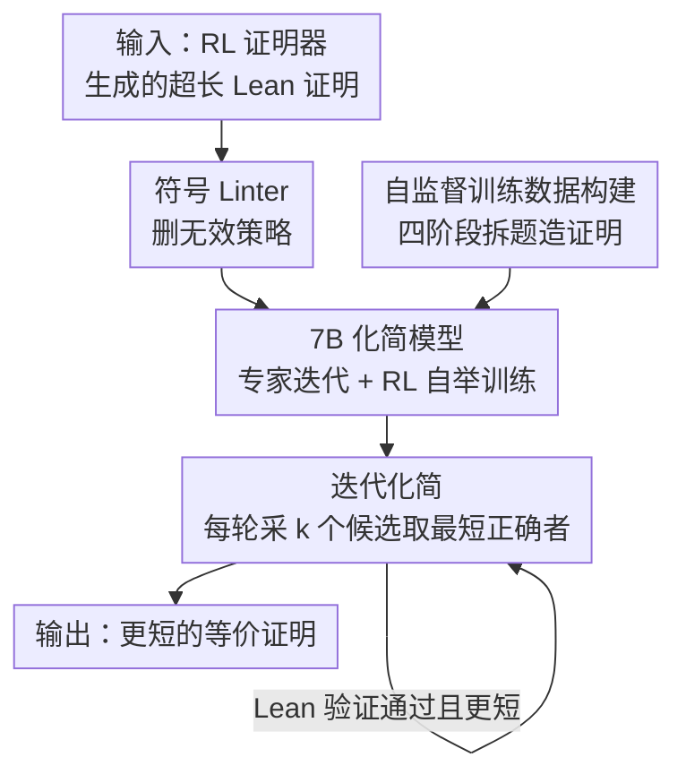

# ProofOptimizer: Training Language Models to Simplify Proofs without Human Demonstrations

**会议**: ICLR 2026  
**OpenReview**: [https://openreview.net/forum?id=huptrb4JTa](https://openreview.net/forum?id=huptrb4JTa)  
**代码**: 待确认（论文承诺开源评测集与模型生成的证明）  
**领域**: LLM推理 / 形式化定理证明  
**关键词**: 证明化简、Lean、专家迭代、强化学习、自监督训练

## 一句话总结
ProofOptimizer 是第一个**不需要任何人工化简示范**就能学会缩短 Lean 证明的 7B 语言模型：它用「符号 linter + 7B 模型 + 迭代化简」三件套，靠 Lean 编译器自动验证、用专家迭代和 RL 自举训练，把 SOTA 神经证明器生成的冗长证明在 miniF2F 上平均压缩 87%、PutnamBench 上 57%、Seed-Prover 的 IMO 2025 证明上 50%，且化简后的证明编译更快、回流当训练数据还能反过来提升证明器性能。

## 研究背景与动机

**领域现状**：用 RL 训练的神经定理证明器（Seed-Prover、Goedel-Prover-V2 等）这一年突飞猛进，已经摸到 IMO 金牌水平，能产出动辄上千行、被 Lean 机械验证为正确的形式化证明。

**现有痛点**：这些 RL 证明器的唯一奖励信号是「证明对不对」，于是模型只管正确、不管简洁，生成的证明又臭又长——堆满冗余步骤、滥用重型自动化策略去解本可以一步搞定的目标。论文给的极端例子是 Seed-Prover 对 IMO 2025 P1 的证明有 4357 行，按字符数算比非形式化解答长 16 倍。这种证明有三宗罪：人类读不懂（丧失数学洞察价值）、当合成训练数据质量差（模型从绕弯证明里学不到东西）、在 Lean / mathlib 里编译极慢。

**核心矛盾**：证明化简（在保正确的前提下把证明改短）成了卡脖子环节，但**训练数据极度稀缺**——根本没有「化简前/化简后」配对的证明语料。

**本文目标**：在零人工监督下，训练一个专门做证明化简的模型，且要能搞定 RL 证明器产出的**超长**证明（这恰恰是先前方法最失效、却最需要化简的场景）。

**切入角度**：作者注意到两件事可以把「没有标注」这道坎绕过去——其一，Lean 编译器本身就是免费且可靠的验证器，能判定一个化简后的证明是否仍然正确；其二，证明长度（Lean token 数）是确定性、可自动计算的复杂度度量，天然可以当 reward。有了「可验证的正确性 + 可计算的目标」，就能用自举的方式自己造数据、自己给信号。

**核心 idea**：把证明化简变成一个**自监督闭环**——模型提出化简候选 → Lean 验证并按长度筛选 → 成功的化简回流成训练数据（专家迭代）或奖励信号（RL），如此循环持续自我改进，全程不需要人写一个化简示范。

## 方法详解

### 整体框架

ProofOptimizer 要解决的是「给一个又长又对的 Lean 证明 $p$，产出一个更短且仍然正确的证明 $p^*$」。任务被形式化为 $p^* = \arg\min_{x \text{ proves } s} L(x)$，其中复杂度度量 $L$ 在本文取证明长度 $L(x)=|x|$（用 Lean 专用 tokenizer 计 token 数，忽略注释和换行，且不惩罚长标识符名）；但方法对任何确定性、可自动计算的度量都通用。

系统由三个部件串成，推理时按「先用符号工具清扫、再用模型大改、最后迭代逼近」的流程逐步压缩：

整条管线的关键在于：训练数据由一条四阶段流水线**凭空合成**（不靠人标），模型再用专家迭代和 RL 两种方式自举，推理时则把符号 linter、模型采样、迭代逼近组合起来把长度榨到最低。

### 关键设计

**1. 自监督训练数据流水线：不靠人标，自己造出「证明前/后」语料**

证明化简最大的拦路虎是没有配对语料。作者干脆用四阶段流水线**自己造证明**当种子，而不是去标注化简对：① 问题收集——从 Goedel-Pset 拿定理证明题，过滤掉过于简单的计算题，每题含自然语言题目、解答和 Lean 命题；② 证明草图——训一个模型把自然语言解答形式化成只有 2–10 个高层步骤的 Lean 证明草图，细节用 Lean 的 `sorry` 占位；③ 定理抽取与过滤——把草图的每一步拆成独立子定理（本质是把长证明切成一堆短证明），共得 518K 个子定理，再用一个自动化策略筛掉平凡定理，剩 307K；④ 证明生成——用 Goedel-Prover-V2-32B 给这些子定理生成证明，成功产出 145K 条，作为初始训练集 $P_0$。这套流水线的巧妙在于：它不需要任何「化简示范」，只要能造出一批正确证明，后面的自举循环就能在这些证明上不断「越改越短」，把「化简能力」从「正确性」里蒸馏出来。

**2. 专家迭代（ExpIt）：用 STaR 式自举把成功化简回流成监督信号**

有了种子证明却没有「更短版本」当标签，作者用 STaR 风格的迭代算法让模型自己生成标签。从基模 $\pi_0$ 和证明集 $P_0$ 出发，每轮 $i$ 做三步：**采样**——对每个证明 $x\in P_i$ 用 $\pi_i$ 采 4 个化简 $\{y^1_x,\dots,y^4_x\}$；**筛选**——用 Lean 编译器在 $\{x\}\cup Y_x$ 里挑出最短的正确证明 $y_x$，并只保留显著化简的样本组成训练集 $D_i=\{(x,y_x)\mid \text{len}(y_x)\le 0.8\cdot\text{len}(x)\}$（这条 0.8 的长度约束逼模型学「实质化简」而非删一两个 token 的琐碎缩短）；**训练**——在 $D_i$ 上微调 $\pi_i$ 得到 $\pi_{i+1}$，同时把这一轮化简出的更短证明当作下一轮的种子。一个细节是从第二轮起，由于当前 $x$ 可能是从更复杂的 $x'\in P_0$ 化简来的，作者额外把 $(x',y_x)$ 这种「跨度更大」的化简对也加进 $D_i$，让模型见到更大幅度的压缩示例。这样数据和模型一起滚雪球，正确性由 Lean 兜底，全程零人工。

**3. 在线强化学习（RL）：直接用「相对缩短率」当奖励**

专家迭代是离线的 SFT，作者又补了一条在线 RL 路线，用同一份数据，让模型针对「给定初始证明 $x$ 产出更短的有效证明 $y$」直接优化。奖励定义为相对缩短率：当 $y$ 有效且 $|y|\le|x|$ 时 $R(x,y)=\frac{|x|-|y|}{|x|}$，否则为 0。优化用 GRPO 的异步变体——优势 $A_i = R_i - \frac{1}{k}\sum_{j\le k}R_j$ 以 $k=8$ 个样本的平均奖励作 baseline，不做标准差归一化、不加 KL 正则、并丢弃零优势序列。RL 的特点是显著拉高单样本（@1）指标，但代价是**多样性坍缩**——@1 涨了，@1 和 @32 的差距却被压扁，这是 RL 训练常见的现象。

**4. 推理期三件套：符号 linter + 测试期 RL + 迭代化简**

光有模型还不够，推理阶段作者叠了三种技术，其中**迭代化简**是主力。先用符号 linter（基于 Lean 的 `linter.unusedTactic`）删掉不改变证明状态的无效策略（如「`norm_num` 什么都没干」），做最廉价的预清扫。然后比较三条路线：**测试期 RL**——在评测集上固定输入证明、只更新模型参数地再做一轮 RL，因为消除了训练/测试分布差，单样本指标进一步提升且评测曲线更稳；**执行反馈修复**——若化简失败就把 Lean 报错喂给 Goedel-Prover-V2-32B 去修，但作者发现这条路效果差，因为修复后的证明往往比原证明还长，linting 后也只有极少数（miniF2F 4.8% / Putnam 1.8%）比化简找到的最优证明更短；**迭代化简**——对一个证明采 $k$ 个候选取最短正确者，再对这个新证明采 $k$ 个、再取最短，如此反复逐步逼近。综合下来，迭代化简在性能和多样性之间取得最佳平衡，是最终拿到 87%/57% 压缩率的关键。

### 一个完整示例

论文图 1 给了个直观例子：一道 Putnam 1968 A1 题（证明 $22/7-\pi=\int_0^1 \frac{x^4(1-x)^4}{1+x^2}dx$），Goedel-Prover-V2 生成的最短证明有 1097 个 token，里面塞了一长串 `have h₁ ... h₁₄` 的中间引理、反复的 `field_simp`/`ring_nf`/`nlinarith` 重型策略调用。ProofOptimizer 把它压到 **76 个 token**——直接用一个 `simp_rw` 配合内联的 `intro/field_simp/ring`，再跟 `ring_nf; norm_num; linarith [Real.pi_pos]` 收尾，把十几个中间 `have` 全部消掉。这个例子很能说明「冗余」长什么样：原证明把一个本可一气呵成的代数恒等式拆成层层子引理逐个证，而化简后的版本把它压回一条紧凑的策略链。

## 实验关键数据

评测用 Goedel-Prover-V2 在 miniF2F（194 条证明，平均长 334）和 PutnamBench（75 条，平均长 1468）上生成的证明做输入。

### 主实验

ExpIt / RL / 测试期 RL 三种方案对比（指标相对 linted 证明，Min 越低越好，Red 越高越好）：

| 数据集 | 模型 | Min@1 ↓ | Min@32 ↓ | Red@1 ↑ | Red@32 ↑ |
|--------|------|---------|----------|---------|----------|
| miniF2F | Linted（基线长度 302） | 302 | — | 0.0% | — |
| miniF2F | Gemini-2.5-Pro + States | 283 | 207 | 26.4% | 58.7% |
| miniF2F | ProofOptimizer-ExpIt | 241 | 153 | 49.0% | 72.3% |
| miniF2F | ProofOptimizer-RL | 190 | 152 | **63.6%** | 70.9% |
| miniF2F | It2 + 测试期 RL | **160** | 154 | **72.5%** | 73.4% |
| PutnamBench | Linted（基线 1359） | 1359 | — | 0.0% | — |
| PutnamBench | Gemini-2.5-Pro + States | 1371 | 1319 | 6.1% | 19.2% |
| PutnamBench | ProofOptimizer-ExpIt | 1328 | 1161 | 8.2% | 26.3% |
| PutnamBench | ProofOptimizer-RL | 1303 | 1258 | 14.9% | 21.1% |
| PutnamBench | It2 + 测试期 RL | **1260** | 1255 | **23.8%** | 24.2% |

ExpIt 三轮逐轮稳步提升，且 @32 指标最强；RL 把单样本（@1）指标顶到最高，但 @1 与 @32 差距明显收窄（多样性坍缩）；测试期 RL 因消除分布差进一步抬高 @1。三者都显著超过 Gemini-2.5-Pro（即便给它类似 ImProver Chain-of-States 的证明状态标注）。

叠加**迭代化简**后效果最猛：miniF2F 平均长度从 334→75、PutnamBench 从 1468→811，逐题平均压缩 **87.9% / 57.2%**。在分布外的 Seed-Prover IMO 2025 四道题上，用更大采样预算把 P1/P3/P4/P5 分别压缩 43.8%/51.7%/50.1%/53.8%，其中三道压掉一半以上。

### 消融与分析

| 分析维度 | 关键数据 | 说明 |
|----------|---------|------|
| 执行反馈修复 | 修复后仅 4.8%(miniF2F)/1.8%(Putnam) 比化简最优更短 | 修复后的证明常比原证明还长，整体逊于重采样 |
| 训练数据回流 | miniF2F 准确率 +2% | 用化简后证明（均长 85）做 SFT 比用原证明（均长 147）更好 |
| 编译加速 | 50/75(Putnam)、114/194(miniF2F) 加速 >10% | 化简后证明在 Lean 里普遍更快，部分加速 >50% |

### 关键发现

- **迭代化简 > 单次大采样 > 执行反馈修复**：把采样预算花在「逐轮对最短证明再化简」上，比一次性 @128 采样或调外部模型修错都更划算；修复路线失败的根因是修出来的证明太长。
- **ExpIt 和 RL 各有所长**：ExpIt 保多样性、@32 最强适合多采样；RL 单样本最强但多样性坍缩，适合算力受限只采一次的场景。
- **化简有下游红利**：化简后的证明回流当训练数据能让证明器 miniF2F 性能 +2%，且编译更快（28% 的证明至少 1.5× 提速）——证明化简不只是「好看」，还能正反馈到证明生成本身。
- **越长越难压**：reduction 随原证明长度上升而下降，超长证明（如 Putnam 的 4357 行级）仍是硬骨头。

## 亮点与洞察

- **把「没有标注」变成「不需要标注」**：核心洞察是证明化简天生有两个免费监督源——Lean 的可验证性（正确性）和 token 长度的可计算性（目标）。有了这俩，自举闭环就能把化简能力从一堆正确证明里蒸馏出来，彻底绕开标注瓶颈。这个思路可迁移到任何「正确性可自动验证 + 质量可自动度量」的任务（代码优化、SQL 改写、电路简化）。
- **奖励函数即插即换**：因为方法对复杂度度量 $L$ 不挑食，只要把 reward 从「证明长度」换成「执行时间」，同一套训练/推理管线就能直接做**证明加速**——一个设计撑起两类应用。
- **修复反而更糟的反直觉结论**：用执行反馈让外部强模型修错证明听起来很合理，实测却因「修出来的证明更长」而输给单纯重采样，提醒大家在「修复 vs 重采样」上别想当然。
- **小模型办大事**：7B 模型在化简任务上稳定打败 Gemini-2.5-Pro 这种重型推理模型，说明任务专精的自举训练比通用大模型的 prompt scaffolding 更对路。

## 局限与展望

- **超长证明仍是短板**：reduction 随原证明长度显著下降，对真正棘手的 IMO 级数万行证明只能压一半左右，离「人类可读」还有距离。
- **化简可能拖慢执行**：作者也观察到部分化简后证明反而更慢——通常是把一个快的证明算法换成了更短但更慢的方法（如用 `interval_cases` 暴力枚举），长度和速度并非总是同向。
- **依赖现有证明器造数据**：训练数据流水线依赖 Goedel-Prover-V2 等能生成正确证明，质量与覆盖受限于这些上游模型；对它们都证不出的难题，化简也无从谈起。
- **度量单一**：正文主要以 token 长度为复杂度度量，而「简洁/可读」是多维的（结构清晰、用的引理是否自然），单看长度可能化简出更短但更晦涩的证明。

## 相关工作与启发

- **vs ImProver / Ahuja et al. 2024**：先前工作用 GPT-4o 这类 API 模型做 agentic scaffolding（如 Chain-of-States），能缩短人写的 Lean 证明，但对 RL 证明器产出的超长证明基本失效；本文直接微调专精模型 + 自举训练，恰好攻克了这个最有价值却最难的场景。
- **vs 直接微调 LLM 做化简**：朴素思路是直接 SFT，但卡在没有「化简前/后」配对语料；本文用 Lean 验证 + 长度筛选把标签问题转成自监督闭环，从根上解决了数据稀缺。
- **vs STaR / 专家迭代**：方法借用了 STaR 的自举骨架（自己生成数据、过滤、回训），但把过滤器换成 Lean 编译器 + 0.8 长度约束，让自举专门朝「越改越短」收敛。

## 评分
- 新颖性: ⭐⭐⭐⭐⭐ 第一个零人工监督的 Lean 证明化简模型，把可验证性+可计算度量转成自监督闭环的思路很漂亮
- 实验充分度: ⭐⭐⭐⭐⭐ miniF2F/Putnam/IMO 三套评测 + 训练/推理多维消融 + 两类下游收益，覆盖扎实
- 写作质量: ⭐⭐⭐⭐ 任务定义、指标、管线都讲得清楚，图 1 的前后对比很直观
- 价值: ⭐⭐⭐⭐⭐ 直击神经定理证明「证明又臭又长」的真实痛点，且化简能反哺证明器，工程与科研价值兼具

<!-- RELATED:START -->

## 相关论文

- [\[ICLR 2026\] ProofBridge: Auto-Formalization of Natural Language Proofs in Lean via Joint Embeddings](proofbridge_auto-formalization_of_natural_language_proofs_in_lean_via_joint_embe.md)
- [\[ICLR 2026\] Native Reasoning Models: Training Language Models to Reason on Unverifiable Data](native_reasoning_models_training_language_models_to_reason_on_unverifiable_data.md)
- [\[ICLR 2026\] Your Models Have Thought Enough: Training Large Reasoning Models to Stop Overthinking](your_models_have_thought_enough_training_large_reasoning_models_to_stop_overthin.md)
- [\[ICLR 2026\] Reinforcing General Reasoning without Verifiers](reinforcing_general_reasoning_without_verifiers.md)
- [\[ICLR 2026\] Hilbert: Recursively Building Formal Proofs with Informal Reasoning](hilbert_recursively_building_formal_proofs_with_informal_reasoning.md)

<!-- RELATED:END -->
