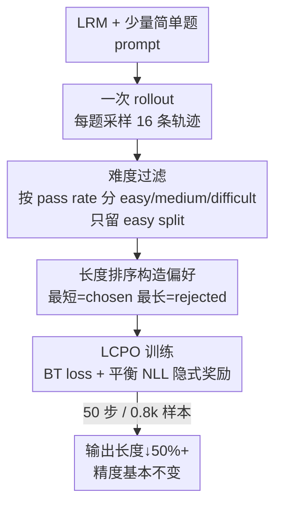

# Pruning Long Chain-of-Thought of Large Reasoning Models via Small-Scale Preference Optimization

**会议**: ICLR 2026  
**OpenReview**: [https://openreview.net/forum?id=8xSU8Oscvg](https://openreview.net/forum?id=8xSU8Oscvg)  
**代码**: 待确认  
**领域**: LLM推理 / 高效推理  
**关键词**: 高效推理, CoT剪枝, 偏好优化, 长度控制, Bradley-Terry

## 一句话总结
这篇论文提出 LCPO（Length Controlled Preference Optimization），仅用 0.8k 条偏好样本、50 步训练，靠"挑模型自己已经会做的简单题、把最短回答当 chosen、最长当 rejected"的纯长度偏好做离线对齐，把 DeepSeek-R1-Distill 系列推理模型的平均输出长度砍掉 50%+ 而几乎不掉精度。

## 研究背景与动机
**领域现状**：以 DeepSeek-R1、QwQ-32B 为代表的大型推理模型（LRM）靠超长 Chain-of-Thought（CoT）在数学/逻辑等复杂任务上拿到强性能，它们通过带可验证奖励的在线强化学习（RLVR，如 PPO、GRPO）学会分解问题、逐步求解、反复回看验证，代价是输出动辄上万 token。

**现有痛点**：过长输出有两个直接危害——一是推理时算力和显存成本暴涨，限制了用 LRM 做下游持续学习；二是"过度思考"（overthinking），对一道 MATH-500 的简单题都能耗掉 5465 token，甚至越想越错。现有省 token 的路子各有硬伤：推理时剪枝（在 prompt 里塞长度 token 逼模型早停）成本低但不稳定、容易伤推理能力；主流的大规模多目标 RL（在准确率奖励外加一个长度正则奖励）要在 645k 量级数据上重训，训练系统复杂、资源消耗高，本身就和"高效推理"的初衷相悖，而且一旦配合预设 token 预算（budget-forcing）就被死板的人工预算卡住、适应不了动态任务。

**核心矛盾**：想砍长度又想保性能，但现有方法要么靠"硬约束/预算"牺牲推理质量，要么靠"大规模在线 RL"牺牲训练效率——降本和保质很难兼得。

**本文目标**：在极少调优（小数据、少步数、离线）的前提下，把 LRM 的生成长度压下来同时维持推理性能。拆成两个研究问题：RQ1——推理模型的生成空间里到底还存不存在"更短但同样有效"的推理路径？RQ2——怎么用有限的训练和数据去调整模型的生成分布？

**切入角度**：作者注意到 RLVR 本质是把输出分布偏向被奖励的轨迹，那就可以反过来在生成空间内用离线方式**显式地把分布往最短有效路径推**。先做实证：对同一道题采样 16 条轨迹按长度排序，发现排名靠前（更短）的若干条轨迹精度几乎不掉，证明短而有效的路径确实存在（正面回答 RQ1）。

**核心 idea**：用偏好优化当作一种高效的"自蒸馏"——拿模型自己生成的短回答当 chosen、长回答当 rejected，把分布推向短路径；再从理论上分析各种偏好优化目标的收敛特性，定制一个专为长度偏好设计的目标 LCPO。

## 方法详解

### 整体框架
作者把训练流程拆成 RL 的三要素——数据（Data）、奖励（Reward）、算法（Algorithm）——逐一做轻量化改造，最终得到一条低成本的长度剪枝管线。**数据**：只跑一次无缝 rollout，从模型生成空间里采样少量轨迹，再用"题目难度"过滤，只留模型已经掌握的简单题；**奖励**：不训奖励模型，奖励完全由数据排序隐式给出——把最短回答标成 chosen、最长标成 rejected，纯按长度构造偏好；**算法**：把现有偏好优化方法统一到 Bradley-Terry 框架下分析收敛性，发现 NLL loss 会拖累长度偏好对齐，据此提出 LCPO 目标。整条管线只需 0.8k 训练样本、50 步训练。

### 关键设计

**1. 难度过滤：只在"模型已经会的简单题"上学短**

直接砍长度的风险是把难题该有的反复试错也砍掉，所以关键是选对训练题。作者用 pass rate 当作"模型主观感知到的难度"代理：对每道题 $q_i$ 采样 16 条输出，记 $s_i$ 为这 16 条的平均准确率，按 $s_i$ 把题目分成三档——$s_i=1$ 为 easy、$0<s_i<1$ 为 medium、$s_i=0$ 为 difficult。论文的核心观察是：输出越长性能越差只是**相关而非因果**——推理模型对答错的题会更多地反思、自我验证，于是越答越长；换句话说长度是被"模型自以为题难"驱动的。实证里模型用约 2200 token 就能在某批题上拿到 90%+ 精度，却平均花了 7000 token 才肯收手，说明它对自身能力存在系统性的"难度高估"。因此作者只在 easy split（模型已经掌握的题）上训练：纠正它在简单题上的过度思考，同时不去碰难题上必要的探索行为。消融（表 4）显示，chosen 回答越长（从 easy 的 2232 → difficult 的 3681）训出来的模型输出也越长，反向印证了过滤策略的有效性。

**2. 纯长度偏好构造：把"最短当对、最长当错"**

奖励不靠任何奖励模型，而是由数据排序隐式决定。对 easy split 里每道题的 16 条轨迹，直接选**最短的那条当 chosen、最长的那条当 rejected**，纯按 token 数排序构造偏好对，最大化长度方向的偏好信号。这一步的巧妙在于：既然 easy split 上长短回答精度都差不多（短的甚至不掉点），那"短优于长"就是一个干净、低噪声的偏好；而且它把"省 token"这件事直接编码进了偏好标签，不需要再设计任何长度惩罚的标量奖励。论文还发现即便在 difficult split 上（chosen 回答其实都答错了）训练，精度仍略有提升，说明 LCPO 更关注捕捉偏好本身、对训练数据正确性标签里的噪声相当鲁棒。

**3. LCPO 目标：用显式项抵消 NLL 隐式奖励，无需调超参**

作者先把 SFT / DPO / SimPO / ORPO / SimPER 等方法统一改写成 log-sigmoid 形式 $-\log\sigma(R(y_w,y_l|x))$，把它们都看作特化的 Bradley-Terry 模型，并以 $\sigma(R)\to 1$ 作为收敛判据来分析各方法在长度偏好上的收敛特性。结论是：SFT 的失效源于 NLL loss；ORPO 随着 chosen 概率上升收敛会越来越被 NLL loss 主导；SimPER 在长度控制上对齐能力弱；DPO/SimPO 收敛条件虽更宽松，却高度依赖超参，小数据下容易不稳。由此提炼出长度控制需要的两味"药引"：① 带宽松 reward margin 的 BT loss；② 对 NLL loss 给出良好平衡的负奖励。

具体地，NLL 这一项本身就能写成 BT 形式：令长度归一化的概率 $p_\theta(y|x)=\exp(\frac{1}{|y|}\log\pi_\theta(y|x))$，对应隐式奖励 $r_\theta(y|x)=\log\frac{p_\theta(y|x)}{1-p_\theta(y|x)}$，则 $\mathcal{L}_{\text{NLL}}=-\frac{1}{|y|}\log\pi_\theta(y|x)=\log\sigma(r_\theta(y|x))$。LCPO 直接用一个符号相反的对应项去抵消这个 NLL 隐式奖励，并把式 (8) 里的 margin $\epsilon$ 设为 0 让模型更早收敛，最终目标为：

$$\mathcal{L}_{\text{LCPO}}=\log\sigma\!\left(\log\frac{p_\theta(y_w|x)}{1-p_\theta(y_w|x)}-\log\frac{p_\theta(y_l|x)}{1-p_\theta(y_l|x)}\right)$$

它和常规 BT loss 同构，但用长度归一化概率 $p_\theta$ 替换了原始策略概率，从而在小规模数据上快速收敛、**完全不需要调超参**，这正是它相比 DPO/SimPO 在 limited training 下更稳的原因。

## 实验关键数据

### 主实验
在 DeepSeek-R1-Distill-Qwen-1.5B / 7B 上、跨 MATH-500、GSM8K、Minerva-Math、AIME24、AMC23、OlympiadBench 六个数学基准评测，指标为准确率与平均生成 token 数。下表为 7B 模型代表性结果（Len 括号内为长度缩减比例，越高越好）：

| 模型/方法 | MATH-500 Acc | MATH-500 Len(↓%) | GSM8K Acc | GSM8K Len(↓%) | 平均长度↓ |
|--------|------|------|------|------|------|
| Original | 92.20 | 4223 | 91.81 | 1677 | - |
| CoD | 90.06 | 2778 (34.2%) | 88.32 | 416 (75.2%) | 36.9% |
| L1-Max | 88.80 | 2016 (52.3%) | 92.42 | 1640 (2.2%) | 52.5% |
| TrEff | 90.20 | 2413 (42.9%) | 89.39 | 357 (78.7%) | 42.3% |
| DAST | 91.20 | 3563 (15.6%) | 91.21 | 1092 (34.9%) | +11.4%（反增） |
| **Ours (LCPO)** | **91.40** | **2033 (51.9%)** | **92.95** | **796 (52.5%)** | **54.2%** |

1.5B 模型上 LCPO 平均长度缩减 57.31%，且六个基准的精度总变化为 **+0.52**（不降反升）；7B 上平均缩减 54.21%、精度总变化仅 -1.99。在最难的 Minerva-Math 上砍掉 64% 输出反而带来小幅精度提升。对比之下，L1-Exact 在 7B 的 AIME24 上精度暴跌 30 个点、AMC23 跌 18 个点，DAST 在多个基准上长度不降反升（总体 +11.38%），凸显 LCPO 在 trade-off 上的优势。

### 消融实验

| 配置 | MATH-500 Len(↓%) | GSM8K Len(↓%) | chosen 平均长度 | 说明 |
|------|---------|------|------|------|
| Ours w/ easy | 2033 (51.86%) | 796 (52.53%) | 2232 | 只用简单题（完整模型） |
| w/ medium | 2468 (41.56%) | 1068 (36.31%) | 3637 | 中等难度，缩减明显变弱 |
| w/ difficult | 3130 (25.88%) | 1364 (18.66%) | 3681 | 难题，缩减最弱 |
| w/o filter | 2954 (30.05%) | 1180 (29.64%) | 3270 | 不过滤，效果显著退化 |

偏好优化算法消融（表 2，7B/MATH-500）：DPO 仅 33.15%、ORPO 25.72%、SimPER 9.26%、SFT 9.97%、SimPO 11.20%，而 LCPO 达 51.86%，且无需调超参。

### 关键发现
- **难度过滤是长度缩减的关键开关**：chosen 回答越长（easy→difficult），训出来的模型越啰嗦；不过滤（w/o filter）直接把 MATH-500 缩减从 51.86% 拉回 30.05%，证明"只学简单题的短回答"才是有效信号。
- **LCPO 对标签噪声鲁棒**：即便在 chosen 全部答错的 difficult split 上训练，精度仍略升，说明它学的是"偏好/长度"而非"正确性"。
- **极致省训练成本**：仅需 22k 数据、0.8k 训练样本、50 步——L1 要 645k、TrEff 要 24.8k、DAST 要 150k 数据 + 20.6k 训练样本。
- **OOD 泛化**：在训练分布外的 MMLU、GPQA-Diamond、WinoGrande 上，1.5B 平均缩减 69.24% 且精度 +5.68，7B 平均缩减 57.50% 且精度 +3.38，说明学到的是通用的"长度偏好"而非记住具体题型。
- **分布左移且方差变小**：训练后 MATH-500 输出长度分布峰值左移、方差减小，模型在长度上更一致。

## 亮点与洞察
- **把"长度高估"问题诊断成相关非因果**：作者明确指出"输出越长越差"是模型对难题更多试错的副产物，而非长度本身导致错——这个 reframing 直接支撑了"只在简单题上纠正过度思考、不动难题探索"的训练策略，是全文最关键的洞察。
- **奖励完全免训练**：纯靠"最短=chosen、最长=rejected"的排序构造偏好，把省 token 这件事编码进标签里，省掉了奖励模型和长度惩罚的标量设计，工程上极简。
- **把 NLL loss 显式写成 BT 形式再抵消**：这是 LCPO 区别于 DPO/ORPO 的理论核心——别人是无意中被 NLL 拖累，作者是把它解析出来再用一个反号项平衡掉，从而做到无需调超参就快速收敛。这个"先统一到 BT 框架、再定向消项"的思路可迁移到其他偏好对齐（如安全、风格）。
- **自蒸馏视角**：训练数据全是模型自己生成的，本质是让模型向自己生成空间里的最短有效路径靠拢，不引入任何外部教师。

## 局限与展望
- **只在数学推理上验证**：六个主基准都是数学题（外加三个 OOD 知识/常识基准），代码、Agent、多轮对话等长 CoT 场景未覆盖，"短而有效路径必然存在"的前提在更难的任务上是否成立存疑。
- **依赖模型已能采到短回答**：方法的上限受限于生成空间里本来就有的短有效轨迹——如果某类题模型只会用长 CoT 解，难度过滤后可用的 easy split 会很少，剪枝空间也有限。
- **纯长度排序可能丢信息**：只取最短当 chosen，可能偏好了"恰好蒙对的短回答"；论文也承认 difficult split 的 chosen 其实是错的，长期训练是否会强化某些不良短路径值得进一步分析。
- **改进方向**：把难度过滤做成动态/自适应（随训练进度调整难度档），或把长度偏好和正确性偏好做成多目标的 LCPO，可能在更难任务上取得更好 trade-off。

## 相关工作与启发
- **vs L1 / TrEff（大规模在线 RL + 长度奖励）**：它们在 645k/24.8k 数据上做多目标 RL，训练重、且配 budget-forcing 会掉点（L1-Exact 在 AIME24 暴跌 30 点）；LCPO 用 0.8k 样本离线偏好优化就拿到更稳的 trade-off，核心区别是"离线自蒸馏 vs 在线多目标 RL"。
- **vs DAST（偏好优化 + SimPO）**：DAST 设计了基于难度的排序函数并用 SimPO 训练（150k 数据），但在本文复现里多个基准长度不降反增（+11.38%）；LCPO 把目标换成抵消 NLL 的 BT loss，且数据需求小两个数量级。
- **vs DPO / SimPO / ORPO / SimPER**：这些通用偏好优化方法在长度控制上要么受 NLL loss 主导收敛（SFT/ORPO）、要么对齐弱（SimPER）、要么强依赖超参（DPO/SimPO）；LCPO 针对性地解决了收敛问题且免调参。
- **vs 推理时剪枝（CoD 等）**：在 prompt/生成里塞长度 token 逼早停，零训练但不稳定、易伤精度；LCPO 用一次离线训练把长度偏好"固化"进模型，推理时无需任何额外约束。

## 评分
- 新颖性: ⭐⭐⭐⭐ 把 NLL loss 显式写成 BT 形式再定向抵消、纯长度排序构造偏好，理论与做法都干净有新意。
- 实验充分度: ⭐⭐⭐⭐ 两规模模型 × 六数学基准 + 三 OOD 基准 + 难度/算法双消融，覆盖较全，但局限于数学领域。
- 写作质量: ⭐⭐⭐⭐ 三要素（数据/奖励/算法）框架清晰，理论推导集中在附录、正文给出关键结论。
- 价值: ⭐⭐⭐⭐⭐ 0.8k 样本 50 步砍 50%+ 长度且不掉点，对高效推理落地有很高实用价值。

<!-- RELATED:START -->

## 相关论文

- [\[ICLR 2026\] Long Chain-of-Thought Reasoning Across Languages](long_chain-of-thought_reasoning_across_languages.md)
- [\[ICLR 2026\] Your Models Have Thought Enough: Training Large Reasoning Models to Stop Overthinking](your_models_have_thought_enough_training_large_reasoning_models_to_stop_overthin.md)
- [\[ICCV 2025\] Unsupervised Visual Chain-of-Thought Reasoning via Preference Optimization](../../ICCV2025/llm_reasoning/unsupervised_visual_chain-of-thought_reasoning_via_preference_optimization.md)
- [\[ICLR 2026\] InftyThink: Breaking the Length Limits of Long-Context Reasoning in Large Language Models](inftythink_breaking_the_length_limits_of_long-context_reasoning_in_large_languag.md)
- [\[ICLR 2026\] Towards Safe Reasoning in Large Reasoning Models via Corrective Intervention](towards_safe_reasoning_in_large_reasoning_models_via_corrective_intervention.md)

<!-- RELATED:END -->
