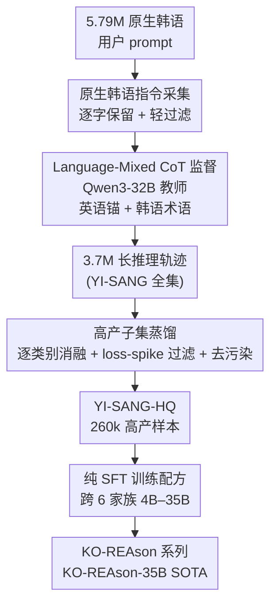

# Pushing on Multilingual Reasoning Models with Language-Mixed Chain-of-Thought

**会议**: ICLR 2026  
**OpenReview**: [https://openreview.net/forum?id=ABc5y3741T](https://openreview.net/forum?id=ABc5y3741T)  
**代码**: https://huggingface.co/KOREAson （数据与模型集合）  
**领域**: LLM推理 / 多语言推理  
**关键词**: 语言混合CoT, 中资源语言, 韩语推理, 数据蒸馏, SFT

## 一句话总结
针对中资源语言（韩语）缺乏长推理模型的问题，本文提出 **Language-Mixed CoT**——让模型在思考时以英语为"锚"做逻辑推演、同时保留韩语关键术语，再配上自采的 5.79M 原生韩语 prompt 与高产子集蒸馏，仅用 SFT 就训出 KO-REAson-35B，在 9 个韩语 benchmark 上取得最高平均分 64.0，且小模型平均提升 +18.6 分。

## 研究背景与动机
**领域现状**：前沿模型靠长链思考（long-CoT）在上下文里探索解空间来提升推理。开源社区复现这种能力的主流路线是**从前沿教师模型蒸馏**：系统化收集 prompt → 教师生成长推理轨迹 → 质量过滤 → SFT。但这些 pipeline 几乎只服务英语（少量中文），中资源语言怎么搭建推理模型仍是空白。

**现有痛点**：把高资源语言的配方直接搬到韩语行不通——韩语的基座模型更弱、高质量数据稀缺，而 RL 冷启动又强依赖"强基座 + 可靠奖励模型 + 大规模数据"三件套。退而求其次用**翻译语料**训练时，作者实测 Qwen2.5-1.5B 在翻译版 OpenThoughts 上训练后，MATH 从 25.5 涨到 74.4，但韩语文化基准 HAE-RAE Bench 却从 35.2 暴跌到 15.3——翻译腔污染了语料，模型对日常口语、文化语境的鲁棒性很差。

**核心矛盾**：推理过程到底用哪种语言写？两种单语方案各有硬伤——全用英语推理会引入**翻译噪声**（prompt 被误译、误差累积、模型"忘掉"原始韩语后跑题）；全用韩语推理则**推理能力明显下降**，且在英语预训练基座上长期训韩语会引发分布漂移，损害原有强项。

**本文目标**：为中资源语言找到一条可复现、可负担的配方，让模型在"推理 + 文化知识"多个维度都稳健，而不只是会做数学题。

**切入角度**：作者观察到推理的"逻辑骨架"和"语义忠实"可以解耦——逻辑推演让英语这个强项语言来扛，关键术语和引用则保留目标语言。再叠加"不靠翻译、直接采原生 prompt"来保证语料的真实分布。

**核心 idea**：用 **English-anchored Language-Mixed CoT**（英语做逻辑锚、韩语保术语）代替单语 CoT，配合大规模原生韩语数据与高产子集蒸馏，纯 SFT 就把中资源语言推到 SOTA。

## 方法详解

### 整体框架
整篇工作是一条"采数据 → 造监督信号 → 蒸高产子集 → 跨家族 SFT"的数据-中心 pipeline，没有改模型结构，全部增益来自**监督信号格式**和**数据质量**。具体地：先从韩语社区/问答站爬取 5.79M 条原生用户 prompt（YI-SANG 指令集），用 Qwen3-32B 当教师、强制 **Language-Mixed CoT** 格式生成 3.7M 条长推理轨迹（YI-SANG 全集）；再通过逐类别消融 + loss-spike 规则过滤 + 去污染，蒸馏出 260k 的高产子集 YI-SANG-HQ；最后在这个子集上对 4B–35B、跨 6 个模型家族做 SFT，得到 KO-REAson 系列。

### 关键设计

**1. Language-Mixed CoT：英语做逻辑锚、韩语保术语的代码切换**

这是全文的核心监督信号，直接针对"推理用哪种语言"的核心矛盾。做法是在 Think 阶段让模型**代码切换**（code-switching）：大部分逻辑脚手架用英语写，但把命名实体、引用片段、关键术语保留成韩语。生成时通过 prompt 指示教师 Qwen3-32B 保留韩语关键词、其余用英语推理；生成后用正则过滤，丢掉韩语字符比例落在 $[5\%, 20\%]$ 之外的样本。这样既借到英语的强推理能力，又不丢失韩语 prompt 的语义忠实。消融（Table 2）很能说明问题：在 Gemma-3-4B 上，English-anchored Language-Mixed CoT 在 HRB(54.9)/MCLM(55.8)/KMMLU-R(53.0) 三项全面超过全英语(50.3/48.1/52.2)和全韩语(40.6/25.6/42.5)；作者还试了中文锚、俄语锚（依据"中文与韩语文化更近、俄语更远"），发现**只有英语锚才能在数学 MCLM 上拿到增益**，其余锚语言数学反而掉。

**2. 原生韩语指令采集：不洗 prompt、逐字保留真实语料分布**

针对翻译语料"翻译腔污染、对口语不鲁棒"的痛点，作者干脆自己采原生 prompt 而非翻译。流程是两步法律分级爬取：作者先用领域知识圈定 54 个用户问答社区，给每个站标 A（可爬可再分发）/B（可爬但禁商用与再分发）/C（禁爬）三类许可，排除 C 站、低量站、结构混乱站和近重复后剩 28 站。关键反直觉的一点是——常规做法会用模板或 LLM 改写来"规范化"种子指令，但作者发现这种规范化会抹掉用户特征（错别字、缩写、混排、网络体），反而损害部署时的鲁棒性，所以**逐字保留 prompt**，只做轻量自动过滤：丢弃韩语字符比 < 30% 的、过短(<50 字符)或过长(>8192 字符)的。最终 YI-SANG 含 5.79M prompt / 3.7M 轨迹 / 6.77B token，是已公开的最大韩语后训练语料。由于纯 web 语料缺竞赛级难题，再用 Gemini-2.5-Flash 翻译补入 OpenThought（早期试 GPT-4o-mini、Qwen2.5-72B 会引发训练不稳定）。

**3. 高产子集蒸馏：逐类别消融 + loss-spike 规则过滤 + 去污染**

3.7M 全集多轮训练算力扛不住，需要从中挑出"高产"小子集。作者先**逐类别单独训练**看每类带来什么：OpenThought 在数学 MCLM 上增益最大，其次 Science、Code；Exams 对 HAE-RAE Bench 和 KMMLU-Redux 最有效；而 Medical 高度专精——只提升 ClinicalQA 却显著拖累其他所有 benchmark，于是连同 Daily 一起被剔除。最终只留 OpenThought + Code + Exams + Science（约 1.8M）。接着用代理小模型（Kanana-1.5-2.1B）做单 epoch "试跑"，把 **loss spike**（loss 突升且下一步不回落）定位到具体 batch、人工检查、写规则把该失败模式从全集清掉、重启，反复直到 loss 曲线稳定；三类反复触发的元凶是：响应无限重复同一短语、含多个 `<think>` 块、`</think>` 之后最终解写成非韩语；超过 16k token 的超长轨迹也丢掉。再用 **13-gram 去污染**（先用 MeCab-KO 做形态学切分归一化，再分别对归一化串和原文建 13-gram，与任一 benchmark 有 ≥1 个 13-gram 重叠就删），删掉约 0.7% 轨迹（~25.9k）。最终 YI-SANG-HQ 含 260k 样本（OpenThought 62k / Code 86k / Science 37k / Exams 66k）。期间还配了两种"考试题增广"——Style（加风格指令）和 Option（用 BM25 检索相似题、合并干扰项），二者单用效果相当，于是都用。

**4. 纯 SFT 训练配方：不靠 RL、不喂 web 答案、只从 prompt 重生成目标**

针对中资源语言"强基座稀缺、RL 冷启动易崩"的现实，作者选择**只用 SFT**：RL（如 GRPO）依赖强基座和稳定奖励，对韩语不现实，所以先用精心蒸馏的数据搭一个强基座，把 RL 留给后续。响应生成上，作者放弃了"agreement-sampling"（多次采样选与 web 答案一致的，太费算力）和"hint-based refinement"（把 web 答案前置让模型改写，有泄漏与分布漂移风险），也不信任 web 抓来的答案（不可靠、强 LLM 可能已超过众包答案），最终**只给教师 prompt、从零重生成所有目标**，不喂任何 web oracle。教师选型上，Qwen3-32B 带推理优于 Qwen3-4B 带推理，而后者又超过 Gemini-2.5-Pro 和 Qwen3-32B 关推理——印证了显式推理才是解锁能力的关键。所有训练默认 5 epoch（A.X-3.1-35B 因算力限制 3 epoch）。

### 损失函数 / 训练策略
全程标准 SFT 监督微调，无自定义损失。评测统一用 vLLM，temperature=0.7、top_p=0.9、max_tokens=32768，最终答案要求包在 `\boxed{...}` 里并用 math-verify 校验；主实验跑 3 次独立试验报均值 ± 标准误，消融跑单次。

## 实验关键数据

### 主实验
20B+ 量级对比（9 个 benchmark，KO-REAson-35B 基于 A.X-3.1 + YI-SANG-HQ）：

| Benchmark | GPT-OSS-20B | DS-R1-32B | EXAONE-Deep-32B | QwQ-32B | KO-REAson-35B |
|-----------|------|------|------|------|------|
| KMMLU-Redux | 67.6 | 70.0 | 68.2 | 74.7 | **76.0** |
| KMMLU-Hard | 39.0 | 43.3 | 43.5 | 49.0 | **51.4** |
| Math (Ko) | 82.8 | 85.4 | 84.8 | 82.3 | **87.5** |
| HRB | 65.1 | 70.8 | 76.1 | 75.5 | **78.9** |
| **Average (9 项)** | 58.8 | 56.4 | 57.4 | 59.6 | **64.0** |

KO-REAson-35B 在 9 项里 5 项第一、其余第二，拿到最高平均分。竞赛级数学（AIME2024-Ko 66.7、KSM 65.7）略逊 GPT-OSS-20B，作者归因于混合里竞赛题太少（过滤后仅 ~60k 翻译 OpenThought，远少于原始的近 1M）。

### 消融实验

| 配置 (Gemma-3-4B) | HRB | MCLM | KMMLU-R | 说明 |
|------|------|------|------|------|
| English-only CoT | 50.3 | 48.1 | 52.2 | 单语英语 |
| Korean-only CoT | 40.6 | 25.6 | 42.5 | 单语韩语，数学崩 |
| Lang-Mixed (zh/ko) | 48.2 | 26.3 | 45.3 | 中文锚，数学无增益 |
| **Lang-Mixed (en/ko)** | **54.9** | **55.8** | **53.0** | 英语锚，三项全胜 |

逐类别贡献（Gemma-3-4B）：OpenThought 对数学 MCLM 增益最大(55.8)；Exams 对 KMMLU-R 最有效(64.2)；Medical 提升 ClinicalQA(65.6) 却把 MCLM 压到 20.9——被剔除。

### 关键发现
- **英语锚是数学增益的唯一来源**：只有 en/ko 混合在 MCLM 上有提升，zh/ko、ru/ko 在数学上都不灵；Gemma3-4B 因预训练含俄/中数据，在 HRB/KMMLU-R 上对俄、中锚也有增益，而只训英韩的 Kanana-1.5 则没有，说明增益与基座预训练语言分布强相关。
- **跨家族、跨尺度普适**：9 个模型（4B–35B、6 家族）训 YI-SANG-HQ 后几乎全面提升，数学类（Math-Ko、AIME24、KSM）增益尤其明显；小/中模型平均提升 +18.6 分；只有 2 例轻微下降（< 2 分）。
- **跨语言 + 多模态"免费午餐"**：只用韩语文本训练的 KO-REAson-12B，在英语推理（AIME25 15.6→32.0、GPQA 30.0→45.1）和韩语视觉语言（HAERAE-Vision 15.47→26.42）上都涨——迁移偏向重推理任务，对浅层事实题增益有限。

## 亮点与洞察
- **把"逻辑语言"和"语义语言"解耦**：Language-Mixed CoT 的巧妙在于它不是简单选英语或韩语，而是让英语扛逻辑骨架、韩语保术语忠实，一举绕开"翻译噪声 vs 推理退化"的两难——这个 code-switching 思路可直接迁移到任何"强英语基座 + 中资源目标语言"的组合。
- **不洗数据反而更鲁棒**：逐字保留用户 prompt（错别字、网络体都留）这一反直觉决定，揭示了部署鲁棒性来自真实分布而非干净模板，对所有面向真实用户的指令数据构建都有借鉴。
- **loss-spike 当数据体检工具**：把训练 loss 突刺当信号去人工定位坏样本、写规则全集清洗再重启，是一套朴素但好用的数据质量闭环，可复用到任何大规模 SFT 语料清洗。

## 局限性 / 可改进方向
- **竞赛级数学是短板**：混合里竞赛题太少导致 AIME2024、KSM 落后 GPT-OSS-20B，作者把"补更多翻译竞赛题"留给未来工作。
- **只验证了韩语**：方法在韩语这一个中资源语言上做案例研究，对其他语言（尤其是与英语字形/语系差异更大的）能否同样奏效未直接验证。
- **依赖强教师**：整条 pipeline 的轨迹质量系于 Qwen3-32B 这个教师，若目标语言连可用的强多语言教师都没有，配方可能退化。
- **止步 SFT**：作者明确把 RL 留作后续，当前模型只是"为 RL 准备的强基座"，长推理的进一步上限尚未触及。

## 相关工作与启发
- **vs 翻译语料路线（lightblue、Lee et al. 2025a）**：他们用机翻数据训练，本文用原生采集 + 语言混合监督；区别在于本文从源头规避翻译腔，实测翻译路线会让韩语文化基准暴跌（35.2→15.3），而本文逐字保留原生 prompt 保住了文化鲁棒性。
- **vs 单语 CoT（全英 Pipatanakul et al.；全韩 lightblue）**：他们二选一，本文做英语锚的代码切换；优势是同时拿到英语的推理力和韩语的语义忠实，在数学与文化任务上都更好。
- **vs RL 路线（GRPO、R1）**：他们靠强基座 + 可验证奖励做在线 RL，本文在缺强基座的中资源场景下证明纯 SFT + 高质量数据也能逼近闭源 SOTA，且把 RL 留作下一步增量。

## 评分
- 新颖性: ⭐⭐⭐⭐ Language-Mixed CoT 的 code-switching 监督信号简洁有效，是对"推理语言"问题的清晰解法
- 实验充分度: ⭐⭐⭐⭐⭐ 100+ 消融、9 模型 6 家族、9 benchmark、跨语言/多模态迁移验证，数据极其扎实
- 写作质量: ⭐⭐⭐⭐ 动机推导清楚、消融讲故事，数据-中心方法叙述完整
- 价值: ⭐⭐⭐⭐⭐ 开源最大韩语后训练语料 + 完整配方，为所有中资源语言社区提供可复现路径

<!-- RELATED:START -->

## 相关论文

- [\[ICLR 2026\] mR3: Multilingual Rubric-Agnostic Reward Reasoning Models](mr3_multilingual_rubric-agnostic_reward_reasoning_models.md)
- [\[ICLR 2026\] Variational Reasoning for Language Models](variational_reasoning_for_language_models.md)
- [\[ICLR 2026\] Pruning Long Chain-of-Thought of Large Reasoning Models via Small-Scale Preference Optimization](pruning_long_chain-of-thought_of_large_reasoning_models_via_small-scale_preferen.md)
- [\[ICLR 2026\] On the Thinking-Language Modeling Gap in Large Language Models](on_the_thinking-language_modeling_gap_in_large_language_models.md)
- [\[ICLR 2026\] Long Chain-of-Thought Reasoning Across Languages](long_chain-of-thought_reasoning_across_languages.md)

<!-- RELATED:END -->
