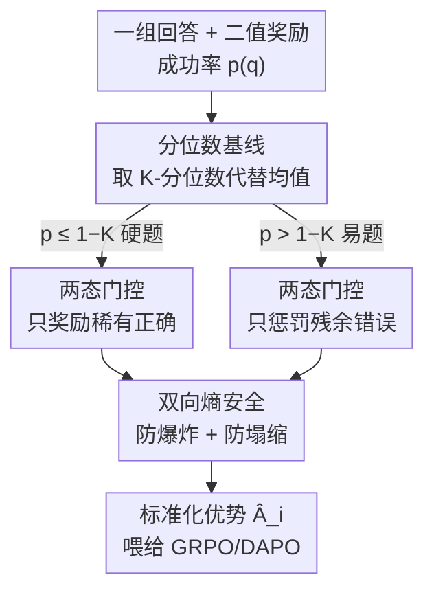

# Quantile Advantage Estimation: Stabilizing RLVR for LLM Reasoning

**会议**: ICLR 2026  
**OpenReview**: [https://openreview.net/forum?id=WDP5b3mtFV](https://openreview.net/forum?id=WDP5b3mtFV)  
**代码**: https://github.com/junkangwu/QAE  
**领域**: LLM推理 / 强化学习  
**关键词**: RLVR, 优势估计, 分位数基线, 策略熵, GRPO/DAPO

## 一句话总结
本文把 value-free RL（GRPO/DAPO）里用「组内均值」当优势基线的做法换成「组内 K-分位数」基线（QAE），用一个超参 $K$ 在硬题上奖励稀有正确、在易题上惩罚残余错误，并证明这能同时防住熵塌缩与熵爆炸，在 AIME/AMC 数学推理上稳定地提升 pass@1。

## 研究背景与动机
**领域现状**：RLVR（用可验证奖励做强化学习）是当前提升大模型推理能力的主流路线。为了省掉价值网络，GRPO、DAPO 这类 value-free 方法对每个 query 采一组 $G$ 个回答，用组内奖励的**均值**当基线、再除以标准差得到优势 $\hat A_i$，只靠组内相对比较来更新策略。

**现有痛点**：这类训练的策略熵极不稳定，常在两个极端之间摆动。一端是**熵塌缩**（entropy collapse）：策略过早收敛、丧失探索、被困在狭窄的推理模式里；另一端是**熵爆炸**（entropy explosion）：策略过度随机，梯度被噪声淹没、信用分配失效、学习停滞。以往工作几乎只盯着「防塌缩」（如抬高低概率 token、惩罚导致塌缩的 token），却忽略了对称的另一半。更糟的是，作者在 Qwen3-8B + DAPO 上观察到：用 Clip-Higher 防住塌缩后，反而会在第 10–80 步触发一次早期熵尖峰，之后熵长期居高不下、性能进入平台期——**防住一端等于把另一端放了出来**。

**核心矛盾**：作者把两种熵灾难都追溯到同一个根源——**均值基线对奖励离群点不鲁棒**。当一组里只有少数高奖励样本时，均值被抬高，本来还算不错的回答被算成「负优势」而遭到惩罚，宝贵的探索被压制；反过来，负优势样本在早期又会主导熵的暴涨（图 4 显示熵增长几乎全由负优势样本贡献）。问题出在**基线设计**，而不是 token 级的裁剪阈值——作者验证了把 DAPO 的 $\epsilon_{high}$ 从 0.20 调到 0.28 也只是杯水车薪，平台期照样存在。

**本文目标**：把熵调控从「token 级调参问题」重新表述为「基线设计问题」，找一个能**同时**双向夹住熵、又只改一行的最小修改。

**核心 idea**：用组内 **K-分位数基线**代替均值基线。$K$ 直接控制有多少样本被判为正优势：$K$ 越小、越多样本算成功（鼓励 exploit、降熵），$K$ 越大、越少样本算成功（鼓励 explore、升熵），从而把训练稳定在一个「不塌不爆」的生产性熵区间。

## 方法详解

### 整体框架
QAE（Quantile Advantage Estimation）的输入是某个 query $q$ 采出的一组回答及其二值奖励 $\{(o_i,R_i)\}_{i=1}^G$（$R_i\in\{0,1\}$，答对为 1），输出是每个回答的标准化优势 $\hat A_i$，直接喂给 GRPO/DAPO 的目标函数——除了基线那一行，其余训练/解码超参全不动。

整条逻辑链是：先用这组奖励算出经验成功率 $p(q)=\frac1G\sum_i R_i$；再不取均值、而取 K-分位数 $b_K(q)$ 当基线；对二值奖励这个分位数会退化成一个关于 $p(q)$ 的**硬阈值** $1-K$，于是每个 query 被自动路由到「硬题/易题」两种状态之一，每种状态只对一类样本（稀有正确 或 残余错误）给非零优势；最后这套机制在理论上被证明能双向夹住单步熵变。

### 关键设计

**1. K-分位数基线：用鲁棒的分布分位数替掉脆弱的均值**

针对的痛点是均值基线被奖励离群点带偏、错杀正常探索。对每组回答，作者定义经验 CDF $\hat F_q(x)=\frac1G\sum_j \mathbb 1\{R_j\le x\}$，再取右连续 K-分位数 $b_K(q)=\inf\{x:\hat F_q(x)\ge K\}$ 当基线，标准化优势为

$$\hat A_i=\frac{R_i-b_K(q)}{\mathrm{std}(\{R_j\})+\varepsilon}.$$

分位数是分布的稳健统计量，不会被少数高奖励样本拉偏；同时 $K\in(0,1)$ 给了一个**显式可调的旋钮**：它决定基线落在分布的哪个位置，从而决定有多少样本被判正优势。这正是和均值基线的本质区别——均值是被动地被数据决定，分位数是主动地由 $K$ 控制探索-利用的天平。

**2. 两态响应级门控：硬题奖励稀有正确，易题惩罚残余错误**

这是 K-分位数在二值奖励下的直接后果，也是 QAE 真正改变更新方向的地方。当奖励是 0/1 时，分位数基线退化成对成功率 $p(q)$ 的阈值（式 4）：

$$b_K(q)=\begin{cases}0,& p(q)\le 1-K\\ 1,& p(q)> 1-K\end{cases}$$

于是每个 query 被难度阈值 $1-K$ 切成两态。**硬题**（$p\le 1-K$，偏 exploit）：基线为 0，错答 $\hat A=0$ 不更新，稀有的对答 $\hat A>0$ 被强化，扶持刚冒头的成功轨迹；**易题**（$p>1-K$，偏 explore）：基线为 1，对答 $\hat A=0$，残余的错答 $\hat A<0$ 被压制，清理已基本解决问题上的失败模式。也就是说 $K$ 是一个直接拨动「奖励稀有成功 ↔ 惩罚残余失败」的开关。一个副产物是更新被天然稀疏化：在 $K=0.4$ 的默认设置下，约 **80% 的回答优势为 0**（响应级 80/20 法则），算力被集中到最有信息量的少数样本上，暴露出均值基线方法里巨大的冗余。

**3. 判别式目标重写：把对称权重换成单边单调权重**

借助 DisCO 的判别视角，GRPO 目标可写成「query 级权重 × 判别项」，其权重是对称的钟形 $\sqrt{p(1-p)}$，同时压低很易和很难的 query（式 5）。把 QAE 的优势代入后（命题 4.1）得到

$$J_{\text{Quantile}}=\mathbb E_q\Big[\mathbb 1\{p\le 1-K\}\sqrt{\tfrac{p}{1-p}}\,\mathbb E_{o\sim\pi^+}s^+_\theta-\mathbb 1\{p> 1-K\}\sqrt{\tfrac{1-p}{p}}\,\mathbb E_{o'\sim\pi^-}s^-_\theta\Big].$$

相比 GRPO，QAE 做了两处关键改动：(i) 按难度**选择性地置零**判别项中的一项（硬题只留正样本项、易题只留负样本项）；(ii) 把对称钟形权重换成**非对称、单调**的因子（硬题用 $\sqrt{p/(1-p)}$、易题用 $\sqrt{(1-p)/p}$）。这把更新焦点从「中等难度问题」转移到「放大稀有成功或残余失败的信号」，从机制上解释了观测到的稳定性。

**4. 两态熵安全：可证明地同时防爆炸与防塌缩**

这是 QAE 区别于所有 token 级方法的理论核心。在 bandit 简化下，一阶 softmax 更新的单步熵变满足熵-协方差恒等式 $\Delta H(q)\approx-\eta\,\mathrm{Cov}_{y}\big(\log\pi(y), \pi(y)A_b(y,q)\big)$。把基线 $b$ 看成线性旋钮可证 $\Delta H(q;b)$ 关于 $b\in[0,1]$ 严格单调递增。于是 K-分位数取到两个极端（命题 4.2）：低成功率时 $b_K=0$ 取到最小熵变 $\Rightarrow$ **防爆炸**；高成功率时 $b_K=1$ 取到最大熵变 $\Rightarrow$ **防塌缩**。关键对比是：token 级控制（Clip-Higher、KL 惩罚等）只缩放步长、**不改变响应级基线** $b(q)$，因此天生是单边的，挡不住由负优势样本驱动的熵爆炸；而 K-分位数基线天生两边都管，正好对上图 4 里观测到的两个训练阶段。

### 损失函数 / 训练策略
QAE 是「一行替换」式的 drop-in：在 GRPO/DAPO 目标里把响应级基线从均值改成 K-分位数即可，默认 $K=0.4$（在 explore/exploit 间稳健平衡）。它与 token 级控制（CLIP-COV、KL-COV）和序列级优化（GSPO）正交，可叠加且不需改它们自己的超参。消融里作者还拆出 POS-MASK / NEG-MASK 两个单边变体，用来分别验证「奖励稀有正确」与「压制残余错误」在不同裁剪强度下各自的作用。

## 实验关键数据

### 主实验
在 AIME'24、AIME'25、AMC'23 三个数学推理 benchmark 上零样本评测，每题采 $k=32$、温度 0.7，报 pass@1 与 pass@16。QAE 作为 drop-in 在多种模型与配方上一致提升 pass@1，同时 pass@16 基本持平。

| 模型 | 方法 | AIME25 P@1 | AIME24 P@1 | AMC23 P@1 |
|------|------|------|------|------|
| Qwen3-8B-Base | Clip-Higher | 32.71 | 39.69 | 92.11 |
| Qwen3-8B-Base | + QAE | 34.90 (+6.7%) | 48.23 (+21.5%) | 92.97 (+0.9%) |
| Qwen3-8B-Base | CLIP-Cov | 33.02 | 42.40 | 87.42 |
| Qwen3-8B-Base | + QAE | 37.40 (+13.3%) | 46.04 (+8.6%) | 90.23 (+3.2%) |
| Qwen3-8B-Base | KL-Cov | 33.33 | 44.90 | 86.02 |
| Qwen3-8B-Base | + QAE | 33.44 (+0.3%) | 44.69 (−0.5%) | 87.97 (+2.3%) |
| Qwen3-30B-A3B | GSPO | 31.15 | 43.75 | 90.00 |
| Qwen3-30B-A3B | + QAE | 32.50 (+4.3%) | 47.50 (+8.6%) | 89.38 (−0.7%) |

最大单项提升是 Qwen3-8B + Clip-Higher 在 AIME24 上 pass@1 从 39.69 涨到 48.23（+21.5%）。pass@16 多数持平或小幅上升，说明涨的是采样效率而非靠多采。

### 消融实验
作者验证了「基线设计而非 token 调参」才是关键，并拆解了两个单边掩码机制的作用。

| 实验 | 设置 | 结论 |
|------|------|------|
| $\epsilon_{high}$ 扫描 (DAPO) | 0.20→0.28 | 峰值在 0.26 (+2.4%)，整体提升有限、平台期仍在 → token 调参不够 |
| 单边掩码 ($\epsilon_{high}=0.28$ 弱裁剪) | POS / NEG / QAE | NEG-MASK（控负优势）最关键，几乎贴齐完整 QAE |
| 单边掩码 ($\epsilon_{high}=0.20$ 强裁剪) | POS / NEG / QAE | POS-MASK（控正优势）占主导 |
| 响应级稀疏性 | 全程统计 | ≈80% 回答优势为 0，更新集中在信息量最大的少数样本（80/20 法则） |
| 熵动力学分解 | 按优势符号 | 熵爆炸由负优势样本主导，QAE 抑制该分量、把熵保持在生产性区间 |

## 亮点与洞察
- **把熵调控重定义为基线设计问题**：以往一堆 token 级 trick（抬低概率 token、惩罚塌缩 token）都是治标，本文指出 root cause 在响应级基线，一行替换就解决，视角上很干净。
- **唯一一个有「双向熵安全」证明的方法**：明确指出 token 级控制只缩放步长、改不了基线，因此天生只能管一边；分位数基线天生两边都管，理论与图 4 的两阶段现象自洽。
- **80/20 稀疏化是免费副产物**：约 80% 回答零优势，既省算力又解释了稳定性，也反过来揭示均值基线方法里的巨大冗余。
- **极强的可组合性**：与 Clip-Cov/KL-Cov、GSPO 都能叠加且不动它们的超参，落地成本极低。

## 局限性 / 可改进方向
- **只在二值奖励下退化成漂亮的阈值**：核心的两态门控依赖 $R\in\{0,1\}$，对连续/稠密奖励，分位数基线的行为与「双向熵安全」结论是否还成立需要额外论证。
- **$K$ 仍是全局固定超参**：默认 $K=0.4$ 是经验折中，不同模型/难度分布下的最优 $K$ 可能不同，文中靠附录敏感性分析覆盖，缺一个自适应调 $K$ 的机制。
- **理论建立在 bandit 简化 + 一阶 softmax 更新上**：把整条回答当单一动作、忽略 token 级动力学，与真实自回归 RL 之间有 gap，结论是近似性的。
- **评测局限于数学推理（AIME/AMC）**：是否迁移到代码、agent、通用推理等其他可验证奖励任务尚未验证。

## 相关工作与启发
- **value-free RLVR 谱系**：GRPO（去价值网络、组内相对优势）、DAPO（去 KL + 非对称裁剪 + token 级归一化 + 动态采样）是本文的直接基线与改造对象。
- **防熵塌缩路线**：Clip-Higher、Clip-Cov/KL-Cov 等 token 级控制，本文把它们定位为「单边、只缩放步长」的方法，并证明可与 QAE 叠加。
- **判别视角**：DisCO 把 GRPO 目标拆成「query 权重 × 判别项」，本文借此推导出 QAE 的判别式目标与单调权重。
- **启发**：在 RL/对齐里，「优势基线」这种看似无关紧要的实现细节，可能正是训练稳定性的总开关；把一个标量统计量从均值换成分位数，就能把脆弱的对称权重换成可控的单边权重——这提示我们重新审视各类 RLHF/RLVR 流水线里被默认采用的均值基线。

<!-- RELATED:START -->

## 相关论文

- [\[ICLR 2026\] Conditional Advantage Estimation for Reinforcement Learning in Large Reasoning Models](conditional_advantage_estimation_for_reinforcement_learning_in_large_reasoning_m.md)
- [\[ICLR 2026\] Beyond Magnitude: Leveraging Direction of RLVR Updates for LLM Reasoning](beyond_magnitude_leveraging_direction_of_rlvr_updates_for_llm_reasoning.md)
- [\[ICLR 2026\] HiPO: Self-Hint Policy Optimization for RLVR](hipo_self-hint_policy_optimization_for_rlvr.md)
- [\[ICLR 2026\] Stabilizing Policy Gradients for Sample-Efficient Reinforcement Learning in LLM Reasoning](stabilizing_policy_gradients_for_sample-efficient_reinforcement_learning_in_llm_.md)
- [\[ACL 2026\] SHAPE: Stage-aware Hierarchical Advantage via Potential Estimation for LLM Reasoning](../../ACL2026/llm_reasoning/shape_stage-aware_hierarchical_advantage_via_potential_estimation_for_llm_reason.md)

<!-- RELATED:END -->
