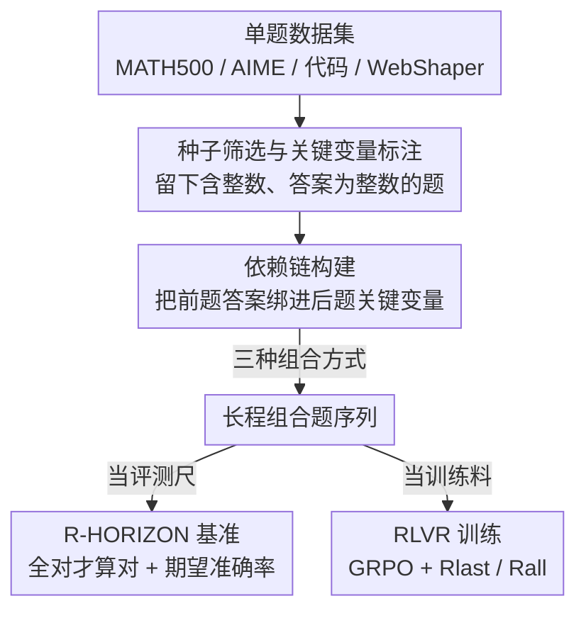

# R-HORIZON: How Far Can Your Large Reasoning Model Really Go in Breadth and Depth?

**会议**: ICLR 2026  
**OpenReview**: [https://openreview.net/forum?id=rRB1bYErbL](https://openreview.net/forum?id=rRB1bYErbL)  
**代码**: https://github.com/meituan-longcat/R-HORIZON  
**领域**: LLM推理  
**关键词**: 长程推理, 查询组合, 推理基准, RLVR, 有效推理长度

## 一句话总结
本文提出 R-HORIZON：通过把多道独立题目用「答案依赖」串成一条必须顺序求解的长链，既造出一个能压垮当前最强大推理模型的长程推理基准，又把同样的组合数据喂给 RLVR 训练，结果不仅大幅提升多题连解能力，连单题成绩也跟着涨（AIME2024 +7.5）。

## 研究背景与动机
**领域现状**：以 OpenAI o1、DeepSeek-R1 为代表的大型推理模型（LRM）靠 test-time scaling 拉长 Chain-of-Thought，在数学、代码、智能体等任务上不断刷新成绩。主流的训练集与评测集（GSM8K、MATH、LiveCodeBench 等）几乎都是**孤立单题**：一道题一个答案，题与题之间互不相关。

**现有痛点**：真实场景里，一个 agent 往往要在成百上千步里连续推理、规划、行动，后一步依赖前一步的结论。单题评测根本测不出模型「连着解多道相互依赖的题」时会怎样，也就掩盖了长程推理的真实边界。同时常规 RL 也只在单题上做优化，模型从未被训练去管理跨多题的推理。

**核心矛盾**：test-time scaling 让推理链越来越长被默认是好事，但「更长的链」在**多题串联**场景下究竟是助力还是负担，从未被系统检验。作者怀疑：模型的有效推理长度是有限的，一旦把多道题串起来超过这个阈值，性能会断崖式下跌——这与单题上「越想越好」的直觉相反。

**本文目标**：(1) 造一种可控、低成本、可扩展的方式把单题变成长程多题任务；(2) 用它建一个能暴露 LRM 长程短板的基准；(3) 用它造训练数据，看长程数据能否真正提升模型。

**切入角度**：与其费力收集天然的长程任务，不如**人工合成依赖**——把已有单题数据「焊接」起来，让第二题的某个关键数字必须由第一题的答案算出。这样既廉价又能精确控制推理跨度（串几道题）。

**核心 idea**：用「查询组合（query composition）」把 N 道独立题改造成一条必须顺序求解的依赖链，同一套方法既当评测尺、又当训练料。

## 方法详解

### 整体框架
R-HORIZON 的核心是一条**数据组合流水线**：拿一批普通单题数据集做种子，先筛出适合改造的题、标注出每道题的「关键变量」，再用一个依赖函数把前一题的答案绑进后一题的题面，串成一条长链。这条链有两种用途——拼成评测基准去考 26 个 LRM，或拼成训练数据喂给 RLVR 去练模型。整个方法不改模型结构，只改「题目长什么样」。

### 关键设计

**1. 种子筛选与依赖链构建：把答案焊进下一题，逼出真正的顺序求解**

要让多题「不可拆解地连在一起」，关键是制造**真实的逻辑依赖**，而不是简单把题目首尾拼接（那只是上下文变长）。流水线分两步。第一步种子筛选：给定原始数据集 $D=\{(q_i,a_i)\}$，只保留题面里含整数、且答案本身是整数的题，$D_{seed}=\{(q,a)\mid |I(q)|>0 \wedge a\in\mathbb{Z}\}$，其中 $I(\cdot)$ 抽取题面所有整数；再用一个模型 $M$ 判定哪些整数是「关键变量」——$K(q)=\{m\in I(q)\mid M(q,m)=1\}$，$M(q,m)=1$ 表示把 $m$ 从题里删掉这道题就无解。于是每道种子题变成三元组 $(q,a,K(q))$。

第二步依赖链构建（Algorithm 1）：从 $q_1$ 出发，对第 $i{+}1$ 题挑一个关键变量 $m_{i+1}$，用占位符 $v_{i+1}$ 替换它，并定义依赖函数 $f_i(x)=x+(m_{i+1}-a_i)$，在题面里显式写上约束 $v_{i+1}=f_i(a_i)$。这样模型必须先解出第 $i$ 题的答案 $a_i$，代入 $f_i$ 才能还原出第 $i{+}1$ 题缺失的数字，再继续解下去。整条链 $Q=(q_1,q_2',\dots,q_n')$ 强制串行求解，错一步则全盘崩。这个「答案即下一题输入」的焊接，正是与 NEST（直接拼接独立题）等做法的本质区别。

**2. 三种组合方式：覆盖从线性到图状的依赖结构**

不同任务的长程形态不一样，R-HORIZON 支持三种组合（Figure 2）。**直接组合（Directly Compose）**把多题简单并列、相对松散；**顺序组合（Sequential Compose）**是数学任务的默认形态，依赖呈一条链，前题答案逐级传入后题；**图状组合（Graphic Compose）**则把依赖织成更复杂的计算图。数学任务用顺序组合，代码与智能体任务的具体构造放在附录。这套机制让「推理跨度」成为一个可调旋钮——想考多深就串多长（$n$ 可取 1、2、4、8、16、20 等），从而把模型的长程边界量化出来。

**3. 全对评分与期望准确率：测出「该对却没对」的差距**

评测时从模型回复里抽出整条答案序列 $\hat A=(\hat a_1,\dots,\hat a_n)$，采用**全对才算对**的严格打分：$Acc(Q)=1$ 当且仅当所有子题 $\hat a_i=a_i$，否则为 0。光有实测准确率还不够，作者再定义一个**期望准确率**作为参照基线：假设各子题独立，用每道原子题的通过率 $p_i$ 连乘，$Acc_{expected}(Q)=\prod_{i=1}^n p_i$。它回答的是「如果模型把每道子题当孤立题独立做、互不干扰，理论上应该考多少」。实测值与期望值之间的差距，正是长程组合本身带来的额外损耗——这一差距随 $n$ 增大而持续拉开，直接证明问题不在单题能力，而在「连续推理时的相互干扰」。

**4. R-HORIZON 强化学习：用组合数据训练，意外提升单题**

既然评测暴露了长程短板，自然想到用同样的组合数据去**训练**。作者沿用 Skywork-OR1 的 RLVR 管线，以 GRPO 为优化算法——它免去 PPO 的价值函数，靠组内相对优势 $\hat A_{i,t}$ 估计 token 级策略梯度（式 5），并带 KL 正则约束到参考策略。针对多题数据设计两种可验证奖励：**只看末答的 $R_{last}$**（仅最后一题对就给 1）与**全对奖励 $R_{all}$**（所有子题都对才给 1）。在 R1-Qwen-7B 上用 2 题组合数据训练后，组合题成绩大涨（AIME24 n=2 +17.4），**单题成绩也跟着涨（AIME24 +7.5）**。机理上，组合数据缓解了「过度思考」——模型学会给后续题分配更合理的 token 预算、反思更长程；同时它在每个 rollout batch 里贡献约 20% 更多「有效样本」（既非全错也非全对），奖励信号更均衡，训练效率更高。

## 实验关键数据

### 主实验
在 6 个数据集（MATH500、AIME24/25、AMC23、LiveCodeBench、WebShaper）上评测 25–26 个 LRM，随组合题数 $n$ 增大，**所有模型无一例外大幅退化**：

| 模型 / 数据集 | n=1 | 退化后 | 说明 |
|--------|------|------|----------|
| DeepSeek-R1 / AIME25 | 87.3% | 24.6% (n=5) | 最强模型也崩 |
| R1-Qwen-7B / MATH500 | 93.6% | 0% (n=16) | 小模型彻底归零 |
| R1-Qwen-32B / MATH500 | 96.8% | ~41% (n=16) | 比 7B 多扛 34.1% |
| Qwen3-235B-Thinking / AIME24 | 93.7% | 69.2% (n=5) | 越难的题降得越狠 |

关键趋势：模型越大退化越轻（有效推理长度更长，7B 的出错位置约在 4–6k token，32B 约 8–10k token）；代码任务比数学退化更严重；很多模型在 web 搜索任务里直接丧失调用工具的能力。

### 消融实验
RLVR 训练（R1-Qwen-7B）不同组合题数与奖励的对比（Table 1，节选 Origin / n=2 平均）：

| 配置 | Origin Avg | Multi(n=2) Avg | 说明 |
|------|---------|------|------|
| R1-Qwen-7B（基线） | 66.4 | 20.1 | 未训练 |
| Naive 单题训练 (n=1) | 74.3 | 21.3 | 组合题几乎没提升 |
| w/ 组合 (n=2) | 76.1 | 36.5 | 单题+组合双涨 |
| w/ 组合 (n=4) | 73.7 | 43.2 | 组合能力最强 |
| w/ 组合 (mixed 1-4) | 72.8 | 43.1 | 混合也很好 |
| w/ $R_{all}$ (n=2) | 75.9 | 40.2 | 多题场景优于 $R_{last}$ |

### 关键发现
- **单题训练几乎不带动长程能力**：Naive(n=1) 在组合题上只从 20.1 升到 21.3，而 n=2 组合数据直接拉到 36.5——长程能力必须用长程数据练。
- **错误以「问题推理错」和「提前停止」为主**：题数增多时模型常常只答了一部分子题就提前终止生成；依赖推理错（前题对、算依赖时错）数量随题增加但占比小。
- **反思高度局部化**：超过一半的题完全没有跨越当前子题的「长程反思」，模型倾向于只在当前题内部 wait/but，识别不出更早子题的错误。
- **思考预算分配失衡**：包括 DeepSeek-R1 在内，模型都把过多 token 砸在前几道题上，后续题分不到足够预算；而用组合数据训练后这种分配明显变合理。

## 亮点与洞察
- **「焊接答案」造依赖**比拼接题面高明：$f_i(x)=x+(m_{i+1}-a_i)$ 这一招让后题的缺失数字必须由前题答案现算，制造的是真依赖而非假长度，干净地把「长程相互干扰」与「单纯上下文变长」分离开。
- **期望准确率连乘**是个聪明的参照系：它把「模型本应能拿到的分」量化出来，于是实测 vs 期望的缺口就直接读出了长程组合的净损耗，避免了「降分到底是题变难还是模型变弱」的混淆。
- **同一套数据既评测又训练**，可控旋钮 $n$ 让「推理跨度」从定性变定量；这种自合成范式低成本、可扩展，能迁移到任何含整数答案的数据集。
- 最反直觉的「啊哈」：用 2 题组合训练竟能反哺单题（AIME24 +7.5），说明长程训练顺带教会了模型更高效地分配思考预算、抑制过度思考。

## 局限与展望
- **依赖构造偏数学化**：靠抽整数、改关键变量来焊接，天然适合数值题；代码/智能体任务的组合方式只在附录交代，对开放式、非数值答案的任务如何制造可验证依赖仍待探索。
- **全对评分极严苛**：$Acc(Q)$ 只要错一子题就归零，能极大放大退化信号，但也可能把「大部分对、个别失误」与「完全不会」混为一谈，掩盖部分进展。
- **RLVR 验证规模有限**：训练实验主要在 R1-Qwen-7B、2–4 题组合上做，更大模型、更长链（n≫4）下的训练收益与稳定性尚未充分检验。
- 改进思路：把依赖函数从线性加减扩展到更丰富的运算/图结构，以及探索能给出部分信用（partial credit）的奖励，或许能让长程训练更平滑。

## 相关工作与启发
- **vs NEST（直接拼接独立题）**: NEST 把多道无逻辑关系的题并排放，测的是「多上下文压力」；R-HORIZON 在题间焊入真实答案依赖，逼出顺序求解，暴露的是被推理链拉长所放大的失败模式。
- **vs GSM-Infinite**: 后者在计算图上建依赖但主打**长输入**；R-HORIZON 主打**短输入、长输出（长 CoT）**，更贴近真实推理场景。
- **vs 过度思考（overthinking）研究**: 既有工作发现长链在简单题上只是浪费 token、收益甚微；本文进一步证明长链在**多步复合任务上会实质性地损害**性能，并把组合数据用作 RL 解药。

## 评分
- 新颖性: ⭐⭐⭐⭐⭐ 「答案焊接造依赖」把单题廉价改造成可控长程任务，评测与训练一体，范式简洁有力。
- 实验充分度: ⭐⭐⭐⭐⭐ 6 数据集、25+ 模型横扫评测，叠加 RLVR 训练与错误/反思/预算多维分析。
- 写作质量: ⭐⭐⭐⭐ 动机—方法—证据链条清晰，但部分构造细节（代码/智能体组合）压进附录。
- 价值: ⭐⭐⭐⭐⭐ 既给出长程推理的可信标尺，又证明长程数据能反哺单题，对评测与训练范式都有直接影响。

<!-- RELATED:START -->

## 相关论文

- [\[ICLR 2026\] Why is Your Language Model a Poor Implicit Reward Model?](why_is_your_language_model_a_poor_implicit_reward_model.md)
- [\[ICLR 2026\] A Simple "Motivation" Can Enhance Reinforcement Finetuning of Large Reasoning Models](a_simple_motivation_can_enhance_reinforcement_finetuning_of_large_reasoning_mode.md)
- [\[ICLR 2026\] Reasoning with Sampling: Your Base Model is Smarter Than You Think](reasoning_with_sampling_your_base_model_is_smarter_than_you_think.md)
- [\[ICLR 2026\] ChainGPT: Dual-Reasoning Model with Recurrent Depth and Multi-Rank State Updates](chaingpt_dual-reasoning_model_with_recurrent_depth_and_multi-rank_state_updates.md)
- [\[ICML 2026\] How Far Ahead Do LLMs Plan? Uncovering the Latent Horizon in Chain-of-Thought Reasoning](../../ICML2026/llm_reasoning/how_far_ahead_do_llms_plan_uncovering_the_latent_horizon_in_chain-of-thought_rea.md)

<!-- RELATED:END -->
