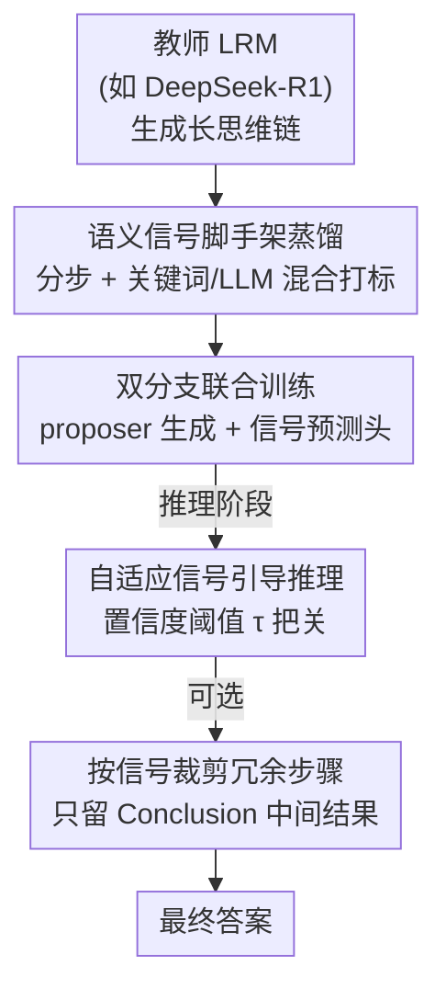

# Reasoning Scaffolding: Distilling the Flow of Thought from LLMs

**会议**: ICLR 2026  
**OpenReview**: [https://openreview.net/forum?id=FcuJY1dK7s](https://openreview.net/forum?id=FcuJY1dK7s)  
**代码**: https://github.com/xywen97/ReasoningScaffolding  
**领域**: LLM推理 / 知识蒸馏  
**关键词**: 推理蒸馏, 语义信号, 思维流, 多任务学习, 小模型推理

## 一句话总结
本文提出 **Reasoning Scaffolding**，不再让小模型逐字克隆教师的文本 rationale，而是先把教师的长思维链抽象成一串离散、可解释的「语义信号」（如对比、补充、结论）当作脚手架，再用「预测下一个信号 + 在信号引导下生成下一步」的双任务目标训练学生模型，从而把推理的**算法结构**而非表面文字迁移给小模型，在 GSM8K、StrategyQA 等基准上准确率与逻辑一致性都显著超过现有蒸馏方法。

## 研究背景与动机

**领域现状**：把大模型（LLM）的推理能力蒸馏给小模型（SLM）的主流做法是 **行为克隆（behavioral cloning）**——用教师生成的 Chain-of-Thought（CoT）文本 rationale 去微调学生，让学生模仿教师的逐步推理文本。

**现有痛点**：这种「文本模仿」本质上是把推理当成一个文本生成任务，逼着小模型做**死记硬背**。它能学会教师的行文风格和流畅度，却学不到教师思维背后的**算法结构**。结果是学生模型很脆——遇到新问题时常常给出逻辑前后矛盾、甚至自相矛盾的「胡说八道」，看着像在推理，其实只是在模仿。

**核心矛盾**：教师的推理过程里，真正有价值的是**论证如何流动**（先对比、再补充、最后归纳这种逻辑骨架），而不是具体写了哪些词。但现有蒸馏的监督信号是 token 级文本，把「结构」和「内容」混在一起喂给学生，学生抓不住前者只学会了后者。

**本文目标**：把教师推理的**结构蓝图（structural blueprint）**单独抽出来、显式地教给学生，让小模型学会「怎么想」而不是「写什么」。

**切入角度**：作者观察到，教师的长思维链里有一些关键词——`wait`、`but`、`ok`、`in addition`——天然标记了推理的转折。比如 `in addition` 往往引出补充信息。这些词其实暴露了论证的逻辑功能，可以被归纳成有限几类**语义信号**。

**核心 idea**：用一串离散语义信号当「脚手架」，先让学生**预判下一步该执行什么逻辑动作**（预测信号），再让它**在该信号约束下生成具体文本**，把信号预测当作逻辑连贯性的强正则，逼学生内化连贯推理的计算模式。

## 方法详解

### 整体框架

Reasoning Scaffolding 把推理重新定义为一个**结构化生成过程**，整个 pipeline 分三段：先离线把教师的思维链拆成「步骤 + 语义信号」构建脚手架数据集；再用双分支多任务目标训练小模型，让它同时会「生成下一步」和「预测下一个信号」；最后在推理时由信号预测器逐步给出信号、引导 proposer 生成，并可选地按信号裁剪冗余步骤省 token。

整套方法围绕 7 类语义信号展开：**Addition and Elaboration（补充与阐述）、Examples and Illustration（举例与说明）、Personal Opinion and Recall（主观判断与回忆）、Contrast and Concession（对比与让步）、Reasoning and Analysis（推理与分析）、Conclusion and Summary（结论与小结）、Response Generation（最终作答）**。这 7 类既保证组内关键词语义内聚，又能覆盖绝大多数转折。

### 关键设计

**1. 语义信号脚手架：把文本思维链抽象成离散逻辑骨架**

针对「文本克隆抓不住结构」这一痛点，作者先用零样本提示查询一个大推理模型（LRM，如 DeepSeek-R1）拿到长思维链，然后做两件事把它抽象成脚手架。第一步是**分步**：用双换行 `\n\n` 等分隔符把思维链切成单独步骤 $S_i = [A_1, \dots, A_N]$。第二步是**打信号标签**，采用「关键词 + LLM」两阶段混合策略：先用关键词表（7 类语义信号对应的触发词）给每步打初始标签，再用强 LLM（如 GPT-4.1）做语义校验——一致就保留，不一致就纠正，没有关键词开头的步骤直接由 LLM 判定。

这样切分（结构）和打标（语义）解耦，既保证脚手架忠实跟随教师的思维流、不人为割裂或漏掉步骤，又兼顾效率。实测约 74% 的步骤以预定义关键词开头，这些步骤上关键词标签与 LLM 标签的一致率约 87%，剩下约 26% 无关键词的步骤交给 LLM oracle 兜底。最终产出两套训练数据：信号预测器用的 $\{Q + [A_1, \dots, A_t],\ \text{Signal}\}$，以及 proposer 用的 $\{Q + [A_1, \dots, A_t],\ \text{Signal} + A_{t+1}\}$。

**2. 双分支联合训练：信号预测当正则，逼学生学会推理流**

光有脚手架数据还不够，关键是怎么让学生同时学到「内容」和「结构」。作者在 SLM backbone 上挂两个分支做多任务训练。**Branch 1（下一步生成）** 在原 LM head 前加一个**信号嵌入层（SEL）**，把当前步的语义信号编码成 embedding，与 backbone 最后一层隐状态做简单相加后再过 LM head，让同一步的所有 token 共享同一个信号约束，损失是带信号条件的下一 token 预测：

$$\mathcal{L}^{(t)} = -\frac{1}{N_t}\sum_{i=1}^{N_t} \log P_\theta\!\left(A_{t,i} \mid A_{<t}, A_{t,<i}, s_t\right)$$

**Branch 2（信号预测）** 加一个信号预测头，逼 backbone 显式预测当前步的语义信号，提升模型对信号线索的敏感度、增强每步与其信号的一致性：

$$\mathcal{L}^{(t)}_{signal} = -\frac{1}{N_t}\sum_{i=1}^{N_t}\sum_{j=1}^{C} s_{t,i,j} \log P_\theta\!\left(\hat{s}_{t,i,j} \mid A_{<t}\right)$$

其中 $C$ 是信号类别数。总目标用 $\beta$ 加权：$\mathcal{L}^{(t)} = (1-\beta)\mathcal{L}^{(t)}_{token} + \beta\mathcal{L}^{(t)}_{signal}$。信号预测这一支起的是**强正则**作用——它强迫学生在生成内容前先想清楚「这一步在逻辑上要干什么」，从而把连贯推理的计算模式内化进去，而不是退化成单一的文本模仿。训练好的 backbone 也为推理期的信号预测器提供了强初始化。

**3. 自适应信号引导推理：用置信度阈值过滤不可靠信号**

训练好后，推理时没有 golden 信号可用，必须由信号预测器现场逐步给出。问题是预测信号未必可靠，错误信号会带歪整条推理。作者用一个**置信度自适应策略**把关：给定问题和当前推理轨迹，预测器先算下一步信号的置信度

$$\text{conf} = \exp\!\left(\frac{1}{L_t}\sum_{l=1}^{L_t}\log P_\phi\!\left(s_{t,l} \mid A_{<t}, s_{t,<l}\right)\right)$$

其中 $L_t$ 是第 $t$ 步信号的长度。置信度超过阈值 $\tau$ 的信号才用来引导下一步；低于 $\tau$ 则认为不可靠，**直接终止推理并用 `Response Generation` 信号催模型收尾作答**，避免在错误信号上越走越偏。实验里 $\tau$ 取 0.96（信号保留比例与预测准确率曲线在 0.95–0.96 附近交叉，取此值平衡两者）。

此外，得益于信号的可解释性，作者还给出一个**可选的二次优化——token 裁剪**：把每个阶段里 `Conclusion and Summary` 之前的中间推理步骤（非关键步）剪掉，只保留作为中间结果的结论步，迭代到最终答案，从而在保住关键信息的前提下大幅压缩 token。消融里「Summaries Only」策略性能几乎不掉，印证了「中间结论步承载了最关键的推理信息」。

## 实验关键数据

### 主实验

在 StrategyQA、CommonsenseQA、TruthfulQA、GSM8K、MATH-500 五个基准上用 Pass@1 评测，base 模型覆盖 Qwen2.5-0.5B/7B/14B 与 Llama3.1-8B。相比原始 base 模型平均提升约 14%，相比 CoT SFT / Long-Thinking SFT 平均提升约 8%。

| 配置（Qwen2.5-14B） | StrategyQA | CSQA | TruthfulQA | GSM8K | MATH-500 |
|------|------|------|------|------|------|
| Original | 0.755 | 0.785 | 0.750 | 0.921 | 0.764 |
| CoT SFT | 0.760 | 0.810 | 0.831 | 0.928 | 0.882 |
| Long Thinking SFT | 0.768 | 0.845 | 0.812 | 0.931 | 0.901 |
| Long Thinking Distill | 0.811 | 0.805 | 0.763 | 0.936 | 0.904 |
| **Ours (Teacher=DS-R1)** | **0.858** | **0.887** | **0.917** | **0.942** | **0.928** |

对小模型增益尤其明显：Qwen2.5-0.5B 在 TruthfulQA 上从原始约 27%、CoT SFT 的 68% 一跃到 86% 以上。

### 消融实验

| 信号策略（14B） | StrategyQA | CSQA | TruthfulQA | GSM8K | MATH-500 | 说明 |
|------|------|------|------|------|------|------|
| Original | 0.755 | 0.785 | 0.750 | 0.921 | 0.764 | 基线 |
| w/ Golden Signals | 0.858 | 0.887 | 0.917 | 0.942 | 0.928 | 上界，gold 信号 |
| w/ Signal Predictor | 0.843 | 0.869 | 0.885 | 0.933 | 0.918 | 实际推理设置 |
| w/ Random Signals | 0.776 | 0.827 | 0.828 | 0.929 | 0.894 | 随机信号 |
| Summaries Only | 0.855 | 0.869 | 0.897 | 0.941 | 0.916 | 只留结论步 |

信号预测器自身的下一信号预测准确率超 75%（14B 上超 83%），叠加自适应策略后升到 85% 以上（Table 2）。

### 关键发现
- **信号质量直接决定推理表现**：golden 信号最高，预测器信号略降但仍远超原始模型，随机信号即便「胡乱搭脚手架」也好于普通微调——说明「把生成结构化成离散步骤」本身就是有用的归纳偏置，能阻止模型退回整段文本模仿；而正确信号带来显著额外增益，证明学对推理流才是上限来源。
- **中间结论步是信息核心**：「Summaries Only」几乎不掉点，说明 `Conclusion and Summary` 步承载了推理最关键的信息，这也是 token 裁剪能成立的依据。
- **token 代价**：本方法 All Signals 的轨迹长度与从大模型蒸馏的 long-thinking 相当（如 GSM8K 1659 vs 771–5921 不等），裁剪后可大幅缩短（GSM8K 降到 845），但相比纯 CoT 仍偏长——是「保真度优先于 token 效率」的权衡。

## 亮点与洞察
- **把「结构」从「内容」里剥离出来单独蒸馏**：这是最核心的「啊哈」点。以往蒸馏把逻辑骨架和文本混在 token 监督里，本文用 7 类离散语义信号显式表达逻辑流，让学生先学骨架再填肉。
- **信号预测当正则项**：双任务里「预测下一信号」并不直接产出答案，却通过逼模型预判逻辑功能，把连贯推理的模式压进 backbone——一个轻量分支换来逻辑鲁棒性，设计很巧。
- **可解释性顺带换来 token 效率**：因为信号有明确语义，可以精准定位「结论步」并裁掉中间冗余，把可解释性变成实际的推理加速手段。
- **随机信号也有效**这一发现很有启发：结构化生成本身就是有价值的 inductive bias，可迁移到其他需要「分步而非一口气生成」的任务。

## 局限与展望
- 作者承认本方法生成的推理轨迹比标准 CoT 更长，是保真度换 token 效率的权衡；虽有裁剪策略缓解，整体仍偏冗长。
- 7 类语义信号由人工归纳 + 手动 review 确定，类别粒度是否对所有领域（如代码、形式化证明）都够用、是否会漏掉某些逻辑转折，文中未充分验证。
- 信号打标依赖强 LLM（GPT-4.1）做语义校验，构建脚手架数据集本身有不小的 LLM 调用成本；约 26% 无关键词步骤完全靠 LLM 兜底，标签质量受 oracle 影响。
- 自适应阈值 $\tau=0.96$ 是全局固定值，跨基准/跨任务是否需要重新调，以及低置信度直接收尾是否会过早截断难题推理，值得进一步分析。

## 相关工作与启发
- **vs 标准 CoT 行为克隆蒸馏**（Shridhar 等）：他们让学生逐字模仿教师 rationale，本文改为蒸馏离散语义信号脚手架，区别在于迁移的是「算法结构」而非「表面文本」，因而逻辑一致性更强、对新问题更鲁棒。
- **vs 结构连贯性研究**（Li et al. 2025a）：他们指出推理链的结构连贯性比内容正确性更关键，本文认同这一洞察，并进一步把推理步骤聚类成抽象信号，从而支持数据 curation 与显式的结构引导，而不仅停留在「强调结构重要」。
- **vs Concept Bottleneck LLM（CB-LLM）**（Sun et al. 2025）：CB-LLM 在分类/纯文本生成里用概念瓶颈层让 token 解码透明，本文把概念瓶颈思想扩展到逐步、高难度推理任务，用离散语义推理信号直接迁移算法结构，同时兼顾可解释性与逻辑鲁棒性。

## 评分
- 新颖性: ⭐⭐⭐⭐⭐ 「蒸馏结构而非文本」+ 语义信号脚手架 + 信号预测正则，视角清晰且原创。
- 实验充分度: ⭐⭐⭐⭐ 覆盖 4 个模型规模、5 个基准、多组消融（信号质量/阈值/token），较扎实；但教师与基准范围仍偏 QA/数学。
- 写作质量: ⭐⭐⭐⭐ 动机—方法—实验逻辑顺畅，图 1–4 的案例直观。
- 价值: ⭐⭐⭐⭐⭐ 给小模型「学会推理而非模仿」提供了一条可解释、可复现的路径，迁移潜力大。

<!-- RELATED:START -->

## 相关论文

- [\[ICLR 2026\] Are Reasoning LLMs Robust to Interventions on Their Chain-of-Thought?](are_reasoning_llms_robust_to_interventions_on_their_chain-of-thought.md)
- [\[ICLR 2026\] DAG-Math: Graph-of-Thought Guided Mathematical Reasoning in LLMs](dag-math_graph-of-thought_guided_mathematical_reasoning_in_llms.md)
- [\[ICLR 2026\] When More Is Less: Understanding Chain-of-Thought Length in LLMs](when_more_is_less_understanding_chain-of-thought_length_in_llms.md)
- [\[ICLR 2026\] Latent-Guided Reasoning: Empowering Small LLMs with Large-Model Thinking](latent-guided_reasoning_empowering_small_llms_with_large-model_thinking.md)
- [\[ICLR 2026\] String Seed of Thought: Prompting LLMs for Distribution-Faithful and Diverse Generation](string_seed_of_thought_prompting_llms_for_distribution-faithful_and_diverse_gene.md)

<!-- RELATED:END -->
