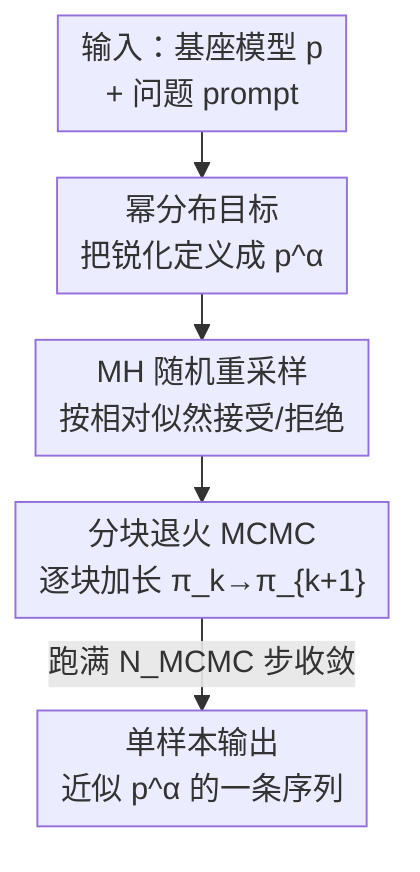

# Reasoning with Sampling: Your Base Model is Smarter Than You Think

**会议**: ICLR 2026  
**OpenReview**: [https://openreview.net/forum?id=Vsgq2ldr4K](https://openreview.net/forum?id=Vsgq2ldr4K)  
**代码**: 待确认  
**领域**: LLM推理  
**关键词**: 测试时采样, 幂分布, MCMC, Metropolis-Hastings, 免训练推理

## 一句话总结
本文提出一种**免训练、免数据集、免验证器**的测试时采样算法：用 MCMC（Metropolis-Hastings）近似地从基座模型自身似然的"幂分布" $p^\alpha$ 中采样，在 MATH500、HumanEval、GPQA、AlpacaEval 等单样本推理任务上把基座模型的表现拉到与 GRPO（RL 后训练）相当甚至更好，同时不损失多样本（pass@k）多样性。

## 研究背景与动机

**领域现状**：当前提升 LLM 推理能力的主流范式是用可验证奖励做强化学习后训练（RLVR），代表算法是 GRPO，在数学、代码、科学等领域带来显著的单样本性能提升。

**现有痛点**：学界一直在追问一个问题——RL 后训练到底是教会了模型**新能力**，还是只是把基座模型本来就有的能力"锐化"（distribution sharpening）出来？已有证据（He et al. 2025、Yue et al. 2025）显示：后训练模型的推理轨迹高度集中在基座模型的高似然区域；在大 $k$ 的 pass@k 上，基座模型反而**胜过**后训练模型，因为 RL 牺牲了生成多样性来换单样本准确率。换句话说，RL 像是把 pass@k 的能力"搬运"到 pass@1 上。此外，RL 后训练本身有重负担：需要大量超参扫描以避免训练不稳定、需要精心构造的数据集、还需要能拿到真值验证器。

**核心矛盾**：如果 RL 后训练分布真的只是基座分布的"锐化版"，那么单样本推理能力的提升原则上应该能**不靠训练**、直接在推理阶段通过采样复现出来——但已有采样方法（如低温采样）并没有真正逼近这个"锐化"目标。

**本文目标**：设计一个仅依赖基座模型自身似然、不需要任何训练/数据/验证器的采样算法，使单样本推理逼近 RL，同时保住多样本多样性。

**切入角度**：作者把"锐化"形式化为从**幂分布** $p^\alpha$（$\alpha\ge 1$）采样——它把高似然序列的相对权重进一步抬高、压低低似然序列。关键观察是：从 $p^\alpha$ 采样**不等价于**逐 token 的低温采样，前者隐含了对"未来路径"的规划，恰好契合推理任务。

**核心 idea**：把"基座模型本来就更聪明"这件事，通过 MCMC 近似采样幂分布 $p^\alpha$ 兑现出来——用额外的推理时计算换更高质量的单条样本。

## 方法详解

### 整体框架

方法要解决的是"如何在不训练的前提下，从基座模型的幂分布 $p^\alpha$ 中采样"。整条流水线是：以基座 LLM $p$ 为唯一信号源，把目标设为锐化后的幂分布 $p^\alpha$；由于 $p^\alpha$ 只有未归一化的值、无法直接采样，用 Metropolis-Hastings（MH）这类只需相对权重的 MCMC 来近似；又因为在整条长序列空间 $\mathcal{X}^T$ 上直接跑 MH 混合时间可能指数级爆炸，再用自回归的顺序结构把采样拆成一串"逐块加长"的中间分布 $\pi_k \propto p(x_{0:kB})^\alpha$，前一块的样本作为下一块 MH 的初始化，逐步收敛到 $p^\alpha$。最终输出是一条单样本序列，所有"接受/拒绝"决策都只用基座似然做出。

### 关键设计

**1. 幂分布作为采样目标：把"锐化"写成可显式指定的分布**

针对的痛点是——人们说 RL 是在"锐化"基座分布，但从没给出一个**显式**的锐化目标。本文把它定义为幂分布 $p^\alpha$：由于 $p(x)>p(x')\Rightarrow p(x)^\alpha/p(x')^\alpha > p(x)/p(x')$，指数化 $\alpha\ge 1$ 会进一步抬高高似然序列、压低低似然序列。关键在于 $p^\alpha$ 完全由基座 LLM 自身决定，**不需要任何额外训练或外部奖励**。

作者特别澄清一个常见误解：逐 token 的低温采样（温度 $\tau=1/\alpha$）**并不等于**从 $p^\alpha$ 采样（Proposition 1）。原因在于二者对未来路径的处理方式不同：$p^\alpha$ 的下一 token 权重是"指数之和" $\sum_{x_{>t}} p(x_{0:T})^\alpha$，而低温采样是"和之指数" $\big(\sum_{x_{>t}} p(x_{0:T})\big)^\alpha$。由此得到 Observation 1——幂分布更偏好"未来路径少但单条似然高"的 token，而低温采样偏好"未来路径多但每条都偏低"的 token。作者用一个 $\{a,b\}$ 两 token 的玩具例子说明：$p(aa)=0,p(ab)=0.40,p(ba)=p(bb)=0.25$、$\alpha=2$ 时，$p^\alpha$ 选 $a$（命中最高似然序列 $ab$），低温采样选 $b$（落入两条低似然路径）。这种"为未来高似然 token 做规划"的隐式偏置，正好对应推理中的关键窗口/枢轴 token——少数 token 决定整条推理对错，而幂分布天然倾向选对它们。

**2. Metropolis-Hastings 随机重采样：只用相对权重就能近似采样未归一化的 $p^\alpha$**

针对的痛点是——$p^\alpha$ 的值虽可逐序列算出，但**未归一化**，直接采样需要在所有序列上归一化，计算不可行。MH 恰好为"从未归一化分布近似采样"而生：用任意提议分布 $q(x\mid x_i)$ 生成候选 $x$，以接受概率
$$A(x,x_i)=\min\left(1,\ \frac{p^\alpha(x)\,q(x_i\mid x)}{p^\alpha(x_i)\,q(x\mid x_i)}\right)$$
接受为下一状态，否则保持不变。归一化常数在比值里被消掉，所以**只需要相对权重**。具体的提议分布选"随机重采样"：以 $1/T$ 的均匀概率选一个起点 $t$，用提议 LLM $p_{\text{prop}}$ 从 $t$ 起重新采样后缀。因为重采样可以早到序列开头，任意两条序列间转移概率非零，从而满足 MH 收敛所需的不可约性（irreducibility）与非周期性（aperiodicity）；又因对称性，反向转移 $q(x_i\mid x)$ 易算。提议 LLM 可任选采样策略（如低温采样）。与 Faria et al. (2024) 等先前 MCMC×LLM 工作的关键区别是：本文的目标分布**完全由基座 LLM 指定**，不需要外部奖励函数。

**3. 自回归分块退火 MCMC：用序列结构破解高维混合时间爆炸**

针对的痛点是——直接在长度 $T$ 的整序列上初始化并反复做全序列 MH，既昂贵又容易遇到 MCMC 的指数混合时间，序列空间 $\mathcal{X}^T$ 维度越高越严重。作者利用自回归的顺序结构，定义一串逐块加长的中间分布（块大小 $B$）：
$$\varnothing \to p(x_{0:B})^\alpha \to p(x_{0:2B})^\alpha \to \cdots \to p(x_{0:T})^\alpha$$
记 $\pi_k(x_{0:kB})\propto p(x_{0:kB})^\alpha$。拿到 $\pi_k$ 的样本后，用 $p_{\text{prop}}$ 自回归地补出下 $B$ 个 token 作为 $\pi_{k+1}$ 的 MH 初始化，再跑 $N_{\text{MCMC}}$ 步随机重采样 MH，固定好新前缀，进入下一块（Algorithm 1）。这种"退火式"逐步加长让每一步的初始化都不至于太离谱，避免病态初始化导致的混合失败。算法是**单样本**的：虽然内部做了多次推理调用，但接受/拒绝全靠基座似然，最终模拟出从 $p^\alpha$ 采一条序列。核心权衡在 $B$ 与 $N_{\text{MCMC}}$ 之间——$B$ 越大、相邻中间分布"跳跃"越大，需要更多 $N_{\text{MCMC}}$ 才能充分转移；可估出平均生成 token 数约 $E_{\text{tokens}}\approx N_{\text{MCMC}}T^2/(4B)$，这正是一条新的推理时扩展（inference-time scaling）轴：花更多采样计算换更高似然/更高质量的样本。

### 损失函数 / 训练策略

本方法**完全无训练**。实现上设 $T_{\max}=3072$、块大小 $B=3072/16=192$；经验上 $\alpha=4.0$、提议 LLM 取基座模型本身且采样温度 $\tau=1/\alpha$ 在推理任务上最优；对 AlpacaEval 2.0 这类一般性任务，把提议分布温度调高到 $\tau=0.5$ 效果更好。

## 实验关键数据

### 主实验

在三个基座模型（Qwen2.5-Math-7B、Qwen2.5-7B、Phi-3.5-mini-instruct）上，对比基座、低温采样、幂采样（本文）与 GRPO（在 MATH 训练集上 RL 后训练），全部**单样本**评测：

| 模型 | 方法 | MATH500 | HumanEval | GPQA | AlpacaEval2.0 |
|------|------|---------|-----------|------|---------------|
| Qwen2.5-Math-7B | Base | 0.496 | 0.329 | 0.278 | 1.61 |
| | 低温采样 | 0.690 | 0.512 | 0.353 | 2.09 |
| | **幂采样(本文)** | 0.748 | **0.573** | 0.389 | **2.88** |
| | GRPO(MATH) | 0.785 | 0.537 | 0.399 | 2.38 |
| Qwen2.5-7B | Base | 0.498 | 0.329 | 0.278 | 7.05 |
| | **幂采样(本文)** | 0.706 | **0.622** | 0.318 | **8.59** |
| | GRPO(MATH) | 0.740 | 0.561 | 0.354 | 7.62 |
| Phi-3.5-mini | Base | 0.400 | 0.213 | 0.273 | 14.82 |
| | **幂采样(本文)** | **0.508** | **0.732** | **0.364** | 17.65 |
| | GRPO(MATH) | 0.406 | 0.134 | 0.359 | 16.74 |

幂采样在**域内**任务 MATH500 上与 GRPO 相当（如 Qwen2.5-Math 上 0.748 vs 0.785），在**域外**任务上常常反超：HumanEval 上对 Phi-3.5 提升高达 +51.9%（且 GRPO 在此处反而把基座搞崩，0.134 < 0.213），在不可验证的 AlpacaEval 2.0 上也普遍优于 GRPO，说明增益能推广到验证器之外的领域。

### 分析实验

| 分析维度 | 基座 | 幂采样(本文) | GRPO |
|----------|------|--------------|------|
| MATH500 响应平均长度(token) | 600 | 679 | 671 |
| 似然分布(相对基座) | 分散 | 偏高且仍有展开 | 高度集中在最高峰 |
| pass@k（大 $k$） | 高 | 高、严格优于 GRPO | 衰减、多样性坍缩 |

### 关键发现

- **长推理是涌现而非显式鼓励**：幂采样未被任何信号要求生成更长答案，却自然涌现出与 GRPO 相近的响应长度（679 vs 671 token），暗示长推理本就是高似然区域的特征。
- **多样性不坍缩**：GRPO 的似然/置信度高度集中（多样性坍缩），而幂采样从更高似然区采样的同时仍保持分布展开；pass@k 曲线上幂采样在 $k>1$ 时严格优于 GRPO，并在高 $k$ 处追上基座——做到了"单样本逼近 RL、多样本不输基座"的两全。
- **似然与正确推理强相关**：图 4 显示 GRPO 与幂采样都从基座的高似然、高置信度区域采样，而这恰对应更高的实证准确率，佐证"基座高似然区 ≈ 强推理"。

## 亮点与洞察

- **把"锐化"从口号变成可计算目标**：用幂分布 $p^\alpha$ 给"RL 只是锐化基座"这一直觉一个显式、可采样的数学对象，这个 framing 本身就很漂亮——它把一个争论性问题转化成一个采样问题。
- **指数之和 vs 和之指数**：澄清低温采样 ≠ 幂分布采样（Proposition 1），并用"未来路径"视角解释为何幂分布更适合推理（隐式规划枢轴 token），是全文最"啊哈"的洞察。
- **分块退火破 MCMC 混合**：把经典 MH 与自回归顺序结构结合、用逐块加长的中间分布避免高维冷启动失败，这个 trick 可迁移到任何"想从某个序列级未归一化目标采样"的场景（红队、个性化生成等）。
- **新的推理时扩展轴**：$E_{\text{tokens}}\approx N_{\text{MCMC}}T^2/(4B)$ 给出"花采样计算换样本质量"的明确刻度，与思维链/多次采样并列为又一条 inference-time scaling 路径。

## 局限与展望

- **推理计算开销大**：单条样本要做 $\sim N_{\text{MCMC}}T^2/(4B)$ 量级的 token 生成，远高于一次普通采样；论文未充分对比"同等计算预算下"与 RL/多次采样的性价比。
- **超参敏感**：$\alpha$、$B$、$N_{\text{MCMC}}$、提议温度都需调，不同任务（推理 vs AlpacaEval）最优提议温度不同，"免超参扫描"的卖点主要是相对 RL 而言。
- **规模与模型有限**：仅在三个 7B 级别基座上验证，更大模型、更长上下文、更难任务上的表现待考。
- **结论的边界**：核心论点"基座本来就更聪明"建立在"高似然 ≈ 正确推理"的相关性上；当任务的正确解本身处于基座低似然区时，幂采样无能为力——它放大的是基座已有的、只是没被普通采样揭示出来的能力。

## 相关工作与启发

- **vs GRPO / RLVR**：RL 用可验证奖励训练去锐化分布，代价是训练不稳定、需数据集与验证器、且多样本多样性坍缩；本文免训练、只用基座似然，在域外任务上反超并保住 pass@k 多样性，劣势是推理时更贵。
- **vs 低温采样**：低温采样逐 token 锐化、是"和之指数"，会偏向多条低似然未来路径；本文目标是序列级"指数之和"的幂分布，隐式为未来高似然 token 规划，二者并不等价（Proposition 1）。
- **vs Faria et al. (2024) 等 MCMC×LLM**：方法论上最接近——同样用 MH 迭代重采样，但先前工作把分布倾斜向**外部奖励**，本文的目标分布则**完全由基座 LLM 指定**，因此无需任何外部信号。

## 评分
- 新颖性: ⭐⭐⭐⭐⭐ 用幂分布+MCMC 给"基座本就会推理"一个免训练的显式实现，framing 与方法都新
- 实验充分度: ⭐⭐⭐⭐ 三模型四任务 + pass@k/似然/长度分析齐全，但缺等计算预算对比、规模偏小
- 写作质量: ⭐⭐⭐⭐⭐ 从直觉到玩具例子到算法层层递进，Proposition/Observation 把关键区别讲得很清楚
- 价值: ⭐⭐⭐⭐⭐ 重新审视 RL 与基座的关系，并给出一条可验证之外可用的推理时扩展新路径

<!-- RELATED:START -->

## 相关论文

- [\[ICLR 2026\] Why is Your Language Model a Poor Implicit Reward Model?](why_is_your_language_model_a_poor_implicit_reward_model.md)
- [\[ICLR 2026\] R-HORIZON: How Far Can Your Large Reasoning Model Really Go in Breadth and Depth?](r-horizon_how_far_can_your_large_reasoning_model_really_go_in_breadth_and_depth.md)
- [\[CVPR 2026\] Think-as-You-See: Streaming Chain-of-Thought Reasoning for Large Vision-Language Models](../../CVPR2026/llm_reasoning/think-as-you-see_streaming_chain-of-thought_reasoning_for_large_vision-language_.md)
- [\[ICLR 2026\] Beyond Speedup - Utilizing KV Cache for Sampling and Reasoning](beyond_speedup_-_utilizing_kv_cache_for_sampling_and_reasoning.md)
- [\[ICLR 2026\] Taming Imperfect Process Verifiers: A Sampling Perspective on Backtracking](taming_imperfect_process_verifiers_a_sampling_perspective_on_backtracking.md)

<!-- RELATED:END -->
