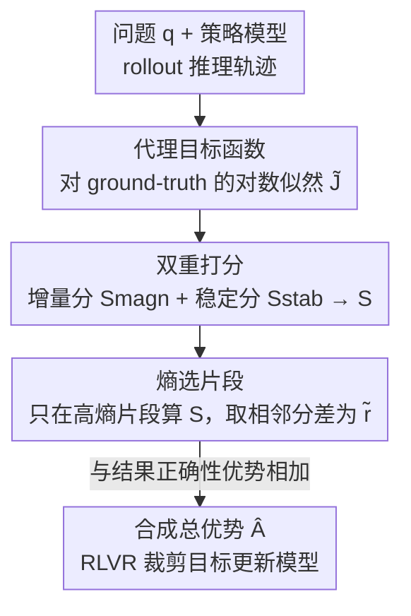

# Rectifying LLM Thought from Lens of Optimization

**会议**: ICLR 2026  
**OpenReview**: [https://openreview.net/forum?id=bOMQmyR492](https://openreview.net/forum?id=bOMQmyR492)  
**代码**: https://github.com/open-compass/RePro  
**领域**: LLM推理 / 强化学习  
**关键词**: 长思维链, 过程级奖励, RLVR, 过度思考, 优化视角

## 一句话总结
本文把长思维链（CoT）的推理过程类比成一次"梯度下降"，提出 REPRO：用模型对正确答案的对数似然作为代理目标函数，沿推理轨迹打两个分（增量分 + 稳定分）合成过程级奖励，插进 RLVR 训练，从而在数学/科学/代码多个 benchmark 上一致提升推理精度并显著压缩"过度思考"的冗余 token。

## 研究背景与动机
**领域现状**：当前最强的推理 LLM（o-series、DeepSeek-R1、Kimi-K1 等）都靠长思维链 + RLVR（带可验证奖励的强化学习）训练——模型自主探索一长串推理步骤，最后只用一个"答案对不对"的终端奖励来回传更新。这套范式让模型学会了反复探索、回溯、自我反思。

**现有痛点**：长 CoT 模型普遍存在"过度思考"：对一个像"2 加 3 等于几"这样的小问题，也能生成上千 token 的推理链，绝大部分步骤对最终答案毫无贡献，只是徒增延迟和算力。终端奖励只看结果对错，对中间这些低效、震荡、反复横跳的步骤没有任何约束信号。

**核心矛盾**：终端奖励是"稀疏 + 只管结果"的，它无法分辨同样答对的两条轨迹里，哪一条是高效直达、哪一条是绕了一大圈反复自我怀疑。缺一个能逐步评判"这一步推理到底有没有把我推向答案"的过程级信号。

**本文目标**：给推理过程本身设计一个可计算、可插拔的过程级奖励，既能压住冗余的"过度思考"，又不破坏原有的结果正确性奖励。

**切入角度**：作者沿用"把 CoT 解码看成对 LLM 内部状态的优化过程"这一视角——每生成一步推理，就相当于做了一次（隐式的）梯度更新，朝着"提高正确答案概率"的方向走。在这个视角下，好的推理 = 一条平滑、单调上升的优化曲线；过度思考 = 在鞍点/局部最优附近来回震荡、迟迟不收敛。

**核心 idea**：既然推理是优化过程，那就**直接去测量这个优化过程的质量**——用模型对 ground-truth 的置信度（似然）作为目标函数的代理值，沿轨迹监测它"涨得够不够多（强度）"和"涨得稳不稳（稳定性）"，把这两点合成一个过程奖励来矫正模型的"思路"。

## 方法详解

### 整体框架
REPRO（Rectifying Process-level Reward）是一个挂在标准 RLVR 训练管线上的即插即用模块。一次训练迭代里：策略模型先 rollout 出一组推理轨迹；REPRO 把每条轨迹当成一次优化过程，沿轨迹计算代理目标函数 $\tilde{J}$ 的序列，再对这个序列打两个分——增量分 $S_{magn}$（优化涨了多少）和稳定分 $S_{stab}$（涨得平不平），加权合成总分 $S$；为了省算力，只在熵最高的若干推理片段上算这个分，把相邻片段的分差作为过程级奖励 $\tilde{r}$；最后把 $\tilde{r}$ 归一化后与原本的结果正确性优势相加，得到总优势 $\hat{A}_t$，照常用裁剪式策略目标更新模型。

### 关键设计

**1. 代理目标函数：用"对正确答案的置信度"当优化曲线的纵轴**

把推理看成优化，第一步得有个目标函数。但真实的优化过程（对内部状态的隐式梯度上升）复杂到没法直接写出来，作者退而求其次找一个**可观测的代理量**：给定前 $t$ 步推理上下文 $\tau_{\le t}$，模型生成 ground-truth 答案 $a$ 的平均对数概率，

$$\tilde{J}\!\left(\pi_\theta, q, \tau_{\le t}, a\right) \triangleq \frac{1}{|a|}\sum_{i=1}^{|a|}\log \pi_\theta\!\left(a^{(i)}\,\middle|\,q, \tau_{\le t}\right).$$

直觉是：随着推理往下走、上下文不断更新模型的内部状态，它对正确答案越来越有信心，$\tilde{J}$ 就该单调上升。作者用 DeepSeek-R1-Distill-Qwen-1.5B 在 AIME 题上验证：画出 $-\tilde{J}$ 随轨迹 token 位置的曲线，确实随推理变长而平稳下降（即 $\tilde{J}$ 上升），说明 $\tilde{J}$ 是个靠谱的"优化进度"探针。它的好处是只需一次前向、不需要额外的奖励模型或人工标注。

**2. 增量分 $S_{magn}$：衡量这段推理把优化推进了多少**

光有曲线还不够，得把"好不好"量化。第一个维度是**强度**——一段推理到底带来了多大净进步。直接比较不同问题的 $\tilde{J}$ 绝对值不公平（题难度不同基线不同），所以引入一个基线 $J_b(q)\triangleq\tilde{J}(\pi_\theta,q,a)$，即不给任何推理、模型直接预测答案的置信度。增量分定义为相对基线的归一化提升：

$$S_{magn,(t)} \triangleq \tanh\!\Big(\Delta + 1\Big) + 1 \in (0,1],\qquad \Delta = \frac{\tilde{J}(\pi_\theta,q,\tau_{\le t},a) - J_b(q)}{J_b(q)}.$$

用 $\tanh$ 把相对提升压到 $(0,1]$ 区间，既保留单调性又抑制极端值。$S_{magn}$ 越高，说明这段部分轨迹 $\tau_{\le t}$ 把模型往正确答案推得越远，是"有效推理"。（⚠️ 原文公式记号略有歧义，正负号与区间以原文为准。）

**3. 稳定分 $S_{stab}$：用 Kendall's Tau 抓"震荡 / 反复横跳"**

第二个维度是**稳定性**——理想的优化每一步都该让目标稳步上升，而过度思考的典型表现是上上下下、迟迟不收敛。作者用 Kendall 秩相关系数衡量 $\tilde{J}$ 序列与步序号的单调一致性：统计所有步对 $(i,j)$ 里 $\tilde{J}$ 的大小关系与序号大小关系符号一致的比例，

$$S_{stab,(t)} = \frac{\sum_{i<j}\operatorname{sign}(\tilde{J}_i-\tilde{J}_j)\cdot\operatorname{sign}(i-j)}{|\tau_{\le t}|\,(|\tau_{\le t}|-1)}\cdot\frac{1}{2}+\frac{1}{2}\in[0,1].$$

若每一步都是有效更新（序列严格递增），$S_{stab}\to 1$；若忽上忽下、震荡严重，则趋近 0。为抗噪声还可对 $\tilde{J}$ 先做 EMA 平滑。最后两分加权合成总分 $S=(1-w)S_{magn}+w\,S_{stab}$，$w\in[0,1]$ 调两者比重。这种"强度 + 稳定性"双维度刻画，正好对应"优化要走得远、也要走得稳"这两个直觉条件。

**4. 熵选片段 + 分差成奖励：把过程分变成能塞进 RLVR 的低噪声信号**

如果在每个 token 上都算 $S$，对动辄上万 token 的长 CoT 来说算力爆炸，而且 token 级信号噪声极大。作者做两件事降本去噪。其一，**熵选片段**：把思考部分按 `\n\n` 切成 $N$ 个片段，只取每段首 token 熵 top-$k$ 的若干段来算分——高熵 token 是"关键决策点"，从优化视角看正是最容易发生震荡/次优更新、最值得矫正的地方。其二，**分差成奖励**：选定片段后，第 $j$ 段的过程奖励取相邻总分之差 $\tilde{r}_j = S_j - S_{j-1}$（$j=1$ 时取 $S_1$），表示"从上一段末尾走到这一段"带来的优化增益——正增益的步骤（关键计算、初步结论）被鼓励，负增益的步骤（自我怀疑、冗余复查）被惩罚。$\tilde{r}_j$ 再单独归一化（与结果奖励分开归一，避免噪声干扰正确性信号），最终过程优势 $\tilde{A}_t=\sum_{i\ge j}\tilde{r}'_i$ 与结果正确性优势 $A$ 按 $\hat{A}_t = A + \alpha\tilde{A}_t$ 合并，照常进裁剪式策略目标。这样 REPRO 完全即插即用，PPO / REINFORCE++ / GRPO 都能直接挂。

### 一个例子：低奖励步骤长什么样
论文给了一道对数方程题（求 $xy$，答案 25），逐步算出每步的 $\tilde{r}$：开头复述题目得 $\tilde{r}=0.143$（正，奠定方向）；"我记得对数有点 tricky……或许换底公式有用"这类空想式铺垫得 $\tilde{r}=-0.217$（强负）；"这种试错法不行，也许该换个思路"得 $\tilde{r}=-0.060$；而真正推出"所以 $xy=25$ 是解"的关键计算步得 $\tilde{r}=0.053\sim0.092$（正）。规律清晰：低 $\tilde{r}$ 步几乎都是自我怀疑、反复复查、贡献甚微的冗余；高 $\tilde{r}$ 步对应实质性计算或结论。REPRO 就是据此压低前者、抬高后者。

## 实验关键数据

### 主实验
在 DeepSeek-R1-Distill-Qwen-1.5B 与 Qwen3-1.7B 上，把 REPRO 挂到 PPO / REINFORCE++（RF++）/ RF++ Baseline / GRPO 四种算法上，评测覆盖数学（AIME24/25、MATH500、LiveMathBench）、科学（GPQA-Diamond）、代码（MBPP、LiveCodeBench）。♠为域内、♣为域外。

| 主干 / 算法 | AIME24 ♠ | AIME25 ♠ | MATH500 ♠ | LMB ♠ | GPQA-D ♣ | MBPP ♣ |
|---|---|---|---|---|---|---|
| R1-Distill-1.5B · PPO | 34.8 | 24.4 | 86.9 | 14.0 | 32.1 | 61.0 |
| · PPO + REPRO | **36.3** | **27.7** | **87.7** | **16.5** | **32.8** | 61.1 |
| R1-Distill-1.5B · GRPO | 32.9 | 25.3 | 86.0 | 10.3 | 34.5 | 62.5 |
| · GRPO + REPRO | **36.0** | **26.5** | **87.1** | **14.3** | **37.0** | **65.4** |
| Qwen3-1.7B · GRPO | 47.3 | 34.8 | 93.4 | 18.8 | 38.3 | 67.5 |
| · GRPO + REPRO | **49.8** | **37.9** | **94.1** | **19.5** | **39.1** | **68.8** |

REPRO 对四种 RL 算法都带来一致提升，且增益从数学域内泛化到科学/代码域外，也跨不同模型家族与尺寸，印证其"通用增强机制而非特定 backbone 的过拟合"。

### 消融实验

| 配置 | 结论 |
|---|---|
| 权重 $w$（Fig.4） | 各 $w$ 下 REPRO 均超 baseline，证明增量分与稳定分都必要；$w$ 偏小时略好，说明**增量分（优化强度）作用更关键** |
| REPRO 权重 $\alpha$（设 0.1） | 各 $\alpha$ 值下性能相对稳定，对该平衡系数鲁棒 |
| 选段数 $k$（10/20/30） | $k$ 增大性能微涨（如 AIME24 36.0→36.9），收益边际递减，需在算力与精度间权衡 |

### 关键发现
- **增量分 > 稳定分**：$w$ 偏小（更看重 $S_{magn}$）时性能更好，说明"推得够远"比"推得够稳"对最终精度更重要。
- **显著降 token / 减回溯**：训练中 REPRO 的推理 token 成本随步数持续下降，推理时跨所有 benchmark 的 token 开销也明显减少（Fig.3、Fig.6）；同时"backtracking（回溯）"这一典型低效模式的占比随训练显著低于 vanilla GRPO（Fig.5）——即不只是省 token，而是真改善了思维行为。
- **更线性、更少错**：case study 显示 REPRO 训出的模型回溯更少、思路更直，且因抑制了"鞍点附近震荡"而减少了推理错误。

## 亮点与洞察
- **把"过程奖励"建立在优化理论上**：不是拍脑袋设计 PRM，而是从"CoT = 梯度下降"这个明确假设出发，推出"优化要走得远（强度）+ 走得稳（稳定性）"两个可量化条件，动机和指标一脉相承。
- **代理目标函数极轻**：用对 ground-truth 的对数似然当优化进度探针，无需训练额外奖励模型、无需人工步级标注，一次前向就能算，这是它能即插即用的关键。
- **熵选片段一举两得**：既把 token 级的昂贵计算降到片段级，又恰好把奖励集中在"高熵关键决策点"——这些正是优化最容易出岔子、最值得矫正的地方，省算力和提质量在这里是同向的。
- **可迁移性**："用似然曲线的单调性 + Kendall's Tau 刻画一段生成过程好坏"这个思路，可迁移到其他需要过程级反馈但缺步级标注的生成任务（如 agent 轨迹、工具调用链）。

## 局限与展望
- **依赖 ground-truth 答案**：代理目标函数 $\tilde{J}$ 要算"对正确答案的似然"，因此天然只适用于有可验证答案的任务（数学/代码/科学题），开放式生成、无标准答案的推理用不了。
- **"优化即推理"是个强假设**：把 $\tilde{J}$ 单调上升等同于"好推理"只是经验性观察，对那些需要先发散探索、似然短暂下降再回升的难题，可能误伤有价值的探索步骤。
- **超参与片段切分依赖经验**：$w$、$\alpha$、$k$ 以及按 `\n\n` 切段都是手工设定，论文未给自适应方案；验证规模集中在 1.5B–1.7B 小模型，更大模型上的收益有待确认。
- **改进方向**：用置信度而非真值近似 $\tilde{J}$ 以摆脱对 ground-truth 的依赖；让 $w$/$k$ 随题目难度自适应。

## 相关工作与启发
- **vs 基于长度的效率正则（如 length-penalty 类方法）**：它们直接惩罚 token 数来压过度思考，但"短"不等于"好"，可能误伤必要推理；REPRO 惩罚的是"低优化增益的步骤"，是按质量而非长度裁剪，更精准。
- **vs 传统过程奖励模型（PRM, Lightman et al.）**：PRM 需要大量步级人工标注训练一个判别器；REPRO 用对 ground-truth 的似然做无监督代理，免标注、免额外模型，更轻量。
- **vs Dr.GRPO / DAPO / VAPO 等 RL 算法改进**：那些工作改的是采样策略、优势估计等算法骨架；REPRO 不动算法骨架，只往奖励里加一个过程级信号，与它们正交、可叠加。

## 评分
- 新颖性: ⭐⭐⭐⭐ 把 CoT 显式建模为优化过程并据此设计"强度+稳定性"双分过程奖励，视角清晰、落点具体
- 实验充分度: ⭐⭐⭐⭐ 覆盖 4 种 RL 算法 × 多模型 × 数学/科学/代码 7 个 benchmark，并有 token/回溯行为分析；但模型规模偏小
- 写作质量: ⭐⭐⭐⭐ 优化类比贯穿全文、图例清楚；部分公式记号略有歧义
- 价值: ⭐⭐⭐⭐ 即插即用、无需额外标注，对缓解过度思考有实际价值

<!-- RELATED:START -->

## 相关论文

- [\[ICLR 2026\] Reference-guided Policy Optimization for Molecular Optimization via LLM Reasoning](reference-guided_policy_optimization_for_molecular_optimization_via_llm_reasonin.md)
- [\[ICLR 2026\] Asymmetric Proximal Policy Optimization: Mini-Critics Boost LLM Reasoning](asymmetric_proximal_policy_optimization_mini-critics_boost_llm_reasoning.md)
- [\[ICLR 2026\] Slow-Fast Policy Optimization: Reposition-Before-Update for LLM Reasoning](slow-fast_policy_optimization_reposition-before-update_for_llm_reasoning.md)
- [\[ICLR 2026\] Making Slow Thinking Faster: Compressing LLM Chain-of-Thought via Step Entropy](making_slow_thinking_faster_compressing_llm_chain-of-thought_via_step_entropy.md)
- [\[ICLR 2026\] Scaf-GRPO: Scaffolded Group Relative Policy Optimization for Enhancing LLM Reasoning](scaf-grpo_scaffolded_group_relative_policy_optimization_for_enhancing_llm_reason.md)

<!-- RELATED:END -->
