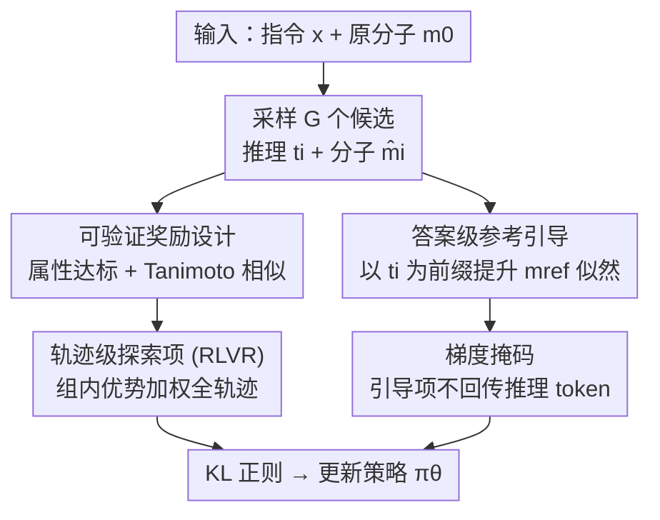

# Reference-guided Policy Optimization for Molecular Optimization via LLM Reasoning

**会议**: ICLR 2026  
**OpenReview**: [https://openreview.net/forum?id=m4nvqQkm4X](https://openreview.net/forum?id=m4nvqQkm4X)  
**代码**: https://github.com/tmlr-group/RePO  
**领域**: LLM推理 / 强化学习 / 分子优化  
**关键词**: 分子优化, RLVR, GRPO, 参考引导, 可验证奖励

## 一句话总结
针对"每条数据只给一个优化后参考分子、没有中间推理轨迹"的指令式分子优化任务，本文提出 RePO：在 GRPO 式可验证奖励强化学习的基础上，加一个只作用在答案 token 上的"参考引导项"，让模型在保持自由探索化学编辑空间的同时把输出锚定到参考分子，从而缓解早期奖励稀疏、显著提升"成功率×相似度"指标。

## 研究背景与动机
**领域现状**：让 LLM 做推理任务，主流是两条配方——监督微调（SFT）和带可验证奖励的强化学习（RLVR，代表方法 GRPO）。两者都能让模型"先想后答"，在数学/代码这类有明确正误的任务上表现很好。但这些配方搬到科学任务（尤其是指令式分子优化）上效果如何，几乎没人系统研究过。

**现有痛点**：指令式分子优化要求模型在**提升某个目标属性**（如 QED、LogP、MR）的同时**保持与原分子的结构相似度**——加官能团能提属性，但会拉低相似度甚至破坏化学合法性，这是一对天然冲突的目标。更要命的是数据集的监督形式：每条样本只给一个优化后的参考分子 $m_{\text{ref}}$，**没有一步步怎么改的轨迹**。这种"监督错配"让两条配方都翻车：纯答案 SFT 直接模仿参考分子，会把模型压成"不推理、只吐一个短答案"，丧失多步探索能力；GRPO 从基座模型直接学，早期能同时满足"提属性+保相似"的样本极少，奖励信号稀疏，模型只敢做接近恒等的保守微编辑。

**核心矛盾**：奖励信号太稀疏，不足以把策略推出保守编辑的舒适区；可参考分子又只能在 token 级被模仿，一旦逐 token 模仿就会过度约束策略、抹掉多样的编辑路径。作者用三组对照实验（GRPO、答案 SFT、GRPO-SFT-init）确认了这个建模缺口：GRPO 相似度高但成功率低；SFT 成功率中等但相似度控制差且坍缩成短答案；在 SFT 之上再跑 GRPO 也救不回多步推理，反而继承了 SFT 的短答案、探索受限。

**本文目标**：在不需要任何中间编辑轨迹标注的前提下，同时提供 (i) 朝向 $m_{\text{ref}}$ 的**答案级**方向性引导来增强学习信号，以及 (ii) **避免 token 级过程模仿**，让同一指令下多条合法推理/编辑路径都能保留。

**核心 idea**：把参考分子只当成"答案级锚点"而不是"推理范本"——保留 GRPO 在完整轨迹上的奖励驱动探索，同时额外加一项"在模型自己采样的推理前缀条件下、提升参考分子答案似然"的引导，用引导缓解奖励稀疏、用 RL 维持探索多样性。

## 方法详解

### 整体框架
RePO（Reference-guided Policy Optimization）要解决的就是上面那个监督错配：只有终点参考分子、没有过程轨迹。它的整体思路是在一次更新里把"探索"和"锚定"两股力拧成一个目标函数。具体一轮：对查询 $q=(x,m_0)$（指令 $x$ + 原分子 $m_0$），用旧策略 $\pi_{\text{old}}$ 采样 $G$ 个回答，每个回答 $o_i=[t_i;\hat m_i]$ 由推理 token $t_i$ 和最终分子 $\hat m_i$ 组成；用可验证奖励给每个 $\hat m_i$ 打分；然后用三项之和更新策略——RLVR 探索项（对全轨迹按组内相对优势加权）、答案级参考引导项（在采样到的推理前缀 $t_i$ 条件下提升 $m_{\text{ref}}$ 的似然）、以及 KL 正则项稳定更新。关键在于引导项**只在答案 token 上计算、且梯度不回传推理 token**，因此模型从不模仿推理过程，只把参考分子当答案锚。

### 关键设计

**1. 可验证奖励设计：把"提属性+保相似"的双目标变成可计算的标量**

强化学习要有奖励才能学，分子优化没有现成的可验证答案，作者直接把 Eqn. 1 的优化目标实例化成奖励 $r(m,m_0)=r_{\text{prop}}(m,m_0)+r_{\text{struct}}(m,m_0)$。结构项用 Tanimoto 相似度 $r_{\text{struct}}=\frac{|FP(m)\cap FP(m_0)|}{|FP(m)\cup FP(m_0)|}\in[0,1]$，其中 $FP(\cdot)$ 是分子指纹（标记子结构是否出现的定长二值向量），越接近原分子奖励越高，鼓励结构保持。属性项用**二值改进奖励**：指令要求增大属性时 $F(m)\ge F(m_0)$ 给 1、否则 0，要求减小时反之。两项相加既奖励"朝目标方向改对了"又奖励"没改太多"，正好对应任务那对冲突目标。

**2. 轨迹级探索项：用 GRPO 式更新维持多步编辑的多样性**

为了不让模型坍缩成保守微编辑，RePO 保留 GRPO 的奖励驱动探索，但作用在**完整轨迹**上。对一组 $G$ 个回答算组内相对优势 $\hat A_{i,k}=(r(o_i,q)-\text{mean}(\{r\}))/\text{std}(\{r\})$，再用裁剪的重要性比 $\rho_{i,k}=\pi_\theta(o_{i,k}\mid q,o_{i,<k})/\pi_{\text{old}}(o_{i,k}\mid q,o_{i,<k})$ 做 $\min(\rho_{i,k}\hat A_{i,k},\,\text{clip}(\rho_{i,k},1-\varepsilon,1+\varepsilon)\hat A_{i,k})$ 的更新，**对 $o_i$ 的所有 token（推理+答案）都施加**。这一项负责把高奖励候选上调、低奖励候选下压，是探索的发动机；因为更新在模型自己采的轨迹上，不同合法编辑路径都能被保留。

**3. 答案级参考引导：以模型自己的推理为前缀，给参考分子加权而非逐 token 抄**

这是 RePO 区别于 SFT/GRPO 的核心。引导项是 $\beta\log\pi_\theta(m_{\text{ref}}\mid q,t_i)$：在模型采样出的推理前缀 $t_i$ 条件下，提升参考分子答案的对数似然，$\beta$ 控制强度。它和纯 SFT 的根本区别在"条件"——SFT 是 $\log\pi(m_{\text{ref}}\mid q)$，强迫模型无视过程直接吐参考，所以坍缩；RePO 把模型自己的推理当上下文，只在答案层面把概率往参考方向拉，等于早期就给"满足指令的答案"一个明确信号，降低奖励稀疏、让后续 RL 更新更有信息量，进而反过来塑造推理 token 去探索更好属性的分子。注意 $m_{\text{ref}}$ 只是未知最优 $m^*$ 的代理，且只用作答案锚（先过 RDKit 合法性检查），从不被当成首选推理路径。

**4. 梯度掩码：让引导项的梯度不污染推理 token**

引导项虽然只在答案 token 上计算，但若任由它的梯度顺着 $\pi_\theta(m_{\text{ref}}\mid q,t_i)$ 回传到前缀 $t_i$，就会把"为了吐出参考分子"的压力施加到推理上，强化虚假或化学上站不住的推理模式——这正是 SFT 坍缩的机制。RePO 因此对引导项做梯度掩码：前缀 $t_i$ 只作上下文、不接收引导项梯度（如 Fig. 6 所示，引导项对推理 token "No gradient"）。机制验证实验（随机掩 40%/80% 与不掩对照）显示，去掉掩码会让性能跌破基线、训练奖励停滞，证明这一步是引导项能用而不坏的关键。

### 损失函数 / 训练策略
最终目标 $J_{\text{RePO}}(\pi_\theta)$ 把三项相加：探索项（裁剪 GRPO，作用全 token）+ 引导项 $\beta\log\pi_\theta(m_{\text{ref}}\mid q,t_i)$（仅答案 token，前缀掩码）+ KL 正则 $-\gamma D_{\text{KL}}(\pi_\theta\|\pi_{\text{ref}})$（用 K3 估计器稳定更新）。训练流程：对每个 $q$ 采 $G$ 个 $o_i=[t_i;\hat m_i]$，解析出 $\hat m_i$ 算奖励 → 算组内相对优势做 GRPO 更新 → 叠加以 $t_i$ 为前缀的参考引导。基座模型用 Qwen-2.5-3B-Instruct，单轮优化、无需任何轨迹标注。

## 实验关键数据

### 主实验
TOMG-Bench 单目标优化（核心指标 SR×Sim，即成功率×相似度，越高越好）：

| 任务 | 指标 | Base | SFT | GRPO | GRPO(SFT-init) | RePO |
|------|------|------|-----|------|----------------|------|
| AddComponent | SR×Sim | 0.066 | 0.147 | 0.005 | 0.156 | **0.239** |
| SubComponent | SR×Sim | 0.046 | 0.264 | 0.052 | 0.299 | **0.344** |
| QED | SR×Sim | 0.130 | 0.207 | 0.123 | 0.192 | **0.236** |
| LogP | SR×Sim | 0.168 | 0.206 | 0.305 | 0.183 | 0.297 |
| MR | SR×Sim | 0.173 | 0.238 | 0.188 | 0.225 | **0.294** |

RePO 在 6 个单目标任务里 4 个取得最佳 SR×Sim；相对 GRPO 成功率最高提升 17.4%。注意纯 GRPO 在结构类任务上几乎崩溃（AddComponent SR 仅 0.005，相似度虚高 0.992 说明几乎没改动），印证了"无引导的探索在巨大化学空间里失效"。

MuMOInstruct 多目标优化（seen / unseen 指令）：RePO 在 BDP、BPQ 上超过基线最高 4%，且在**未见过的指令风格**下仍保持优势（unseen BPQ SR×Sim 0.144 为最佳），体现泛化性。

### 消融实验

| 配置 | 现象 | 说明 |
|------|------|------|
| RePO (full) | 最优 | 完整三项 + 梯度掩码 |
| No Mask | 跌破基线 | 引导梯度回传推理 token，强化虚假推理；训练奖励停滞 |
| Random Mask 40%/80% | 低于 full | 部分掩码不足以隔离污染 |
| RePO (30% 参考损坏) | 仍高于基线 | 对错配 query-reference 优雅降级 |
| RePO (50% 参考损坏) | 仍具竞争力 | 鲁棒性好 |

### 关键发现
- **梯度掩码是引导项能用的前提**：不掩码时性能反而掉到基线以下、训练停滞（Fig. 7/8），说明"只在答案级锚定、绝不让梯度碰推理"才是 RePO 不坍缩的根本。
- **属性增益是整体抬升而非个别离群**：属性增益分布（Fig. 11）显示 RePO 相对 base/GRPO 整体右移；MR 任务平均增益 18.89，远超 GRPO 的 6.84，甚至超过参考分子本身的 9.05。
- **推理质量更高**：LLM-as-a-judge（对齐专家化学家）打分 RePO 4.32 最高，No-Mask 仅 3.54。
- **跨骨干稳健**：换到 Qwen-2.5-7B、Llama-3.1-8B（架构/分词器差异大）RePO 仍整体最佳；纯 zero/few-shot CoT 提示则明显不够。

## 亮点与洞察
- **"答案级锚定 + 轨迹级探索"的解耦很巧**：同一个参考分子，SFT 把它当 token 级范本就坍缩，RePO 把它当答案级锚点就增益——区别只在一个"以模型推理为条件"和一个梯度掩码，却根本改变了行为。
- **诊断驱动设计**：先用三组对照（GRPO / SFT / GRPO-SFT-init）+ 回答长度曲线把"为什么坍缩、为什么稀疏"讲透，再针对性地设计目标函数，方法的每一项都能对上一个观察到的失败模式。
- **可迁移思路**：凡是"只有终点标签、没有过程轨迹"的 RLVR 场景（科学发现、程序合成的目标态），都可以借鉴"用终点标签做答案级引导 + 梯度掩码隔离过程"这套，既补稀疏奖励又不抹杀探索。

## 局限与展望
- **奖励设计偏简单**：属性项是二值改进奖励（达标即 1），不区分"提升多少"，可能让模型满足于刚好越过阈值的小改动；连续/分级的属性奖励或许能进一步推动。
- **单轮优化**：RePO 是单轮生成优化，虽与多轮进化方法（MOLLEO、Graph-GA 等）竞争甚至胜出，但面对需要多步迭代精修的难目标，单轮上限可能受限。
- **依赖参考分子质量**：虽对 30%/50% 参考损坏有鲁棒性，但引导项本质依赖 $m_{\text{ref}}$ 作为 $m^*$ 的代理，若数据集参考普遍偏弱，引导信号也会偏弱。
- **相似度阈值/指纹的选择**：奖励用 Tanimoto + 分子指纹，对指纹类型和阈值 $\delta$ 的敏感性正文未充分展开。

## 相关工作与启发
- **vs GRPO（纯 RLVR）**：GRPO 从基座直接学，早期高奖励样本稀疏，只敢做保守编辑（相似度虚高、成功率低）；RePO 在同样 GRPO 探索框架上加答案级参考引导，直接补足稀疏奖励，结构类任务上把崩溃的 GRPO 拉回最优。
- **vs 答案 SFT / GRPO(SFT-init)**：SFT 逐 token 模仿参考导致坍缩成短答案、丧失多步推理，在其上跑 GRPO 也救不回；RePO 用梯度掩码把参考限制在答案级，保住推理与探索。
- **vs 黑盒 LLM 分子优化（MOLLEO、打分 oracle、工具耦合）**：那些方法把 LLM 嵌入进化搜索或外接化学工具做多轮优化；RePO 用更小的开源骨干、单轮优化就达到竞争或更优，路线更轻量、更端到端。

## 评分
- 新颖性: ⭐⭐⭐⭐ "参考分子当答案锚而非推理范本 + 梯度掩码"是干净且切中监督错配的创新
- 实验充分度: ⭐⭐⭐⭐ 两个 benchmark、多骨干、机制验证/损坏鲁棒/CoT 对照/LLM-judge 都覆盖
- 写作质量: ⭐⭐⭐⭐ 先诊断三种失败再对症设计，逻辑链清晰
- 价值: ⭐⭐⭐⭐ 为"只有终点标签、无过程轨迹"的 RLVR 场景提供了可复用范式

<!-- RELATED:START -->

## 相关论文

- [\[ICLR 2026\] Inpainting-Guided Policy Optimization for Diffusion Large Language Models](inpainting-guided_policy_optimization_for_diffusion_large_language_models.md)
- [\[ICLR 2026\] HiPO: Self-Hint Policy Optimization for RLVR](hipo_self-hint_policy_optimization_for_rlvr.md)
- [\[ICLR 2026\] Slow-Fast Policy Optimization: Reposition-Before-Update for LLM Reasoning](slow-fast_policy_optimization_reposition-before-update_for_llm_reasoning.md)
- [\[ICLR 2026\] Asymmetric Proximal Policy Optimization: Mini-Critics Boost LLM Reasoning](asymmetric_proximal_policy_optimization_mini-critics_boost_llm_reasoning.md)
- [\[ICLR 2026\] Scaf-GRPO: Scaffolded Group Relative Policy Optimization for Enhancing LLM Reasoning](scaf-grpo_scaffolded_group_relative_policy_optimization_for_enhancing_llm_reason.md)

<!-- RELATED:END -->
