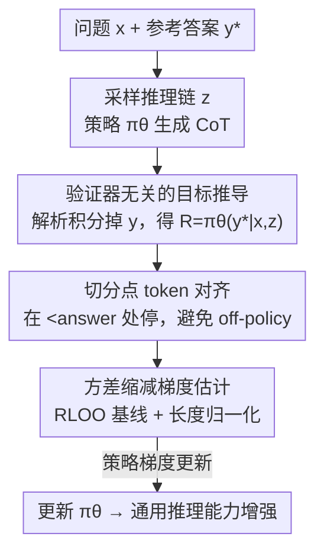

# Reinforcing General Reasoning without Verifiers

**会议**: ICLR 2026  
**OpenReview**: [https://openreview.net/forum?id=nnwvwge40d](https://openreview.net/forum?id=nnwvwge40d)  
**代码**: 有（论文标注 Code Link，Sea AI Lab）  
**领域**: LLM推理 / 强化学习 / RLVR  
**关键词**: 无验证器RL、RLVR、推理链、方差缩减、通用推理

## 一句话总结
本文提出 VeriFree——一种**不需要任何验证器**的 DeepSeek-R1-Zero 式强化学习方法：它不再判断模型答案对错，而是直接最大化「在模型自己生成的推理链条件下，参考答案被生成的概率」，从 RL 目标里严格推导出来，把 R1-Zero 训练从数学/代码扩展到化学、医疗、法律等无法规则判分的通用推理领域，且在 MMLU-Pro、GPQA、SuperGPQA 上追平甚至超过带验证器的方法。

## 研究背景与动机

**领域现状**：DeepSeek-R1-Zero 证明了「RL + 可验证奖励（RLVR）」能极大提升 LLM 推理能力——模型先生成一段推理链（CoT）再给出最终答案，一个规则程序抽取答案、对则奖励 1、错则 0，再用 GRPO 优化。这套范式在数学、代码上效果惊人，引发大量跟进工作。

**现有痛点**：这套方法**死死绑定在「能规则判分」的领域**。数学有 Math-Verify、代码有测试用例，但化学、医疗、工程、法律、生物、商科、经济这些真实世界领域，答案等价性判断本身就极难，规则验证根本无从下手。一个自然的补救是引入一个专门的 LLM 当验证器（类似 RLHF 的奖励模型）来判断生成答案与参考答案是否等价，但这又带来三个新问题：① 依赖一个本身就很强的验证器 LLM；② 把范式退化成「优化一个模型给的奖励」，因此容易被 reward hacking 钻空子；③ 训练时还得在显存里多挂一个验证器模型反复查询，开销大。

**核心矛盾**：想把 R1-Zero 范式推广到通用领域，就绕不开「如何判断答案对错」；而无论用规则还是用模型来判断，都各有死穴（规则做不到 / 模型不可靠又昂贵）。

**本文目标**：在保留 RL 范式好处的同时，**彻底拿掉「显式判断答案对错」这一步**，让 R1-Zero 式训练能直接用在无法验证的通用推理任务上。

**切入角度**：作者回到 RL 目标函数本身做数学推导，发现——在「答案唯一正确」的假设下，对最终答案 $y$ 求期望奖励这一步可以**解析地积分掉**，根本不需要采样答案再判分。

**核心 idea**：用「模型在给定推理链 $z$ 下生成参考答案 $y^\star$ 的概率 $\pi_\theta(y^\star|x,z)$」直接充当奖励信号，从而既不需要规则验证器、也不需要模型验证器，还顺带降低了梯度方差。

## 方法详解

### 整体框架

VeriFree 的输入是「问题 $x$ + 参考答案 $y^\star$」，输出是一个被强化过通用推理能力的策略 $\pi_\theta$。它和标准 R1-Zero 共用「采样推理链」这一前半段，关键区别在后半段：R1-Zero 要让模型把答案 $y$ 也生成出来、抽取出来、再送给验证器判 0/1；VeriFree 则在推理链结束处（`</think>`）**把模型自己的答案直接换成数据集里的参考答案 $y^\star$**，然后只做**一次前向传播**算出条件概率 $\pi_\theta(y^\star|x,z)$，这个连续值同时扮演两个角色——既是给推理链的奖励信号，又是对参考答案做加权监督学习的权重。

整个梯度可以从 RL 目标严格推出，并自然分解成两项：一项形如「以似然为奖励的 RLVR」（推理项），一项形如「在参考答案上做监督训练」（参考答案项）。

### 关键设计

**1. 验证器无关的目标推导：把判分换成一次概率计算**

这一步直击「通用领域无法判分」的痛点。作者从标准 R1-Zero 目标 $J_{\text{Verifier}}=\mathbb{E}_{z}\mathbb{E}_{y}[R_{\text{Verifier}}(y;y^\star)]$ 出发，在「答案唯一正确」即 $R_{\text{Verifier}}=\mathbb{1}\{y=y^\star\}$（精确匹配而非语义等价）的假设下做了一个关键观察：给定推理链 $z$ 后，对答案 $y$ 求期望奖励等价于把所有取值求和、只有 $y=y^\star$ 那一项留下，于是

$$\mathbb{E}_{y\sim\pi_\theta(\cdot|x,z)}[\mathbb{1}\{y=y^\star\}]=\sum_y \pi_\theta(y|x,z)\,\mathbb{1}\{y=y^\star\}=\pi_\theta(y^\star|x,z).$$

也就是说，**最终答案 $y$ 被解析地积分掉了**，期望奖励直接等于模型对参考答案打的概率 $R_{\text{VeriFree}}(z;x,y^\star)=\pi_\theta(y^\star|x,z)$。对应的梯度估计为

$$\nabla_\theta J_{\text{VeriFree}}=\mathbb{E}_{z}\big[\underbrace{R_{\text{VeriFree}}\,\nabla_\theta\log\pi_\theta(z|x)}_{\text{推理项}}+\underbrace{\nabla_\theta\log\pi_\theta(y^\star|x,z)}_{\text{参考答案项}}\big].$$

推理项是「以模型生成正确答案的概率为奖励」的策略梯度，参考答案项是「以该概率为权重」的监督学习。两项在期望意义下与带验证器的版本**完全等价**，但全程不需要任何验证器。

**2. 概率加权的参考答案项：用推理质量给监督信号打折**

这是 VeriFree 与同样把推理链当隐变量的前作 JEPO、LaTRO 的本质区别，也是它能赢的原因。JEPO/LaTRO 的参考答案项权重**恒为 1**——不管推理链好坏，都一律把 $y^\star$ 的概率往上推。问题在于：如果模型胡乱推出「……减 2 个苹果，最后总共 7 个苹果」而正确答案是「6」，恒权重 1 会**强行让这条错误推理也产出「6」**，从而把「推理」和「答案」之间的错配给固化下来，鼓励了坏推理。

VeriFree 的参考答案项权重恰好是 $\pi_\theta(y^\star|x,z)$ 本身：推理链越烂、模型在它下面给 $y^\star$ 的概率越低，这条样本对监督的贡献就被自动下调。这等于在用「推理质量」给监督信号加权，从而避免奖励到「答案碰巧对、但推理是错的」这类样本。作者也指出，正因为 VeriFree 在单答案假设下**精确还原了**原始带验证器目标，而 JEPO/LaTRO 优化的是有微妙偏差的对数似然下界（JEPO 实际奖励是 $\log\pi_\theta(y^\star|x,z)$），所以前作一直跑不过验证器基线，而 VeriFree 能追平甚至反超。

**3. 方差缩减：Rao-Blackwell 化 + RLOO 基线**

把答案 $y$ 解析积分掉不只省了验证器，还白赚了一个理论好处。定理 1 证明 VeriFree 单样本梯度估计的方差**不大于**带验证器版本：$\text{Var}_z(\hat G_{\text{VeriFree}})\le\text{Var}_{z,y}(\hat G_{\text{Verifier}})$。直觉是——带验证器版本的方差来自「采样 $z$」和「采样 $y$」两处随机，而 VeriFree 把 $y$ 解析地 marginalize 掉，直接消除了一个随机源（即 Rao-Blackwell 化）。

这套估计器还能和现成方差缩减技巧叠加：作者对每个 prompt 采多条回复，给推理项套 RLOO 基线，并采用 Dr. GRPO 的修正版长度归一化。最终在线梯度为

$$\nabla_\theta J=\frac{1}{G}\sum_{i=1}^{G}\big[A_i\,\nabla_\theta\log\pi_\theta(z_i|x)+R_i\,\nabla_\theta\log\pi_\theta(y^\star|x,z_i)\big],$$

其中 $R_i=\pi_\theta(y^\star|x,z_i)$，$A_i=\pi_\theta(y^\star|x,z_i)-\frac{1}{G-1}\sum_{j\ne i}\pi_\theta(y^\star|x,z_j)$ 是 leave-one-out 基线。更低的方差让训练更稳、收敛更快，这也解释了为什么 VeriFree 用更少步数就能达到更高精度。

**4. 切分点的 token 对齐：在 `<answer` 处停而非 `<answer>`**

这是个看似琐碎、却决定方法能否稳定的工程细节。要把答案换成 $y^\star$，必须先精确切出推理链 $z$。但 LLM 是在 token 序列上操作的，按文本 `<answer>` 来切会踩坑：`>` 这个字符在 $y$ 和 $y^\star$ 不同上下文里可能被切成不同的 token，造成采样与优化之间的 token 边界不一致（即引入 off-policy 数据，导致训练不稳）。引入特殊 token 虽能统一边界，但这些新 token 不在基座词表里、会损害性能。

作者的解法是把 $z$ 的终点定义在对应 `<answer`（**不含 `>`**）的那个 token，利用「`r>` 这个模式不出现在标准分词器词表里」这一事实，保证采样和优化共享一致的 token 空间对齐。这在操作上等价于把 `<answer` 设为采样时的 stop word（vLLM 等推理引擎原生支持），于是可以**直接采样推理链 $z$**，而不必先生成完整 $(z,y)$ 再事后抽取。

### 损失函数 / 训练策略

采用 Qwen3 系列基座（1.7B / 4B / 8B），遵循 R1-Zero 的「Zero」设定**跳过 SFT 直接 RL 微调**。基于 Oat 框架实现，**不使用 KL 正则或 KL 惩罚**，因此训练时无需在显存里保留参考模型。每步对 16 个问题各采 8 条回复（组大小 8），rollout 用 temperature=1.0、top_p=1、max_tokens=3000；1.7B/4B 训约 4000 步、8B 训约 3000 步，单节点 8×H100。数据为对 WebInstruct 清洗后得到的 ~61k 条通用推理样本（WebData），只保留答案少于 7 个 token 的样本并用 Qwen2.5-72B-Instruct 过滤噪声。

## 实验关键数据

### 主实验

| 基准 | 模型 | Base | 带验证器 | VeriFree（本文） |
|------|------|------|----------|------------------|
| MMLU-Pro | Qwen3-4B | 47.2 | 63.0 | **63.5** |
| MMLU-Pro | Qwen3-8B | 59.8 | 65.9 | **67.2** |
| SuperGPQA | Qwen3-4B | 24.7 | 34.3 | **35.1** |
| SuperGPQA | Qwen3-8B | 31.0 | 37.1 | **38.0** |

从基座出发，VeriFree 把平均精度拉高 12%–40%，且在 8B 上同时**超过带验证器基线和 Qwen3 instruct（thinking 模式）**——而它完全不依赖任何显式验证信号。微调后回复长度增加，说明模型学会探索更长的推理链，呼应了 R1-Zero 的现象。

### 消融实验

| 配置 | 现象 | 说明 |
|------|------|------|
| Full（VeriFree） | 基准 | 完整方法 |
| w/o RLOO | 最终精度低 >3% | 去掉 RLOO 后过早收敛、达不到峰值，凸显方差缩减的重要性 |
| w/o token split | 收敛不稳 | 用文本切分引入 off-policy 数据，优化不稳定 |
| w/ 等价类 | 略有提升 | 引入等价答案集合只带来小幅增益，是方法的一处小局限 |

### 关键发现
- **学习效率更高**：在相同期望奖励下，VeriFree 的连续奖励 + RLOO 让梯度方差更低，因此**用更少训练步就达到更高精度**（MMLU-Pro 训练曲线全程压制验证器基线）。
- **模型置信度是推理能力的好代理**：Qwen3-8B 上 MMLU-Pro 精度与训练中平均置信度 $\pi_\theta(y^\star|x,z)$ 呈强正相关（$\rho=0.82$），说明模型对正确答案的自估概率能有效量化涌现的推理能力。
- **推理技能可迁移**：只在去掉所有数学样本的数据上训练，模型不仅在通用基准上提升，还**无数学监督地迁移到数学基准**，表明 VeriFree 诱导出的是跨领域的通用推理能力。

## 亮点与洞察
- **「积分掉答案」这一步是全文的支点**：一个纯数学的观察（唯一答案下期望奖励 = 参考答案概率）同时解决了三件事——不需要验证器、降低梯度方差、把判分换成一次廉价前向，堪称「一招拆三难」。
- **把工程细节上升为方法组件**：`<answer` vs `<answer>` 的 token 对齐看似是 trick，但它直接关系到采样与优化是否 on-policy，作者把它讲透并消融，体现了对 RL 训练稳定性的深刻理解。
- **概率加权的监督项是赢过 JEPO/LaTRO 的关键**：同样是「无验证器 + 隐变量推理链」，恒权重 1 会固化坏推理，而用 $\pi_\theta(y^\star|x,z)$ 加权能自动给烂推理打折——这个洞察可迁移到任何「想用参考答案做弱监督却又怕奖励错样本」的场景。
- **置信度作为能力代理**（$\rho=0.82$）提供了一个无需额外标注就能监控训练进展的廉价指标。

## 局限与展望
- **单答案假设**：方法严格等价只在「答案唯一正确（精确匹配）」时成立；现实中常存在多个等价正确答案，作者用单一参考答案虽经验上够用，但等价类消融显示引入等价集合仍有提升空间，如何更好利用答案等价性是明确的 future work。
- **依赖参考答案质量**：训练需要短答案（<7 token）且经过过滤的高质量参考答案，对答案冗长或开放式生成（如长文写作）的领域，「精确匹配 + 概率」框架是否适用存疑。
- **评测用选择题**：为便于验证，通用推理基准评测仍以多选题形式进行，与真正开放式生成的差距未被完全检验。
- **改进思路**：把单答案推导推广到「显式建模等价类」的目标，或将概率加权思想与语义等价奖励结合，可能进一步释放通用领域的潜力。

## 相关工作与启发
- **vs 带验证器方法（General-Reasoner / RLHF 式验证器）**: 他们额外训练一个 LLM 验证器判断答案等价，本文直接用 $\pi_\theta(y^\star|x,z)$ 当奖励，区别在于本文**不需要任何外部验证器**，因此免疫 reward hacking、省显存、且方差更低；代价是依赖单答案假设。
- **vs JEPO / LaTRO**: 二者同样把推理链当隐变量优化对数似然下界，但参考答案项权重恒为 1、优化的是有偏差的目标，实证上跑不过验证器基线；本文在单答案下精确还原原始目标、并用概率加权抑制坏推理，因此能追平甚至反超。LaTRO 还从固定参考策略 $\pi_{\text{ref}}$ 采样，本文从当前策略 $\pi_\theta$ 采样。
- **vs Dr. GRPO / RLOO**: 本文复用它们的长度归一化与 leave-one-out 基线作为方差缩减组件，是在这些技术之上叠加，而非替代。

## 评分
- 新颖性: ⭐⭐⭐⭐⭐ 从 RL 目标严格推出「无验证器」估计器，把判分换成概率计算，视角清新且有理论支撑
- 实验充分度: ⭐⭐⭐⭐ 覆盖三个模型规模、多个通用+数学基准、完整消融与迁移分析，但评测以多选题为主
- 写作质量: ⭐⭐⭐⭐⭐ 推导清晰、与前作对比到位、工程细节交代充分
- 价值: ⭐⭐⭐⭐⭐ 把 R1-Zero 范式真正解锁到无法验证的通用领域，简单、更快、更省显存且更稳

<!-- RELATED:START -->

## 相关论文

- [\[ICLR 2026\] Taming Imperfect Process Verifiers: A Sampling Perspective on Backtracking](taming_imperfect_process_verifiers_a_sampling_perspective_on_backtracking.md)
- [\[ICLR 2026\] ProofOptimizer: Training Language Models to Simplify Proofs without Human Demonstrations](proofoptimizer_training_language_models_to_simplify_proofs_without_human_demonst.md)
- [\[ICLR 2026\] C-Voting: Confidence-Based Test-Time Voting without Explicit Energy Functions](c-voting_confidence-based_test-time_voting_without_explicit_energy_functions.md)
- [\[NeurIPS 2025\] On Learning Verifiers and Implications to Chain-of-Thought Reasoning](../../NeurIPS2025/llm_reasoning/on_learning_verifiers_and_implications_to_chain-of-thought_reasoning.md)
- [\[ACL 2026\] Self-Reinforcing Controllable Synthesis of Rare Relational Data via Bayesian Calibration](../../ACL2026/llm_reasoning/self-reinforcing_controllable_synthesis_of_rare_relational_data_via_bayesian_cal.md)

<!-- RELATED:END -->
