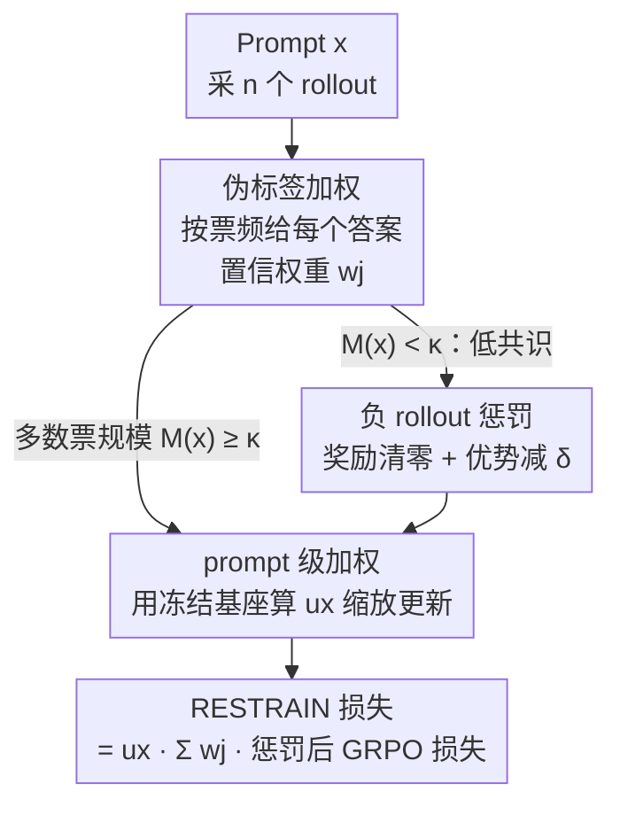

# RESTRAIN: From Spurious Votes to Signals — Self-Training RL with Self-Penalization

**会议**: ICLR 2026  
**OpenReview**: [https://openreview.net/forum?id=87ySF7viys](https://openreview.net/forum?id=87ySF7viys)  
**代码**: 待确认  
**领域**: LLM推理 / 无监督强化学习  
**关键词**: 自驱动RL, 自惩罚, 伪标签加权, GRPO, 无标签推理

## 一句话总结
RESTRAIN 把"没有金标签"这件坏事变成训练信号：在 GRPO 上叠加伪标签加权、负 rollout 惩罚、prompt 级加权三层自惩罚机制，让模型不再盲信多数投票，从而在无标签数据上把 Qwen3-4B 的平均 Pass@1 推到 51.0%，几乎追平用金标签训练的 GRPO 上界（51.4%）。

## 研究背景与动机
**领域现状**：用人工标注 + 可验证奖励的强化学习（RLVR）已经显著强化了大模型的长链式推理。但这条路依赖源源不断的高质量标注数据，成本高且在更难的任务上后劲不足。一个自然的下一步是**经验驱动学习**——让模型在无标注数据上自我改进。

**现有痛点**：无标签设定下，怎么让模型生成自己的学习信号是核心难题。一类是自奖励（模型给自己的 rollout 打分），但缺乏证据表明它能稳定提升复杂推理。另一类是利用模型自身一致性，最典型的是**多数投票**（TTRL 把多数答案当唯一伪标签去强化）。但多数投票有严重的可靠性问题：当自一致性低时，多数答案本身可能系统性错误；而在难题上，正确解往往藏在**少数派 rollout** 里，却因为被过度自信的"伪多数"压制而被忽略。在这种被扭曲的奖励信号上训练，会随任务难度增大而走向**训练崩溃**。

**核心矛盾**：作者用 Figure 2 实测了这个矛盾——在 DAPO-MATH 上，Pass@64（只要 64 个采样里有一个对就算对）和多数投票正确率之间存在巨大鸿沟，且当多数票规模（majority size）很小时，多数答案正确率急剧下降。也就是说，把全部概率质量塌缩到单一多数答案上，既丢掉了藏在少数派里的正确解，又在低共识区把噪声当成了监督。

**本文目标 / 切入角度**：与其押注"多数答案正确"，不如利用模型**整个答案分布**里的信号——既保留有希望的推理链，又主动惩罚过度自信的 rollout 和低一致性的样本。

**核心 idea**：用"自惩罚"代替"自奖励"——把缺少标签转化为 rollout 级和 prompt 级的负向学习信号，无缝嵌进 GRPO，就能在不用任何金标签的情况下持续自我提升。

## 方法详解

### 整体框架
RESTRAIN 建立在 GRPO 之上。标准 GRPO 对每个 prompt $x$ 采 $n$ 个 rollout，用金标签 $y$ 算奖励 $r_i$ 与组内基线归一化的优势 $A_i$，再用 PPO 式裁剪目标更新策略。RESTRAIN 的改动是：**在没有金标签时，用模型自己的预测分布替代金标签，并对其施加三层自惩罚**，让"伪标签"既被利用又不被盲信。

整条流程是：给定 prompt $x$，采 $n$ 个 rollout → 收集所有去重答案 $\{a_j\}$ 及票数 $c_j$ → ① 把每个 $a_j$ 当成一个伪标签，按频率给一个**置信权重 $w_j$** 加权求和损失（而不是只取多数票）；② 对多数票规模过低（$M(x)<\kappa$）的 prompt，判定为不可信，**清零奖励并给所有 rollout 一个负优势偏移 $\delta$**；③ 再用一个由冻结基座模型离线算出的 **prompt 权重 $u_x$** 缩放整条样本的更新幅度。三者相乘得到最终的 RESTRAIN 损失。

### 关键设计

**1. 伪标签加权：用整个答案分布代替单一多数票**

这一层直接针对"多数投票丢掉少数派正确解"的痛点。给定 prompt $x$，采 $n$ 个 rollout，收集所有去重答案 $\{a_j\}_{j=1}^m$ 及其票数 $c_j$，**把每一个 $a_j$ 都当成一个候选伪标签**，最终损失是对所有候选的加权 GRPO 损失之和：

$$L_{\text{GRPO}}(x;\theta)=\sum_{j=1}^{m} w_j \cdot L_{\text{GRPO}}(x, a_j; \theta)$$

权重 $w_j$ 由频率 $f_j=c_j/n$ 经一个单调整形函数 $g$ 归一化得到：$w_j = g(f_j) / \sum_\ell g(f_\ell)$，其中 $g$ 取一个以 $k\in[0,1]$ 为中心、偏置 $\sigma>0$ 的高斯函数。这等价于在答案频率上做一次"软选择"：高频答案拿到成比例更大的权重，低频的虚假答案被压低，但又不会像多数投票那样把全部质量塌缩到一个答案。$\sigma$ 控制分布的"偏度"——$\sigma$ 太小近似 step 函数、退化回多数投票；$\sigma$ 太大又会给噪声低频答案太多影响。消融显示这一层是**防止训练崩溃最关键**的组件，去掉它平均掉到 37.5%（崩溃）。

**2. 负 rollout 惩罚：低共识 prompt 一律给负信号，逼模型另辟蹊径**

伪标签加权依赖 Pass@n 的逻辑——只要有一个 rollout 正确就能提供有效正信号。但当多数票规模极低时，模型很可能一个正确 rollout 都没有，此时任何答案都不可信。这一层就处理这种情况：定义多数计数 $M(x)=\max_j c_j$，当 $M(x)<\kappa$（自一致性低于阈值）时，把所有候选答案的奖励清零，并对所有 rollout 的优势施加统一的负偏移 $\delta$：

$$\tilde{r}_{i,j}=\begin{cases} r_{i,j} & M(x)\ge\kappa\\ 0 & M(x)<\kappa\end{cases}\qquad \tilde{A}_{i,j}=\begin{cases} A_{i,j} & M(x)\ge\kappa\\ A_{i,j}-\delta & M(x)<\kappa\end{cases}$$

在 PPO/GRPO 目标里，这意味着 $M(x)<\kappa$ 的 prompt 只贡献负更新——惩罚所有低自一致性的 rollout，从而**阻止模型强化虚假多数票、引导它探索别的推理路径**。去掉这一层平均从 51.0% 掉到 42.1%。

**3. prompt 级加权：用冻结基座离线估每条样本的可靠度**

前两层都在 rollout 层面操作，这一层补一个 prompt 层面的惩罚。不同 prompt 上模型的确定性差异很大：有的高度一致、有的极度不确定。RESTRAIN 据此按"模型对该 prompt 的置信度"缩放整条样本的更新——低置信 prompt 更新小、高置信 prompt 更新大。关键细节是：权重用**冻结的基座模型**离线算一次、之后训练全程固定，避免训练中置信度被自己抬高造成的虚假反馈回路。具体地，对每个 prompt 用参考策略 $\pi_{\text{ref}}$ 采 $n$ 个 rollout、得到多数计数 $c_{\text{ref}}$，再用同一个单调函数 $g$ 算权重：$u_x = g(c_{\text{ref}}/n)$。论文（附录 E）指出离线预计算的权重优于训练中动态更新的在线变体。去掉这一层主要伤害科学类基准（MMLU STEM 从 80.9 掉到 63.8）。

### 损失函数 / 训练策略
把三层信号合在一起就是最终损失：prompt 权重 $u_x$ 在最外层缩放，内部对每个伪标签 $a_j$ 用置信权重 $w_j$ 加权，单个候选的 GRPO 损失里把优势换成惩罚后的 $\tilde{A}_{i,j}$：

$$L_{\text{RESTRAIN}}(x;\theta)=u_x\sum_{j=1}^{m} w_j\,\tilde{L}_{\text{GRPO}}(x,a_j;\theta)$$

$$\tilde{L}_{\text{GRPO}}(x,a_j;\theta)=-\frac{1}{n}\sum_{i=1}^{n}\min\!\big(\rho_i(\theta)\tilde{A}_{i,j},\ \text{clip}(\rho_i(\theta),1-\epsilon,1+\epsilon)\tilde{A}_{i,j}\big)-\beta D_{\text{KL}}[\pi_\theta\Vert\pi_{\text{ref}}]$$

整个机制无缝嵌进 GRPO，不需要额外的奖励模型或外部监督，可直接在无标签数据上持续自训练。

## 实验关键数据

### 主实验
在 DAPO-14k-Math 上训练、6 个基准（4 数学 + 2 科学）的平均 Pass@1（16 seed 平均）：

| 设定 | 模型 | aime25 | mmlu | gpqa-d | Avg.↑ |
|------|------|--------|------|--------|-------|
| 用金标签（上界） | Qwen3-4B GRPO | 20.8 | 73.7 | 38.7 | 51.4 |
| 无标签 | TTRL | 8.3 | 59.4 | 33.6 | 42.2 |
| 无标签 | SRT (offline majority) | 12.0 | 59.4 | 34.5 | 43.1 |
| 无标签 | **RESTRAIN** | **17.9** | **80.9** | **40.2** | **51.0** |

RESTRAIN 在无标签下做到 51.0%，比 TTRL 高 8.8 pp，距金标签 GRPO 上界只差 0.4 pp，并在 MMLU STEM、GPQA-Diamond 上**反超**金标签设定。Octothinker Hybrid-8B 上同样全面超过 TTRL/SRT，AIME25 相对提升达 +140.7%。合成 S1k 数据上也保持最强无标签方法、平均超次优基线至少 7.7 pp。

### 消融实验
Qwen3-4B 上逐组件移除（平均 Pass@1）：

| 配置 | aime25 | mmlu | gpqa-d | 说明 |
|------|--------|------|--------|------|
| RESTRAIN（完整） | 17.9 | 80.9 | 40.2 | 51.0 |
| (-) 伪标签加权 | 6.0 | 59.3 | 33.7 | 37.5，训练快速崩溃，掉点最多 |
| (-) 负 rollout 惩罚 | 9.6 | 56.4 | 33.0 | 42.1 |
| (-) prompt 级加权 | 18.1 | 63.8 | 37.0 | 主要伤科学类基准 |

### 关键发现
- **伪标签加权是防崩溃的命门**：去掉它平均掉 13.5 pp 且训练失稳；进一步实验显示"考虑所有候选"还不够——若给所有候选**均匀**权重反而崩得更早，说明低频伪标签多为噪声、必须靠频率软选择压低它们。
- **训练稳定性**：在 MATH500 上，TTRL 约 50 步后迅速崩溃，RESTRAIN 没有突然崩溃、能保持稳定，因为自惩罚抑制了过度自信更新。
- **超参敏感性**：$\sigma$ 太小（如 0.1）因给噪声低频答案太多影响而表现差；prompt 权重离线算优于在线动态更新。

## 亮点与洞察
- **把"无标签"从负担翻译成信号**：核心"啊哈"在于不再追求自奖励的"正信号"，而是系统地构造**负信号**——惩罚过度自信和低共识，这比盲信多数票稳健得多。
- **三层信号正交且各有分工**：伪标签加权管"别塌缩到单一答案"、负 rollout 惩罚管"低共识时别瞎学"、prompt 加权管"按样本可靠度调更新"，消融显示三者掉点位置不同（崩溃 / 整体 / 科学类），说明互补。
- **可迁移 trick**：用冻结基座离线算 prompt 可靠度权重、避免训练中自我强化的反馈回路，这一思路可迁移到任何自训练/自蒸馏场景防止置信度膨胀。

## 局限与展望
- 方法依赖一组阈值/形状超参（$\kappa$、$\delta$、$\sigma$、$g$ 的中心 $k$），跨模型跨任务的稳健取值需要调，论文主要在数学+科学推理上验证。
- "金标签上界"的对照是同一套 GRPO 配方，超越上界的部分（如 MMLU STEM）可能与具体基准的标注/分布特性有关，横向跨基准的提升幅度不宜直接比大小。
- 自惩罚本质是在模型当前分布内做软选择，若基座模型在某领域几乎从不产出正确 rollout（Pass@n 极低），负惩罚也难凭空造出正确推理，适用前提是基座有一定潜在能力。

## 相关工作与启发
- **vs TTRL**：TTRL 把多数票当唯一伪标签强化，重度依赖"多数即正确"，易被虚假多数带崩；RESTRAIN 用整个答案分布加权 + 低共识负惩罚，稳定性与上限都更高。
- **vs SRT**：SRT 的两个启发式（离线多数 / 只留高票率的"简单 prompt"）要么仍在奖励自一致性而非正确性，要么直接丢掉低共识 prompt——而那些 prompt 常藏着有价值但被低估的推理路径；RESTRAIN 选择**保留并惩罚**而非丢弃。
- **vs ETTRL**：基于熵的测试时 RL，RESTRAIN 在测试时 RL 实验里把它作为对照并取得更优，尤其在 AMC、MATH500 上。

## 评分
- 新颖性: ⭐⭐⭐⭐⭐ 把自奖励范式翻转成"自惩罚"，三层信号设计干净且动机来自实测的多数票失效现象。
- 实验充分度: ⭐⭐⭐⭐ 两基座、两数据、六基准 + 逐组件消融 + 训练稳定性曲线 + 超参分析，较扎实。
- 写作质量: ⭐⭐⭐⭐ 公式清晰、Figure 2 的动机实证有说服力。
- 价值: ⭐⭐⭐⭐⭐ 无标签下逼近金标签 GRPO，给"超越监督上限"的推理自训练提供了可扩展路径。

<!-- RELATED:START -->

## 相关论文

- [\[ICLR 2026\] Co-rewarding: Stable Self-supervised RL for Eliciting Reasoning in Large Language Models](co-rewarding_stable_self-supervised_rl_for_eliciting_reasoning_in_large_language.md)
- [\[ICLR 2026\] SkillFactory: Self-Distillation for Learning Cognitive Behaviors](skillfactory_self-distillation_for_learning_cognitive_behaviors.md)
- [\[ICLR 2026\] HiPO: Self-Hint Policy Optimization for RLVR](hipo_self-hint_policy_optimization_for_rlvr.md)
- [\[ICLR 2026\] Toward Effective Tool-Integrated Reasoning via Self-Evolved Preference Learning](toward_effective_tool-integrated_reasoning_via_self-evolved_preference_learning.md)
- [\[ICML 2026\] The Role of Feedback Alignment in Self-Distillation](../../ICML2026/llm_reasoning/the_role_of_feedback_alignment_in_self-distillation.md)

<!-- RELATED:END -->
