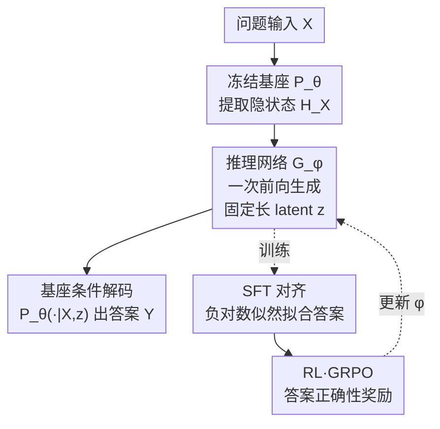

# Rethinking LLM Reasoning: From Explicit Trajectories to Latent Representations

**会议**: ICLR 2026  
**OpenReview**: [https://openreview.net/forum?id=CbK7lYbmv8](https://openreview.net/forum?id=CbK7lYbmv8)  
**代码**: https://github.com/MobiusDai/LRT  
**领域**: LLM推理  
**关键词**: 高效推理, 隐式推理, latent representation, 过度思考, 推理网络

## 一句话总结
针对慢思考推理模型动辄上千 token 的"过度思考"问题，本文先实证发现推理轨迹高度冗余（随机删 50% token 准确率仅掉 2 个点），进而提出 Latent Reasoning Tuning（LRT）：用一个轻量推理网络 $G_\phi$ 通过**一次前向**把输入映射成固定长度的隐式 latent 推理 token，替代逐 token 自回归生成的显式推理链，在数学与跨域基准上稳定超过现有高效推理方法，并胜过 Qwen3 的非思考模式。

## 研究背景与动机
**领域现状**：OpenAI o1、DeepSeek-R1、Qwen-QwQ 等慢思考模型，靠在给出答案前生成一长串"step-by-step"的推理轨迹（reasoning trajectory）来提升复杂任务表现，这套能力通过 SFT + 强化学习（如 DeepSeek-R1 的 GRPO + 规则奖励）习得。

**现有痛点**：推理轨迹的长度往往远超最终答案（论文记号里 $k \gg m$），即便是简单题，模型也会为了回溯和自检生成冗长的链条，造成巨大的推理开销和延迟——即所谓 **overthinking（过度思考）**。

**核心矛盾**：现有缓解方案都没碰到根子上。一类是后训练**压缩轨迹**（ShorterBetter 选最短正确样本作奖励、LC-R1 加入长度与压缩奖励），但它们本质仍是"慢思考"——模型还是要走一遍被缩短的显式轨迹，而且长度奖励可能反而限制真正难题的求解；另一类是**直接绕过推理**（NoThinking 预填一个假的思考块、Qwen3 用特殊 token 强制直接出答案），靠刚性 prefilling 又带来脆弱性、可能损伤性能。两类方法的共同问题是：要么仍在解码密集的显式 token 上打转，要么用所有输入都一样的固定表示，没法针对性优化。

**切入角度**：作者先做了一个关键的实证分析——如果给推理模型喂**残缺的轨迹**会怎样？结果发现模型对噪声/缺失出奇地鲁棒，说明完整逐 token 轨迹根本不是正确推理的必要条件。

**核心 idea**：既然显式轨迹冗余且非必需，那就不要逐 token 生成它，而是**用一个可学习的推理网络把"推理逻辑"直接算成一段紧凑的 latent 表示**，让基座 LLM 在这段 latent 条件下直接产出答案，用一次前向取代昂贵的自回归。

## 方法详解

### 整体框架
LRT 的目标是：在**不改动基座推理 LLM 任何参数**的前提下，把"显式逐 token 推理"替换为"隐式 latent 推理"。整条 pipeline 是：输入问题 $X$ 先过冻结的基座模型 $P_\theta$ 拿到最终隐状态 $H_X$，再喂给一个轻量**推理网络 $G_\phi$**，由它一次前向输出固定长度（如 256 个）的 **latent 推理 token** $z = G_\phi(H_X)$；这段 $z$ 作为显式轨迹 $R$ 的紧凑替身，和输入拼在一起，让基座模型在 $P_\theta(\cdot \mid [X, z])$ 上自回归解码出最终答案 $Y$。整个推理过程里，原本需要逐 token 采样的几千个推理 token 被一次前向算出的 256 个 latent token 取代。

推理网络靠**两阶段训练**学会生成有效的 latent：第一阶段 SFT 让 $G_\phi$ 的行为对齐基座模型的显式推理结果，第二阶段 RL（GRPO）用答案正确性的可验证奖励进一步提升其解题能力。因为基座参数全程冻结、设计模块化非侵入，所以同一个模型可以在 latent 推理与显式推理两种模式间无缝切换，天然提供了一种"混合推理"方案。

### 关键设计

**1. 片段轨迹冗余分析：证明完整轨迹不是必需的**

这是整套方法的实证地基，针对的痛点是"大家默认推理必须走完整条显式链"。作者用 DeepSeek-R1-Distill-Qwen-7B 在 MATH-500 上做了一个受控实验：给定问题 $X$ 和它的完整轨迹 $R$，按两种粒度构造**残缺轨迹**——token 级 $R_t(p)$（以概率 $p$ 独立删每个 token）和 step 级 $R_s(p)$（以概率 $p$ 删整句/整步），再看模型在残缺轨迹条件下 $\hat{Y}\sim P_\theta(\cdot\mid[X,R_t(p)])$ 的答案准确率。结果很反直觉：完整轨迹平均消耗 3529 token、准确率 92.8%，而**随机删掉 30% token 准确率掉不到 2 个点，删到 50% 仍有 90.6%**。由此得出两条结论——推理轨迹存在大量冗余，且模型对噪声/残缺输入有很强的信息过滤能力。正是这个发现，把"必须逐 token 生成完整轨迹"这一隐含假设打掉，为后面用 latent 替代显式轨迹提供了依据。

**2. 推理网络 $G_\phi$：用一次前向把推理压成固定长 latent**

针对"自回归生成显式轨迹太慢"的痛点。在贪心解码下，轨迹生成其实是确定性的，可形式化为函数 $R=h(X,\theta)$，于是答案分布写成 $P_\theta(Y\mid[X,h(X,\theta)])$。既然分析表明严格的自回归约束并非必要，作者就引入一个专门的推理网络 $G_\phi: X \to Z$，**绕过显式生成**，直接把输入映射成紧凑 latent：$z = G_\phi(X)$。具体实现上，$G_\phi$ 以 Qwen3-Embedding-0.6B 为骨干，在一个 256 个**可学习 embedding** 的词表上工作，吃基座模型抽出的输入隐状态 $H_X$，输出固定长度的 latent 推理 token。和"从零训练 latent reasoner"或 Coconut 式反复精炼隐状态的工作不同，LRT 是**适配一个已有的显式推理 LLM**，让它学会利用 latent 表示来计算、而无需在每一步把隐状态解码回文本；也和 NoThinking/Qwen3 的固定 prefill 不同——这里的 latent 是由网络算出、可被优化的，而非对所有输入都一样的死表示。

**3. SFT 阶段：让 latent 复现基座的显式推理答案**

第一阶段的目标是让 $G_\phi$ 产出的 latent 轨迹，能驱动基座模型复现它原本走完整显式推理后给出的答案，即让 $P_\theta(\cdot\mid[X,G_\phi(X)])$ 逼近目标分布 $P_\theta(\cdot\mid[X,h(X,\theta)])$。最直接的对齐方式是知识蒸馏、最小化二者 KL 散度，但那要生成目标分布的 logits、计算代价过高。作者改用更省的 SFT 路线：训练集 $D$ 是从推理 LLM 输出里抽的三元组 $(X_i,R_i,Y_i)$，但训练目标**只用** $(X_i,Y_i)$——对每个 $X_i$ 取其最终隐状态 $H_{X_i}$ 作为上下文嵌入，过 $G_\phi$ 得 latent，再以负对数似然优化 $\phi$：

$$\mathcal{L}(\phi) = -\log f_\theta\big(Y \mid [X, G_\phi(H_X)]\big).$$

这一步本质是"模仿"——让 latent 学会引出与显式推理一致的答案，但它的上限受训练数据质量限制，只学到模仿、学不到超越。

**4. RL 阶段：用 GRPO 奖励正确答案，突破模仿上限**

为了突破 SFT 的模仿天花板、提升模型内在解题能力，第二阶段用强化学习以答案正确性作可验证奖励来精炼 $G_\phi$。流程是 GRPO 式的：对每个输入算出 latent $z$ 后，从 $P_\theta(\cdot\mid[X,z])$ 采样 $K$ 个候选答案，对每个候选用规则计算奖励 $r_k$，做组内归一化得到优势 $A_k=(r_k-\bar r)/\sigma_r$，再用裁剪的策略损失更新 $\phi$：

$$\mathcal{L}_{\mathrm{GRPO}} = -\frac{1}{K}\sum_{k=1}^{K}\min\Big(\rho_k A_k,\ \mathrm{clip}(\rho_k,1-\epsilon,1+\epsilon)A_k\Big).$$

与 SFT 的"模仿"不同，RL 鼓励推理网络在 latent 空间里**探索**更有效的推理轨迹，去找那些更稳定产出正确答案的表示。消融显示这一阶段贡献巨大：SFT+RL 相比纯 SFT 在 GSM8K 上提升达 13.37 个点。

### 损失函数 / 训练策略
两阶段串行：① SFT 用 OpenR1-Math-220k，目标 $-\log f_\theta(Y\mid[X,G_\phi(H_X)])$；② RL 用 DeepScaleR-Preview 数据集，GRPO 裁剪策略损失 + 规则奖励。全程冻结基座 $\theta$，只更新推理网络 $\phi$。latent token 数默认 256（test-time scaling 的最优点）。

## 实验关键数据

### 主实验
模型：DeepSeek-R1-Distill-Qwen-1.5B 与 Qwen3 系列。基准覆盖域内（AMC / MATH-500 / GSM8K）与跨域（LSAT / GPQA）。下表为 512-token 预算下的对比（准确率 %）：

| 方法 | AMC | MATH-500 | GSM8K | LSAT | GPQA | 平均 |
|------|-----|----------|-------|------|------|------|
| Baseline | 33.25 | 43.15 | 70.00 | 19.02 | 24.24 | 37.93 |
| NoThinking | 37.75 | 58.35 | 73.24 | 18.15 | 23.74 | 42.25 |
| ShorterBetter | 33.87 | 55.11 | 60.78 | 19.05 | 26.23 | 39.01 |
| LC-R1 | 35.75 | 48.00 | 74.26 | 18.59 | 24.24 | 40.17 |
| **Ours (LRT)** | **38.00** | **60.65** | **77.16** | **19.57** | **29.17** | **44.91** |

在 512 预算下，LRT 平均比 NoThinking 高 2.16、比 ShorterBetter 高 8.68、比 LC-R1 高 5.93 个点；预算放宽到 1024 时仍保持平均领先。与 Qwen3 系列对比（把 thinking 模式转成 latent 推理 vs 原生 non-thinking）：

| 模型 | 指标 | base 平均 | ours 平均 |
|------|------|-----------|-----------|
| Qwen3-1.7B | pass@1 | 46.93 | 48.42 |
| Qwen3-1.7B | pass@4 | 62.60 | 66.81 |
| Qwen3-4B | pass@1 | 54.07 | 55.04 |
| Qwen3-4B | pass@4 | 65.78 | 71.60 |

pass@4 的提升尤为明显，说明 latent 推理能产生更**多样**的解题路径。

### 消融实验

| 配置 | 平均准确率 | 说明 |
|------|-----------|------|
| latent token = 64 | 42.53 | token 太少，信息不足 |
| latent token = 128 | 45.04 | — |
| **latent token = 256** | **48.42** | 最优点（test-time scaling） |
| latent token = 512 | 46.92 | 反降，需更大训练规模才能用满 |
| SFT only | 41.29 | 仅模仿，上限受数据限制 |
| **SFT + RL** | **48.42** | 两阶段，显著超越 |

### 关键发现
- **轨迹冗余是方法成立的前提**：删 50% token 仅掉 2 个点，直接验证了"完整显式轨迹非必需"，这是 LRT 敢用 latent 替代的根本依据。
- **latent token 数符合 test-time scaling 但有饱和点**：64→256 单调涨，512 反降——更多 latent 容量需要更大的训练规模才喂得满。
- **RL 阶段是涨点主力**：SFT only 仅 41.29，加 RL 后 48.42，GSM8K 单项涨 13.37 个点，说明纯模仿不够、必须用正确性奖励去探索。

## 亮点与洞察
- **"先证明再替代"的论证链很扎实**：不是上来就说 latent 好，而是先用残缺轨迹实验把"完整轨迹必需"这个隐含假设证伪，再顺理成章引入 latent 网络，动机非常具体。
- **非侵入、零改基座参数**：只训练一个外挂推理网络，基座冻结，因此可以在 latent / 显式两种模式自由切换——这等于免费给任意显式推理 LLM 加了一个"混合推理"开关。
- **把"推理"显式建模成输入的函数**：贪心解码下 $R=h(X,\theta)$ 的形式化，给"用一次前向网络逼近整条轨迹"提供了干净的理论说法，这个视角可迁移到其他"自回归过程能否被单次映射替代"的问题。

## 局限与展望
- latent token 数到 512 反而掉点，作者归因于训练规模不足——说明该方法对训练数据/算力规模较敏感，"latent scaling"还没真正打开。
- 实验主要在 1.5B–4B 量级模型和数学/逻辑/科学推理基准上，更大模型、更开放式任务（如长程 agent、代码）上的有效性未验证。
- latent 推理牺牲了显式轨迹的**可解释性**：模型不再输出可读的中间步骤，调试和可信度核验会更难，作者也提到原显式方法至少能给出 rationale 摘要。
- 改进思路：让 latent token 数随题目难度自适应（而非固定 256），或在 latent 与显式间按难度动态路由，兼顾效率与难题表现。

## 相关工作与启发
- **vs ShorterBetter / LC-R1（RL 压缩轨迹）**：它们用长度/压缩奖励缩短显式链，但模型仍走显式 token、仍是慢思考；LRT 直接把轨迹换成一次前向算出的 latent，从根上去掉自回归开销。
- **vs NoThinking / Qwen3 非思考（固定 prefill 绕过推理）**：它们用刚性预填或控制 token 跳过推理，对所有输入用同一死表示、易脆；LRT 的 latent 由网络算出且可被 RL 优化，针对性更强、性能更稳。
- **vs Coconut / 循环深度等 latent reasoning**：那些工作多是从零训练 latent reasoner 或反复精炼隐状态；LRT 的差异点在于**适配已有的显式推理 LLM**，让它复用 latent 计算而无需每步解码回文本，工程上更轻、可即插即用。

## 评分
- 新颖性: ⭐⭐⭐⭐ 以"显式轨迹是输入函数"为切口、用外挂网络一次前向替代自回归推理，角度新颖且论证链完整。
- 实验充分度: ⭐⭐⭐⭐ 域内+跨域 5 基准、含 token 数与训练策略消融，但模型规模偏小、任务集中在推理类。
- 写作质量: ⭐⭐⭐⭐ "先证伪假设再提方法"的叙事清晰，公式与算法表完整。
- 价值: ⭐⭐⭐⭐ 非侵入、可切换模式，对高效推理与混合推理落地有直接参考价值。

<!-- RELATED:START -->

## 相关论文

- [\[ICLR 2026\] The Path of Least Resistance: Guiding LLM Reasoning Trajectories for Efficient Consistency](the_path_of_least_resistance_guiding_llm_reasoning_trajectories_for_efficient_co.md)
- [\[ICLR 2026\] The Path of Least Resistance: Guiding LLM Reasoning Trajectories with Prefix Consensus](the_path_of_least_resistance_guiding_llm_reasoning_trajectories_with_prefix_cons.md)
- [\[ICLR 2026\] ∇-Reasoner: LLM Reasoning via Test-Time Gradient Descent in Latent Space](nabla-reasoner_llm_reasoning_via_test-time_gradient_descent_in_latent_space.md)
- [\[ICLR 2026\] Off-Trajectory Reasoning: Can LLMs Collaborate on Reasoning Trajectories?](off-trajectory_reasoning_can_llms_collaborate_on_reasoning_trajectories.md)
- [\[ICML 2026\] Prioritize the Process, Not Just the Outcome: Rewarding Latent Thought Trajectories Improves Reasoning in Looped Language Models](../../ICML2026/llm_reasoning/prioritize_the_process_not_just_the_outcome_rewarding_latent_thought_trajectorie.md)

<!-- RELATED:END -->
