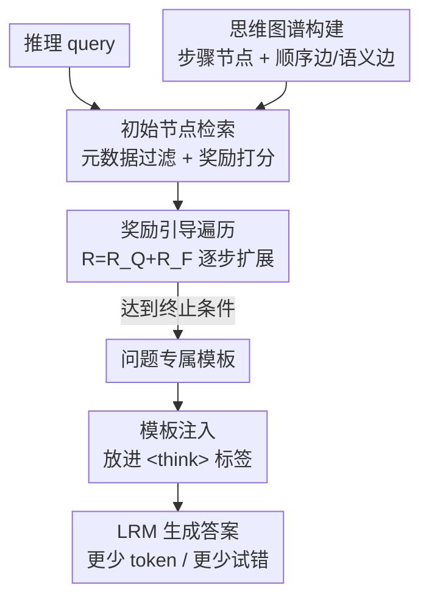

# Retrieval-of-Thought: Efficient Reasoning via Reusing Thoughts

**会议**: ICLR 2026  
**OpenReview**: [https://openreview.net/forum?id=Wy7NyScKlD](https://openreview.net/forum?id=Wy7NyScKlD)  
**代码**: https://github.com/ahme0599/Retrieval-of-Thought  
**领域**: LLM推理  
**关键词**: 高效推理、思维复用、思维图谱、检索增强、推理模板

## 一句话总结
把过往推理过程拆成可复用的「思维步骤」存进一张思维图谱，推理时检索并用奖励引导遍历动态拼出一份问题专属模板塞进 `<think>` 标签引导生成，在几乎不掉精度的前提下把输出 token 最多砍 40%、延迟砍 82%、成本砍 59%。

## 研究背景与动机
**领域现状**：大推理模型（LRM，如 o1、DeepSeek-R1、Qwen-QwQ）靠生成又长又细的推理链来提升复杂任务的准确率。主流的「test-time scaling」做法——Best-of-N、beam search、MCTS、GRPO——本质都是让模型多生成 token 来模拟深思熟虑。

**现有痛点**：更长的输出直接带来两个代价。其一，token 必须串行解码，输出越长延迟越高；其二，API 厂商对输出 token 的定价通常是输入 token 的 2–5 倍，规模化时成本高得离谱。也就是说，「想得更准」和「想得更省」之间存在尖锐 trade-off。

**核心矛盾**：已有的检索式推理方法（Buffer of Thought、SuperCorrect、RAT）确实想用「复用过往思维模板」来省 token，但它们用的是**生成前就固定下来的静态模板**——一个模板对应一类问题，无法在推理时即时拆解、重组出新的推理路径。而人类解题恰恰相反：不只是回忆整段经验，更会「connecting the dots」，把过往解法的碎片重新组合成新配置。静态模板缺的正是这种**动态拼装**能力。

**本文目标**：给 LRM 配一份**细粒度的思维步骤记忆库**，并让它在推理时**按当前问题动态合成**模板，而不是套用固定脚手架。

**切入角度**：作者用三个观察支撑这条路（图 2 实测）。**O1**：同领域的问题（如 AIME/AMC 数学题）解题步骤高度重复，许多代数变换、化简模式反复出现——可复用的空间很大。**O2**：从向量库检索比让 LM 生成快得多，实测检索 0.02s 对生成 0.343s，约 17× 差距。**O3**：给模型喂一条相似题的正确推理路径，它能用更少 token 解出新题。

**核心 idea**：用「检索+重组已有思维步骤拼成动态模板」代替「让模型从头探索」，把冗余的试错路径切换转化为一次廉价的图检索。

## 方法详解

### 整体框架
RoT 的目标是：给定一道推理 query，不让模型从零开始反复试错，而是先从一张预先建好的思维图谱里检索出相关的推理步骤，用奖励引导遍历把它们拼成一份**问题专属的推理模板**，再把模板塞进 `<think>` 标签作为「锚」引导模型生成，从而砍掉冗余的路径切换、减少输出 token。

整条管线分**离线建图**和**在线三步**两部分。离线阶段把 3.34k 个推理模板拆成步骤节点、连成思维图谱（一次性构建，全局共享）。在线阶段对每个 query 执行：① 检索初始节点 → ② 奖励引导遍历扩展模板 → ③ 模板注入。三步对应的就是下面四个关键设计（建图、初始节点检索、遍历、注入）。

### 关键设计

**1. 思维图谱：把过往推理拆成可复用步骤节点**

针对「静态模板无法重组」的痛点，RoT 不存整段模板，而是把每段解题轨迹**拆到单步粒度**存成图节点，让步骤可以跨模板自由拼接。形式上图谱是一张有向、带权、不连通的多重图 $G=(V, E_{\text{Sequential}} \cup E_{\text{Semantic}}, w)$：每个节点 $(t,i)$ 是模板 $t$ 的第 $i$ 步推理（含模板类型、知识标签等元数据 + 推理文本）。两类边各司其职——**顺序边**连接同一模板内相邻的步骤 $(t,i)\to(t,i{+}1)$，保留原本的逻辑流；**语义边**连接跨模板的相似步骤，当两节点嵌入的归一化相似度 $g_{\text{sim}}(u_{t,i}, u_{t',j}) \geq \tau$（$\tau=0.85$）时双向相连，支撑跨模板的知识迁移。相似度用 ℓ2 归一化后的余弦内积，再线性缩放到 $[0,1]$：$g_{\text{sim}}(a,b)=\frac{\text{sim}(a,b)+1}{2}$。边权上顺序边恒为 1，语义边取 $g_{\text{sim}}$。图谱用 ReasonFlux-v2 的 3.34k 模板构建，嵌入由 jina-embeddings-v2-small-en 生成并全部预计算缓存。这样一来，模型不再被锁死在某个固定脚手架上，而是能顺着语义边「连点成线」拼出原本不存在的新路径。

**2. 初始节点检索：先粗筛元数据，再用奖励选入口**

拼模板要从一个合适的「入口节点」起步。RoT 用多级过滤 + 打分来选它。**过滤**先靠元数据收缩搜索空间：只保留模板类型与问题类别匹配（如代数/几何）、且知识标签命中领域概念（几何、微积分、数论等）、并且有预计算嵌入的候选节点。**打分**再用一个兼顾语义相关与结构合法的奖励选出最优入口：

$$R_{\text{Initial}} = \alpha \cdot R_Q + (1-\alpha) \cdot R_S$$

其中 $R_Q$ 是 query 与节点嵌入的余弦相似度，$R_S$ 是结构指示奖励——节点是模板的第 0 步（$i=0$）时为 1，否则为 0。作者取 $\alpha=0.8$，意思是以语义相关为主、同时偏好真正合法的「步骤 0」作入口。这一步的价值在于：检索本身极快（O2），又能保证模板从一个语义对题、结构上站得住的起点展开，避免后续遍历从一个不合理的中间步起步。

**3. 奖励引导遍历：边走边拼，按奖励决定何时停**

选好入口后，模板通过迭代图遍历逐步扩展。每一步评估当前节点的邻居，用一个平衡语义对齐与顺序流的奖励选下一个节点：

$$R = R_Q + R_F$$

$R_Q$ 仍是候选节点与 query 的语义相关度，$R_F$ 是结构流奖励——若候选与当前节点构成顺序边 $((t,i),(t,i{+}1))\in E_{\text{Sequential}}$ 则为 1，否则为 0。两项等权，既倾向接上语义相关的步骤，又奖励沿原模板自然流动。遍历的**终止**也由奖励控制：当 $\max(R) < \tau$（最优候选都不够相关）、或模板长度 $l_{\text{Template}} \geq l_{\max}$（$l_{\max}=8$）、或已无有效候选（$N_{\text{Candidates}}=0$）时停止。这套终止准则保证模板不会因为硬凑而拉得过长或塞进不相关步骤，在「够用」和「精简」之间自动收敛。整个检索+遍历流程见 Algorithm 1，实测每 query 仅耗 0.038s，相对解码可忽略。

**4. `<think>` 标签注入：让模型真的听模板的话**

模板拼好后，难点是如何让模型在内部深思时**真的遵循**它。已有研究指出推理模型常常不可靠地执行显式指令，所以 RoT 不把模板当普通 prompt 提示，而是借鉴 Thinking Intervention，把模板直接放进 `<think>` 和 `</think>` 标签内部——也就是塞进模型「思考区」而非「指令区」。关键是**不微调模型**来强制遵循，因为针对模板遵循的微调可能引发对核心推理能力的灾难性遗忘。这个朴素注入对应论文里的 RoT+TI 变体，实验证明它比把模板放在普通 prompt 位置（裸 RoT）更省 token、更稳，是把检索收益真正落地的关键一环。

## 实验关键数据

### 主实验
评测在四个数学推理基准（AIME 2023/2024/2025、AMC 2023）上进行，主力模型为 Qwen3 全家桶（0.6B–14B），对比 CoT、CoT-SC、RAG（静态模板+CoT）、BoT。核心结论：RoT+TI 稳定落在「高准确率 + 少 token」的高效推理区，精度与 CoT 基本持平而 token 大幅下降。

| 模型 | 方法 | 准确率 | 输出 token | 说明 |
|------|------|--------|-----------|------|
| Qwen3-1.7B | CoT | ~46% | ~11.0k | 基线 |
| Qwen3-1.7B | RoT+TI | ~44% | ~8.0k | 精度近持平，省 ~3k token |
| Qwen3-4B | CoT | ~74% | ~9.9k | 基线 |
| Qwen3-4B | RoT+TI | ~72% | ~9.1k | 精度近持平，省 ~800 token |
| Qwen3-8B | RAG | ~80% | ~10.1k | 静态模板基线 |
| Qwen3-8B | RoT+TI | ~83% | ~9.6k | 精度更高且更省 |

成本与延迟（相对 CoT，按阿里云定价）：RoT+TI 在小模型收益最大，Qwen3-0.6B 成本降 **59.0%**、延迟降 **72.9%**；Qwen3-1.7B 成本降 39.3%、延迟降 29.7%；中大模型（4B/8B/14B）降幅递减但始终为正，14B 仍降成本 8.5%、延迟 8.5%。

### 消融与分析实验

| 配置 / 分析 | 关键指标 | 说明 |
|------|---------|------|
| 裸 RoT vs RoT+TI | token 省幅 | 注入 `<think>` 后 token 省幅显著更大，验证设计 4 |
| 图谱 0.9k vs 3.34k 模板 | Qwen3-8B 准确率 +17.0% | 图谱越大精度越高，可扩展性强 |
| 路径切换数 (CoT vs RoT+TI) | 最多 −81.8% | RoT+TI 把模型锚在好路径，少绕弯 |
| 跨模型族 (DLER-7B/DS-R1-L8B) | 仍 Pareto 高效 | 不绑定 Qwen3，泛化到其他族 |
| 跨领域 (GPQA 科学推理) | token 最多省 ~80% | 不止数学，抽象推理结构也能复用 |
| 近重复变体鲁棒性 | RoT+TI token −20~57% | 节点存抽象操作而非具体数值，不会注错常数 |
| 显存开销 (Qwen3-4B, A100) | 图谱+嵌入仅 1.7GB (~4.3%) | 一次构建全局共享，相对 KV cache 可忽略 |

### 关键发现
- **路径切换是省 token 的机制根因**：作者用「however / alternatively / instead」等转折标记近似统计「路径切换」次数，发现 RoT+TI 把切换最多砍 81.8%——模板像一根锚，把模型按在有希望的轨迹上，少了反复试错自然就少生成 token。
- **小模型受益更大**：因为小模型保留了更多指令遵循能力（GRPO 微调轮次少），更听模板的话；大模型经过更多 RL 训练，探索性强但对外部模板的遵循性下降，所以 RoT 收益随规模递减。
- **图谱可扩展**：模板从 0.9k 增到 3.34k 精度普遍上升（8B 上 +17%），暗示服务平台积累的用户数据越多、图谱越大、推理越高效。
- **复用的是抽象推理动作而非具体数值**：节点编码「做代换」「化归标准型」这类操作，所以面对仅改了常数的近重复题不会注入错误数值，反而结构重复时收益更大。

## 亮点与洞察
- **把「模板」从段落粒度降到步骤粒度**：这是 RoT 区别于 BoT/RAG 静态模板的本质——节点可跨模板自由组合，从而在推理时「连点成线」拼出库里原本不存在的新路径，真正实现人类式的 recombination。
- **用一张图同时编码两种关系**：顺序边保逻辑流、语义边保跨模板迁移，遍历奖励 $R=R_Q+R_F$ 恰好让两者各管一头，设计简洁又自洽。
- **不微调、零训练成本落地**：仅靠 `<think>` 标签注入就让模型遵循模板，规避了微调带来的灾难性遗忘，是即插即用、可迁移到任意支持 thinking 模式模型的实用 trick。
- **效率收益完全来自「少走弯路」**：路径切换分析把 token 节省直接归因到减少试错，而非压缩答案质量，论证链条干净有说服力。

## 局限与展望
- **依赖人工标注的元数据标签**：实验里 AIME/AMC 的代数/几何标签是手工标的，作者坦言可用 BERT 等小编码器自动化但本文没做，标签质量直接影响初始节点检索。
- **大模型收益有限**：8B 成本仅降 3.8%、14B 仅降 8.5%，因为大模型指令遵循性弱、不太听模板；方法对最前沿的大 LRM 增益不明显（作者寄望未来 checkpoint 更好地兼顾遵循与推理）。
- **领域内复用假设**：核心红利来自「同领域问题步骤高度重复」（O1），主评测刻意只选数学以复用单张图谱；虽在 GPQA 验证了跨领域可行，但推理结构差异大或问题分布稀疏时收益会缩水。
- **裸 RoT 有时反而增 token**：表 1 中 RoT 在部分设置下输出 token 不降反升（如 DS-R1-L8B/AMC +23.9%），必须配 TI 注入才稳定省 token，说明模板若不进 `<think>` 容易被模型当成额外上下文继续展开。

## 相关工作与启发
- **vs BoT / SuperCorrect / RAT（静态检索式推理）**：它们都复用「生成前固定」的整段模板、常蒸馏自更大的教师模型；RoT 改为把解法拆成步骤、推理时按需动态拼装，适配性更强，且直接面向有推理能力的 LM 而非靠教师蒸馏。
- **vs RAG（静态模板 + CoT）**：RAG 检索的是固定模板，RoT+TI 检索可复用但随上下文重组的结构，实验显示后者泛化更好（8B 上精度更高且更省 token）。
- **vs CoT-SC / Best-of-N / MCTS / GRPO（test-time scaling）**：这些靠多生成 token 提精度，与 RoT「少生成 token 同时保精度」的目标正交甚至互补——RoT 可视为给这类方法降本的检索层。
- **vs Thinking Intervention（TI）**：RoT 借用了 TI 的 `<think>` 标签注入机制来保证模板遵循，但把「注入什么」从人写指令换成了图谱动态检索出的模板。

## 评分
- 新颖性: ⭐⭐⭐⭐ 「步骤粒度思维图谱 + 奖励遍历动态拼模板」是对静态检索式推理的实质性改进，思路新颖。
- 实验充分度: ⭐⭐⭐⭐ 覆盖 5 个模型规模、4 个数学基准 + 跨模型族/跨领域/近重复/路径切换/显存多维消融，较全面。
- 写作质量: ⭐⭐⭐⭐ 三观察 → 方法 → 机制归因的逻辑链清晰，公式与图示完整。
- 价值: ⭐⭐⭐⭐ 零训练、即插即用、显存开销极小，对推理服务降本有直接落地价值，唯大模型增益有限。

<!-- RELATED:START -->

## 相关论文

- [\[ICLR 2026\] RL of Thoughts: Navigating LLM Reasoning with Inference-Time Reinforcement Learning](rl_of_thoughts_navigating_llm_reasoning_with_inference-time_reinforcement_learni.md)
- [\[ICLR 2026\] Evoking User Memory: Personalizing LLM via Recollection-Familiarity Adaptive Retrieval](evoking_user_memory_personalizing_llm_via_recollection-familiarity_adaptive_retr.md)
- [\[ICLR 2026\] PEAR: Phase Entropy Aware Reward for Efficient Reasoning](pear_phase_entropy_aware_reward_for_efficient_reasoning.md)
- [\[ICLR 2026\] FROST: Filtering Reasoning Outliers with Attention for Efficient Reasoning](frost_filtering_reasoning_outliers_with_attention_for_efficient_reasoning.md)
- [\[ICLR 2026\] Thinking-Free Policy Initialization Makes Distilled Reasoning Models More Effective and Efficient Reasoners](thinking-free_policy_initialization_makes_distilled_reasoning_models_more_effect.md)

<!-- RELATED:END -->
