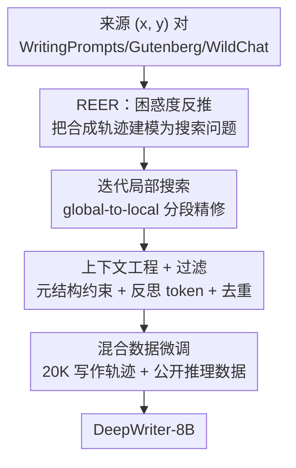

# Reverse-Engineered Reasoning for Open-Ended Generation

**会议**: ICLR 2026  
**OpenReview**: [https://openreview.net/forum?id=aK9JneKTL8](https://openreview.net/forum?id=aK9JneKTL8)  
**代码**: 待确认（开源了 DeepWriting-20K 数据集与 DeepWriter-8B 模型）  
**领域**: LLM推理  
**关键词**: 深度推理, 开放式生成, 逆向工程推理, 困惑度搜索, 思维链数据合成

## 一句话总结
针对"深度推理在开放式创作任务上无法落地"的难题，本文提出 REER（逆向工程推理）——不再正向地用 RL 试错或蒸馏去"造"推理过程，而是从已有的高质量答案"倒推"出能生成它的隐式思维链，用困惑度作为质量代理、以无梯度局部搜索合成 2 万条深度推理轨迹（DeepWriting-20K），训出的 8B 模型 DeepWriter 在写作 benchmark 上比肩甚至超过 GPT-4o 与 Claude 3.5。

## 研究背景与动机

**领域现状**：以 o1、DeepSeek-R1 为代表的"深度推理"范式（先长链思考再作答），在数学、代码这类**可验证**领域取得了巨大成功，核心驱动力是 RL——因为有明确的对错奖励信号，模型能在巨大的解空间里高效搜索。

**现有痛点**：可一旦换到开放式创作（写小说、写论文、写文案），这套打法就失灵了。创意写作没有唯一的标准答案，质量靠原创性、情感共鸣、叙事连贯这类**主观**标准来评判。两条主流的"教推理"路线都在这里栽跟头：RL 缺乏清晰的奖励信号，而要训一个能逼近人类主观偏好的奖励模型本身就极难，且 RL 过程样本效率低、算力开销大；指令蒸馏则成本高昂，且能力被教师模型的天花板死死卡住。

**核心矛盾**：教模型"深度思考"需要大量高质量的思维轨迹数据，但开放式任务里这种数据极度稀缺——正向去造它，要么靠 RL 的低效试错，要么靠昂贵的逐条蒸馏，两条路都堵死了。

**本文目标**：在**没有任务可验证性**的前提下，找到一条既绕开 RL 样本低效、又绕开蒸馏成本依赖的第三条路，从零给模型注入开放式生成的深度推理能力。

**切入角度**：作者反过来问了一个问题——"给定一段已经写得很好的输出，最连贯、最合逻辑的思维过程应该长什么样？" 既然高质量答案是现成的（网上海量的好故事、好文章），那思维链就不该去"造"，而该去"挖"：从结果倒推过程。

**核心 idea**：把"教推理"重新定义为"逆向恢复推理"——以参考答案的困惑度作为思维质量的代理，用无梯度搜索从已知好输出反推出隐式思维链，从而可规模化地批量合成深度推理训练数据。

## 方法详解

### 整体框架

REER 的整条流水线可以概括为"先找好答案，再倒推思维链，最后混合微调"三段。给定一个查询 $x$（如写作 prompt）和一段高质量参考答案 $y$（如一篇好故事），目标是找到一条深度推理轨迹 $z$，使它能最好地"解释"为什么会生成 $y$。关键在于怎么衡量"解释得好不好"——本文用生成器 LLM 对 $y$ 的困惑度 $\mathrm{PPL}(y\mid x, z)$ 来度量：困惑度越低，说明这条思维链让这个好答案显得越自然、越合逻辑。于是合成轨迹就变成一个搜索问题：

$$z^* = \arg\min_{z \in \mathcal{Z}} \mathrm{PPL}(y \mid x, z)$$

由于解空间巨大、且没有可微目标，作者用**无梯度的迭代局部搜索**来逼近 $z^*$：先粗生成一条初始思维链，再逐段精修、每次用困惑度信号挑出更好的片段，直到困惑度降到阈值以下。搜出来的 $(x, z^*, y)$ 三元组经过过滤后，与公开的数学/代码推理数据混合，去微调一个 base 模型，让它内化"先深度思考再作答"的习惯。

### 关键设计

**1. REER：用参考答案的困惑度反推隐式思维链**

这一步针对的是开放式领域"没有可验证奖励信号"的根本痛点。RL 之所以失灵，是因为没法判断一个输出对不对；REER 的巧思是**把评判对象从最终输出换成思维过程**——不去问"这段答案好不好"，而是问"这条思维链能多好地解释这段已知的好答案"。具体用生成器 LLM 对参考答案 $y$ 的困惑度 $\mathrm{PPL}(y\mid x,z)$ 当代理：如果在某条思维链 $z$ 的条件下，模型觉得写出 $y$ 是顺理成章、概率很高的，那这条 $z$ 就是一个好的规划。这样就把"在缺乏 ground truth 时合成推理数据"这个看似无解的问题，转化成了一个有明确目标函数（最小化困惑度）的搜索问题，彻底绕开了奖励模型和逐条蒸馏。

**2. 迭代局部搜索：global-to-local 的分段精修**

直接在巨大轨迹空间里求 $z^*$ 不可行，所以本文设计了一套无梯度的迭代局部搜索。它先用一个"启发式 prompt"让 LLM 生成一条完整但粗糙的初始思维链 $z^{(0)}=[z_1,\dots,z_n]$，然后进入精修循环：每轮选中其中一个片段 $z_i$，把完整上下文（查询 $x$、参考答案 $y$、已精修的前文 $z^*_{<i}$ 和未动的后文 $z_{>i}$）喂给 LLM 生成若干候选片段，把每个候选 $c$ 代入构成临时轨迹 $z'_{\text{cand}}$ 并算困惑度 $S(c)=\mathrm{PPL}(y\mid x, z'_{\text{cand}})$，取困惑度最低的那个作为该段的更新：

$$z_i^* = \arg\min_{c \in C_i \cup \{z_i\}} \mathrm{PPL}(y \mid x, z'_{\text{cand}})$$

注意候选集里**保留了原片段 $z_i$**，这保证了困惑度单调下降、绝不会越改越差。当困惑度降到预设阈值（实验里设为 0.25）或达到最大步数（10 步）时停止。作者特意把它和 MCTS 区分开：一是用整段参考答案的困惑度当代理，省掉了 MCTS 那种昂贵的 rollout；二是走"先全局后局部"的路子——从一个完整但不完美的全局规划出发逐段打磨，而非像 MCTS/beam search 那样从局部状态一点点往外扩展。正是这种"全局到局部"让它可规模化。

**3. 上下文工程 + 启发式过滤：保证轨迹既像人又不退化**

搜索算法管用，但合成质量同样取决于喂给生成器的指令怎么设计，以及事后怎么剔除坏样本。上下文工程上有两招：其一是**用元结构强制分段编辑**，在 prompt 里给思维过程规定一套元结构，作为隐式正则项，逼模型只改当前选中的片段、别顺手把后续部分也一起改了，从而保证"分段精修"名副其实；其二是**注入类人思维模式**，显式鼓励模型用"Hmm……或许我可以……""Wait，这有点太直白了……"这类标记认知探索、自我反思与回溯的措辞，避免合成出僵硬刻板的公式化推理。合成完还有两道启发式过滤：**结尾过滤**会丢掉那些在序列最后 10% 仍在"思考"、迟迟不收尾的轨迹（它们容易把模型带进死循环）；**重复过滤**用 top-3 n-gram 频率度量检测退化的循环表达，把高重复样本剔除。最终留下 2 万条高质量轨迹。

**4. 混合数据微调：防止专精写作而灾难性遗忘通用能力**

只用领域专精数据训练会过拟合、损伤模型原有的通用知识先验。所以本文把合成的 2 万条开放式写作轨迹，与公开的 OpenThoughts（主要覆盖数学、代码、科学）蒸馏推理数据混合，最终凑成约 3.7 万条的混合训练集。每条 $(x, z^*, y)$ 三元组用统一模板格式化，显式教模型"先深度推理、再产出最终答案"。这种数据配比让模型既学到开放式生成的专精推理，又守住了广泛的知识先验。

### 一个完整示例

以"You can't speedrun an Isekai!"这个写作 prompt（$x$）配一篇高质量同人故事（$y$）为例：REER 先让 LLM 生成一条粗糙初始思维链 $z^{(0)}$——大致是"先理解用户意图、再头脑风暴核心创意、搭叙事结构"。接着进入局部搜索：选中"搭结构"这一段，喂入完整上下文生成几个更细的候选（比如细化到"开头—发展—高潮—主角反思"），逐个代回算参考答案 $y$ 的困惑度，挑困惑度最低的替换；然后再选下一段精修。随着迭代推进，轨迹里逐渐长出"Wait，这有点太直白了，加点反转""Hmm，或许加条 God 的支线"这类反思与分支，困惑度持续下降、token 长度持续上升（图 4 验证：精修后 PPL 分布整体左移、轨迹明显变长）。直到 $y$ 的困惑度低于 0.25 停止，得到一条 $z^*$，与 $x,y$ 组成一条训练样本。

## 实验关键数据

模型基座为 Qwen3-8B-Base，轨迹合成的生成器用 Qwen2.5-32B-Instruct；微调 3 epoch、学习率 $2\times10^{-5}$、global batch size 96；局部搜索最大 10 步、停止 PPL 阈值 0.25。评测用三个互补 benchmark：LongBench-Write（LB，超长文本耐久性）、HelloBench（HB，真实场景适用性，HB-A 开放式 QA / HB-B 启发式文本生成）、WritingBench（WB，六个专业领域 A–F 的可控性）。

### 主实验

| 模型 | LB | HB-A | HB-B | WB-A | WB-D | WB-F |
|------|------|------|------|------|------|------|
| GPT-4o | 83.1 | 83.7 | 87.6 | 74.4 | 77.9 | 78.0 |
| Claude 3.5 | 89.3 | 82.9 | 88.3 | 59.1 | 59.3 | 67.7 |
| Claude 3.7 | 97.8 | 83.9 | 93.2 | 78.2 | 79.3 | 80.8 |
| Qwen3-8B | 85.2 | 81.4 | 85.3 | 68.7 | 67.2 | 71.3 |
| LongWriter-8B | 76.5 | 80.1 | 82.6 | 57.9 | 52.0 | 52.0 |
| **DeepWriter-8B** | **91.3** | **82.6** | **87.4** | **72.2** | **70.6** | **72.3** |

关键看点：DeepWriter-8B 在 WritingBench 六个领域全面碾压同尺寸的 LongWriter-8B（平均高出 18 分以上），凸显深度推理合成相比标准指令微调的优势；在创意任务 HB-B 上（87.4）与 GPT-4o（87.6）、Claude 3.5（88.3）统计上持平；最反直觉的是 LongBench-Write 上 91.3 反超 GPT-4o（83.1）和 Claude 3.5（89.3）——说明显式训练结构化思维链为超长文本的长程连贯性提供了强归纳偏置。

### 消融实验

| 配置 | HB-B | WB-A | WB-D | 说明 |
|------|------|------|------|------|
| DeepWriter-8B（Full） | 87.5 | 72.2 | 70.6 | 完整模型 |
| − 移除合成数据 | 73.7 | 63.4 | 57.7 | 只用公开推理数据训练，全面暴跌 |
| − 移除迭代搜索 | 84.4 | 66.7 | 65.6 | 用初始轨迹 $z^{(0)}$ 而非 $z^*$ |
| − 移除反思 token | 82.8 | 71.6 | 62.0 | 去掉 Hmm/Wait 等措辞，WB-D 重挫 |
| − 下采样长轨迹 | 84.0 | 69.6 | 67.5 | 专业写作受损更明显 |
| − 下采样短轨迹 | 82.1 | 70.8 | 66.9 | 创意任务受损更明显 |
| − 移除文学数据 | 85.3 | 71.3 | 69.8 | 全 benchmark 普降 |

### 关键发现
- **合成数据贡献最大**：移除 2 万条合成轨迹掉点最狠（HB-B 87.5→73.7，WB 平均掉 8 分以上）。这印证了核心假设——重要的不是有没有"思考"数据，而是**为开放式领域量身定制的结构化轨迹的质量与相关性**。
- **迭代精修确有价值**：用未精修的 $z^{(0)}$ 替代 $z^*$ 后 WB-A 从 72.2 掉到 66.7，证明困惑度引导的局部搜索确实搜出了更优的推理路径。
- **反思 token 对文艺创作尤其关键**：去掉它整体只是小幅下滑，但 WB-D（文学与艺术）从 70.6 暴跌到 62.0，说明这些"探索/自我纠正/分支"标记对艺术写作所需的灵活性与创造力格外重要。
- **轨迹长度偏好与任务相关**：长轨迹对专业写作更重要，短轨迹对创意构思更优——结构化专业写作需要详尽多步规划，而创意灵感更吃灵巧直接的推理。
- **文学数据有外溢效应**：移除文学/日常数据会拖累所有 benchmark（不只 WB-D），说明创意叙事任务训练赋予了模型更可泛化的"处理细腻、结构与开放性"的能力，连技术领域都跟着受益。

## 亮点与洞察
- **"困惑度即质量代理"是全文最妙的一招**：在没有 ground truth 的开放式领域，把"思维链好不好"转译成"它让已知好答案显得多自然"，于是一个无监督、无奖励模型的搜索目标就立住了——这个视角可迁移到任何"结果易得、过程难标"的数据合成场景。
- **"逆向工程"绕开了蒸馏天花板**：传统蒸馏的能力上限是教师模型，而 REER 倒推的是**人类写好的答案**背后的思维，相当于让模型向人类成品学习而非向另一个 LLM 学习，天花板更高、成本还低。
- **global-to-local + 候选集含原片段**：从完整粗糙规划出发逐段精修、且每轮保留原段以保证困惑度单调下降，这套"只会更好不会更差"的无梯度搜索设计简洁且稳健，避免了 MCTS 的昂贵 rollout，值得借鉴到其他离散序列优化问题。

## 局限与展望
- **依赖现成的高质量 $(x,y)$ 对**：方法的前提是能拿到大量好答案；对于连好答案都稀缺的小众/新兴领域，REER 的来源就成了瓶颈。
- **困惑度代理的潜在偏差**：用生成器 LLM 的困惑度衡量思维质量，可能偏好"该模型容易预测"的表达，而非真正最优的人类思维；困惑度低不必然等于推理好，存在代理目标与真实目标错位的风险。
- **评测高度依赖 LLM 裁判**：LB/WB 用 Claude-3.7、HB 用 GPT-4o 打分，作者也承认 WritingBench 复现分数与原论文存在差异，主观评测的偏差与可复现性需谨慎看待。
- **改进方向**：可探索更贴合人类偏好的质量代理（而非纯困惑度）、把 REER 扩展到对话/Agent 等更长程的开放式交互，以及自动化 $(x,y)$ 来源的挖掘。

## 相关工作与启发
- **vs 强化学习（如 WritingZero）**：RL 路线试图在创意领域训一个逼近主观质量的奖励模型再做搜索，但奖励建模本身极难、样本效率低且数据模型多不开源；REER 用困惑度代理 + 无梯度搜索完全绕开了奖励模型与在线试错。
- **vs 指令蒸馏**：蒸馏逐条从强模型抽思维数据，成本高且被教师能力封顶；REER 从人类好答案倒推，成本低、可规模化、天花板更高，并开源了 DeepWriting-20K。
- **vs MCTS / 自精炼**：MCTS 靠昂贵 rollout 评估、且自底向上扩展部分状态；REER 用整段参考答案困惑度免去 rollout，走 global-to-local 逐段精修，更适合大规模轨迹合成。
- **vs VeriFree**：同样用"代理奖励"思路，但 VeriFree 面向可验证域，REER 把类似原理推广到更难的开放式生成、恢复类人推理。

## 评分
- 新颖性: ⭐⭐⭐⭐⭐ 把"教推理"反转成"从好答案倒推推理"，并用困惑度代理 + 无梯度搜索落地，是真正的第三条路。
- 实验充分度: ⭐⭐⭐⭐ 三个互补 benchmark + 系统消融，证据扎实；但全靠 LLM 裁判、且作者自承 WB 复现有差异。
- 写作质量: ⭐⭐⭐⭐⭐ 动机层层递进，方法的"为什么这么做"讲得透彻，图示清晰。
- 价值: ⭐⭐⭐⭐⭐ 开源数据集+模型，为开放式生成的深度推理提供了低成本可规模化的新范式。

<!-- RELATED:START -->

## 相关论文

- [\[ICLR 2026\] ShinkaEvolve: Towards Open-Ended and Sample-Efficient Program Evolution](shinkaevolve_towards_open-ended_and_sample-efficient_program_evolution.md)
- [\[ICLR 2026\] Think in Parallel, Answer as One: Logit Averaging for Open-Ended Reasoning](think_in_parallel_answer_as_one_logit_averaging_for_open-ended_reasoning.md)
- [\[ICLR 2026\] MetaMuse: Algorithm Generation via Creative Ideation](metamuse_algorithm_generation_via_creative_ideation.md)
- [\[ICLR 2026\] Log-Augmented Generation: Scaling Test-Time Reasoning with Reusable Computation](log-augmented_generation_scaling_test-time_reasoning_with_reusable_computation.md)
- [\[ICLR 2026\] Unleashing Scientific Reasoning for Bio-Experimental Protocol Generation via Structured Component-based Reward Mechanism](unleashing_scientific_reasoning_for_bio-experimental_protocol_generation_via_str.md)

<!-- RELATED:END -->
