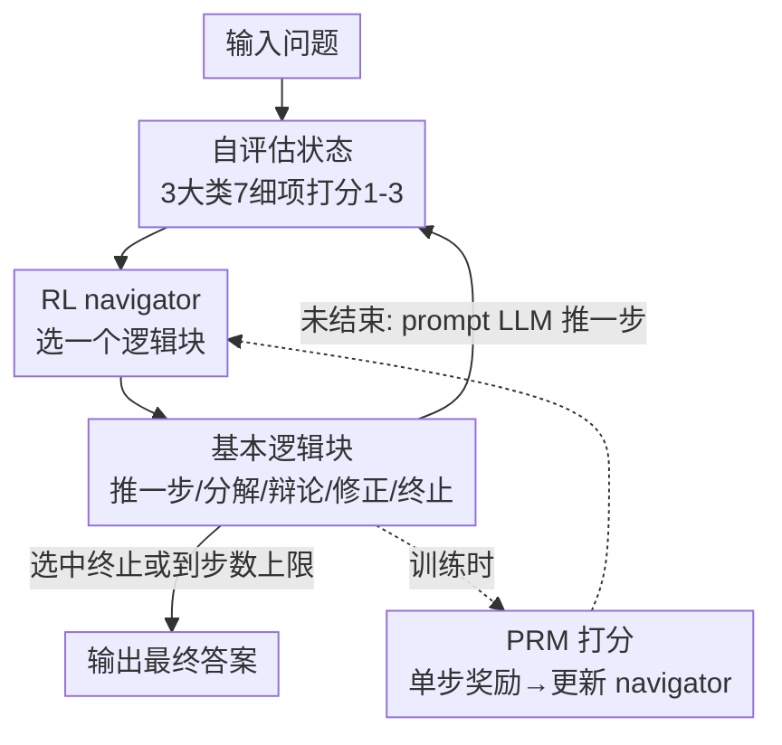

# RL of Thoughts: Navigating LLM Reasoning with Inference-Time Reinforcement Learning

**会议**: ICLR 2026  
**OpenReview**: [https://openreview.net/forum?id=Dw034qKrP5](https://openreview.net/forum?id=Dw034qKrP5)  
**代码**: https://github.com/tsinghua-fib-lab/RL-LLM-Reasoning  
**领域**: LLM推理  
**关键词**: 推理时增强、逻辑结构、强化学习、过程奖励模型、可迁移性

## 一句话总结
RLoT 把 LLM 的多步推理建模成一个马尔可夫决策过程，用强化学习训练一个不到 3K 参数的「导航器」，让它在推理过程中根据当前状态动态挑选并拼接五个认知启发的「基本逻辑块」，从而为每道题现场生成专属的逻辑结构——在 AIME/MATH/GPQA 等基准上最高提升 13.4%，并能让 sub-10B 模型逼近 10× 规模的大模型。

## 研究背景与动机

**领域现状**：提升 LLM 推理能力主要有两条路。一条是微调（fine-tuning），效果显著但要海量算力和数据，成本高昂；另一条是推理时技术（inference-time），代表是 Chain-of-Thought（CoT）、Tree-of-Thoughts（ToT）、Graph-of-Thoughts，它们不改 LLM 参数，只靠外部预定义的逻辑结构来引导推理，轻量又便宜。

**现有痛点**：这些推理时方法的逻辑结构都是**人工预先设计、且与任务无关（task-agnostic）**的。一套固定的 CoT/ToT 结构被无差别地套到数学、STEM、常识问答等各种任务上，缺乏适应性。更糟的是，复杂推理往往是多步的，每走一步问题的求解状态都在变，但预定义结构是静态的，无法跟着状态动态调整后续的逻辑。

**核心矛盾**：推理任务在**领域多样性**和**过程动态性**两个维度上都在变化，而手工设计的逻辑结构既无法为每个任务专门定制，也无法随推理状态实时调整——这就是固定结构的根本局限。

**本文目标**：让推理时技术变得「自适应」——既能针对不同任务生成不同的逻辑结构，又能在推理过程中根据当前进展动态调整。

**切入角度**：作者注意到，「根据当前状态依次做决策」恰好是强化学习（RL）擅长的事。如果把「生成逻辑结构」看成一连串决策——每一步根据当前求解状态挑一种推理操作——那么一个 RL 智能体就能在推理时充当「导航器」，把通用的推理操作动态拼成任务专属的结构。

**核心 idea**：把长序列推理建模为 MDP，用 RL 训练一个轻量导航器，在推理时动态选择并组合五个基本逻辑块，为每道题现场「导航」出专属的逻辑结构，而不改动 LLM 本身。

## 方法详解

### 整体框架

RLoT（RL-of-Thoughts）的核心是一个被 RL 训练出来的**导航器（navigator）**。给定一道题，推理过程被拆成若干步，每一步都走同一个循环：先让 LLM 对当前的推理进展做「自评估」得到一个低维状态向量；导航器看着这个状态，从五个基本逻辑块里**选一个动作**；这个动作对应一种推理操作（如「再推一步」「分解」「辩论」「修正」「终止」），被翻译成 prompt 让 LLM 继续推理一步；推理完后再次自评估得到新状态，进入下一轮循环。如此往复，导航器实际上是在**逐步拼接逻辑块、现场搭建一条从问题到答案的推理路径**，直到选中「终止」或达到步数上限。

训练阶段额外引入一个过程奖励模型（PRM）：每执行一个动作后，PRM 给中间结果打分，这个分数作为该动作的单步奖励，用来训练导航器。LLM 和 PRM 全程冻结，只更新导航器（一个不到 3K 参数的小 MLP）。训练完成后 PRM 即可丢弃，推理时只剩 LLM + 导航器。

### 关键设计

**1. 自评估状态：把不断变化的推理进展压成低维向量**

要让导航器「看状态做决策」，首先得有一个能反映当前求解进展、又足够紧凑的状态表示。直接把冗长的推理文本喂给 RL 智能体既高维又嘈杂。RLoT 的做法是用 LLM **自评估**：在每一步，prompt LLM 自己从三大类、七个细项给当前推理打分（每项 1–3 分）。三大类是正确性（A：建模正确性 A1、后续推理的清晰度 A2、计算正确性 A3）、复杂度（B：到最终答案的复杂度 B1、后续可选的替代方法 B2）、完整度（C：与最终解的接近程度 C1、当前步骤内部的完整度 C2）。这七个分数聚合成 MDP 的状态向量。

这样做把「一大段复杂的推理步骤」概括成一个低维状态，既给导航器提供了求解进展的全局画像，又让它能据此动态调整后续策略。状态随每一步推理而更新，正是这种「状态会变」的设计，让导航器有能力对动态推理过程做出实时反应——这正好补上了固定结构无法随状态调整的痛点。

**2. 五个认知启发的基本逻辑块：可灵活组合的动作空间**

固定结构的另一个痛点是不够灵活。RLoT 从人类认知出发，设计了五个可自由级联的「基本逻辑块」作为 MDP 的动作空间，导航器通过挑选并串接它们来搭建逻辑结构：**Reason one step**（只往前推理一步，不一定直达答案，但推进整体进程）；**Decompose**（把当前任务拆成更简单的子任务依次求解，再让 LLM 汇总子任务结果）；**Debate**（为任务生成多个方案并比较，挑出最有希望的那个，再基于它推一步）；**Refine**（回看并修订当前推理步骤，提升清晰度和正确性）；**Terminate**（基于此前所有步骤给出最终答案并按指定格式输出，标志推理结束）。

这五块对应人类解题时常用的认知策略——拆解复杂问题、出错时回看修正、多方案权衡。把它们当成可组合的「积木」，导航器就能为不同任务铺出不同的推理路径，而不是套一套写死的模板。为保证拼出的结构合理，状态转移上加了几条简单约束：一旦某步回答里已出现答案，后续只允许「终止」；「修正」若出现在第一步会自动转成「推一步」（原问题还没有可修正的内容）；并对动作总数设上限，到顶后自动执行「终止」，避免推理链无限拉长。

**3. PRM 奖励 + 轻量 navigator 的 RL 训练：只训 3K 参数，LLM 全程冻结**

有了状态和动作，还需要奖励信号来训练导航器。RLoT 用过程奖励模型 PRM（具体是 Math-Shepherd）给每个动作后的中间结果打分，把这个 PRM 分数当作该动作的**单步奖励**。这把「逻辑结构好不好」量化成了可优化的目标。由于动作空间是离散的，训练就是一个标准的离散 RL 问题，框架因此**算法无关**——作者用的是 Double-Dueling-DQN：Double Q-learning 缓解价值高估，Dueling 架构把状态价值和优势分开表示，二者共同提升训练稳定性。导航器本体只是个三层 MLP（Dueling Network），总共仅 **2,566 个参数**。

训练时只更新导航器，LLM 和 PRM 都冻结，所以算力开销极低。为聚焦难题，作者从目标任务训练集里专门抽出「LLM 直接作答答不对」的 hard questions 来训练，每个 episode 随机选一道并重复多次。训练完成后 PRM 不再需要，推理时直接用训好的导航器即可。正因为导航器是「现场直接生成逻辑结构」而非像 ToT 那样搜索试错，它在拿到最佳性能的同时还保持了低成本。

### 一个完整示例

以 GPQA 这类需要大量计算的题为例：导航器观察到首步自评估状态后，常见地先选 **Reason one step** 推进一步，再选 **Refine** 检查并修订计算——这个高频出现的「Reason-Refine」两步模式，恰好弥补了 LLM 计算能力偏弱的短板，让结果更可靠。遇到更难的题，三步模式里会用上 **Decompose**（拆解）或 **Debate**（多方案权衡），并在它们前后插入 Refine 保证与前后推理的衔接。整条路径不是预设的，而是导航器看着每一步状态动态拼出来的——不同任务（MATH/GPQA/StrategyQA）拼出的高频模式也明显不同，体现了「任务专属逻辑结构」的可解释性。

## 实验关键数据

### 主实验

跨 4 类任务（奥赛数学 AIME24/AMC23、初等数学 MATH/GSM8K、STEM 的 GPQA/MMLU-STEM、常识 StrategyQA）、5 个 LLM（Qwen2.5-7B/14B、Llama3.1-8B、GPT-4o-mini、DeepSeek-R1-Distill-Qwen-7B）评测。RLoT 在几乎所有任务上稳定超过推理时基线（Direct QA / Zero-shot CoT / Few-shot CoT / CoT-SC / ToT），其中 CoT-SC 是最强基线。

| LLM | 方法 | AIME24 | AMC23 | MATH | GPQA | 平均 |
|-----|------|--------|-------|------|------|------|
| Qwen2.5-14B | 最强基线(CoT-SC) | 6.67 | 47.50 | 80.04 | 45.54 | 64.57(ZeroCoT) |
| Qwen2.5-14B | **RLoT** | **23.33** | **65.00** | **80.38** | **51.34** | **69.19** |
| Llama3.1-8B | 最强基线(CoT-SC) | – | – | 51.74 | 33.48 | 64.89 |
| Llama3.1-8B | **RLoT** | – | – | **56.56** | **46.88** | **71.70** |
| DeepSeek-R1-7B | 最强基线(CoT-SC) | 56.67 | 67.50 | 95.54 | 60.94 | 78.38 |
| DeepSeek-R1-7B | **RLoT** | **63.33** | **77.50** | **96.56** | **67.19** | **82.92** |

GPQA 这类 LLM 普遍表现差的难任务上提升最显著——Llama3.1-8B 上拿到 13.4% 的提升。值得注意的是 ToT 虽然设计更复杂，在很多任务上反而表现不佳（与既有研究一致）。

### 参数效率与可迁移性

- **参数效率**：不到 3,000 参数的导航器，能把 sub-10B LLM（Qwen2.5-14B、Llama3.1-8B、GPT-4o-mini）提升到与其约 10× 参数的大模型相当，弥补大部分性能差距甚至反超。
- **跨 LLM 迁移**（Table 3，MATH 上）：在 A 模型上训的导航器拿去增强 B 模型，性能与「在 B 上自训」基本一致，且都超过最强基线 CoT-SC。
- **跨任务迁移**（Table 4）：在 MATH/GPQA/StrategyQA 之间互训互测，性能大体一致。数学（MATH）和 STEM（GPQA）互相迁移性更好，而常识（StrategyQA）与前两者的迁移较弱——符合领域本身的内在关联与差异。

### 消融实验

逐一移除某个逻辑块再重训导航器（Table 6）：

| 配置 | MATH | GPQA | StrategyQA | 平均 |
|------|------|------|-----------|------|
| Full RLoT (Qwen2.5-7B) | 76.70 | 44.64 | 79.04 | **66.79** |
| w/o Decompose | 75.42 | 31.92 | 77.00 | 61.45 |
| w/o Debate | 74.02 | 36.61 | 77.58 | 62.74 |
| w/o Refine | 75.76 | 41.29 | 72.93 | 63.33 |
| Full RLoT (GPT-4o-mini) | 77.36 | 54.02 | 82.68 | **71.35** |

### 关键发现
- **每个逻辑块都有用**：去掉任意一个都会掉点。Decompose 对 GPQA（STEM）影响最大（Qwen2.5-7B 上 44.64→31.92），Refine 对 StrategyQA（常识）影响最大（79.04→72.93），说明不同块对不同任务的贡献结构不同。
- **高频推理模式可解释**：MATH/GPQA 高频出现 Reason-Refine（补计算短板），常识任务更多 Reason-Debate；Refine 常被放在 Decompose/Debate 前后做衔接。
- **难题增益更大**：在 LLM 本就薄弱的 GPQA、奥赛数学上提升最明显，说明自适应结构在「硬」场景价值最高。

## 亮点与洞察
- **「用 RL 选逻辑块」这一抽象很巧**：把静态、人工、任务无关的 CoT/ToT 结构，换成由 RL 智能体逐步决策生成的动态结构，一举打通了「领域多样」和「过程动态」两个维度的适应性。
- **极致轻量**：导航器仅 2,566 参数、三层 MLP，训练只更新它、LLM/PRM 冻结，却能让小模型逼近 10× 大模型——「小尾巴摇大狗」的性价比极高。
- **自评估状态是可复用的 trick**：用 LLM 自己打分把冗长推理压成 7 维低维状态，给任何「需要观测 LLM 推理进展」的 RL/控制任务提供了一个现成的状态抽象方式。
- **可迁移性意味着一次训练多处复用**：导航器学到的是「何时该拆/该辩/该修」的元策略，与具体 LLM、具体任务弱耦合，跨模型跨任务都能直接用。

## 局限与展望
- **训练依赖 PRM**：单步奖励来自 Math-Shepherd 这类过程奖励模型，主要面向数学/STEM；在缺乏好 PRM 的领域（如开放式生成）奖励信号质量存疑。
- **常识域迁移弱**：StrategyQA 与数学/STEM 之间迁移性有限，说明导航器学到的策略仍有领域依赖，并非完全通用。
- **逻辑块是人工设计的**：五个基本块仍来自人类认知先验，块的粒度/种类是否最优、能否让模型自己发现新块，尚未探索。
- **自评估可靠性**：状态完全依赖 LLM 自我打分，若 LLM 对自身推理的判断有偏（如过度自信），状态噪声会直接误导导航器（作者在附录 F 有讨论）。

## 相关工作与启发
- **vs CoT / CoT-SC**：CoT 用固定的「step by step」prompt，CoT-SC 再加多路采样投票；二者结构都是静态、任务无关的。RLoT 的逻辑结构是按题动态生成的，且把 CoT-SC 的「多路采样」换成「一次导航直出结构」，在拿到更高精度的同时避免了搜索成本。
- **vs ToT / GoT**：ToT/GoT 用预定义的树/图结构做搜索试错，开销大且对很多任务并不奏效。RLoT 不搜索，由导航器直接决策出结构，成本更低、对难任务（GPQA）反而更强。
- **vs 微调 / RLHF 类方法**：微调直接改 LLM 参数，需要海量算力数据。RLoT 完全不动 LLM，只训一个外挂的 3K 参数导航器，属于推理时增强，部署和迁移都更轻。

## 评分
- 新颖性: ⭐⭐⭐⭐⭐ 「把生成逻辑结构建模成 MDP、用 RL 导航器现场拼逻辑块」是对推理时技术的一个干净而有力的新抽象。
- 实验充分度: ⭐⭐⭐⭐⭐ 4 类任务 × 5 个 LLM，主实验 + 参数效率 + 双向迁移 + 逐块消融 + 模式分析，覆盖全面。
- 写作质量: ⭐⭐⭐⭐ MDP 四要素和五个逻辑块讲得清晰，框架图直观；部分关键细节（PRM 选取、自评估可靠性）放在附录。
- 价值: ⭐⭐⭐⭐⭐ 用 <3K 参数把小模型抬到大模型水平、且可跨模型跨任务迁移，实用性和性价比都很高。

<!-- RELATED:START -->

## 相关论文

- [\[ICLR 2026\] Incentivizing LLM Reasoning via Reinforcement Learning with Functional Monte Carlo Tree Search](incentivizing_llm_reasoning_via_reinforcement_learning_with_functional_monte_car.md)
- [\[ICLR 2026\] Curriculum Reinforcement Learning from Easy to Hard Tasks Improves LLM Reasoning](curriculum_reinforcement_learning_from_easy_to_hard_tasks_improves_llm_reasoning.md)
- [\[ICLR 2026\] NFT: Bridging Supervised Learning and Reinforcement Learning in Math Reasoning](nft_bridging_supervised_learning_and_reinforcement_learning_in_math_reasoning.md)
- [\[ICLR 2026\] Learning to Reason over Continuous Tokens with Reinforcement Learning (HyRea)](learning_to_reason_over_continuous_tokens_with_reinforcement_learning.md)
- [\[ICLR 2026\] Emergent Hierarchical Reasoning in LLMs through Reinforcement Learning](emergent_hierarchical_reasoning_in_llms_through_reinforcement_learning.md)

<!-- RELATED:END -->
