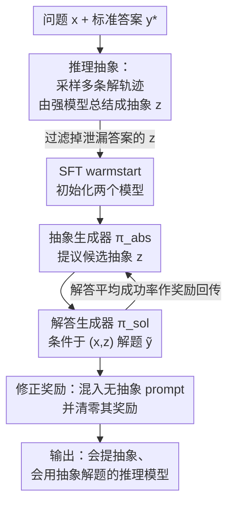

# RLAD: Training LLMs to Discover Abstractions for Solving Reasoning Problems

**会议**: ICLR 2026  
**OpenReview**: [https://openreview.net/forum?id=fvJPjCioeR](https://openreview.net/forum?id=fvJPjCioeR)  
**领域**: LLM推理  
**关键词**: 推理抽象, 双玩家RL, 测试时算力分配, 探索广度, 数学推理

## 一句话总结
本文提出"推理抽象"（reasoning abstraction）——用自然语言写成的、可跨问题复用的过程性/事实性知识片段，并设计 RLAD 这套双玩家 RL 范式，联合训练一个"抽象生成器"和一个"抽象条件解答生成器"，让模型先提议抽象再据此解题，在 AIME 2025 上相比纯长链思维 RL（DAPO）平均提升 44%。

## 研究背景与动机
**领域现状**：当前训练 LLM 推理的主流做法是用 RL 激励更长的思维链（long CoT），让模型在单条轨迹里不断验证、续接前面的推理步骤。

**现有痛点**：这种训练本质上优化的是"深度"（depth）——后续训练迭代主要是把响应拉长、在已经选定的推理路线上叠加新操作。结果是模型产生很长但"暴力深搜"式的轨迹，沿着一条链顺序地探索解空间。这类模型在某些题上能成功，却在难度相近的题上失败，泛化很差。

**核心矛盾**：很多难题真正需要的是"广度"（breadth）——探索多样化的解题策略，而不是一上来就锁定一组看似不错的策略往下钻。深度搜索容易陷入"看起来最优、其实不对"的路线里出不来。深度与广度之间存在结构性的 trade-off，而 long-CoT RL 天然偏向深度。

**本文目标**：让模型学会为一道题"假设"出多种攻击策略，再在解答里实际利用这些策略，从而把探索从"在过程知识里搜索"变成"在已给定的过程知识上组合"。

**切入角度**：作者观察到，一道题的多条候选解轨迹其实共享一些底层过程（中间引理、可复用算法、甚至"哪些走法是错的"）。如果把这些共享子结构压缩成简短的自然语言描述，它们在上下文里就像考试时的"提示（hint）"，能让模型基于这些洞见去解更难的题。

**核心 idea**：用模型自己提议的"推理抽象"作为高层子目标/先验，再用一套双玩家 RL 同时训练"提抽象"和"用抽象解题"两个能力——把对过程知识的搜索，替换成对过程知识的复用与组合。

## 方法详解

### 整体框架
RLAD 要解决的是"如何让模型既能提出有用的推理抽象、又能据此解题"。整体分两阶段：先用 SFT 把两个模型 warmstart 到能产出/利用抽象的初始状态，再用一套协作式双玩家 RL（RLAD）联合优化。系统里有两个 LLM：抽象生成器 $\pi^{abs}_\theta(z\mid x)$ 给定问题 $x$ 提议一个或多个自然语言抽象 $z$；抽象条件解答生成器 $\pi^{sol}_\theta(y\mid x,z)$ 在 $x$ 和 $z$ 的条件下产生解答 $y$。关键的耦合点在奖励：抽象生成器的奖励 = 解答生成器在该抽象条件下的平均成功率，于是"提出好抽象"和"用好抽象解题"被绑成一个合作博弈。

### 关键设计

**1. 推理抽象：把多条解轨迹的共享子结构压成可复用的自然语言提示**

针对"long-CoT RL 只会深搜、泛化差"这个痛点，本文先要回答一个前置问题：什么是好抽象、怎么获得。作者把一道题的解空间看成一张图，节点是解题过程中的中间状态，好的抽象应当识别出这张图里的有用子结构——比如"哪几类策略会导向相似结果"、"哪组做法会反复犯同一个错"。获取方式很直接：让一个模型（Qwen3）采样多条解轨迹，再让一个更强的模型（o4-mini）去总结这些轨迹中的有用模式，得到抽象 $z$。一个好抽象 $z$ 的判据是条件生成后准确率上升，即 $\mathbb{E}_{\tilde y\sim\pi^{sol}_\theta(\cdot\mid x,z)}[\mathrm{Acc}(\tilde y,y^*)] > \mathbb{E}_{\tilde y\sim\pi^{sol}_\theta(\cdot\mid x)}[\mathrm{Acc}(\tilde y,y^*)]$。

为防止抽象直接"泄漏"答案、让模型抄近路，作者做了事后校验：只给抽象、不给问题时从基座模型采样 16 次，准确率必须为 0，才保留该抽象。实证上，这种"总结式"抽象本身就能把基座解题器的数学推理性能平均提升 30%，而且抽象往往落在三类：有用的技巧、可复用的引理/启发式、以及揭示常见陷阱的"警示样例"。这一步同时也产出 RL 之前的 SFT warmstart 数据。

**2. 双玩家 RL 训练范式：抽象奖励绑定解答成功率的协作博弈**

有了抽象的概念后，核心是把"提抽象 + 用抽象"两种能力都训出来，而不是靠手工脚手架。RLAD 把它建成一个协作式双玩家游戏。解答生成器 $\pi^{sol}_\theta$ 用标准的 0/1 结果奖励训练（条件在采样到的抽象 $z$ 上），$r(x,z,\tilde y):=\mathrm{Acc}_x(\tilde y,y^*)$；抽象生成器 $\pi^{abs}_\theta$ 的奖励则定义为解答器在该抽象下的期望成功率：

$$r_{\pi^{sol}_\theta}(x,z) := \mathbb{E}_{\tilde y\sim\pi^{sol}_\theta(\cdot\mid x,z)}[\mathrm{Acc}_x(\tilde y,y^*)]$$

也就是说，一个抽象"好不好"完全由它能否最大程度帮解答器找到正确解来度量（同时不能泄漏答案）。两个模型迭代地各自优化：固定 $\pi^{sol}_\theta$ 训 $\pi^{abs}_\theta$ 去最大化 $r_{\pi^{sol}_\theta}$，再固定 $\pi^{abs}_\theta$ 训 $\pi^{sol}_\theta$ 去最大化结果奖励。这样抽象提议和解答生成的学习信号被解耦，抽象天然扮演 RL 里的高层子目标/技能/先验。实现上，抽象生成器用"批式"离线 RL（RFT/RPO，因为在线 rollout 解答器算力不可行），解答生成器用 DAPO（token 级 loss 归一化 + 非对称裁剪 + 难度/长度课程）。

**3. 修正奖励：混入无抽象 prompt 并清零其奖励，逼解答器真正依赖抽象**

朴素奖励设计有三个隐患：(1) 若 $\pi^{abs}_\theta$ 学会把整道题解了，$r_{\pi^{sol}_\theta}$ 仍给高分，但这不是合格抽象；(2) 若 $\pi^{sol}_\theta$ 太弱或太强（总错或总对），$r_{\pi^{sol}_\theta}$ 就提供不了有意义的更新信号；(3) on-policy RL 下 $\pi^{sol}_\theta$ 可能干脆无视抽象 $z$。这些都源于两个玩家强弱不对称、一方淹没另一方的学习信号。

作者的修法很小但很关键：训练 $\pi^{sol}_\theta$ 时，把"带抽象的 prompt"和"完全不带抽象的 prompt"混合喂入，但对任何"无抽象轨迹"直接把奖励清零：

$$r(x,z,\tilde y) := \begin{cases} 0, & z=\varnothing \\ \mathrm{Acc}_x(\tilde y,y^*), & \text{otherwise}\end{cases}$$

在 KL 约束 RL（GRPO/DAPO）下，这等于要求 $\pi^{sol}_\theta$ 在无抽象问题上贴近参考模型的分布，而只有在加了抽象的同一问题上才去争取奖励——于是模型只能通过"认真利用抽象"来涨分，从根上堵住了忽略抽象的退化解。

**4. SFT warmstart + 课程训练：给 RL 一个能产出有意义抽象/解答的起点**

RL 配方依赖初始模型从一开始就能产出"还算靠谱"的抽象和解答，否则两玩家都没信号。作者借鉴"先 SFT 再 RL"的范式：用 o4-mini 生成抽象、用较弱的 GPT-4.1-mini 通过"有/无该抽象的解题成功率差"来筛选只保留能涨分的抽象，构成种子集，再对 Qwen3-1.7B 跑 5 个 epoch SFT 得到初始抽象生成器；解答生成器用同一个 Qwen3-1.7B（保证两个组件容量一致）。RL 阶段叠加两段式课程：按基座成功率把 DeepScaleR 划成 easy/medium/hard，先在 easy（8K token 预算）再到 medium 上微调，hard 留作 held-out 评测（即 "DeepScaleR [Hard]"）。

### 一个完整示例
以一道数论题"求满足 $p+p^{-1}\equiv 25 \pmod{143}$ 的最小正素数 $p$"为例：标准推理会沿一条链顺序试探。RLAD 的抽象生成器则先提议若干抽象，比如"在模运算下用二次公式：对 $aX^2+bX+c\equiv 0\pmod m$，先算判别式 $D=b^2-4ac$，再 $X\equiv(-b\pm\sqrt D)(2a)^{-1}\pmod m$"，以及"用 $X^{-1}$ 前先检查乘法逆元是否存在（$\gcd(X,m)=1$ 时才有）"。解答生成器在这些抽象条件下解题时，会在轨迹里显式引用这些"提示"（论文 Figure 4 中可见解答里用蓝色标出对抽象的引用），从而把高层策略落到具体计算上——而不是自己从零搜索该用什么方法。

### 损失函数 / 训练策略
解答器：DAPO（KL 约束 + token 级 loss 归一化 + 非对称裁剪 + 难度/长度课程），奖励为式 (3) 的"无抽象清零"版 0/1 结果奖励。抽象器：批式离线 RL（RFT + RPO），奖励为式 (4) 的解答器期望成功率。两者迭代交替优化，构成协作双玩家博弈。

## 实验关键数据

### 主实验
基座为 Qwen3-1.7B，与不带抽象的 DAPO RL 微调对比，三个数学推理 benchmark 上 RLAD 全面占优（32K token 预算，pass@1 取 16 样本平均，best 为 pass@16）：

| Benchmark | 设置 | Qwen3-1.7B | +DAPO | +RLAD |
|-----------|------|-----------|-------|-------|
| AIME 2025 | w/o abs | 33.75 | 37.92 | **38.04** |
| AIME 2025 | w/ abs (avg) | 36.25 | 34.90 | **42.45** |
| AIME 2025 | w/ abs (best) | 40.00 | 39.79 | **48.33** |
| DeepScaleR [Hard] | w/ abs (best) | 32.50 | 33.54 | **35.54** |
| AMC 2023 | w/ abs (best) | 84.53 | 88.44 | **91.72** |

值得注意的是，即便推理时不给抽象（w/o abs），用 RLAD 训过的模型也比 DAPO 强——说明训练时见过多样抽象本身增强了模型的通用推理能力。ARC-AGI 上同样观察到抽象条件带来 pass@k 与覆盖率的一致提升（如 pass@16 从 24.7% → 33.2%）。

### 消融 / 分析实验

| 分析 | 关键指标 | 说明 |
|------|---------|------|
| 抽象来源对比 | o4-mini 长抽象 +8.1% / +7.0% | 只有"强生成器 + 足够长详细的抽象"才稳定涨分；短抽象或弱生成器多数无效甚至掉点 |
| 等算力对比（AIME，pass@k） | n=16: 0.71 vs 0.65；n=256: 0.87 vs 0.82 | "n 个抽象×n 个解答" 一致优于 "n² 个纯解答采样" |
| 弱到强泛化 | o4-mini pass@1 80.38%→85.83% | 弱模型（Qwen3-1.7B）产的抽象，迁移给强解答器 o4-mini 仍稳定涨 pass@k |
| 抽象遵从度 | "Abstraction" 条件遵从率最高 | 解答器确实在按所给抽象的策略走，而非无视/套用不相关抽象 |

### 关键发现
- **算力分配偏向抽象多样性更划算**：在固定推理算力 $C=m\times k$（$m$ 个抽象、每抽象 $k$ 个解答）下，跨 $k_0\in\{0,2,4,6,8\}$ 的归一化偏移，把算力更多投向"生成多样抽象"比投向"重复采样解答"涨幅更大，尤其当总预算变大时。直觉是：当模型的失败来自"陷入看似合理却错误的路线、难以切换"时，多样抽象提供了不同高层入口；而局部小错误一旦解决，继续堆 long-CoT 采样收益就饱和了。
- **抽象不能太短、生成器不能太弱、解答器要够强**：三者同时满足才有增益，这也解释了为什么必须用 SFT warmstart 一个像样的起点。
- **抽象有跨域普适性**：同样的总结流程在医疗、人类行为、法律、Web 安全等 37 个任务（RAFT/CLUES/LegalBench）上平均提升 30%，只是过程知识与事实知识的占比因域而异。

## 亮点与洞察
- **把"探索广度"显式参数化成一个可训练的模块**：抽象生成器本质上是把"该换什么策略"这件事从解答轨迹里剥离出来单独训练，等于给 long-CoT RL 补上了它天生缺的"breadth"维度，这是最让人"啊哈"的地方。
- **奖励清零这个小 trick 很巧**：仅用"无抽象轨迹奖励清零 + 混合 prompt"，就同时堵住了"抽象泄漏答案""解答器无视抽象""强弱不对称淹没信号"三个 failure mode，几乎零额外成本，可迁移到任何"辅助信息 + 主任务"的协作 RL 设置。
- **抽象作为测试时算力的新维度**：以往 scaling test-time compute 多是堆并行采样或拉长单条轨迹，本文给出第三条轴——堆抽象的多样性，且在等算力下更优，这对推理系统的算力规划有直接指导意义。
- **弱到强迁移可复用**：弱模型产的抽象能提升强模型，意味着可以用便宜模型批量产抽象、喂给昂贵模型推理，是一个实用的成本结构。

## 局限与展望
- 作者承认研究主要聚焦数学任务，把抽象推广到更广泛的推理域、以及把抽象生成与解答生成统一进一个模型，仍是开放方向。
- 抽象生成器因算力限制只能用"批式离线 RL"（RFT/RPO）而非在线 rollout 解答器的 on-policy RL，真正的在线协作博弈下能否更强、是否有不稳定性，未充分验证。
- 增益高度依赖"抽象足够长且由强模型生成 + 解答器指令跟随能力足够"，小模型或短抽象场景几乎无效，适用范围受限；warmstart 阶段还需要 o4-mini/GPT-4.1-mini 这类强外部模型造数据，并非完全自举。
- 主实验基座规模较小（Qwen3-1.7B），更大规模解答器上抽象的边际收益是否仍显著、是否会被基座自身的广度探索能力吃掉，值得进一步检验。

## 相关工作与启发
- **vs 长链思维 RL（DAPO 等）**：它们只在单条轨迹内优化"深度"，本文额外训练一个抽象生成器引入"广度"，在 AIME 2025 上 w/ abs (best) 48.33 vs 39.79，且 w/o abs 也更强。
- **vs 手工脚手架式多步评估（ToT 等）**：那些方法依赖预定义接口/流程，本文不依赖固定脚手架，而是用 RL 自动学会"提出有用抽象"。
- **vs RAG / prompt 优化 / 经验复用**：RAG 假设静态外部语料、prompt 优化多为输入无关或基于反馈的编辑，而本文的抽象是输入相关、部署时不取自外部、由模型自己"提议"的过程性知识，需要双玩家 RL 才能习得这种能力。
- **vs 并行/顺序采样的混合（如 Pan et al. 2025）**：并发工作只是把交错结构蒸馏进模型，不跑 RL 优化；本文用 RL 显式优化抽象引导下的并行+顺序混合采样。

## 评分
- 新颖性: ⭐⭐⭐⭐⭐ "推理抽象 + 双玩家 RL"是对 long-CoT RL 探索广度短板的原创性补全
- 实验充分度: ⭐⭐⭐⭐ 多 benchmark + 等算力对比 + 弱到强 + 跨域，但基座规模偏小、在线 RL 未验证
- 写作质量: ⭐⭐⭐⭐ 概念—方法—分析逻辑清晰，奖励设计的动机交代到位
- 价值: ⭐⭐⭐⭐⭐ 给测试时算力提供了"抽象多样性"这一可操作的新维度，思路可迁移

<!-- RELATED:START -->

## 相关论文

- [\[CVPR 2026\] Hilbert-Geo: Solving Solid Geometric Problems by Neural-Symbolic Reasoning](../../CVPR2026/llm_reasoning/hilbert-geo_solving_solid_geometric_problems_by_neural-symbolic_reasoning.md)
- [\[ICLR 2026\] STAT: Skill-Targeted Adaptive Training](stat_skill-targeted_adaptive_training.md)
- [\[ICLR 2026\] $\textbf{Re}^{2}$: Unlocking LLM Reasoning via Reinforcement Learning with Re-solving](textbfre2_unlocking_llm_reasoning_via_reinforcement_learning_with_re-solving.md)
- [\[ICLR 2026\] Exposing Weaknesses of Large Reasoning Models through Graph Algorithm Problems](exposing_weaknesses_of_large_reasoning_models_through_graph_algorithm_problems.md)
- [\[ICLR 2026\] Training Large Reasoning Models Efficiently via Progressive Thought Encoding](training_large_reasoning_models_efficiently_via_progressive_thought_encoding.md)

<!-- RELATED:END -->
