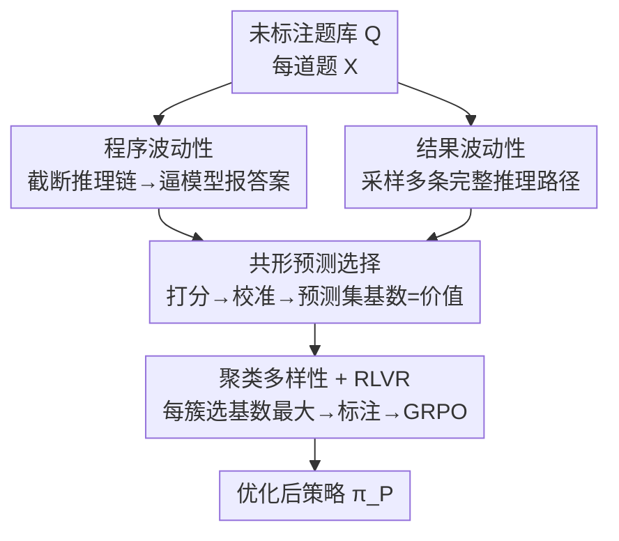

# Sample Lottery: Unsupervised Discovery of Critical Instances for LLM Reasoning

**会议**: ICLR 2026  
**OpenReview**: [https://openreview.net/forum?id=76OZBE4Rb6](https://openreview.net/forum?id=76OZBE4Rb6)  
**代码**: https://github.com/YushengZhao/SampleLottery  
**领域**: LLM推理 / RLVR / 数据选择  
**关键词**: 彩票样本假设, 程序波动性, 结果波动性, 共形预测, GRPO

## 一句话总结
本文提出"彩票样本假设"——RLVR 训练集中存在一个极小子集，单独用它训练就能逼近全量数据的效果，并设计了无监督选样框架 CONST：用"程序波动性 + 结果波动性"刻画每道题的潜在价值，再用共形预测集的大小作为筛选标准，仅标注和训练 < 0.5% 的样本就达到接近全量数据的推理性能，平均超过各类基线 10.97%。

## 研究背景与动机

**领域现状**：可验证奖励强化学习（RLVR）已成为提升 LLM 逻辑推理能力的主流后训练手段——数学题这类有标准答案的任务可以直接验证对错给出 0/1 奖励，配合 GRPO 等策略优化算法显著增强模型的链式推理。

**现有痛点**：常规 RLVR 有两个浪费。其一，需要对**整个训练集**做完整标注（标答案），人力成本高；其二，把算力**均匀**分配到所有样本上，不管这道题对训练是否真有价值。而越来越多研究表明，训练集里的样本并不等价，只用一小撮就可能得到满意结果。

**核心矛盾**：既然样本价值不均，关键问题就变成——**怎样在不知道答案的前提下，从原始训练集里挑出那些"中彩票"的关键样本？** 已有的样本选择/数据估值工作几乎都假设训练集已完整标注（要靠真值答案算梯度、算影响力），而本文的设定是答案还没标，必须**无监督**地判断价值，这正是难点所在。

**本文目标**：在预算 $b$（如只标 4 或 8 道题）下找到子集 $Q' \subset Q$，使得 $\pi_P = \Phi(\pi_0, Q', A')$ 训练出的策略逼近全量训练的 $\pi_F$。

**切入角度**：作者观察到，对推理真正有价值的题目，往往会诱发**复杂、易变**的推理轨迹——简单题目无论怎么想都给出一致答案，对提升推理能力帮助不大；而难题在推理过程被打断、或换不同推理路径时，最终答案会"摇摆"。这种"摇摆程度"恰好可以在**不知道正确答案**的情况下被测量。

**核心 idea**：用"过程的不稳定（程序波动性）"和"结果的不一致（结果波动性）"两个互补信号刻画题目价值，再借助共形预测把这些信号转换成一个有理论保证的"可能正确答案集合"，**集合越大说明该题携带越丰富的优化信号**，据此选样。

## 方法详解

### 整体框架

CONST（Complementary Conformal Selection，互补共形选择）的目标是从**未标注**的题库 $Q$ 中挑出关键样本，只标注这一小部分再做标准 RLVR。整条流水线是：对每道题，先从两个互补视角生成"可能答案"的多重集（multiset，允许元素重复）——**程序波动性**截断推理链的不同阶段逼模型直接报答案，**结果波动性**则采样多条完整推理路径看最终答案；两个多重集合并后送入**共形预测**，得到一个"可能正确答案集合"，其**大小（基数）**就是该题的价值评分；最后对题目聚类、在每个簇里挑评分最大的题，标注后用 GRPO 优化。

### 关键设计

**1. 程序波动性：用"截断推理链后答案会不会变"无监督地度量题目难度**

要无监督判断一道题对推理训练是否有价值，作者抓住一个直觉：值得训练的难题会诱发"曲折"的推理过程，而简单题的思路笔直、怎么截断都给出同样答案。于是对题目 $X$，先确定性地采样一条完整输出 $O = [t_1, t_2, \ldots, t_L; \hat{Y}]$，然后把推理链在 $n_P$ 个不同位置截断，得到一组截断轨迹

$$\mathcal{T}(X) = \{[t_1, t_2, \ldots, t_{\lceil iL/n_P \rceil}] \mid i = 1, 2, \ldots, n_P\}$$

再把每条截断轨迹喂回 LLM，要求它**不再推理、直接报一个最终答案**，由此得到一个答案多重集 $B_P(X) = \{\!\{\hat{Y} = \pi_0(\hat{Y} \mid X, \tau) \mid \tau \in \mathcal{T}(X)\}\!\}$。简单题在各截断点都收敛到同一答案（多重集元素高度集中），难题则在不同截断处给出五花八门的答案——这种"过程层面的摇摆"无需真值就能反映题目的推理复杂度。

**2. 结果波动性：用"不同推理路径给出的答案有多分散"补充过程视角**

程序波动性看的是同一条推理链被打断后的变化，但题目的价值还体现在"换一条思路会不会得到不同答案"上。作者指出，策略优化时一道题诱发的多样答案能从多个方向提供梯度，帮助模型避开各类陷阱。因此对原始策略 $\pi_0$（RLVR 训练前的模型）直接采样 $n_O$ 条独立输出，构成另一个答案多重集

$$B_O(X) = \{\!\{\hat{Y}_i \mid i = 1, 2, \ldots, n_O,\ \hat{Y}_i \sim \pi_0(\hat{Y} \mid X)\}\!\}$$

它和程序波动性互补：前者刻画"过程不稳定"，后者刻画"结果不一致"。两者合并成 $B(X) = B_P(X) \uplus B_O(X)$，作为后续共形预测的输入，既覆盖推理过程的曲折，又覆盖最终答案的分歧。

**3. 共形预测选择：把"答案集合的离散程度"转成有理论保证的价值评分**

有了多重集 $B(X)$，问题变成"这里面有多少答案像是对的"。作者用共形预测（CP）给出一个理论可控的"可能正确答案集合"。先设计打分函数 $f^{\pi_0}(X, Y)$ 衡量题目与答案的不一致度（模型越确信 $Y$ 正确，分越低）。它融合两项：负频率 $f_{\mathrm{NF}}(X, \hat{Y}) = -\mathrm{freq}(\hat{Y}; B(X))$（一致预测是确定性的天然信号），以及为避免分数过度集中而引入的熵项 $f_{\mathrm{ent}}(X, \hat{Y}) = H(B(X)) / \log|B(X)|$，合成 $f^{\pi_0}(X, \hat{Y}) = f_{\mathrm{NF}}(X, \hat{Y}) + \lambda \cdot f_{\mathrm{ent}}(X, \hat{Y})$。再用一个**已标注**的校准集（如从 BigMath 另采的 1024 题）求得阈值 $\hat{\rho}$——取校准分数的 $\lceil(m+1)(1-\alpha)\rceil/m$ 分位数；校准时若真值答案没出现在多重集里，就把其分数置为 $+\infty$。最终每道题得到预测集 $\hat{C}_{1-\alpha}(X) = \{\hat{Y} \in \mathrm{set}(B(X)) \mid f^{\pi_0}(X, \hat{Y}) \le \hat{\rho}\}$。**集合越大，说明模型认为"可能正确"的候选越多、与正确答案相关的优化信号越丰富**，这就是该题的价值评分。CP 的好处是模型无关、且对覆盖正确答案有概率保证（$1-\alpha$）。

**4. 聚类多样性 + RLVR 优化：避免选到一堆同质难题，再用 GRPO 训练**

直接按预测集大小取 Top-$b$ 容易选到一批彼此相似的题，缺乏多样性。为此作者先用 Sentence-BERT 把题目编码、K-means 聚成 $b$ 个簇 $Q_1, \ldots, Q_b$，再在**每个簇里挑预测集最大的那一道**：

$$Q' = \Big\{\arg\max_{X \in Q_i} |\hat{C}_{1-\alpha}(X)| \ \Big|\ i = 1, 2, \ldots, b\Big\}$$

这样既保证每道入选题都是该语义簇里价值最高的，又让 $b$ 道题覆盖不同题型。最后只对这 $b$ 道题标注真值 $A'$，用标准 GRPO 优化 $\pi_0$ 得到最终模型 $\pi_P$。论文还给出理论分析：在"彩票样本假设"（子集梯度与全量梯度的 $\ell_2$ 差不超过 $\epsilon$）以及光滑性、PL 条件下，CONST 能有效逼近最优策略参数 $\theta^*$，泛化误差上界随训练集规模增大而收紧。

### 损失函数 / 训练策略
最终优化用标准 GRPO 目标（组内相对优势 $a_i = (r_i - \mathrm{mean}\{r_j\}) / \mathrm{std}\{r_j\}$ + 重要性裁剪 + KL 正则）。关键超参：程序波动阶段数 $n_P = 20$、结果采样数 $n_O = 20$、共形预测错误率 $\alpha = 0.1$、打分平衡系数 $\lambda = 0.02$、标注预算 $b \in \{4, 8\}$；训练最长 8192 token、推理 3072 token，学习率 $1\times10^{-6}$，GRPO 的 $\beta = 1\times10^{-3}$，4×H800 训练。

## 实验关键数据

### 主实验
在 BigMath-sub（2048 题）上选样、4 个数学推理基准测试，指标为 avg@32（AMC23 用 avg@256）。下表为预算 8 时各模型平均准确率（AVG 列）：

| 模型 | NoFinetune | RandSelect | BADGE | CEC | CONST | FullDataset |
|------|-----------|-----------|-------|-----|-------|-------------|
| LLaMA-3.1-8B-Instruct | 20.12 | 22.32 | 23.65 | 24.43 | **28.31** | 28.03 |
| DeepSeek-R1-Distill-Qwen-1.5B | 28.21 | 46.13 | 43.78 | 44.14 | **48.14** | 49.15 |
| Qwen2.5-Math-1.5B | 24.79 | 41.11 | 40.53 | 41.58 | **43.82** | 44.41 |
| Qwen2.5-Math-7B | 52.06 | 53.52 | 53.25 | 53.71 | **54.94** | 55.00 |

关键结论：仅用 8 道关键样本，CONST 把原始 LLaMA-3.1-8B 提升 40.71%、DeepSeek-R1-1.5B 提升 70.65%、Qwen2.5-Math-1.5B 提升 76.76%；用 < 0.5% 的样本即逼近全量数据，预算 8 时平均差距 < 1.09%；在 LLaMA-3.1-8B 上甚至略微反超全量（28.31 vs 28.03）。整体平均超基线 10.97%。

### 消融实验
在 LLaMA-3.1-8B、预算 8 下设计 V1–V6 变体（AVG 列）：

| 配置 | AVG | 说明 |
|------|-----|------|
| CONST（完整） | 28.31 | 完整模型 |
| V1：去共形预测，簇内随机选 | 23.01 | 掉 5.30，最严重 |
| V2：去聚类，全局选最大预测集 | 25.54 | 掉 2.77，多样性受损 |
| V3：用熵代替共形预测集选样 | 23.30 | 掉 5.01 |
| V4：聚 $b/2$ 簇、每簇取 Top-2 | 27.60 | 掉 0.71，选择策略变体 |
| V5：去程序波动性 | 26.38 | 掉 1.93 |
| V6：去结果波动性 | 23.04 | 掉 5.27，几乎与去 CP 同级 |

### 关键发现
- **共形预测是核心**：V1/V3 用随机或纯熵替代共形预测集，绝对准确率掉约 5%，说明"用预测集基数当价值评分"这一设计不可替代。
- **结果波动性比程序波动性更关键**：去掉结果波动性（V6，掉 5.27）远比去掉程序波动性（V5，掉 1.93）伤害大，说明答案层面的分歧信号更直接对应优化价值；但两者互补、都有正贡献。
- **聚类带来的多样性确有用**：V2 去聚类后掉 2.77，验证了"避免选到同质难题"的必要性。
- **超参在中间取最优**：$n_P$ 和 $n_O$ 都在 20 附近最好——太粗（小 $n_P$）抓不住推理的曲折，太细（大 $n_P$）会频繁打断逻辑片段。
- **对校准集鲁棒**：换用同分布的 BM Calib-2 几乎不变，换跨分布的 MMLU 也仅轻微下降，意味着可直接复用已有标注数据集（如 MMLU）当校准集，省去额外标注。

## 亮点与洞察
- **"彩票样本假设 + 无监督选样"的组合很新**：以往数据选择几乎都要先有全量标注才能算样本价值，本文把设定反过来——**先在无标注下选，再只标这几道题**，把标注成本从全量压到 < 0.5%，这是真正切中 RLVR 痛点的角度。
- **用共形预测集的"大小"当价值信号，巧在把不确定性量化变成了可选样的标量**。共形预测原本是为"给出带覆盖保证的预测区间"，这里被借来度量"模型认为可能正确的答案有多少"，集合越大 = 优化信号越丰富，思路可迁移到其他需要无监督估值的场景。
- **程序/结果波动性是两个零真值的难度探针**：截断推理链看答案是否摇摆、采样多路径看答案是否分散，都不需要正确答案，却能反映题目对推理训练的价值——这种"用模型自身的不一致性当信号"的做法很值得借鉴。

## 局限与展望
- **只在数学推理上验证**：四个基准全是数学题，是否迁移到代码、逻辑、多步规划等其他可验证奖励任务未知。
- **依赖一个已标注校准集**：虽然论文证明可复用 MMLU 等现成数据，但严格说仍需要一批带答案的校准样本，并非完全零标注。
- **选样开销不可忽略**：每道题要做 $n_P + n_O = 40$ 次额外的 LLM 查询/采样来估波动性，题库很大时这部分推理成本需要权衡（虽然换来的是标注与训练成本的大幅下降）。
- **极小预算下的方差**：预算只有 4/8 道题时结果对选样波动较敏感，论文靠重复三次取平均缓解，实际部署时稳定性值得关注。

## 相关工作与启发
- **vs 有监督数据选择/估值（如基于梯度匹配、影响力函数）**：它们需要全量真值答案来计算样本价值，本文在无答案下用模型自身的波动性 + 共形预测估值，定位完全不同，适配 RLVR 的"标注昂贵"场景。
- **vs 主动学习基线（EntSampling / BADGE / CEC）**：这些方法不是为 LLM 强化学习设计的，本文在所有模型上稳定超过它们（如预算 8 平均超 10.97%），说明"为推理 RL 量身定制的波动性信号"比通用不确定性采样更对路。
- **vs 推理专用选样（SCF / EWS）**：本文同样面向推理，但创新点在于把程序波动与结果波动互补建模、并用共形预测给出理论保证（逼近最优策略参数 $\theta^*$）。

## 评分
- 新颖性: ⭐⭐⭐⭐⭐ "彩票样本假设 + 无监督共形选样"切入角度新颖，且配套理论分析。
- 实验充分度: ⭐⭐⭐⭐ 4 模型 × 4 数据集 + 六组消融 + 超参/校准鲁棒性，较扎实，但局限于数学推理。
- 写作质量: ⭐⭐⭐⭐ 动机清晰、公式与算法完整，框架图和结论组织得当。
- 价值: ⭐⭐⭐⭐⭐ 把 RLVR 标注成本压到 < 0.5% 仍逼近全量，实用价值高。

<!-- RELATED:START -->

## 相关论文

- [\[ICLR 2026\] Stabilizing Policy Gradients for Sample-Efficient Reinforcement Learning in LLM Reasoning](stabilizing_policy_gradients_for_sample-efficient_reinforcement_learning_in_llm_.md)
- [\[ICLR 2026\] ShinkaEvolve: Towards Open-Ended and Sample-Efficient Program Evolution](shinkaevolve_towards_open-ended_and_sample-efficient_program_evolution.md)
- [\[ICLR 2026\] Sample Smart, Not Hard: Correctness-First Decoding for Better Reasoning in LLMs](sample_smart_not_hard_correctness-first_decoding_for_better_reasoning_in_llms.md)
- [\[ICML 2026\] ResRL: Boosting LLM Reasoning via Negative Sample Projection Residual Reinforcement Learning](../../ICML2026/llm_reasoning/resrl_boosting_llm_reasoning_via_negative_sample_projection_residual_reinforceme.md)
- [\[ICLR 2026\] On the Design of KL-Regularized Policy Gradient Algorithms for LLM Reasoning](on_the_design_of_kl-regularized_policy_gradient_algorithms_for_llm_reasoning.md)

<!-- RELATED:END -->
