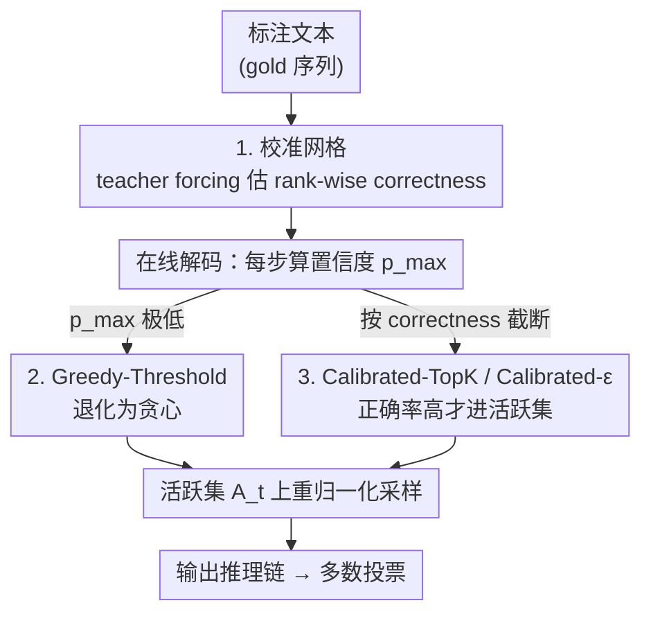

# Sample Smart, Not Hard: Correctness-First Decoding for Better Reasoning in LLMs

**会议**: ICLR 2026  
**OpenReview**: [https://openreview.net/forum?id=pNwCWIBHBC](https://openreview.net/forum?id=pNwCWIBHBC)  
**代码**: https://github.com/xueyan-lii/Sample-Smart-Not-Hard  
**领域**: LLM推理  
**关键词**: 解码策略, 截断采样, 不确定性, 校准, 推理任务

## 一句话总结
这篇论文指出推理任务里"低置信度步骤=值得多探索"是一个错误直觉，主张解码截断应该按 token 的"正确率"而非"概率"来校准：在置信度极低时直接退化为贪心（Greedy-Threshold），并用一张无需训练的校准网格把概率映射到正确率来动态设截断阈值（Calibrated-TopK / Calibrated-ε），在多个推理 benchmark 上稳定涨点，AIME 最多提升约 6%。

## 研究背景与动机

**领域现状**：在数学推理、多步求解这类任务上，主流做法是采样多条思维链再做多数投票（self-consistency）。这要求解码同时满足两个目标：注入足够随机性去探索多条推理路径，同时保证每条路径本身足够准。围绕这两个目标，已有工作分成两派——一派在不确定的步骤上"加更多探索"（提高温度、放大候选集，如 top-p / top-k / min-p / EDT），假设高熵意味着"有多个合法的下一步"；另一派在生成后"做更多过滤"，靠"低置信度往往对应低质量答案"这个观察拒绝低置信样本。

**现有痛点**：这两派其实是冲突的，因为它们把不同来源的不确定性混为一谈。"加探索"派假设低置信度反映的是 **aleatoric（偶然）不确定性**——确实存在多个合法续写，于是更广地采样是合理的；"做过滤"派则隐含承认低置信度位置就是模型最容易出错的地方。如果后者成立，那么在低置信步骤上加随机性只会放大 **epistemic（认知）不确定性**，即模型因为缺乏知识而产生的系统性错误，反而把错误累积放大。

**核心矛盾**：到底低置信度步骤是"多个合法分支的岔路口"，还是"模型最容易犯错的危险区"？两种判断给出完全相反的解码策略，而现有方法只盯着 token 概率（confidence）做决策，从没把"概率"和"这个 token 真的对不对（correctness）"区分开。

**本文目标**：（1）实证厘清低置信度步骤的真实角色；（2）设计一套按"正确率"而非"概率"来截断候选集的解码规则；（3）这套规则要免训练、近乎零额外推理开销，且能叠加在现有 sampler 上。

**切入角度**：作者用 teacher forcing 在标注文本上统计"每个置信度档位、每个 rank 上 gold token 出现的频率"，发现 correctness 在低置信度档位整体很低、且随 rank 增大急剧衰减——即低置信度位置不是岔路口，而是误差放大态。

**核心 idea**：把解码截断的依据从"token 概率"换成"估计的 token 正确率"——在期望正确率高的地方放开采样，在期望正确率低的地方收紧甚至退化为贪心。

## 方法详解

### 整体框架

方法分两条线：一条是**离线校准**，用带标注的文本通过 teacher forcing 估出一张"置信度档 × rank → 正确率"的校准网格；另一条是**在线解码**，每一步先看当前最大概率（置信度），再根据校准结果选择一个截断规则裁出"允许采样的活跃集合（active set）"$A_t$，最后在活跃集合上重归一化并采样。三个具体 sampler 都是这个框架的实例：Greedy-Threshold 只看置信度是否过低、过低就退化贪心；Calibrated-TopK 用校准网格把"安全 rank 上限"算出来；Calibrated-ε 把校准网格拟合成一条连续的概率→正确率映射，按预测正确率逐 token 过滤。所有截断规则可以取交集叠加使用，且若过滤后活跃集合为空就回退到贪心。

### 关键设计

**1. 校准网格：把"概率"翻译成"这个位置/这个 rank 到底有多大概率对"**

这是整套方法的信号基础，针对的痛点是：现有解码只看 token 概率，却不知道某个概率对应的真实正确率是多少。作者把模型置信度 $p_{t,\max} \triangleq \max_j p_t(j)$（即排序后第一名概率 $p^{(1)}_t$）切成 $n=10$ 个等宽置信度档 $B_m=\left(\frac{m-1}{n}, \frac{m}{n}\right]$，每个解码步按其置信度归入唯一一档。再用 teacher forcing 喂入 gold 前缀，对每个"档 $m$ × rank $r$"统计两个量：平均概率 $\hat p_{m,r}=\mathbb{E}[p^{(r)}_t \mid p_{t,\max}\in B_m]$，以及 **rank-wise correctness** $\hat c_{m,r}=\mathbb{P}[\text{rank}_t(x^\star_t)=r \mid p_{t,\max}\in B_m]$，其中 $x^\star_t$ 是 teacher forcing 下的真实下一 token。直白说，$\hat c_{m,r}$ 回答的是"当模型处于置信度档 $m$、我去取第 $r$ 名的候选时，它正好是正确 token 的概率有多大"。

这张网格揭示了关键现象：correctness 在低置信度档整体偏低，且随 rank 急剧下降——例如最高置信档 $(0.8,1.0]$ 里，正确率从 rank 1 的 0.907 直接掉到 rank 2 的 0.039。这说明"概率第二名往后"几乎都是错的，低置信度位置并不是有多个合法续写的岔路口，而是模型系统性犯错的地方。由此还能定义每档的期望准确率 $C_m=\sum_{r=1}^{R}\hat p_{m,r}\hat c_{m,r}$。校准只需在 benchmark 训练集（甚至跨域的 alpaca-gpt4-en）上跑一遍 teacher forcing 即可，免训练。

**2. Greedy-Threshold：在置信度过低的"危险区"直接停掉采样，退化为贪心**

针对的痛点是"在低置信度步骤加探索反而有害"。作者实证发现（Figure 5）：一旦序列里采到低概率 token（$p<0.1$）或处于低置信态（$p_{\max}<0.3$），序列级准确率随这类事件次数累积而显著下降；平均采样 rank 越高、准确率越低。一个早期的错步就可能让后续整条链跑偏，小模型尤甚。

于是 Greedy-Threshold 反转了常见启发式：设阈值 $p_{GT}\in(0,1)$，当某步最大概率低于它时，活跃集只保留 argmax 这一个 token，强制贪心：

$$A^{GT}_t=\begin{cases}\{v^\star_t\}, & p_{t,\max}<p_{GT}\\ V, & p_{t,\max}\ge p_{GT}\end{cases}$$

实验取 $p_{GT}=0.3$。它的妙处在于：既可以单独用，也可以叠加在 top-p / top-k / min-p 等现有 sampler 之上——置信度高于 0.3 时完全保留原 sampler 行为，只在最危险的低置信区把采样掐掉，从而把"误差传播"在源头限制住。这是一个对低正确率步骤的"定点抑制"。

**3. Calibrated-TopK 与 Calibrated-ε：把截断阈值从"概率"改成"估计正确率"**

Greedy-Threshold 只解决了"极低置信度"这个极端，更一般的问题是：每一步到底该放开到第几名候选？传统 top-k 把 $k$ 写死、ε-sampling 按概率阈值 $\varepsilon$ 砍尾（$A^\varepsilon_t=\{v:p_t(v)\ge\varepsilon\}$），但概率并不等于正确率。两个校准型 sampler 直接用网格里的 correctness 来设阈值。

**Calibrated-TopK** 不再固定 $k$，而是在当前置信度档 $m(t)$ 下，找出正确率仍高于阈值 $c_{CT}$ 的最大 rank：$K_m(c_{CT})=\max\{r:\hat c_{m,r}\ge c_{CT}\}$，活跃集就取 rank 不超过 $K_m$ 的 token（若 $K_m=0$ 则贪心）。也就是说在每个置信度档里，只探索那些"经验上大概率正确"的 rank 区间。**Calibrated-ε** 进一步把离散档位换成连续映射：作者发现校准网格里 $(\hat p,\hat c)$ 在 log-log 坐标下近似线性，$\log_{10}\hat c\approx A+B\log_{10}\hat p$，用最小二乘拟合出 $A,B$（文中约 $A=-0.506,B=0.795$，⚠️ 以原文为准）。解码时对每个候选 token 直接算估计正确率 $\hat c_t(j)\triangleq 10^A p_t(j)^B$，再按阈值 $c_\varepsilon$ 保留 $A^{C\varepsilon}_t=\{v:\hat c_t(v)\ge c_\varepsilon\}$。这只是一次标量变换，几乎零开销。实验取 $c_{CT}=c_\varepsilon=0.05$。最后无论用哪个规则，都在活跃集上重归一化采样 $p'_t(v)=p_t(v)/\sum_{w\in A_t}p_t(w)$。

### 损失函数 / 训练策略
本方法**完全免训练**：没有任何梯度优化或额外模型参数，唯一的"学习"是在校准网格上用最小二乘拟合一条直线（Calibrated-ε 的两个系数 $A,B$）。校准只需在标注文本上跑一遍 teacher forcing；推理时只需一次 2 参数查表（Calibrated-TopK）或一次对词表的向量运算（Calibrated-ε），解码额外开销可忽略。

## 实验关键数据

### 主实验

在 Qwen2.5-0.5B-Instruct 上对比各 sampler 的多数投票准确率（maj@k），校准型 sampler 相比"无限制"基线提升最大。

| 数据集 | 指标 | No restrictions | min-p | ε-sampling | Calibrated-TopK | Calibrated-ε |
|--------|------|-----------------|-------|------------|------------------|---------------|
| GSM8K | maj@32 | 38.6 | 46.6 | 46.7 | 47.1 | 47.1 |
| MMLU-Pro | maj@32 | 17.3 | 18.6 | 18.3 | 18.7 | **18.6** |
| Big-Bench-Hard | maj@32 | 16.2 | 31.7 | 31.6 | 31.6 | **32.0** |

在"思考型"大模型 GPT-OSS-20B + 高难数学 AIME 上，把 ε-sampling（$\varepsilon=0.05$）/ Greedy-Threshold 叠上去同样涨点：

| Benchmark | 方法 | Maj@32 | Pass@32 | Overall Correct |
|-----------|------|--------|---------|-----------------|
| AIME25 | Baseline | 90.0 | 92.2 | 56.1 |
| AIME25 | Greedy-Threshold | **91.1** | **94.4** | **59.9** |
| AIME24 | Baseline | 92.6 | 93.3 | 48.7 |
| AIME24 | Greedy-Threshold | 92.6 | **94.0** | **55.2** |

整体正确答案比例（Overall Correct）最多提升约 6.5%，而输出多样性几乎不掉——32 次采样的唯一答案数仅从 14.1 降到 13.3。

### 消融 / 分析实验

Greedy-Threshold 叠加在各 sampler 之上对 GSM8K 多数投票的增益（越小的模型增益越明显）：

| 配置 | Qwen2.5-0.5B (maj@32) | Qwen2.5-1.5B (maj@32) | Qwen2.5-3B (maj@32) |
|------|-----------------------|-----------------------|---------------------|
| Baseline T=1 | 38.6 → +2.0 | 73.1 → +2.4 | 81.1 → -0.1 |
| top-k | 41.9 → +1.1 | 73.9 → +2.8 | 81.0 → -0.2 |
| η-sampling | 41.0 → +1.7 | 74.2 → +2.7 | 81.0 → +0.1 |
| EDT | 46.8 → +0.1 | 78.9 → -0.1 | 80.9 → +0.1 |

### 关键发现
- **低置信度≠值得探索**：把采样限制在最低置信度档不会带来多数投票准确率的提升，对唯一答案数也几乎没贡献；真正受益于探索的是中等置信度档（0.3–0.6）。这直接推翻了"高熵=多个合法分支"的常见假设。
- **越小的模型受益越大**：Greedy-Threshold 在 0.5B / 1.5B 上稳定涨 1–3 个点，在 3B 上几乎持平（不掉点）。因为小模型在低置信区的 epistemic 错误更多，掐掉这些采样收益更明显。
- **EDT 几乎不受益**：EDT 本身已是较强的自适应温度 sampler，再叠 Greedy-Threshold 增益接近 0——说明 Greedy-Threshold 补的正是那些"在低置信区乱探索"的 sampler 的短板。
- **跨域校准也稳**：用通用指令数据 alpaca-gpt4-en 校准，性能与在 GSM8K 训练集上 in-domain 校准相当，说明只要"指令→答案"格式匹配，概率→正确率的映射可跨域迁移。

## 亮点与洞察
- **重新定义"该往哪里加随机性"**：把解码的判据从概率换成正确率，一句话点破——推理任务里高熵更多反映 epistemic（缺知识），而非 aleatoric（多合法解），所以在低置信区"采更多"是南辕北辙。这个视角转换比具体算法更有价值。
- **rank-wise correctness 是个可复用的信号**："第一名 0.907、第二名 0.039"这种悬崖式衰减，量化了"top-1 之外几乎都错"，可以迁移到推测解码的草稿验证、置信度过滤、幻觉检测等任何需要判断"候选可不可信"的场景。
- **免训练 + 可叠加**：Greedy-Threshold 能直接挂在任意现有 sampler 上当"安全阀"，Calibrated-ε 只是一次标量变换，工程落地几乎零成本，这是它比需要调温度/调阈值的方法更实用的地方。
- **log-log 线性拟合的巧劲**：把一张离散校准网格压成两个系数 $A,B$ 的连续映射，既避免了分档的粒度问题，又让正确率预测可对词表逐 token 向量化。

## 局限与展望
- 校准依赖 teacher forcing 在短指令式数据上估计，而"思考型"模型生成的是超长中间推理链，短数据上的校准未必代表其真实行为——所以作者在 GPT-OSS-20B 上退而用固定高阈值 ε-sampling 而非完整校准网格，这是一处妥协。
- 方法的前提是"任务有唯一正确答案、correctness 比 diversity 重要"。对开放式生成、创意写作这类需要多样性的任务，强截断很可能有害，论文也只在数学/推理 benchmark 上验证。
- 阈值（$p_{GT}=0.3$、$c=0.05$、$\varepsilon=0.05$）和置信度分档数（$n=10$）都是经验选取，论文虽给了消融但跨模型/跨任务的最优值是否稳定仍需更多验证。
- 改进方向：把校准从短文本扩展到长链思考模型的在线/分段校准；或把 rank-wise correctness 信号接入推测解码、束搜索等其他解码框架。

## 相关工作与启发
- **vs 加探索派（top-p / top-k / min-p / EDT）**：它们在低置信步骤放大候选集或升温，假设高熵=多合法分支；本文实证这一假设在推理任务上不成立，主张反过来收紧，并能把 Greedy-Threshold 直接叠在它们之上补短板。
- **vs ε-sampling（Hewitt et al., 2022）**：原 ε-sampling 按固定概率阈值砍尾，且为机器翻译/MBR 选了极小的 $\varepsilon$（$\approx 3\text{–}9\times10^{-4}$）；本文指出推理任务可用大得多的 $\varepsilon=0.05$，并进一步把阈值从"概率"校准到"正确率"（Calibrated-ε），让截断点落在 correctness 真正塌陷的地方。
- **vs 生成后过滤（如基于低置信度拒绝样本 / 幻觉检测）**：它们也利用"低置信对应低质量"，但是在生成完之后做筛；本文把这个信号前移到解码每一步的截断决策里，从源头阻止错误 token 被采到并传播。

## 评分
- 新颖性: ⭐⭐⭐⭐ 视角转换（按 correctness 而非 probability 截断）干净有力，但具体规则是对 ε-sampling / top-k 的校准式改造。
- 实验充分度: ⭐⭐⭐⭐ 覆盖 Qwen/Llama/GPT-OSS 多尺度、多 benchmark，含跨域校准与丰富分析图，长推理模型上略有妥协。
- 写作质量: ⭐⭐⭐⭐ 动机层层推导清晰，校准网格与公式定义严谨。
- 价值: ⭐⭐⭐⭐ 免训练、可叠加、近零开销，对推理多数投票场景实用性强。

<!-- RELATED:START -->

## 相关论文

- [\[ICLR 2026\] WavefrontDiffusion: Dynamic Decoding Schedule for Improved Reasoning](wavefrontdiffusion_dynamic_decoding_schedule_for_improved_reasoning.md)
- [\[ICLR 2026\] Making, Not Taking, the Best of N](making_not_taking_the_best_of_n.md)
- [\[ICLR 2026\] ShinkaEvolve: Towards Open-Ended and Sample-Efficient Program Evolution](shinkaevolve_towards_open-ended_and_sample-efficient_program_evolution.md)
- [\[ICLR 2026\] Curriculum Reinforcement Learning from Easy to Hard Tasks Improves LLM Reasoning](curriculum_reinforcement_learning_from_easy_to_hard_tasks_improves_llm_reasoning.md)
- [\[ICLR 2026\] Stabilizing Policy Gradients for Sample-Efficient Reinforcement Learning in LLM Reasoning](stabilizing_policy_gradients_for_sample-efficient_reinforcement_learning_in_llm_.md)

<!-- RELATED:END -->
